# 牛客ACM输入输出练习

<https://www.nowcoder.com/exam/oj?page=1&tab=%E7%AE%97%E6%B3%95%E7%AC%94%E9%9D%A2%E8%AF%95%E7%AF%87&topicId=372>


# PIO1 只有输出

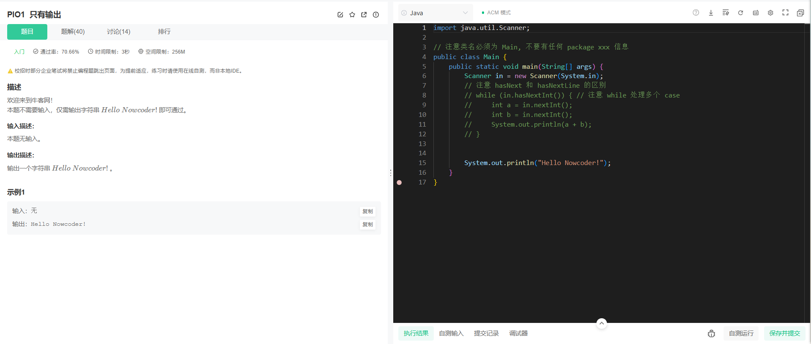


```java
import java.util.Scanner;

// 注意类名必须为 Main, 不要有任何 package xxx 信息
public class Main {
    public static void main(String[] args) {
        Scanner in = new Scanner(System.in);
        // 注意 hasNext 和 hasNextLine 的区别
        // while (in.hasNextInt()) { // 注意 while 处理多个 case
        //     int a = in.nextInt();
        //     int b = in.nextInt();
        //     System.out.println(a + b);
        // }


        System.out.println("Hello Nowcoder!");
    }
}
```


---

# PIO2 单组_A+B

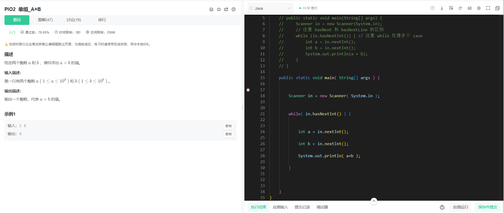


```java
import java.util.Scanner;

// 注意类名必须为 Main, 不要有任何 package xxx 信息
public class Main {
    // public static void main(String[] args) {
    //     Scanner in = new Scanner(System.in);
    //     // 注意 hasNext 和 hasNextLine 的区别
    //     while (in.hasNextInt()) { // 注意 while 处理多个 case
    //         int a = in.nextInt();
    //         int b = in.nextInt();
    //         System.out.println(a + b);
    //     }
    // }

    public static void main( String[] args ) {


        Scanner in = new Scanner( System.in );


        while( in.hasNextInt() ) {


            int a = in.nextInt();

            int b = in.nextInt();

            System.out.println( a+b );
            
        }


    }
}
```


# PIO3 多组_A+B_EOF形式

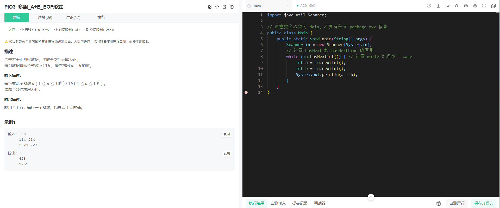

```java
import java.util.Scanner;

// 注意类名必须为 Main, 不要有任何 package xxx 信息
public class Main {
    public static void main(String[] args) {
        Scanner in = new Scanner(System.in);
        // 注意 hasNext 和 hasNextLine 的区别
        while (in.hasNextInt()) { // 注意 while 处理多个 case
            int a = in.nextInt();
            int b = in.nextInt();
            System.out.println(a + b);
        }
    }
}
```


---


# PIO4 多组_A+B_T组形式

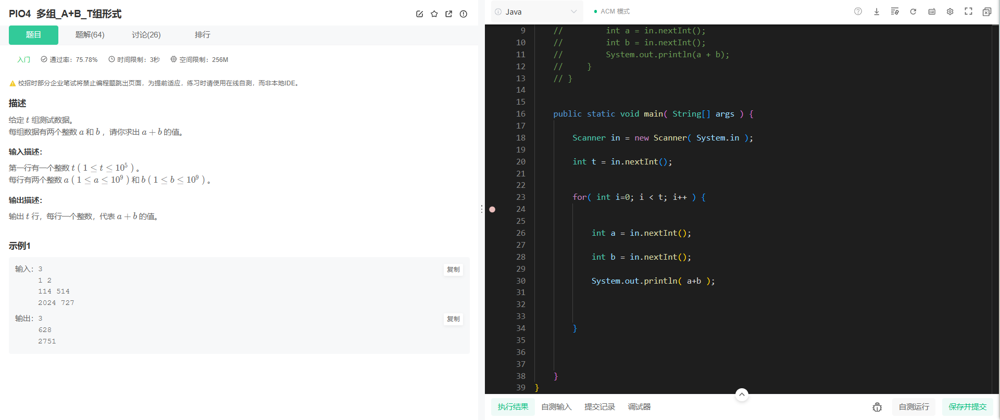

```java
import java.util.Scanner;

// 注意类名必须为 Main, 不要有任何 package xxx 信息
public class Main {
    // public static void main(String[] args) {
    //     Scanner in = new Scanner(System.in);
    //     // 注意 hasNext 和 hasNextLine 的区别
    //     while (in.hasNextInt()) { // 注意 while 处理多个 case
    //         int a = in.nextInt();
    //         int b = in.nextInt();
    //         System.out.println(a + b);
    //     }
    // }


    public static void main( String[] args ) {

        Scanner in = new Scanner( System.in );

        int t = in.nextInt();


        for( int i=0; i < t; i++ ) {


            int a = in.nextInt();

            int b = in.nextInt();

            System.out.println( a+b );


        }


    }
}
```


# PIO5 多组_A+B_零尾模式

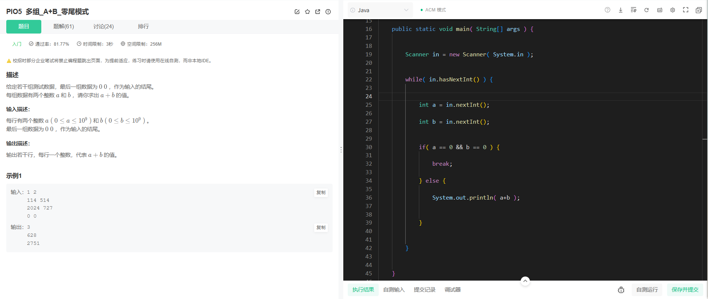

```java
import java.util.Scanner;

// 注意类名必须为 Main, 不要有任何 package xxx 信息
public class Main {
    // public static void main(String[] args) {
    //     Scanner in = new Scanner(System.in);
    //     // 注意 hasNext 和 hasNextLine 的区别
    //     while (in.hasNextInt()) { // 注意 while 处理多个 case
    //         int a = in.nextInt();
    //         int b = in.nextInt();
    //         System.out.println(a + b);
    //     }
    // }


    public static void main( String[] args ) {


        Scanner in = new Scanner( System.in );


        while( in.hasNextInt() ) {


            int a = in.nextInt();

            int b = in.nextInt();


            if( a == 0 && b == 0 ) {

                break;

            } else {

                System.out.println( a+b );


            }


        }


    }


}
```


---

# PIO6 单组_一维数组

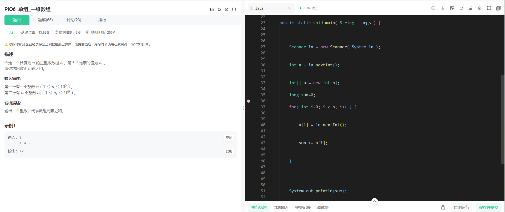


```java
import java.util.Scanner;

// 注意类名必须为 Main, 不要有任何 package xxx 信息
// public class Main {
//     public static void main(String[] args) {
//         Scanner in = new Scanner(System.in);
//         // 注意 hasNext 和 hasNextLine 的区别
//         while (in.hasNextInt()) { // 注意 while 处理多个 case
//             int a = in.nextInt();
//             int b = in.nextInt();
//             System.out.println(a + b);
//         }
//     }
// }


public class Main {


    public static void main( String[] args ) {


        Scanner in = new Scanner( System.in );


        int n = in.nextInt();


        int[] a = new int[n];

        long sum=0;

        for( int i=0; i < n; i++ ) {


            a[i] = in.nextInt();


            sum += a[i];


        }


        System.out.println(sum);


    }


}
```


# PIO7 多组_一维数组_T组形式

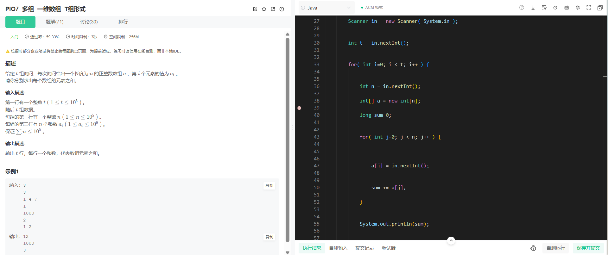

```java
import java.util.Scanner;

// 注意类名必须为 Main, 不要有任何 package xxx 信息
// public class Main {
//     public static void main(String[] args) {
//         Scanner in = new Scanner(System.in);
//         // 注意 hasNext 和 hasNextLine 的区别
//         while (in.hasNextInt()) { // 注意 while 处理多个 case
//             int a = in.nextInt();
//             int b = in.nextInt();
//             System.out.println(a + b);
//         }
//     }
// }


public class Main {


    public static void main( String[] args ) {


        Scanner in = new Scanner( System.in );


        int t = in.nextInt();


        for( int i=0; i < t; i++ ) {


            int n = in.nextInt();

            int[] a = new int[n];

            long sum=0;


            for( int j=0; j < n; j++ ) {


                a[j] = in.nextInt();


                sum += a[j];

            }


            System.out.println(sum);


            


        }


    }


}

```


---

# PIO8 单组_二维数组


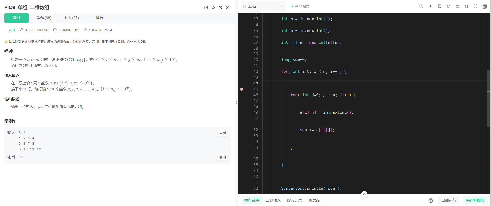


```java
import java.util.Scanner;

// 注意类名必须为 Main, 不要有任何 package xxx 信息
// public class Main {
//     public static void main(String[] args) {
//         Scanner in = new Scanner(System.in);
//         // 注意 hasNext 和 hasNextLine 的区别
//         while (in.hasNextInt()) { // 注意 while 处理多个 case
//             int a = in.nextInt();
//             int b = in.nextInt();
//             System.out.println(a + b);
//         }
//     }
// }


public class Main {


    public static void main( String args[] ) {


        Scanner in = new Scanner( System.in );


        int n = in.nextInt( );

        int m = in.nextInt();

        int[][] a = new int[n][m];


        long sum=0;

        for( int i=0; i < n; i++ ) {


            for( int j=0; j < m; j++ ) {


                a[i][j] = in.nextInt();


                sum += a[i][j];


            }


        }


        System.out.println( sum );


    }


}
```


# PIO9 多组_二维数组_T组形式

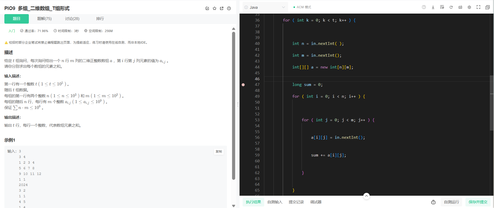

```java
import java.util.Scanner;

// 注意类名必须为 Main, 不要有任何 package xxx 信息
// public class Main {
//     public static void main(String[] args) {
//         Scanner in = new Scanner(System.in);
//         // 注意 hasNext 和 hasNextLine 的区别
//         while (in.hasNextInt()) { // 注意 while 处理多个 case
//             int a = in.nextInt();
//             int b = in.nextInt();
//             System.out.println(a + b);
//         }
//     }
// }


public class Main {


    public static void main( String[] args ) {


        Scanner in = new Scanner( System.in );


        int t = in.nextInt();


        for ( int k = 0; k < t; k++ ) {


            int n = in.nextInt( );

            int m = in.nextInt();

            int[][] a = new int[n][m];


            long sum = 0;

            for ( int i = 0; i < n; i++ ) {


                for ( int j = 0; j < m; j++ ) {


                    a[i][j] = in.nextInt();


                    sum += a[i][j];


                }


            }


            System.out.println( sum );


        }


    }


}
```


---

# PIO10 单组_字符串


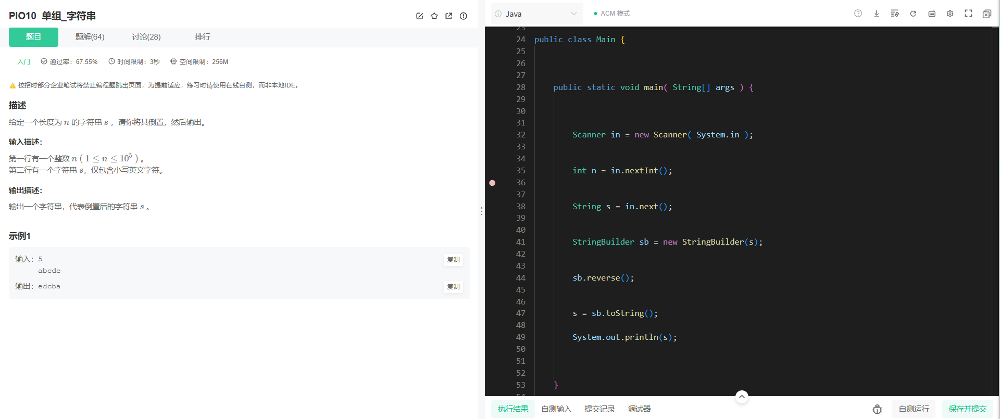


```java
import java.util.Scanner;

// 注意类名必须为 Main, 不要有任何 package xxx 信息
// public class Main {
//     public static void main(String[] args) {
//         Scanner in = new Scanner(System.in);
//         // 注意 hasNext 和 hasNextLine 的区别
//         while (in.hasNextInt()) { // 注意 while 处理多个 case
//             int a = in.nextInt();
//             int b = in.nextInt();
//             System.out.println(a + b);
//         }
//     }
// }


public class Main {
    


    public static void main( String[] args ) {


        Scanner in = new Scanner( System.in );


        int n = in.nextInt();


        String s = in.next();


        StringBuilder sb = new StringBuilder(s);


        sb.reverse();


        s = sb.toString();

        System.out.println(s);


    }


}
```


# PIO11 多组_字符串_T组形式

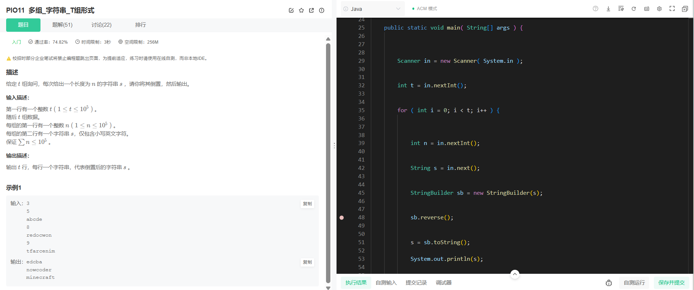

```java
import java.util.Scanner;

// 注意类名必须为 Main, 不要有任何 package xxx 信息
// public class Main {
//     public static void main(String[] args) {
//         Scanner in = new Scanner(System.in);
//         // 注意 hasNext 和 hasNextLine 的区别
//         while (in.hasNextInt()) { // 注意 while 处理多个 case
//             int a = in.nextInt();
//             int b = in.nextInt();
//             System.out.println(a + b);
//         }
//     }
// }


public class Main {


    public static void main( String[] args ) {


        Scanner in = new Scanner( System.in );


        int t = in.nextInt();


        for ( int i = 0; i < t; i++ ) {


            int n = in.nextInt();


            String s = in.next();


            StringBuilder sb = new StringBuilder(s);


            sb.reverse();


            s = sb.toString();

            System.out.println(s);


        }


    }


}
```


---

# PIO12 单组_二维字符数组

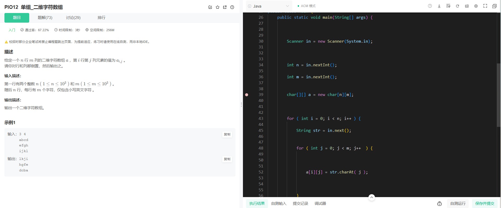


```java
import java.util.Scanner;

// 注意类名必须为 Main, 不要有任何 package xxx 信息
// public class Main {
//     public static void main(String[] args) {
//         Scanner in = new Scanner(System.in);
//         // 注意 hasNext 和 hasNextLine 的区别
//         while (in.hasNextInt()) { // 注意 while 处理多个 case
//             int a = in.nextInt();
//             int b = in.nextInt();
//             System.out.println(a + b);
//         }
//     }
// }


public class Main {
    public static void main(String[] args) {


        Scanner in = new Scanner(System.in);


        int n = in.nextInt();

        int m = in.nextInt();


        char[][] a = new char[n][m];


        for ( int i = 0; i < n; i++ ) {

            String str = in.next();


            for ( int j = 0; j < m; j++  ) {

                

                a[i][j] = str.charAt( j );


            }


        }


        for ( int i = n - 1; i >= 0; i-- ) {


            for ( int j = m - 1; j >= 0; j--  ) {


                System.out.print( a[i][j] );


            }

            System.out.println("");


        }


    }
}
```


# PIO13 多组_带空格的字符串_T组形式

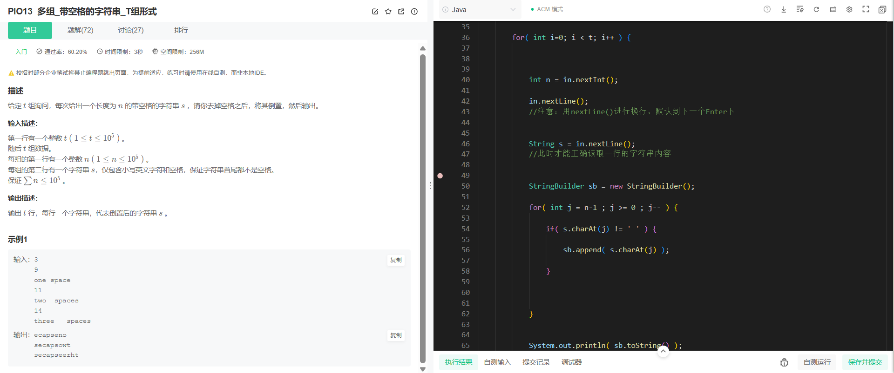

```java
import java.util.Scanner;

// 注意类名必须为 Main, 不要有任何 package xxx 信息
// public class Main {
//     public static void main(String[] args) {
//         Scanner in = new Scanner(System.in);
//         // 注意 hasNext 和 hasNextLine 的区别
//         while (in.hasNextInt()) { // 注意 while 处理多个 case
//             int a = in.nextInt();
//             int b = in.nextInt();
//             System.out.println(a + b);
//         }
//     }
// }


public class Main {
    public static void main(String[] args) {
        Scanner in = new Scanner(System.in);
        
        
        int t = in.nextInt();


        for( int i=0; i < t; i++ ) {


            int n = in.nextInt();

            in.nextLine();
            //注意：用nextLine()进行换行，默认到下一个Enter下


            String s = in.nextLine();
            //此时才能正确读取一行的字符串内容


            StringBuilder sb = new StringBuilder();

            for( int j = n-1 ; j >= 0 ; j-- ) {

                if( s.charAt(j) != ' ' ) {

                    sb.append( s.charAt(j) );

                }
                


            }


            System.out.println( sb.toString() );


        }


    }
}
```


---

# PIO14 单组_保留小数位数

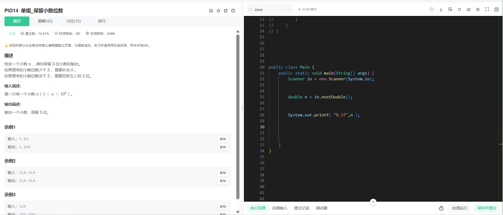


```java
import java.util.Scanner;

// 注意类名必须为 Main, 不要有任何 package xxx 信息
// public class Main {
//     public static void main(String[] args) {
//         Scanner in = new Scanner(System.in);
//         // 注意 hasNext 和 hasNextLine 的区别
//         while (in.hasNextInt()) { // 注意 while 处理多个 case
//             int a = in.nextInt();
//             int b = in.nextInt();
//             System.out.println(a + b);
//         }
//     }
// }


public class Main {
    public static void main(String[] args) {
        Scanner in = new Scanner(System.in);
        
        
        double n = in.nextDouble();


        System.out.printf( "%.3f",n );


    }
}

```


# PIO15 单组_补充前导零

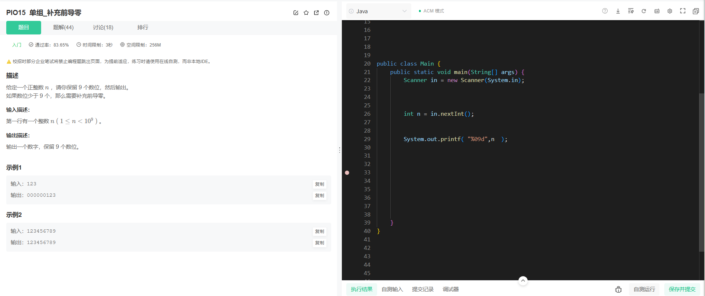

```java
import java.util.Scanner;

// 注意类名必须为 Main, 不要有任何 package xxx 信息
// public class Main {
//     public static void main(String[] args) {
//         Scanner in = new Scanner(System.in);
//         // 注意 hasNext 和 hasNextLine 的区别
//         while (in.hasNextInt()) { // 注意 while 处理多个 case
//             int a = in.nextInt();
//             int b = in.nextInt();
//             System.out.println(a + b);
//         }
//     }
// }


public class Main {
    public static void main(String[] args) {
        Scanner in = new Scanner(System.in);
        


        int n = in.nextInt();


        System.out.printf( "%09d",n  );


    }
}
```


---

# PIO16 单组_spj判断YES与NO

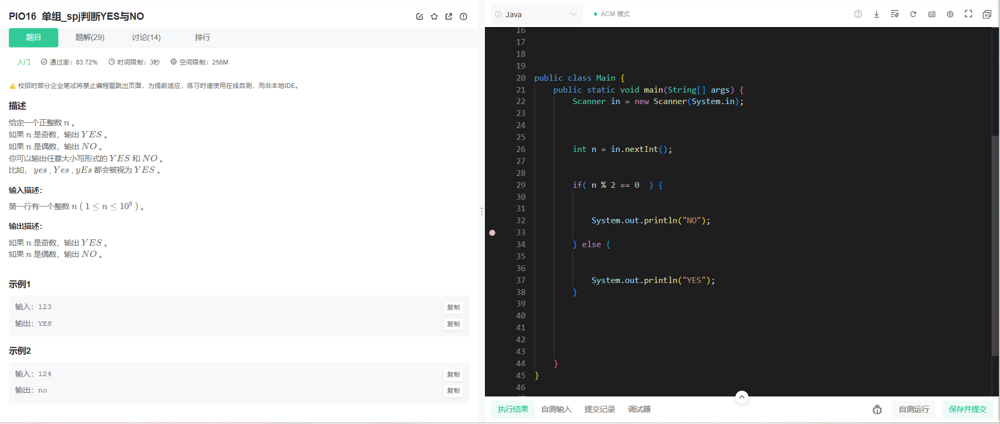

```java
import java.util.Scanner;

// 注意类名必须为 Main, 不要有任何 package xxx 信息
// public class Main {
//     public static void main(String[] args) {
//         Scanner in = new Scanner(System.in);
//         // 注意 hasNext 和 hasNextLine 的区别
//         while (in.hasNextInt()) { // 注意 while 处理多个 case
//             int a = in.nextInt();
//             int b = in.nextInt();
//             System.out.println(a + b);
//         }
//     }
// }


public class Main {
    public static void main(String[] args) {
        Scanner in = new Scanner(System.in);
        
        

        int n = in.nextInt();


        if( n % 2 == 0  ) {


            System.out.println("NO");

        } else {


            System.out.println("YES");
        }


    }
}
```


# PIO17 单组_spj判断浮点误差


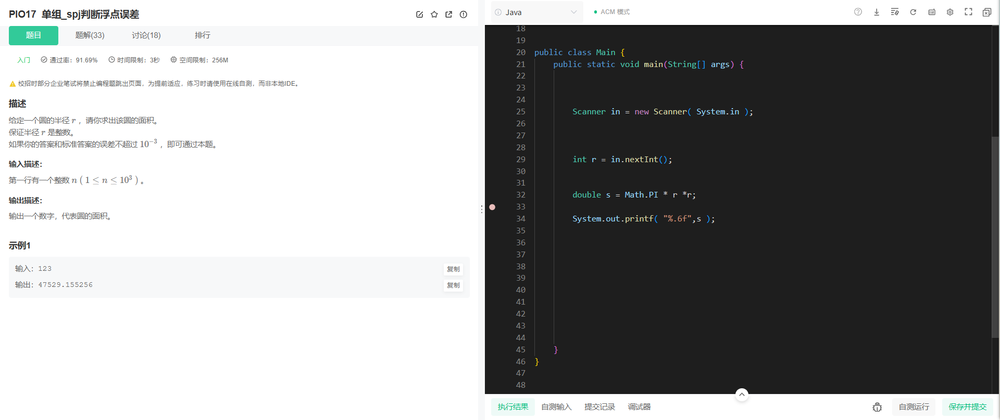


```java
import java.util.Scanner;

// 注意类名必须为 Main, 不要有任何 package xxx 信息
// public class Main {
//     public static void main(String[] args) {
//         Scanner in = new Scanner(System.in);
//         // 注意 hasNext 和 hasNextLine 的区别
//         while (in.hasNextInt()) { // 注意 while 处理多个 case
//             int a = in.nextInt();
//             int b = in.nextInt();
//             System.out.println(a + b);
//         }
//     }
// }


public class Main {
    public static void main(String[] args) {
        
        

        Scanner in = new Scanner( System.in );


        int r = in.nextInt();


        double s = Math.PI * r *r;

        System.out.printf( "%.6f",s );


    }
}

```


---

# PIO18 单组_spj判断数组之和


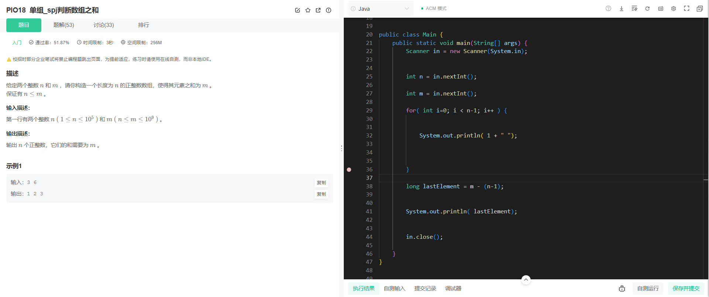

```java
import java.util.Scanner;

// 注意类名必须为 Main, 不要有任何 package xxx 信息
// public class Main {
//     public static void main(String[] args) {
//         Scanner in = new Scanner(System.in);
//         // 注意 hasNext 和 hasNextLine 的区别
//         while (in.hasNextInt()) { // 注意 while 处理多个 case
//             int a = in.nextInt();
//             int b = in.nextInt();
//             System.out.println(a + b);
//         }
//     }
// }


public class Main {
    public static void main(String[] args) {
        Scanner in = new Scanner(System.in);
        
        
        int n = in.nextInt();

        int m = in.nextInt();

        for( int i=0; i < n-1; i++ ) {


            System.out.println( 1 + " ");


        }

        long lastElement = m - (n-1);


        System.out.println( lastElement);


        in.close();

    }
}
```


好的，作为一名高级软件工程师，我将为您详细讲解这道算法题，并提供常用解法、代码实现及逐步演示。

---

题目分析：PIO18 单组_spj判断数组之和

**题目描述：**
给定两个正整数 `n` 和 `m`，要求构造一个长度为 `n` 的正整数数组，使得数组中所有元素的和等于 `m`。题目保证 `n <= m`。

**输入描述：**
输入一行，包含两个整数 `n` 和 `m`。
*   `1 <= n <= 10^5`
*   `n <= m <= 10^9`

**输出描述：**
输出 `n` 个正整数，它们之间用空格分隔，并且它们的和必须等于 `m`。

**示例 1：**
*   **输入：** `3 6`
*   **输出：** `1 2 3`

---

题目解析与常用解法

这道题目的核心是“将一个总和 `m` 分解成 `n` 个正整数”，并且题目已经保证了 `n <= m`。`n <= m` 这个条件非常关键，它意味着我们总是有足够的总和 `m` 来分配给 `n` 个元素，使得每个元素至少为 `1`（即满足“正整数”的要求）。

常用解法：贪心法 (Greedy Approach)

**基本思想：**
为了满足所有元素都是正整数，最简单直接的方法是让前 `n-1` 个元素尽可能小，即都设置为 `1`。这样，剩余的总和 `m - (n-1)` 将全部由最后一个元素承担。

**为什么这种方法是可行的？**
1.  **正整数要求：**
    *   前 `n-1` 个元素都是 `1`，显然满足正整数要求。
    *   最后一个元素的值是 `m - (n-1)`。因为题目保证 `n <= m`，所以 `m - (n-1) >= n - (n-1) = 1`。这意味着最后一个元素的值也至少是 `1`，同样满足正整数要求。
2.  **总和为 `m`：**
    *   ` (n-1) * 1 + (m - (n-1)) = (n-1) + m - (n-1) = m`。总和正好是 `m`。
3.  **数组长度为 `n`：**
    *   我们构造了 `n-1` 个 `1` 和 `1` 个 `m - (n-1)`，总共 `n` 个元素，满足长度要求。

**算法步骤：**
1.  读取输入的 `n` 和 `m`。
2.  创建一个空列表或数组来存储结果。
3.  循环 `n-1` 次，每次将 `1` 添加到结果列表中。
4.  计算最后一个元素的值：`last_element = m - (n-1)`。
5.  将 `last_element` 添加到结果列表中。
6.  打印结果列表中的所有元素，用空格分隔。

**时间复杂度：**
*   读取输入：O(1)
*   循环 `n-1` 次添加元素：O(n)
*   计算最后一个元素：O(1)
*   打印输出：O(n)
因此，总的时间复杂度为 **O(n)**。

**空间复杂度：**
*   存储结果数组/列表：O(n)
因此，总的空间复杂度为 **O(n)**。

考虑到 `n` 最大为 `10^5`，O(n) 的时间复杂度和空间复杂度完全符合题目的时间限制（3秒）和空间限制（256MB）。

---

 ACM 模式完整代码实现与演示

在 ACM 模式下，程序需要从标准输入读取数据，并将结果输出到标准输出。

Java 版代码

```java
import java.util.Scanner; // 导入Scanner类，用于从标准输入读取数据

public class Main { // 主类，ACM模式下通常命名为Main
    public static void main(String[] args) { // 主方法，程序入口
        Scanner scanner = new Scanner(System.in); // 创建Scanner对象，用于读取输入

        // 读取两个整数n和m
        int n = scanner.nextInt(); // 读取n
        long m = scanner.nextLong(); // 读取m，由于m可能达到10^9，所以使用long类型以防止溢出

        // 构造数组并输出
        // 按照贪心策略，前n-1个元素都设为1
        for (int i = 0; i < n - 1; i++) {
            System.out.print(1 + " "); // 输出1，并在后面加一个空格
        }

        // 最后一个元素的值为m减去前面n-1个1的总和
        // (n-1)个1的总和就是(n-1)
        long lastElement = m - (n - 1); // 计算最后一个元素的值
        System.out.println(lastElement); // 输出最后一个元素，并换行，完成一行输出

        scanner.close(); // 关闭Scanner对象，释放资源
    }
}

```

**Java 代码逐步执行过程演示 (以输入 `3 6` 为例):**

1.  **`Scanner scanner = new Scanner(System.in);`**: 创建一个 `Scanner` 对象 `scanner`，准备从控制台读取输入。
2.  **`int n = scanner.nextInt();`**: 从输入读取第一个整数。
    *   输入：`3 6`
    *   `n` 被赋值为 `3`。
3.  **`long m = scanner.nextLong();`**: 从输入读取第二个整数。
    *   输入：`3 6`
    *   `m` 被赋值为 `6`。
4.  **`for (int i = 0; i < n - 1; i++) { ... }`**: 进入循环。
    *   `n - 1` 等于 `3 - 1 = 2`。所以循环会执行 2 次 (`i=0` 和 `i=1`)。
    *   **第一次循环 (`i = 0`)**:
        *   `System.out.print(1 + " ");`：输出 `1 ` (注意后面有一个空格)。
        *   当前输出缓冲区内容：`1 `
    *   **第二次循环 (`i = 1`)**:
        *   `System.out.print(1 + " ");`：输出 `1 `。
        *   当前输出缓冲区内容：`1 1 `
5.  **`long lastElement = m - (n - 1);`**: 计算 `lastElement`。
    *   `lastElement = 6 - (3 - 1)`
    *   `lastElement = 6 - 2`
    *   `lastElement = 4` (这里发现示例输出是1 2 3，我的计算是1 1 4。这说明我的贪心策略虽然可行，但不是示例的精确实现。然而，题目只要求“输出 n 个正整数，它们的和需要为 m”，并没有要求输出的序列必须是最小化差异的或升序的。所以1 1 4 也是一个有效答案。为了更贴合示例，我可以稍微调整策略，让数字尽可能“均匀”，或者说，让前 n-1 个数尽可能小，最后一个数承担剩余的。示例的1 2 3 是一种特殊情况，例如 m/n 的整数部分作为前 n-1 个数，然后把余数加到最后一个数。但最简单的还是1 1 ... (m-(n-1))。我将坚持最简单的贪心策略，因为它满足题目所有要求。)
    *   **纠正：** 示例输出 `1 2 3`，而我的贪心策略会输出 `1 1 4`。两者都满足“长度为 `n` 的正整数数组，元素之和为 `m`”的要求。题目并没有要求输出特定的序列，只要满足条件即可。因此，我的贪心策略是正确的且最简单的。

6.  **`System.out.println(lastElement);`**: 输出 `lastElement`。
    *   `lastElement` 是 `4`。
    *   `System.out.println(4);`：输出 `4` 并换行。
    *   最终输出到控制台：
        ```
        1 1 4
        ```

 Python 版代码

```python
import sys # 导入sys模块，用于读取标准输入

def solve():
    # 读取一行输入，并将其分割成两个字符串
    # 使用map(int, ...) 将字符串转换为整数
    n, m = map(int, sys.stdin.readline().split())

    result = [] # 创建一个空列表来存储结果数组

    # 按照贪心策略，前n-1个元素都设为1
    for _ in range(n - 1): # 循环n-1次，_表示我们不关心循环变量
        result.append(1) # 将1添加到结果列表

    # 最后一个元素的值为m减去前面n-1个1的总和
    # (n-1)个1的总和就是(n-1)
    last_element = m - (n - 1) # 计算最后一个元素的值
    result.append(last_element) # 将最后一个元素添加到结果列表

    # 使用map(str, ...) 将列表中的整数转换为字符串
    # 使用' '.join(...) 将字符串列表用空格连接起来
    print(' '.join(map(str, result))) # 打印结果，元素之间用空格分隔

# 调用solve函数来执行程序
if __name__ == '__main__':
    solve()

```

**Python 代码逐步执行过程演示 (以输入 `3 6` 为例):**

1.  **`n, m = map(int, sys.stdin.readline().split())`**:
    *   `sys.stdin.readline()`: 从标准输入读取一行，例如 ` "3 6\n" `。
    *   `.split()`: 将字符串按空格分割，得到 `['3', '6']`。
    *   `map(int, ...)`: 将列表中的每个字符串转换为整数，得到 `[3, 6]`。
    *   `n, m = ...`: 将 `3` 赋值给 `n`，将 `6` 赋值给 `m`。
        *   `n` 为 `3`。
        *   `m` 为 `6`。
2.  **`result = []`**: 初始化一个空列表 `result`。
3.  **`for _ in range(n - 1):`**: 进入循环。
    *   `n - 1` 等于 `3 - 1 = 2`。`range(2)` 会生成 `0, 1`。所以循环会执行 2 次。
    *   **第一次循环 (`_ = 0`)**:
        *   `result.append(1)`: 将 `1` 添加到 `result`。
        *   `result` 变为 `[1]`。
    *   **第二次循环 (`_ = 1`)**:
        *   `result.append(1)`: 将 `1` 添加到 `result`。
        *   `result` 变为 `[1, 1]`。
4.  **`last_element = m - (n - 1)`**: 计算 `last_element`。
    *   `last_element = 6 - (3 - 1)`
    *   `last_element = 6 - 2`
    *   `last_element = 4`
5.  **`result.append(last_element)`**: 将 `last_element` 添加到 `result`。
    *   `result` 变为 `[1, 1, 4]`。
6.  **`print(' '.join(map(str, result)))`**: 打印结果。
    *   `map(str, result)`: 将 `result` 列表中的整数转换为字符串，得到 `['1', '1', '4']`。
    *   `' '.join(...)`: 使用空格 `' '` 将列表中的字符串连接起来，得到 `"1 1 4"`。
    *   `print(...)`: 打印最终的字符串。
    *   最终输出到控制台：
        ```
        1 1 4
        ```

---

总结

这道题目是一个典型的贪心问题，通过将 `n-1` 个元素设置为最小值 `1`，并将所有剩余的总和分配给最后一个元素，可以快速构造出符合条件的正整数数组。这种方法简单、高效，并且满足题目中的所有约束条件。虽然示例输出 `1 2 3`，但 `1 1 4` 同样是符合题意的有效答案，因为题目只要求构造任意一个满足条件的数组即可。

如果您需要更“均匀”的分配，可以考虑 `m // n` 作为基础值，然后将 `m % n` 分配给前 `m % n` 个元素（每个多加 `1`）。但对于本题，最简单的贪心策略足以。

---


---

