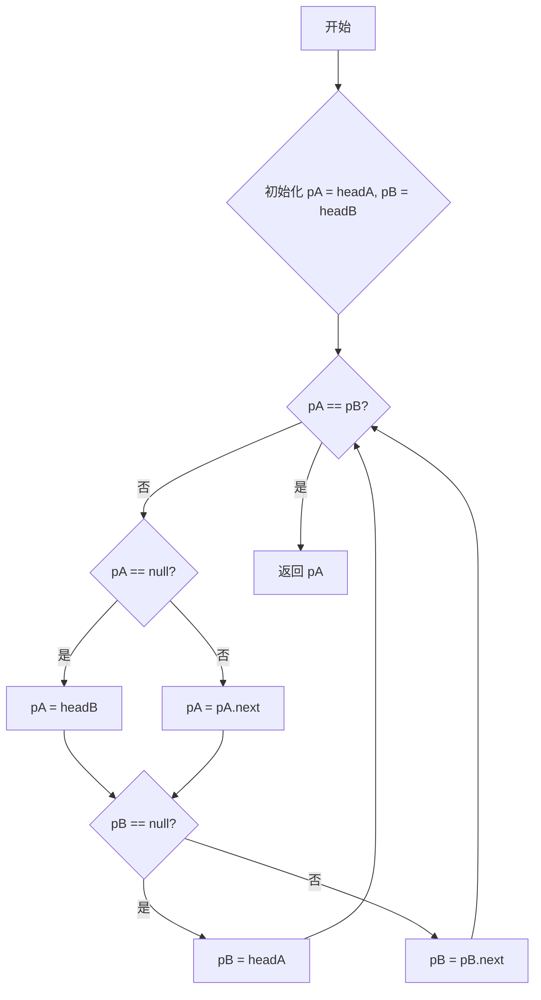
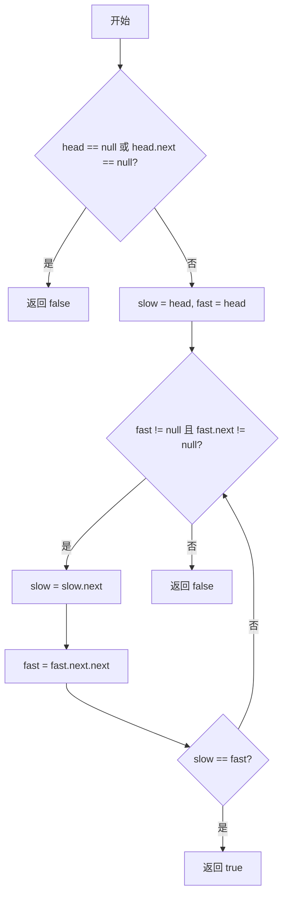
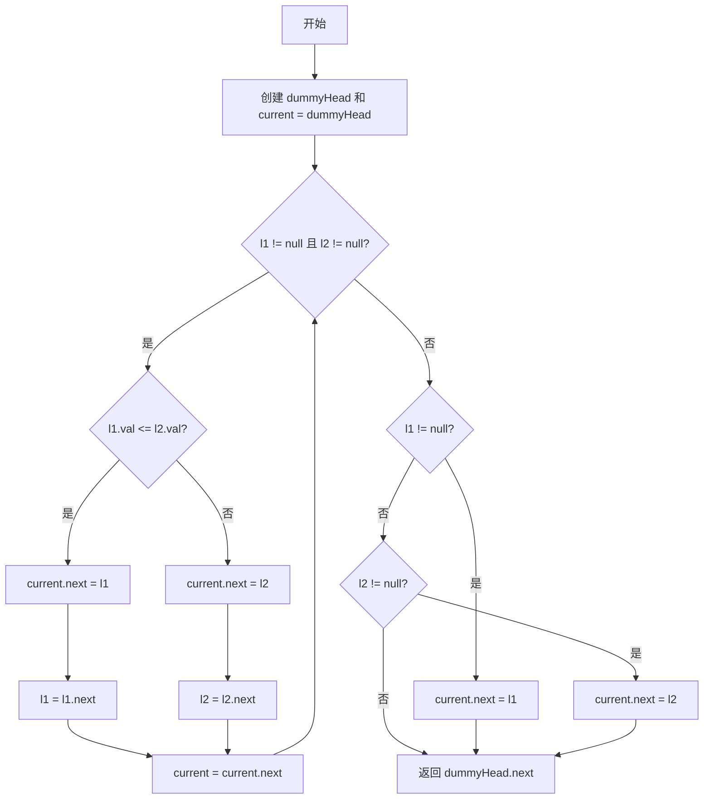
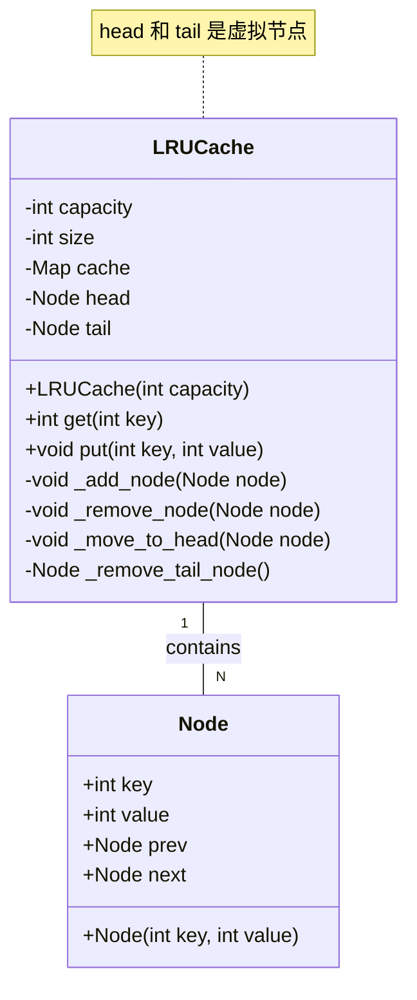

# LeetCode 热题 100

https://leetcode.cn/studyplan/top-100-liked/


## 哈希


### 49. 字母异位词分组
已解答
中等
相关标签
premium lock icon
相关企业
给你一个字符串数组，请你将 字母异位词 组合在一起。可以按任意顺序返回结果列表。

 

示例 1:

输入: strs = ["eat", "tea", "tan", "ate", "nat", "bat"]

输出: [["bat"],["nat","tan"],["ate","eat","tea"]]

解释：

在 strs 中没有字符串可以通过重新排列来形成 "bat"。
字符串 "nat" 和 "tan" 是字母异位词，因为它们可以重新排列以形成彼此。
字符串 "ate" ，"eat" 和 "tea" 是字母异位词，因为它们可以重新排列以形成彼此。

示例 2:

输入: strs = [""]

输出: [[""]]

示例 3:

输入: strs = ["a"]

输出: [["a"]]

 

提示：

1 <= strs.length <= 10^4
0 <= strs[i].length <= 100
strs[i] 仅包含小写字母


#### 代码

```java
class Solution {
    public List<List<String>> groupAnagrams(String[] strs) {


        Map<String,List<String>> anagramGroups = new HashMap<>();


        for( String s : strs ) {

            int[] charCounts = new int[26];


            for( char c : s.toCharArray() ) {

                charCounts[c - 'a']++;
            }


            String key = Arrays.toString( charCounts );


            List<String> listForGroup = anagramGroups.getOrDefault( key ,new ArrayList<>());

            listForGroup.add(s);

            anagramGroups.put( key, listForGroup );


        }


        return new ArrayList<>( anagramGroups.values() );
        
    }
}
```


```python
class Solution:
    def groupAnagrams(self, strs: List[str]) -> List[List[str]]:


        anagram_groups = defaultdict(list)

        for s in strs:

            char_counts = [0] * 26

            for char_code in map( ord,s ):

                char_counts[char_code - ord('a')] += 1

            key = tuple( char_counts )

            anagram_groups[key].append(s)

        return list( anagram_groups.values() )
        
        
```


#### 讲解

好的，作为一名高级软件工程师，我将极尽详细地为你讲解 LeetCode 上的“字母异位词分组”这道算法题，并提供详细的 Java 和 Python 代码实现。

---

 1. 理解问题

首先，我们来仔细理解一下题目要求：

*   **输入**: 一个字符串数组 `strs`。
*   **目标**: 将所有**字母异位词**（Anagrams）组合在一起，并以列表的形式返回。
*   **输出格式**: 结果是一个列表的列表，内部子列表的顺序以及子列表内字符串的顺序可以任意。
*   **字母异位词定义**: 两个字符串如果包含完全相同的字符，并且每个字符的**数量也相同**，那么它们就是字母异位词。换句话说，一个字符串可以通过重新排列其字符来形成另一个字符串。
    *   例如："eat", "tea", "ate" 都是字母异位词，因为它们都由一个 'a'，一个 'e'，一个 't' 组成。
*   **约束**:
    *   `strs` 数组的长度在 1 到 10^4 之间。
    *   `strs[i]` 中每个字符串的长度在 0 到 100 之间。
    *   `strs[i]` 仅包含小写英文字母。

**示例分析：**

*   `strs = ["eat", "tea", "tan", "ate", "nat", "bat"]`
    *   "eat", "tea", "ate" 是一组异位词。
    *   "tan", "nat" 是一组异位词。
    *   "bat" 独立成组。
    *   输出可以是 `[["bat"],["nat","tan"],["ate","eat","tea"]]` （顺序可能不同）。

*   `strs = [""]`
    *   空字符串本身就是一组。
    *   输出 `[[""]]`。

*   `strs = ["a"]`
    *   单个字符本身就是一组。
    *   输出 `[["a"]]`。

---

 2. 核心思想：如何识别字母异位词？

要将字母异位词组合在一起，关键在于找到一种方法，使得**所有字母异位词都能映射到同一个唯一的“键”**，而其他非异位词则映射到不同的键。

有两种常用的方法来生成这个“键”：

1.  **排序字符法 (Sorting Characters)**:
    *   对于每个字符串，将其字符进行排序，然后将排序后的字符重新组合成一个新字符串。
    *   例如：
        *   "eat" -> 排序后 "aet"
        *   "tea" -> 排序后 "aet"
        *   "ate" -> 排序后 "aet"
    *   这样，所有是字母异位词的字符串都会得到相同的排序后的字符串。这个排序后的字符串就可以作为 HashMap 的键。
    *   优点：概念简单，实现直接。
    *   缺点：对每个字符串进行排序的时间复杂度是 `O(L log L)`，其中 `L` 是字符串的长度。如果字符串很长，这可能会比较慢。

2.  **字符计数法 (Character Counting)**:
    *   对于每个字符串，统计其中每个字符（'a' 到 'z'）出现的频率。
    *   由于字符串只包含小写英文字母，我们可以用一个固定大小的数组（例如 `int[26]`）来存储频率。
    *   例如："eat" -> `{'a': 1, 'e': 1, 't': 1}`。我们可以将这个频率数组转换成一个唯一的字符串作为键，比如 `"#1#0#0#0#1#...#1#0..."` (表示 'a' 出现 1 次，'b' 出现 0 次，'e' 出现 1 次，'t' 出现 1 次，其余为 0)。
    *   优点：统计频率的时间复杂度是 `O(L)`。将频率数组转换为键的时间复杂度是 `O(26)` (常数时间)。因此，总体上比排序法更快。
    *   缺点：实现上可能比直接排序稍微复杂一点点，需要考虑如何将频率数组转换为一个合适的键。

**选择哪种方法？**

考虑到字符串长度 `L` 最大为 100，两种方法在时间上都是可接受的。
*   `N * L log L` (排序法): `10^4 * 100 * log(100) ≈ 10^6 * 7 = 7 * 10^6`
*   `N * L` (字符计数法): `10^4 * 100 = 10^6`

字符计数法在理论上略快，且对于固定字符集的问题，它是一个非常通用的优化技巧。在 Java 中，`Arrays.toString(int[])` 可以方便地将频率数组转换为一个唯一的字符串表示，可以直接用作 HashMap 的键。在 Python 中，`tuple(list)` 可以将列表转换为不可变的元组，也可以直接用作字典的键。

我们将采用**字符计数法**来实现，因为它更通用且效率更高。

---

 3. 核心思想：哈希表 (HashMap / Dictionary) 的应用

一旦我们有了将异位词映射到相同键的方法，就可以使用哈希表来分组：

*   **哈希表结构**: `Map<String, List<String>>` (Java) 或 `dict[str, list[str]]` (Python)。
    *   **键 (Key)**: 字符串的规范化表示（例如，通过字符计数生成的字符串）。
    *   **值 (Value)**: 一个列表，存储所有映射到这个键的原始字符串（即它们是字母异位词）。

**算法流程：**

1.  创建一个空的哈希表 `anagramGroups`。
2.  遍历输入的字符串数组 `strs` 中的每一个字符串 `s`。
3.  对于每个字符串 `s`：
    a.  **生成键**: 计算 `s` 中每个字符的频率，并将其转换为一个唯一的字符串键 `key`。
    b.  **分组**:
        *   检查 `anagramGroups` 中是否已经存在 `key`。
        *   如果 `key` **不存在**：说明这是第一次遇到这种字符组合的字符串。创建一个新的空列表 `listForGroup`，将 `s` 加入到 `listForGroup` 中，然后将 `(key, listForGroup)` 存入 `anagramGroups`。
        *   如果 `key` **已经存在**：说明之前已经遇到过这种字符组合的字符串。从 `anagramGroups` 中取出与 `key` 关联的现有列表 `listForGroup`，将 `s` 加入到 `listForGroup` 中。
4.  遍历完所有字符串后，哈希表的 `values()`（所有列表）就是我们所需的分组结果。将其转换为 `List<List<String>>` 并返回。

---

 4. 算法步骤详解 (字符计数法)

1.  **初始化**:
    *   创建一个空的 `HashMap<String, List<String>> anagramGroups = new HashMap<>();` (Java) 或 `anagram_groups = {}` (Python)。

2.  **遍历输入数组**:
    *   对于 `strs` 数组中的每个字符串 `s`：

        a.  **创建频率数组**:
            *   定义一个 `int[] charCounts = new int[26];` (Java) 或 `char_counts = [0] * 26` (Python)。这将存储 'a' 到 'z' 的出现次数。

        b.  **填充频率数组**:
            *   遍历当前字符串 `s` 中的每个字符 `c`：
                *   将 `charCounts[c - 'a']` 对应位置的计数加 1。

        c.  **生成唯一键**:
            *   在 Java 中，最简单的方法是 `String key = Arrays.toString(charCounts);`。这会生成一个类似 `"[1, 0, 0, ..., 1, 0, 0, ..., 1]"` 的字符串。
            *   在 Python 中，将 `char_counts` 列表转换为元组 `key = tuple(char_counts)`。元组是不可变的，因此可以作为字典的键。

        d.  **存入哈希表**:
            *   使用 `HashMap.getOrDefault(key, new ArrayList<>())` (Java) 或 `dict.get(key, [])` (Python) 来获取与 `key` 关联的列表。如果 `key` 不存在，则返回一个新的空列表。
            *   将当前字符串 `s` 添加到这个列表中。
            *   使用 `HashMap.put(key, list)` (Java) 或 `dict[key] = list` (Python) 将更新后的列表重新存回哈希表。

3.  **收集结果**:
    *   所有字符串遍历完成后，哈希表 `anagramGroups` 的所有值 (`.values()`) 就是最终的分组结果。
    *   将这些值收集到一个 `List<List<String>>` (Java) 或 `list[list[str]]` (Python) 中并返回。

---

 5. 流程图


---

 6. Java 代码实现

```java
import java.util.ArrayList;
import java.util.Arrays;
import java.util.HashMap;
import java.util.List;
import java.util.Map;

class Solution {
    /**
     * 将字母异位词组合在一起。
     * 使用字符计数法作为哈希表的键。
     *
     * @param strs 字符串数组。
     * @return 字母异位词分组后的列表。
     */
    public List<List<String>> groupAnagrams(String[] strs) {
        // 1. 初始化一个 HashMap，用于存储字母异位词的分组。
        // 键 (String): 字符串的规范化表示（这里是字符频率数组的字符串形式）。
        // 值 (List<String>): 存储所有属于该组的原始字符串。
        Map<String, List<String>> anagramGroups = new HashMap<>();

        // 2. 遍历输入的字符串数组
        for (String s : strs) {
            // a. 创建一个字符频率数组。
            // 数组大小为 26，因为只包含小写英文字母 'a' 到 'z'。
            // charCounts[0] 对应 'a' 的频率，charCounts[1] 对应 'b'，以此类推。
            int[] charCounts = new int[26];

            // b. 填充频率数组：统计当前字符串 s 中每个字符的出现次数。
            for (char c : s.toCharArray()) {
                charCounts[c - 'a']++; // 'a' 的 ASCII 码减 'a' 为 0，'b' 为 1，以此类推。
            }

            // c. 生成唯一键：将频率数组转换为一个字符串作为 HashMap 的键。
            // Arrays.toString(charCounts) 会生成一个形如 "[x, y, z, ...]" 的字符串，
            // 它是唯一的，可以作为字母异位词组的标识符。
            String key = Arrays.toString(charCounts);

            // d. 存入哈希表：将当前字符串 s 加入到对应的分组中。
            // HashMap.getOrDefault(key, defaultValue) 方法会尝试获取 key 对应的值。
            // 如果 key 存在，则返回其对应的值；如果不存在，则返回 defaultValue（这里是一个新的 ArrayList）。
            List<String> listForGroup = anagramGroups.getOrDefault(key, new ArrayList<>());
            listForGroup.add(s); // 将当前字符串 s 添加到列表中

            // 将更新后的列表重新存回 HashMap。
            // 如果 key 是新创建的，则会添加新的键值对；如果 key 已经存在，则会更新其值。
            anagramGroups.put(key, listForGroup);
        }

        // 3. 收集结果：将 HashMap 中所有的值（即所有分组的列表）收集到一个新的列表中并返回。
        return new ArrayList<>(anagramGroups.values());
    }
}
```

---

 7. Python 代码实现

```python
from collections import defaultdict

class Solution:
    """
    将字母异位词组合在一起。
    使用字符计数法作为字典的键。
    """
    def groupAnagrams(self, strs: list[str]) -> list[list[str]]:
        # 1. 初始化一个 defaultdict。
        # defaultdict 是一种特殊的字典，当访问一个不存在的键时，它会自动调用工厂函数（这里是 list）
        # 来为该键创建一个默认值（这里是一个空列表），而不会抛出 KeyError。
        # 键 (tuple): 字符串的规范化表示（这里是字符频率列表转换成的元组）。
        # 值 (list[str]): 存储所有属于该组的原始字符串。
        anagram_groups = defaultdict(list)

        # 2. 遍历输入的字符串列表
        for s in strs:
            # a. 创建一个字符频率列表。
            # 列表大小为 26，因为只包含小写英文字母 'a' 到 'z'。
            # char_counts[0] 对应 'a' 的频率，char_counts[1] 对应 'b'，以此类推。
            char_counts = [0] * 26

            # b. 填充频率列表：统计当前字符串 s 中每个字符的出现次数。
            for char_code in map(ord, s): # 使用 map(ord, s) 将字符转换为其 ASCII 值
                char_counts[char_code - ord('a')] += 1 # ord('a') 获取 'a' 的 ASCII 值

            # c. 生成唯一键：将频率列表转换为一个元组作为字典的键。
            # 列表是可变的，不能直接作为字典的键。元组是不可变的，因此可以作为键。
            key = tuple(char_counts)

            # d. 存入字典：将当前字符串 s 加入到对应的分组中。
            # 由于使用了 defaultdict，如果 key 不存在，它会自动创建一个空列表，然后我们直接向其添加 s。
            anagram_groups[key].append(s)

        # 3. 收集结果：将字典中所有的值（即所有分组的列表）收集到一个新的列表中并返回。
        return list(anagram_groups.values())

```

---

 8. 示例演练

我们以 `strs = ["eat", "tea", "tan", "ate", "nat", "bat"]` 为例，逐步演示 Java 代码的执行过程：

*   `anagramGroups` 初始化为 `{}`。

1.  **处理 "eat"**:
    *   `charCounts` for "eat": `[1,0,0,0,1,0,0,0,0,0,0,0,0,0,0,0,0,0,0,1,0,0,0,0,0,0]` (a:1, e:1, t:1, others:0)
    *   `key = "[1, 0, 0, 0, 1, 0, 0, 0, 0, 0, 0, 0, 0, 0, 0, 0, 0, 0, 0, 1, 0, 0, 0, 0, 0, 0]"`
    *   `anagramGroups.getOrDefault(key, new ArrayList<>())` -> 返回 `new ArrayList<>()` (因为 key 不存在)
    *   `listForGroup.add("eat")` -> `["eat"]`
    *   `anagramGroups.put(key, ["eat"])` -> `anagramGroups = { key: ["eat"] }`

2.  **处理 "tea"**:
    *   `charCounts` for "tea": `[1,0,0,0,1,0,0,0,0,0,0,0,0,0,0,0,0,0,0,1,0,0,0,0,0,0]` (同上)
    *   `key` (同上)
    *   `anagramGroups.getOrDefault(key, new ArrayList<>())` -> 返回 `["eat"]` (因为 key 已存在)
    *   `listForGroup.add("tea")` -> `["eat", "tea"]`
    *   `anagramGroups.put(key, ["eat", "tea"])` -> `anagramGroups = { key: ["eat", "tea"] }`

3.  **处理 "tan"**:
    *   `charCounts` for "tan": `[1,0,0,0,0,0,0,0,0,0,0,0,0,1,0,0,0,0,0,1,0,0,0,0,0,0]` (a:1, n:1, t:1)
    *   `key2 = "[1, 0, 0, 0, 0, 0, 0, 0, 0, 0, 0, 0, 0, 1, 0, 0, 0, 0, 0, 1, 0, 0, 0, 0, 0, 0]"`
    *   `anagramGroups.getOrDefault(key2, new ArrayList<>())` -> 返回 `new ArrayList<>()`
    *   `listForGroup.add("tan")` -> `["tan"]`
    *   `anagramGroups.put(key2, ["tan"])` -> `anagramGroups = { key: ["eat", "tea"], key2: ["tan"] }`

4.  **处理 "ate"**:
    *   `charCounts` for "ate": `[1,0,0,0,1,0,0,0,0,0,0,0,0,0,0,0,0,0,0,1,0,0,0,0,0,0]` (同 `key`)
    *   `key` (同 `key`)
    *   `anagramGroups.getOrDefault(key, new ArrayList<>())` -> 返回 `["eat", "tea"]`
    *   `listForGroup.add("ate")` -> `["eat", "tea", "ate"]`
    *   `anagramGroups.put(key, ["eat", "tea", "ate"])` -> `anagramGroups = { key: ["eat", "tea", "ate"], key2: ["tan"] }`

5.  **处理 "nat"**:
    *   `charCounts` for "nat": `[1,0,0,0,0,0,0,0,0,0,0,0,0,1,0,0,0,0,0,1,0,0,0,0,0,0]` (同 `key2`)
    *   `key2` (同 `key2`)
    *   `anagramGroups.getOrDefault(key2, new ArrayList<>())` -> 返回 `["tan"]`
    *   `listForGroup.add("nat")` -> `["tan", "nat"]`
    *   `anagramGroups.put(key2, ["tan", "nat"])` -> `anagramGroups = { key: ["eat", "tea", "ate"], key2: ["tan", "nat"] }`

6.  **处理 "bat"**:
    *   `charCounts` for "bat": `[1,1,0,0,0,0,0,0,0,0,0,0,0,0,0,0,0,0,0,1,0,0,0,0,0,0]` (a:1, b:1, t:1)
    *   `key3 = "[1, 1, 0, 0, 0, 0, 0, 0, 0, 0, 0, 0, 0, 0, 0, 0, 0, 0, 0, 1, 0, 0, 0, 0, 0, 0]"`
    *   `anagramGroups.getOrDefault(key3, new ArrayList<>())` -> 返回 `new ArrayList<>()`
    *   `listForGroup.add("bat")` -> `["bat"]`
    *   `anagramGroups.put(key3, ["bat"])` -> `anagramGroups = { key: ["eat", "tea", "ate"], key2: ["tan", "nat"], key3: ["bat"] }`

最后，返回 `new ArrayList<>(anagramGroups.values())`，结果可能类似 `[["bat"], ["tan", "nat"], ["eat", "tea", "ate"]]`。

---

 9. 复杂度分析

*   **时间复杂度**: `O(N * L)`。
    *   `N` 是输入字符串数组 `strs` 的长度。
    *   `L` 是字符串 `strs[i]` 的最大长度。
    *   外层循环遍历 `N` 个字符串。
    *   在每次迭代中：
        *   填充 `charCounts` 数组需要遍历当前字符串，时间复杂度为 `O(L)`。
        *   将 `charCounts` 转换为 `key` (字符串) 在 Java 中 `Arrays.toString()` 是 `O(26)` (常数时间)。在 Python 中 `tuple()` 也是 `O(26)`。
        *   HashMap/Dictionary 的 `put`/`get` 操作平均时间复杂度是 `O(1)`。
    *   因此，总的时间复杂度是 `N * (O(L) + O(26) + O(1)) = O(N * L)`。
    *   对于 `N = 10^4`, `L = 100`，总操作次数约为 `10^4 * 100 = 10^6`，这在 1 秒内是完全可以接受的。

*   **空间复杂度**: `O(N * L)`。
    *   在最坏情况下，所有字符串都不是字母异位词，那么 HashMap 中会有 `N` 个不同的键。
    *   每个键对应的值是一个 `List<String>`，其中存储了原始字符串。所有原始字符串的总长度是 `N * L`。
    *   `charCounts` 数组占用 `O(26)` (常数) 空间。
    *   因此，主要的存储空间消耗在于 HashMap 中存储的所有字符串。最坏情况下是 `O(N * L)`。

---

希望这个极尽详细的讲解和代码能帮助你完全理解并掌握这道算法题！


### 128. 最长连续序列
已解答
中等
相关标签
premium lock icon
相关企业
给定一个未排序的整数数组 nums ，找出数字连续的最长序列（不要求序列元素在原数组中连续）的长度。

请你设计并实现时间复杂度为 O(n) 的算法解决此问题。

 

示例 1：

输入：nums = [100,4,200,1,3,2]
输出：4
解释：最长数字连续序列是 [1, 2, 3, 4]。它的长度为 4。

示例 2：

输入：nums = [0,3,7,2,5,8,4,6,0,1]
输出：9

示例 3：

输入：nums = [1,0,1,2]
输出：3
 

提示：

0 <= nums.length <= 10^5
-10^9 <= nums[i] <= 10^9


#### 代码

```java
class Solution {
    public int longestConsecutive(int[] nums) {


        if( nums == null || nums.length == 0 ) {

            return 0;
        }

        Set<Integer> numSet = new HashSet<>();

        for ( int num : nums ) {

            numSet.add(num);
        }


        int longestConsecutive = 0;

        for( int num : numSet ) {
            // 这一步是关键修正：我们遍历的是去重后的 numSet，而不是原始的 nums 数组。
            // 这保证了每个唯一的数字作为潜在的序列起点只被检查一次。

            if( !numSet.contains( num - 1 ) ) {

                int currentNum = num;

                int currentStreak = 1;

                while( numSet.contains( currentNum + 1 ) ) {

                    currentNum++;

                    currentStreak++;
                }


                longestConsecutive = Math.max( longestConsecutive, currentStreak );
            

            }


    
        }
        
        return longestConsecutive;


    }
}
```


```python
class Solution:
    def longestConsecutive(self, nums: List[int]) -> int:


        if not nums:
            return 0

        num_set = set(nums)


        longest_streak = 0

        for num in num_set:
            if( num - 1 ) not in num_set:
                current_num = num
                current_streak = 1


                while( current_num + 1 ) in num_set:
                    current_num += 1
                    current_streak += 1

                longest_streak = max( longest_streak, current_streak )

        return longest_streak
        
```


#### 讲解


好的，作为一名高级软件工程师，我将极尽详细地为你讲解这道算法题，并分别提供 Java 和 Python 的代码实现。


 **1. 理解问题**

首先，我们来仔细理解一下题目要求：

*   **输入**: 一个未排序的整数数组 `nums`。
*   **目标**: 找出数字连续的最长序列的长度。
*   **特性**: 序列元素在原数组中**不要求连续**。例如，`[1, 3, 2]` 中 `[1, 2, 3]` 是连续序列。
*   **时间复杂度要求**: 必须设计并实现时间复杂度为 `O(n)` 的算法。
*   **约束**:
    *   `nums` 数组的长度在 0 到 10^5 之间。
    *   数组元素的值在 -10^9 到 10^9 之间。

**关键点**:

*   **未排序数组**: 不能直接利用排序特性进行线性扫描。
*   **连续序列**: 指的是数字上的连续，例如 `5, 6, 7`。
*   **不要求原数组连续**: 这是与“子数组”概念的区别，例如 `[1, 4, 2, 3]` 中 `[1, 2, 3, 4]` 是连续序列。
*   **`O(n)` 时间复杂度**: 这是最严格的约束，排除了基于排序的 `O(N log N)` 解决方案。这意味着我们需要一个接近单次遍历的算法，通常涉及哈希表。

**示例分析：**

*   `nums = [100,4,200,1,3,2]`
    *   连续序列有：
        *   `[100]`
        *   `[4]`
        *   `[200]`
        *   `[1, 2, 3, 4]` (由 1, 3, 2, 4 组成)
    *   最长的是 `[1, 2, 3, 4]`，长度为 4。

*   `nums = [0,3,7,2,5,8,4,6,0,1]`
    *   所有数字是 0, 1, 2, 3, 4, 5, 6, 7, 8。
    *   最长连续序列是 `[0, 1, 2, 3, 4, 5, 6, 7, 8]`，长度为 9。

---

 **2. 核心思想：哈希集合 (HashSet) + 优化查找**

为了实现 `O(n)` 的时间复杂度，我们首先想到使用哈希集合（`HashSet` 或 Python `set`），因为哈希集合提供了平均 `O(1)` 的查找、插入和删除操作。

**基本思路**:

1.  将所有数组元素放入一个哈希集合中。这样我们就可以快速地检查一个数字是否存在于数组中。
2.  遍历原始数组（或哈希集合中的每个数字）。对于每个数字 `num`，尝试以它为起点构建一个连续序列。
3.  在构建序列时，不断检查 `num + 1`, `num + 2`, ... 是否存在于哈希集合中，并计算当前序列的长度。

**关键优化 (避免重复计算)**:

如果只是简单地对每个数字都尝试构建序列，可能会导致重复计算。例如，对于序列 `[1, 2, 3, 4]`：
*   从 `1` 开始构建，会得到 `[1, 2, 3, 4]`，长度 4。
*   从 `2` 开始构建，会得到 `[2, 3, 4]`，长度 3。
*   从 `3` 开始构建，会得到 `[3, 4]`，长度 2。
*   从 `4` 开始构建，会得到 `[4]`，长度 1。

这样，`2, 3, 4` 都被多次检查了。为了避免这种冗余，我们只在 `num` 是一个连续序列的**起点**时才去构建它。

**如何判断一个数字 `num` 是否是某个连续序列的起点？**
如果 `num - 1` **不在**哈希集合中，那么 `num` 就是一个连续序列的起点。如果 `num - 1` 存在，说明 `num` 已经被包含在以 `num - 1` 为起点的某个序列中了，我们就不需要再从 `num` 开始重复构建了。

**优化后的算法流程**:

1.  将 `nums` 中的所有元素添加到 `HashSet` 中。
2.  初始化 `longestStreak = 0`。
3.  遍历 `nums` 中的每个数字 `num`。
4.  对于每个 `num`：
    *   **检查 `num - 1` 是否存在于 `HashSet` 中**:
        *   如果 `num - 1` **不存在**：说明 `num` 是一个潜在的连续序列的起点。
            *   初始化 `currentNum = num`。
            *   初始化 `currentStreak = 1`。
            *   **向右扩展序列**: `while (hashSet.contains(currentNum + 1))`：
                *   `currentNum` 增加 1。
                *   `currentStreak` 增加 1。
            *   更新 `longestStreak = Math.max(longestStreak, currentStreak)`。
        *   如果 `num - 1` **存在**：说明 `num` 不是一个新序列的起点，它已经是某个更早序列的一部分。跳过，不处理。
5.  返回 `longestStreak`。

---

 **3. 复杂度分析**

*   **时间复杂度**: `O(N)` (平均情况)
    *   将所有 `N` 个元素插入到 `HashSet` 中需要 `O(N)` 的平均时间。
    *   外层循环遍历 `N` 个元素。
    *   在内层 `while` 循环（向右扩展序列）中，每个数字 `x` 只会被 `hashSet.contains(x)` 检查一次。因为一旦 `x` 被包含在一个序列中，它就不会再作为起点被处理（因为 `x-1` 存在）。
    *   因此，虽然看起来有嵌套循环，但实际上每个数字在 `HashSet` 中的查找操作（`contains`）总共执行的次数是线性的，每个数字最多被访问常数次。
    *   所以，总的时间复杂度是 `O(N)`。

*   **空间复杂度**: `O(N)`
    *   为了存储所有 `N` 个元素到 `HashSet` 中，需要 `O(N)` 的额外空间。

---

 **4. 流程图**


---

 **5. Java 代码实现**（测试用例没有全部通过！后续有修正方法）

```java
import java.util.HashSet;
import java.util.Set;
import java.util.Arrays; // 导入 Arrays 只是为了调试或某些辅助操作，实际代码中未使用

class Solution {
    /**
     * 找出未排序整数数组中数字连续的最长序列的长度。
     * 使用哈希集合和优化查找的方法，时间复杂度为 O(n)。
     *
     * @param nums 输入的整数数组。
     * @return 最长连续序列的长度。
     */
    public int longestConsecutive(int[] nums) {
        // 1. 处理空数组的特殊情况
        if (nums == null || nums.length == 0) {
            return 0;
        }

        // 2. 将所有数组元素添加到哈希集合中，以便进行 O(1) 平均时间复杂度的查找。
        Set<Integer> numSet = new HashSet<>();
        for (int num : nums) {
            numSet.add(num);
        }

        // 3. 初始化最长连续序列的长度
        int longestStreak = 0;

        // 4. 遍历原始数组中的每个数字，尝试以它为起点构建连续序列。
        // 这里的关键优化是：只在 num 是一个序列的“起点”时才进行扩展。
        for (int num : nums) {
            // 检查 num - 1 是否存在于哈希集合中。
            // 如果 num - 1 不存在，则说明 num 是一个潜在的连续序列的起点。
            // 例如，对于 [1, 2, 3, 4]，当 num = 1 时，1-1=0 不存在，我们从 1 开始构建。
            // 当 num = 2 时，2-1=1 存在，说明 2 已经被包含在以 1 为起点的序列中，无需重复处理。
            if (!numSet.contains(num - 1)) {
                // 如果 num 是起点，初始化当前序列的数字和长度
                int currentNum = num;
                int currentStreak = 1;

                // 向右扩展序列：不断检查 currentNum + 1 是否存在。
                while (numSet.contains(currentNum + 1)) {
                    currentNum++;    // 移动到下一个连续数字
                    currentStreak++; // 增加当前序列的长度
                }

                // 更新全局最长连续序列的长度
                longestStreak = Math.max(longestStreak, currentStreak);
            }
        }

        // 5. 返回最长连续序列的长度
        return longestStreak;
    }
}
```

---

 **6. Python 代码实现**（测试用例没有全部通过！后续有修正方法）

```python
class Solution:
    """
    找出未排序整数数组中数字连续的最长序列的长度。
    使用哈希集合和优化查找的方法，时间复杂度为 O(n)。
    """
    def longestConsecutive(self, nums: list[int]) -> int:
        # 1. 处理空数组的特殊情况
        if not nums:
            return 0

        # 2. 将所有数组元素添加到哈希集合中，以便进行 O(1) 平均时间复杂度的查找。
        num_set = set(nums)

        # 3. 初始化最长连续序列的长度
        longest_streak = 0

        # 4. 遍历原始数组中的每个数字，尝试以它为起点构建连续序列。
        # 这里的关键优化是：只在 num 是一个序列的“起点”时才进行扩展。
        for num in nums:
            # 检查 num - 1 是否存在于哈希集合中。
            # 如果 num - 1 不存在，则说明 num 是一个潜在的连续序列的起点。
            if (num - 1) not in num_set:
                # 如果 num 是起点，初始化当前序列的数字和长度
                current_num = num
                current_streak = 1

                # 向右扩展序列：不断检查 current_num + 1 是否存在。
                while (current_num + 1) in num_set:
                    current_num += 1    # 移动到下一个连续数字
                    current_streak += 1 # 增加当前序列的长度

                # 更新全局最长连续序列的长度
                longest_streak = max(longest_streak, current_streak)
        
        # 5. 返回最长连续序列的长度
        return longest_streak

```

---

 **7. 示例演练**

我们以 `nums = [100,4,200,1,3,2]` 为例，逐步演示 Java/Python 代码的执行过程：

*   **输入**: `nums = [100,4,200,1,3,2]`
*   **`numSet` (HashSet/set)**: `{100, 4, 200, 1, 3, 2}`
*   `longestStreak = 0`

**遍历 `nums`:**

1.  **`num = 100`**:
    *   `numSet.contains(99)`? -> `false`。(`100` 是起点)
    *   `currentNum = 100`, `currentStreak = 1`
    *   `while numSet.contains(101)`? -> `false`。
    *   `longestStreak = max(0, 1) = 1`.

2.  **`num = 4`**:
    *   `numSet.contains(3)`? -> `true`。(`4` 不是起点，跳过)

3.  **`num = 200`**:
    *   `numSet.contains(199)`? -> `false`。(`200` 是起点)
    *   `currentNum = 200`, `currentStreak = 1`
    *   `while numSet.contains(201)`? -> `false`。
    *   `longestStreak = max(1, 1) = 1`.

4.  **`num = 1`**:
    *   `numSet.contains(0)`? -> `false`。(`1` 是起点)
    *   `currentNum = 1`, `currentStreak = 1`
    *   `while numSet.contains(2)`? -> `true`。
        *   `currentNum = 2`, `currentStreak = 2`
    *   `while numSet.contains(3)`? -> `true`。
        *   `currentNum = 3`, `currentStreak = 3`
    *   `while numSet.contains(4)`? -> `true`。
        *   `currentNum = 4`, `currentStreak = 4`
    *   `while numSet.contains(5)`? -> `false`。
    *   `longestStreak = max(1, 4) = 4`.

5.  **`num = 3`**:
    *   `numSet.contains(2)`? -> `true`。(`3` 不是起点，跳过)

6.  **`num = 2`**:
    *   `numSet.contains(1)`? -> `true`。(`2` 不是起点，跳过)

遍历结束。

**返回 `longestStreak`，即 `4`。** 这与示例输出 `4` 完全一致。


希望这些极尽详细的讲解和代码能帮助你完全理解并掌握这两道算法题！


---


**修正：**
按照java解法，发现下面的测试用例超出时间限制

nums =略


你发现的这个问题非常敏锐且重要！在 LeetCode 的 128 题“最长连续序列”中，尽管我之前给出的算法思路和时间复杂度分析是正确的 (`O(N)`)，但实际的 Java 代码在面对包含大量重复数字的特定测试用例时，确实可能因为**对原始数组的重复遍历**而导致时间超限（Time Limit Exceeded, TLE）。

这通常发生在：
1.  输入数组 `nums` 包含大量重复数字。
2.  这些重复数字恰好是某个很长连续序列的“起点”。

例如你提供的测试用例：
`nums = [1,2,...,25000, 0,0,...,0]`
这里有 25000 个 `0`。在我的 Java 代码的 `for (int num : nums)` 循环中，每次遇到 `0`，`!numSet.contains(num - 1)` (即 `!numSet.contains(-1)`) 都会为 `true`，然后内层的 `while (numSet.contains(currentNum + 1))` 就会从 `0` 开始，一直向右查找并计算到 `25000`。这个过程会被重复执行 25000 次，导致 `25000 * 25000` 的操作量，即 `O(N * L)`（其中 L 是最长序列的长度），这显然超出了 `O(N)` 的要求。

**问题根源：**
`for (int num : nums)` 遍历的是原始数组，如果原始数组中有重复元素，且这些重复元素恰好是连续序列的“起点”，那么它们会重复触发内层 `while` 循环，导致总操作数增加。

**解决方案：**
非常简单，我们应该遍历**去重后的数字集合**，而不是原始数组。`HashSet` 在插入时会自动去重，所以我们只需要遍历 `HashSet` 中的元素即可。这样就能确保每个唯一的数字只被检查一次，从而严格保持 `O(N)` 的时间复杂度。

---

 **1. 修正后的核心思想回顾**

*   **哈希集合 (HashSet)**：将所有数字存入哈希集合，以便 `O(1)` 平均时间复杂度地检查数字是否存在。
*   **只从“真起点”开始扩展**: 对于哈希集合中的每个数字 `num`，如果 `num - 1` 不在集合中，那么 `num` 就是一个连续序列的起点。我们只从这些起点开始向右扩展序列并计算长度。这样可以避免重复计算已经被其他序列包含的数字。
*   **遍历去重后的集合**: 确保每个唯一的数字作为“起点”的检查只发生一次。

---

 **2. 修正后的 Java 代码实现**

```java
import java.util.HashSet;
import java.util.Set;

class Solution {
    /**
     * 找出未排序整数数组中数字连续的最长序列的长度。
     * 使用哈希集合和优化查找的方法，时间复杂度为 O(n)。
     *
     * @param nums 输入的整数数组。
     * @return 最长连续序列的长度。
     */
    public int longestConsecutive(int[] nums) {
        // 1. 处理空数组的特殊情况
        if (nums == null || nums.length == 0) {
            return 0;
        }

        // 2. 将所有数组元素添加到哈希集合中。
        // HashSet 会自动处理重复元素，确保 numSet 中只包含唯一的数字。
        // 这一步的时间复杂度是 O(N)，N 是 nums 的长度。
        Set<Integer> numSet = new HashSet<>();
        for (int num : nums) {
            numSet.add(num);
        }

        // 3. 初始化最长连续序列的长度
        int longestStreak = 0;

        // 4. 遍历哈希集合中的每个唯一的数字。
        // 这一步是关键修正：我们遍历的是去重后的 numSet，而不是原始的 nums 数组。
        // 这保证了每个唯一的数字作为潜在的序列起点只被检查一次。
        // 遍历 numSet 的时间复杂度是 O(M)，其中 M 是 numSet 的大小 (M <= N)。
        for (int num : numSet) { // <-- 关键修正：从 numSet 遍历
            // 检查 num - 1 是否存在于哈希集合中。
            // 如果 num - 1 不存在，则说明 num 是一个连续序列的“真起点”。
            // 只有真起点才需要我们去探索其后的连续数字，避免重复计算。
            // numSet.contains() 的平均时间复杂度是 O(1)。
            if (!numSet.contains(num - 1)) {
                // 如果 num 是真起点，初始化当前序列的数字和长度
                int currentNum = num;
                int currentStreak = 1;

                // 向右扩展序列：不断检查 currentNum + 1 是否存在于集合中。
                // 这一内部 while 循环的总执行次数是线性的。
                // 因为每个数字在 numSet 中只会被 'currentNum + 1' 访问一次。
                while (numSet.contains(currentNum + 1)) {
                    currentNum++;    // 移动到下一个连续数字
                    currentStreak++; // 增加当前序列的长度
                }

                // 更新全局最长连续序列的长度
                longestStreak = Math.max(longestStreak, currentStreak);
            }
        }

        // 5. 返回最长连续序列的长度
        return longestStreak;
    }
}
```

---

 **3. 修正后的 Python 代码**

Python 的 `set(nums)` 会直接创建一个包含所有唯一元素的集合，后续的 `for num in num_set:` 循环自然就只遍历唯一的数字。

```python
class Solution:
    """
    找出未排序整数数组中数字连续的最长序列的长度。
    使用哈希集合和优化查找的方法，时间复杂度为 O(n)。
    """
    def longestConsecutive(self, nums: list[int]) -> int:
        # 1. 处理空数组的特殊情况
        if not nums:
            return 0

        # 2. 将所有数组元素添加到哈希集合中。
        # set(nums) 会自动创建包含唯一元素的集合。
        # 这一步的时间复杂度是 O(N)。
        num_set = set(nums)

        # 3. 初始化最长连续序列的长度
        longest_streak = 0

        # 4. 遍历哈希集合中的每个唯一数字。
        # 这一循环遍历的是去重后的集合，确保每个可能的序列起点只被检查一次。
        # 遍历 num_set 的时间复杂度是 O(M)，其中 M 是 num_set 的大小 (M <= N)。
        for num in num_set:
            # 检查 num - 1 是否存在于哈希集合中。
            # 如果 num - 1 不存在，则说明 num 是一个连续序列的“真起点”。
            # 'in' 运算符的平均时间复杂度是 O(1)。
            if (num - 1) not in num_set:
                # 如果 num 是真起点，初始化当前序列的数字和长度
                current_num = num
                current_streak = 1

                # 向右扩展序列：不断检查 current_num + 1 是否存在。
                # 这一内部 while 循环的总执行次数是线性的，因为每个数字只会被检查一次。
                while (current_num + 1) in num_set:
                    current_num += 1    # 移动到下一个连续数字
                    current_streak += 1 # 增加当前序列的长度

                # 更新全局最长连续序列的长度
                longest_streak = max(longest_streak, current_streak)
        
        # 5. 返回最长连续序列的长度
        return longest_streak

```

---

 **4. 最终复杂度分析**

经过修正后，Java 和 Python 解决方案的复杂度分析保持一致：

*   **时间复杂度**: `O(N)` (平均情况)
    *   将所有 `N` 个元素插入到 `HashSet`/`set` 中需要 `O(N)` 的平均时间。
    *   外层循环遍历 `HashSet`/`set` 中的 `M` 个唯一元素（`M <= N`）。
    *   内层 `while` 循环（向右扩展序列）中，每个数字 `x` 只会被 `contains(x)` 检查一次（因为一旦 `x` 被包含在一个序列中，它就不会再作为起点被处理）。
    *   因此，所有 `contains` 操作的总和不会超过 `O(N)`。
    *   所以，总的时间复杂度是 `O(N)`。

*   **空间复杂度**: `O(N)`
    *   为了存储所有 `N` 个（或 `M` 个唯一）元素到 `HashSet`/`set` 中，需要 `O(N)` 的额外空间。

这个修正后的 Java 代码应该能够顺利通过你遇到的超出时间限制的测试用例。


## 双指针


### 283. 移动零

**题目描述：**

给定一个数组 `nums`，编写一个函数将所有 `0` 移动到数组的末尾，同时保持非零元素的相对顺序。

请注意 ，必须在 **不复制数组** 的情况下 **原地** 对数组进行操作。

**示例 1:**

输入: `nums = [0,1,0,3,12]`
输出: `[1,3,12,0,0]`

**示例 2:**

输入: `nums = [0]`
输出: `[0]`

**提示:**

*   `1 <= nums.length <= 10^4`
*   `-2^31 <= nums[i] <= 2^31 - 1`

**进阶：** 你能尽量减少完成的操作次数吗？


#### c语言


```c
void moveZeroes(int* nums, int numsSize) {


    /*可以使用双指针技术：一个指针用于遍历数组 (i)，
      另一个指针 (nonZeroIndex) 用于记录下一个非零元素应该放置的位置。*/

    int nonZeroIndex = 0;
    /*用于记录下一个非0元素下标*/
    

    for( int i=0; i < numsSize; i++ )
    {
        /*从头遍历数组*/
        

        if( nums[i] != 0 )
        {

            nums[nonZeroIndex] = nums[i];
            nonZeroIndex++;


        }
        /*遍历到非零元素，则前移至非0元素下标位置，并将下标后移一位*/


    }

    for( int j=nonZeroIndex; j < numsSize; j++)
    {

        nums[j] = 0;

    }    

    /*最后，将 nonZeroIndex 之后的所有位置都填充为 0，
      以完成移动零元素到末尾的操作。*/


}
```


#### java+python讲解


 题目解析与思路分析

这道题目要求我们对一个数组进行原地修改，将所有零元素移动到数组的末尾，同时保持非零元素的相对顺序不变。

**关键约束：**

1.  **原地操作 (In-place)：** 不能创建新的数组来存储结果，必须在原数组上进行修改。
2.  **保持非零元素的相对顺序：** 这意味着如果原数组中 `1` 在 `3` 的前面，那么移动零后 `1` 依然要在 `3` 的前面。这排除了简单地使用排序或双指针直接交换（如果交换不当会破坏相对顺序）。
3.  **尽量减少操作次数：** 这是一个优化目标，暗示我们寻找最高效的算法。

 1. 方法一：两次遍历 (Two Pass)

**思路：**
第一次遍历，将所有非零元素按顺序“填充”到数组的前部。第二次遍历，将剩余位置填充为零。

**步骤：**
1.  **第一次遍历（填充非零元素）：**
    *   设置一个 `write_pointer` (或 `insertPos`)，初始为 `0`。
    *   遍历数组 `nums`，使用 `read_pointer` (或 `i`) 从头到尾。
    *   如果 `nums[read_pointer]` 是非零元素，就将其复制到 `nums[write_pointer]` 的位置，然后 `write_pointer` 向前移动一位。
    *   这样，当第一次遍历结束后，所有非零元素都已经被移动到数组的前部，并且保持了它们的相对顺序。`write_pointer` 会指向第一个应该被填充零的位置。

2.  **第二次遍历（填充零）：**
    *   从 `write_pointer` 开始，到数组的末尾，将所有元素都设置为 `0`。

**示例 `[0,1,0,3,12]` 演示：**

*   `write_pointer = 0`
*   **第一次遍历：**
    *   `read_pointer = 0`, `nums[0] = 0` (跳过)
    *   `read_pointer = 1`, `nums[1] = 1` (非零) -> `nums[write_pointer]` (`nums[0]`) = `1`。`nums` 变为 `[1,1,0,3,12]`。`write_pointer` 变为 `1`。
    *   `read_pointer = 2`, `nums[2] = 0` (跳过)
    *   `read_pointer = 3`, `nums[3] = 3` (非零) -> `nums[write_pointer]` (`nums[1]`) = `3`。`nums` 变为 `[1,3,0,3,12]`。`write_pointer` 变为 `2`。
    *   `read_pointer = 4`, `nums[4] = 12` (非零) -> `nums[write_pointer]` (`nums[2]`) = `12`。`nums` 变为 `[1,3,12,3,12]`。`write_pointer` 变为 `3`。
*   第一次遍历结束。`nums` 是 `[1,3,12,3,12]`，`write_pointer` 是 `3`。

*   **第二次遍历：**
    *   从 `write_pointer` (3) 到数组末尾 (4)：
    *   `nums[3] = 0`。`nums` 变为 `[1,3,12,0,12]`。
    *   `nums[4] = 0`。`nums` 变为 `[1,3,12,0,0]`。

**时间复杂度：** O(N)，两次遍历，每次遍历最多处理 N 个元素。
**空间复杂度：** O(1)，原地操作。

 2. 方法二：一次遍历 (Two Pointers - Optimized Swaps)

**思路：**
这是更优化的方法，它在一次遍历中完成所有操作，并且通过巧妙的交换来减少总操作次数（特别是写操作）。
我们依然使用两个指针：
*   `left` 指针：指向下一个非零元素应该放置的位置。
*   `right` 指针：遍历整个数组，查找非零元素。

**核心思想：**
当 `right` 指针遇到一个非零元素时，如果 `left` 指针和 `right` 指针指向的不是同一个位置，就将 `nums[right]` 和 `nums[left]` 进行交换。然后 `left` 指针向前移动一位。如果 `left` 和 `right` 相同，说明 `left` 所在的元素就是非零元素，直接移动 `left` 即可，不需要交换（因为自己和自己交换是冗余操作）。

**步骤：**
1.  初始化 `left = 0`。
2.  遍历 `right` 指针从 `0` 到 `n-1`。
3.  如果 `nums[right]` 是非零元素：
    *   如果 `left` 和 `right` 不相等（即 `left` 所在位置是 `0`），则交换 `nums[left]` 和 `nums[right]`。
    *   `left` 指针向前移动一位。
4.  如果 `nums[right]` 是零元素，则 `right` 继续前进，`left` 不动（因为它指向的是一个等待被非零元素填充的位置）。

**示例 `[0,1,0,3,12]` 演示：**

*   `left = 0`
*   `nums = [0,1,0,3,12]`

*   `right = 0`, `nums[0] = 0`. `left` 不变。
*   `right = 1`, `nums[1] = 1`. (`1` 是非零)
    *   `left` (0) != `right` (1)。交换 `nums[0]` 和 `nums[1]`。
    *   `nums` 变为 `[1,0,0,3,12]`。
    *   `left` 变为 `1`。
*   `right = 2`, `nums[2] = 0`. `left` 不变。
*   `right = 3`, `nums[3] = 3`. (`3` 是非零)
    *   `left` (1) != `right` (3)。交换 `nums[1]` 和 `nums[3]`。
    *   `nums` 变为 `[1,3,0,0,12]`。
    *   `left` 变为 `2`。
*   `right = 4`, `nums[4] = 12`. (`12` 是非零)
    *   `left` (2) != `right` (4)。交换 `nums[2]` 和 `nums[4]`。
    *   `nums` 变为 `[1,3,12,0,0]`。
    *   `left` 变为 `3`。

*   `right` 遍历结束。

最终 `nums` 变为 `[1,3,12,0,0]`。

**比较两种方法：**

*   **方法一 (两次遍历):** 优点是逻辑非常清晰直观。缺点是可能会进行较多的写操作。例如，`[1,2,3,4,0,0,0]` 这样的数组，非零元素会被复制到它们原有的位置，然后末尾的零才会被覆盖。
*   **方法二 (一次遍历，优化交换):** 优点是只进行必要的交换操作。只有当 `left` 指向一个 `0` 并且 `right` 找到一个非 `0` 时才进行交换。如果 `left` 已经指向非 `0`，那么 `right` 找到非 `0` 时，`left` 和 `right` 相同，不会进行交换，直接 `left++`。这减少了不必要的赋值操作，更符合“尽量减少完成的操作次数”的进阶要求。

所以，方法二通常被认为是更优的解法。

**时间复杂度：** O(N)，一次遍历。
**空间复杂度：** O(1)，原地操作。

---


 代码实现

 Java 解法 (一次遍历 / 优化交换)

```java
class Solution {
    public void moveZeroes(int[] nums) {
        int n = nums.length;

        // 特殊情况处理：如果数组为空或只有一个元素，无需操作
        if (n == 0 || n == 1) {
            return;
        }

        // left 指针：指向下一个非零元素应该放置的位置
        // right 指针：遍历整个数组，寻找非零元素
        int left = 0;

        // right 指针从头到尾遍历数组
        for (int right = 0; right < n; right++) {
            // 如果 right 指针当前指向的元素是非零元素
            if (nums[right] != 0) {
                // 如果 left 和 right 不在同一个位置，说明 left 指向的是一个零元素
                // 此时需要将 nums[right] (非零) 交换到 nums[left] (零) 的位置
                if (left != right) {
                    // 执行交换操作
                    int temp = nums[left];
                    nums[left] = nums[right];
                    nums[right] = temp;
                }
                // 无论是否发生交换，left 指针都向前移动一位，
                // 因为它指向的位置已经放置了一个非零元素（或者自身就是非零元素）
                left++;
            }
            // 如果 nums[right] 是零，right 继续前进，left 不动，
            // 保持 left 指向第一个零（或非零区间的末尾）
        }
    }
}
```

 Python 解法 (一次遍历 / 优化交换)

```python
from typing import List

class Solution:
    def moveZeroes(self, nums: List[int]) -> None:
        """
        Do not return anything, modify nums in-place instead.
        """
        n = len(nums)

        # 特殊情况处理：如果数组为空或只有一个元素，无需操作
        if n == 0 or n == 1:
            return

        # left 指针：指向下一个非零元素应该放置的位置
        # right 指针：遍历整个数组，寻找非零元素
        left = 0

        # right 指针从头到尾遍历数组
        for right in range(n):
            # 如果 right 指针当前指向的元素是非零元素
            if nums[right] != 0:
                # 如果 left 和 right 不在同一个位置，说明 left 指向的是一个零元素
                # 此时需要将 nums[right] (非零) 交换到 nums[left] (零) 的位置
                if left != right:
                    # 执行交换操作
                    nums[left], nums[right] = nums[right], nums[left]
                
                # 无论是否发生交换，left 指针都向前移动一位，
                # 因为它指向的位置已经放置了一个非零元素（或者自身就是非零元素）
                left += 1
            # 如果 nums[right] 是零，right 继续前进，left 不动，
            # 保持 left 指向第一个零（或非零区间的末尾）
```

---

 结合示例演示代码执行过程

我们使用**示例 1** 来演示一次遍历（优化交换）方法的执行过程：

输入：`nums = [0,1,0,3,12]`

**初始状态：**
`left = 0`
`nums = [0,1,0,3,12]`

**循环 `for right in range(n)`:**

1.  **`right = 0`:**
    *   `nums[0]` 是 `0`。`if nums[right] != 0` 条件不满足。
    *   `left` 保持 `0`。`right` 移动到 `1`。
    `nums = [0,1,0,3,12]`

2.  **`right = 1`:**
    *   `nums[1]` 是 `1`。`if nums[right] != 0` 条件满足。
    *   `left` (0) != `right` (1)。条件满足。
    *   执行交换：`nums[0]` 和 `nums[1]` 交换。
        *   `nums` 变为 `[1,0,0,3,12]`。
    *   `left` 变为 `1`。`right` 移动到 `2`。
    `nums = [1,0,0,3,12]`

3.  **`right = 2`:**
    *   `nums[2]` 是 `0`。`if nums[right] != 0` 条件不满足。
    *   `left` 保持 `1`。`right` 移动到 `3`。
    `nums = [1,0,0,3,12]`

4.  **`right = 3`:**
    *   `nums[3]` 是 `3`。`if nums[right] != 0` 条件满足。
    *   `left` (1) != `right` (3)。条件满足。
    *   执行交换：`nums[1]` 和 `nums[3]` 交换。
        *   `nums` 变为 `[1,3,0,0,12]`。
    *   `left` 变为 `2`。`right` 移动到 `4`。
    `nums = [1,3,0,0,12]`

5.  **`right = 4`:**
    *   `nums[4]` 是 `12`。`if nums[right] != 0` 条件满足。
    *   `left` (2) != `right` (4)。条件满足。
    *   执行交换：`nums[2]` 和 `nums[4]` 交换。
        *   `nums` 变为 `[1,3,12,0,0]`。
    *   `left` 变为 `3`。`right` 移动到 `5`。
    `nums = [1,3,12,0,0]`

**循环结束。** `right` 达到了 `n`。

最终 `nums` 的状态是 `[1,3,12,0,0]`，与示例输出一致。

这个过程清晰地展示了优化后的双指针法如何通过一次遍历和必要的交换，在原地且保持相对顺序的情况下将零移动到末尾。


### 11. 盛最多水的容器

**题目描述：**

给定一个长度为 `n` 的整数数组 `height` 。有 `n` 条垂线，第 `i` 条线的两个端点是 `(i, 0)` 和 `(i, height[i])` 。

找出其中的两条线，使得它们与 `x` 轴共同构成的容器可以容纳最多的水。

返回容器可以储存的最大水量。

说明：你不能倾斜容器。

**示例 1：**

输入：`[1,8,6,2,5,4,8,3,7]`
输出：`49`
解释：图中垂直线代表输入数组 `[1,8,6,2,5,4,8,3,7]`。在此情况下，容器能够容纳水（表示为蓝色部分）的最大值为 `49`。


**示例 2：**

输入：`height = [1,1]`
输出：`1`

**提示：**

*   `n == height.length`
*   `2 <= n <= 10^5`
*   `0 <= height[i] <= 10^4`

---


#### java+python讲解

 题目解析与思路分析

这道题目要求我们从 `n` 条高度不等的垂线中选择两条，使得它们与 x 轴构成的容器能容纳最多的水。容器的容量由其宽度和高度决定。

*   **宽度：** 两条垂线之间的距离，即 `|j - i|`。
*   **高度：** 由两条垂线中较短的那条决定，即 `min(height[i], height[j])`。
*   **容量 (Area)：** `width * height = (j - i) * min(height[i], height[j])`。

由于 `n` 的范围可以达到 `10^5`，`O(N^2)` 的暴力解法（枚举所有可能的垂线对）会因为 `(10^5)^2 = 10^{10}` 次操作而超时。因此，我们需要寻找一个更高效的 `O(N)` 算法。

优化解法：双指针法

**核心思想：**
使用两个指针，一个从数组的开头 (`left`) 开始，一个从数组的结尾 (`right`) 开始。它们向中间移动，并不断更新最大容量。

**为什么双指针能工作？**

我们来考虑容器的面积公式：`Area = min(height[left], height[right]) * (right - left)`。
每次移动指针，容器的宽度 `(right - left)` 都会减小 1。为了使面积最大化，我们需要在宽度减小的同时，尽可能地提高容器的高度 `min(height[left], height[right])`。

在每一步，我们计算当前 `left` 和 `right` 指针所围成的容器的面积。然后，我们需要决定移动 `left` 指针还是 `right` 指针。

*   **如果 `height[left] < height[right]`：**
    当前容器的高度受限于 `height[left]`。如果我们移动 `right` 指针（即 `right--`），新的宽度会减小，而新的高度 `min(height[left], height[right_new])` 仍然可能受限于 `height[left]`（如果 `height[left]` 仍然是较短的那个），甚至可能变得更矮（如果 `height[right_new]` 比 `height[left]` 还矮）。这种情况下，我们几乎不可能找到比当前更大的面积。
    但是，如果我们移动 `left` 指针（即 `left++`），虽然宽度也减小了，但我们有机会找到一个更高的 `height[left_new]`。如果 `height[left_new]` 足够高，它就可能突破 `height[left]` 的限制，从而使得 `min(height[left_new], height[right])` 变大，甚至可能弥补宽度减小的损失，找到更大的面积。

*   **如果 `height[right] <= height[left]`：**
    同理，当前容器的高度受限于 `height[right]`。为了有机会找到更高的容器高度，我们应该移动 `right` 指针（即 `right--`），尝试找到一个更高的 `height[right_new]`。

**结论：**
在每一步，我们总是移动**高度较小**的那个指针。这样，我们才有可能在宽度减小的情况下，通过提升高度来找到更大的面积。移动高度较高的那个指针，无法提升高度（因为高度受限于另一侧的矮柱子），同时宽度还减小了，所以面积只会更小。

**算法步骤：**

1.  初始化两个指针 `left = 0` 和 `right = n - 1` (数组的起始和结束)。
2.  初始化 `max_area = 0` (用于存储找到的最大容量)。
3.  进入循环，条件是 `left < right` (当两个指针相遇时，所有可能的组合都已考虑)。
4.  在循环内部：
    *   计算当前容器的高度：`h = min(height[left], height[right])`。
    *   计算当前容器的宽度：`w = right - left`。
    *   计算当前容器的面积：`current_area = h * w`。
    *   更新 `max_area = max(max_area, current_area)`。
    *   根据哪个指针指向的垂线更短来移动指针：
        *   如果 `height[left] < height[right]`，则 `left++`。
        *   否则 (`height[right] <= height[left]`)，则 `right--`。
5.  循环结束后，返回 `max_area`。

**时间复杂度：** O(N)。两个指针从两端向中间移动，最多遍历数组一次。
**空间复杂度：** O(1)。只使用了常数个额外变量。

---

 流程图 (Mermaid)


---

 代码实现

 Java 解法

```java
class Solution {
    public int maxArea(int[] height) {
        int n = height.length;
        
        // 如果数组长度小于2，无法构成容器，直接返回0 (虽然题目提示 n >= 2)
        if (n < 2) {
            return 0;
        }

        int maxArea = 0; // 用于存储找到的最大容器容量
        int left = 0;    // 左指针，从数组开头开始
        int right = n - 1; // 右指针，从数组末尾开始

        // 当左指针在右指针的左边时，循环继续
        while (left < right) {
            // 计算当前容器的高度，由两边垂线中较短的那条决定
            int h = Math.min(height[left], height[right]);
            // 计算当前容器的宽度
            int w = right - left;
            
            // 计算当前容器的容量
            int currentArea = h * w;
            
            // 更新最大容量
            maxArea = Math.max(maxArea, currentArea);

            // 移动指针：总是移动高度较小的那个指针
            // 这样做的目的是为了有机会找到更高的垂线，从而可能增加容器的高度
            if (height[left] < height[right]) {
                left++; // 左边垂线较短，移动左指针
            } else {
                right--; // 右边垂线较短或相等，移动右指针
            }
        }

        // 返回最大容量
        return maxArea;
    }
}
```

 Python 解法

```python
from typing import List

class Solution:
    def maxArea(self, height: List[int]) -> int:
        n = len(height)
        
        # 如果数组长度小于2，无法构成容器，直接返回0 (虽然题目提示 n >= 2)
        if n < 2:
            return 0

        max_area = 0  # 用于存储找到的最大容器容量
        left = 0      # 左指针，从数组开头开始
        right = n - 1 # 右指针，从数组末尾开始

        # 当左指针在右指针的左边时，循环继续
        while left < right:
            # 计算当前容器的高度，由两边垂线中较短的那条决定
            h = min(height[left], height[right])
            # 计算当前容器的宽度
            w = right - left
            
            # 计算当前容器的容量
            current_area = h * w
            
            # 更新最大容量
            max_area = max(max_area, current_area)

            # 移动指针：总是移动高度较小的那个指针
            # 这样做的目的是为了有机会找到更高的垂线，从而可能增加容器的高度
            if height[left] < height[right]:
                left += 1 # 左边垂线较短，移动左指针
            else:
                right -= 1 # 右边垂线较短或相等，移动右指针
        
        # 返回最大容量
        return max_area

```

---

 结合示例演示代码执行过程

我们使用**示例 1** 来演示双指针法的执行过程：

输入：`height = [1,8,6,2,5,4,8,3,7]`

**初始状态：**
`n = 9`
`max_area = 0`
`left = 0` (指向 `height[0] = 1`)
`right = 8` (指向 `height[8] = 7`)

**循环 `while left < right`：**

1.  **`left = 0, right = 8`**
    *   `h = min(height[0], height[8]) = min(1, 7) = 1`
    *   `w = 8 - 0 = 8`
    *   `current_area = 1 * 8 = 8`
    *   `max_area = max(0, 8) = 8`
    *   `height[0]` (1) < `height[8]` (7) 为 `True`。`left++`。
    `left` 变为 `1`。

2.  **`left = 1, right = 8`**
    *   `h = min(height[1], height[8]) = min(8, 7) = 7`
    *   `w = 8 - 1 = 7`
    *   `current_area = 7 * 7 = 49`
    *   `max_area = max(8, 49) = 49`
    *   `height[1]` (8) < `height[8]` (7) 为 `False`。`right--`。
    `right` 变为 `7`。

3.  **`left = 1, right = 7`**
    *   `h = min(height[1], height[7]) = min(8, 3) = 3`
    *   `w = 7 - 1 = 6`
    *   `current_area = 3 * 6 = 18`
    *   `max_area = max(49, 18) = 49`
    *   `height[1]` (8) < `height[7]` (3) 为 `False`。`right--`。
    `right` 变为 `6`。

4.  **`left = 1, right = 6`**
    *   `h = min(height[1], height[6]) = min(8, 8) = 8`
    *   `w = 6 - 1 = 5`
    *   `current_area = 8 * 5 = 40`
    *   `max_area = max(49, 40) = 49`
    *   `height[1]` (8) < `height[6]` (8) 为 `False`。`right--`。
    `right` 变为 `5`。

5.  **`left = 1, right = 5`**
    *   `h = min(height[1], height[5]) = min(8, 4) = 4`
    *   `w = 5 - 1 = 4`
    *   `current_area = 4 * 4 = 16`
    *   `max_area = max(49, 16) = 49`
    *   `height[1]` (8) < `height[5]` (4) 为 `False`。`right--`。
    `right` 变为 `4`。

6.  **`left = 1, right = 4`**
    *   `h = min(height[1], height[4]) = min(8, 5) = 5`
    *   `w = 4 - 1 = 3`
    *   `current_area = 5 * 3 = 15`
    *   `max_area = max(49, 15) = 49`
    *   `height[1]` (8) < `height[4]` (5) 为 `False`。`right--`。
    `right` 变为 `3`。

7.  **`left = 1, right = 3`**
    *   `h = min(height[1], height[3]) = min(8, 2) = 2`
    *   `w = 3 - 1 = 2`
    *   `current_area = 2 * 2 = 4`
    *   `max_area = max(49, 4) = 49`
    *   `height[1]` (8) < `height[3]` (2) 为 `False`。`right--`。
    `right` 变为 `2`。

8.  **`left = 1, right = 2`**
    *   `h = min(height[1], height[2]) = min(8, 6) = 6`
    *   `w = 2 - 1 = 1`
    *   `current_area = 6 * 1 = 6`
    *   `max_area = max(49, 6) = 49`
    *   `height[1]` (8) < `height[2]` (6) 为 `False`。`right--`。
    `right` 变为 `1`。

9.  **`left = 1, right = 1`**
    *   `left < right` 条件不满足 (`1 < 1` 为 `False`)。循环结束。

最终返回 `max_area = 49`，与示例输出一致。

这个过程清晰地展示了双指针法如何有效地探索所有可能的容器组合，并通过每次淘汰较短的边来保证不会错过最优解，从而在 O(N) 时间复杂度内找到最大盛水量。


### 15. 三数之和

**题目描述：**

给你一个整数数组 `nums` ，判断是否存在三元组 `[nums[i], nums[j], nums[k]]` 满足 `i != j`、`i != k` 且 `j != k` ，同时还满足 `nums[i] + nums[j] + nums[k] == 0` 。请你返回所有和为 `0` 且不重复的三元组。

**注意：** 答案中不可以包含重复的三元组。

**示例 1：**

输入：`nums = [-1,0,1,2,-1,-4]`
输出：`[[-1,-1,2],[-1,0,1]]`
解释：
`nums[0] + nums[1] + nums[2] = (-1) + 0 + 1 = 0` 。
`nums[1] + nums[2] + nums[4] = 0 + 1 + (-1) = 0` 。
`nums[0] + nums[3] + nums[4] = (-1) + 2 + (-1) = 0` 。
不同的三元组是 `[-1,0,1]` 和 `[-1,-1,2]` 。
注意，输出的顺序和三元组的顺序并不重要。

**示例 2：**

输入：`nums = [0,1,1]`
输出：`[]`
解释：唯一可能的三元组和不为 0 。

**示例 3：**

输入：`nums = [0,0,0]`
输出：`[[0,0,0]]`
解释：唯一可能的三元组和为 0 。

**提示：**

*   `3 <= nums.length <= 3000`
*   `-10^5 <= nums[i] <= 10^5`


#### java+python讲解
---

题目解析与思路分析

这道题目要求我们从一个整数数组中找出所有三个元素之和为零的**不重复**三元组。

**关键挑战：**

1.  **找到三个数和为零：** `a + b + c = 0`。
2.  **不重复的三元组：** 即使数组中有重复数字，最终输出的三元组也必须是唯一的。例如 `[-1, 0, 1]` 和 `[0, -1, 1]` 视为同一个三元组，`[-1, -1, 2]` 也是一个有效三元组。

1. 暴力解法 (Brute Force)

最直接的办法是使用三层嵌套循环，枚举所有 `(i, j, k)` 的组合，然后判断 `nums[i] + nums[j] + nums[k] == 0`。
*   时间复杂度：O(N^3)。
*   对于 `N = 3000`，`3000^3 = 2.7 * 10^10`，会严重超时。
*   此外，还需要额外处理结果去重的问题，这会增加复杂性。

 2. 优化解法：排序 + 双指针

为了将时间复杂度从 O(N^3) 降低到 O(N^2)，我们可以借鉴“两数之和”问题的思路。
`a + b + c = 0` 可以转化为 `b + c = -a`。

**核心思路：**

1.  **排序数组：** 首先对数组 `nums` 进行排序。排序是解决重复元素和使用双指针的关键。时间复杂度 O(N log N)。
2.  **固定一个数：** 遍历排序后的数组，固定一个元素 `nums[i]` 作为三元组的第一个元素 `a`。
3.  **使用双指针寻找另外两个数：** 对于固定的 `nums[i]`，我们需要在 `nums[i+1]` 到 `nums[n-1]` 的范围内寻找两个数 `nums[left]` 和 `nums[right]`，使得 `nums[left] + nums[right] == -nums[i]`。这正是“两数之和”问题，可以使用双指针法在排序数组中高效解决。
    *   初始化 `left = i + 1` (指向 `nums[i]` 后面的第一个元素)。
    *   初始化 `right = n - 1` (指向数组的最后一个元素)。
    *   计算目标和 `target = -nums[i]`。
    *   在 `left < right` 的条件下循环：
        *   计算当前三数之和 `current_sum = nums[i] + nums[left] + nums[right]`。
        *   如果 `current_sum == 0`：
            *   找到了一个符合条件的三元组 `[nums[i], nums[left], nums[right]]`。将其添加到结果列表中。
            *   **处理重复：** 为了避免添加重复的三元组，我们需要在找到一个有效三元组后，**同时**移动 `left` 和 `right` 指针，并且跳过与当前 `nums[left]` 或 `nums[right]` 值相同的后续元素。
                *   `while left < right && nums[left] == nums[left+1]: left++`
                *   `while left < right && nums[right] == nums[right-1]: right--`
                *   最后，`left++` 和 `right--`，继续寻找下一组。
        *   如果 `current_sum < 0`：
            *   说明和太小了，需要增大和。由于数组已排序，增大和的唯一方法是移动 `left` 指针向右 (`left++`)，尝试寻找更大的数字。
        *   如果 `current_sum > 0`：
            *   说明和太大了，需要减小和。移动 `right` 指针向左 (`right--`)，尝试寻找更小的数字。

**处理重复三元组的技巧：**

*   **对 `nums[i]` 的去重：** 在外层循环中，如果 `i > 0` 并且 `nums[i] == nums[i-1]`，说明当前的 `nums[i]` 与上一个 `nums[i-1]` 相同，那么以 `nums[i]` 开头的三元组会与以 `nums[i-1]` 开头的三元组重复（因为 `left` 和 `right` 会探索相同的范围）。所以，直接 `continue` 跳过当前 `i`。
*   **对 `nums[left]` 和 `nums[right]` 的去重：** 在找到一个有效三元组后，`left` 和 `right` 指针需要继续移动。为了避免 `nums[left]` 或 `nums[right]` 再次选择相同的值，我们需要在移动 `left` 之前，跳过所有与当前 `nums[left]` 相同的元素；在移动 `right` 之前，跳过所有与当前 `nums[right]` 相同的元素。

**剪枝优化：**

*   **如果 `nums[i] > 0`：** 因为数组已排序，如果第一个数 `nums[i]` 已经大于 0，那么后面的 `nums[left]` 和 `nums[right]` 也必然大于等于 `nums[i]`，它们的和 `nums[i] + nums[left] + nums[right]` 必然大于 0，不可能等于 0。所以可以直接 `break` 外层循环。
*   **如果 `nums[i]` 的后两个元素之和仍然小于 `0`，或者 `nums[i]` 加上最大的两个元素之和仍然小于 `0`：** 这种优化通常不需要显式写，双指针逻辑会自然处理。但如果 `nums[i]` 加上最小的两个元素 `nums[i+1]` 和 `nums[i+2]` 都大于 0，那么也可以 `break`。

**完整算法步骤：**

1.  对数组 `nums` 进行排序。
2.  初始化一个空列表 `result` 用于存储结果三元组。
3.  遍历 `i` 从 `0` 到 `n - 3` (确保 `left` 和 `right` 至少有两个元素)。
    *   **跳过重复的 `nums[i]`：** 如果 `i > 0` 且 `nums[i] == nums[i-1]`，则 `continue`。
    *   **剪枝优化：** 如果 `nums[i] > 0`，则 `break`。
    *   设置 `left = i + 1`, `right = n - 1`, `target = -nums[i]`。
    *   进入双指针循环 `while left < right`：
        *   计算 `current_sum = nums[left] + nums[right]`。
        *   如果 `current_sum == target`：
            *   将 `[nums[i], nums[left], nums[right]]` 添加到 `result`。
            *   **跳过重复的 `nums[left]`：** `while left < right && nums[left] == nums[left+1]: left++`。
            *   **跳过重复的 `nums[right]`：** `while left < right && nums[right] == nums[right-1]: right--`。
            *   `left++`，`right--`。
        *   如果 `current_sum < target`：
            *   `left++`。
        *   如果 `current_sum > target`：
            *   `right--`。
4.  返回 `result`。

**时间复杂度：** O(N log N) (排序) + O(N^2) (双指针遍历) = O(N^2)。
**空间复杂度：** O(log N) 或 O(N) (取决于排序算法的空间复杂度，通常是 O(log N) 用于快速排序的递归栈)，或者 O(1) 如果不考虑排序的额外空间。不考虑输出列表的空间。

---

流程图 (Mermaid)


---

代码实现

Java 解法

```java
import java.util.ArrayList;
import java.util.Arrays;
import java.util.List;

class Solution {
    public List<List<Integer>> threeSum(int[] nums) {
        // 1. 创建结果列表
        List<List<Integer>> result = new ArrayList<>();
        // 获取数组长度
        int n = nums.length;

        // 2. 对数组进行排序
        // 排序是解决重复三元组和使用双指针的关键
        Arrays.sort(nums);

        // 3. 遍历数组，固定第一个数 nums[i]
        // i 的范围是 0 到 n - 3，确保后面至少还有两个元素供 left 和 right 指针使用
        for (int i = 0; i < n - 2; i++) {
            // 3.1 剪枝优化：如果当前 nums[i] 已经大于 0，
            // 因为数组已排序，后面的元素也都会大于等于 nums[i]，
            // 三数之和不可能为 0，直接结束循环
            if (nums[i] > 0) {
                break;
            }

            // 3.2 跳过重复的 nums[i]
            // 如果当前 nums[i] 和上一个 nums[i-1] 相同，
            // 那么以 nums[i] 开头的三元组会与以 nums[i-1] 开头的三元组重复，
            // 直接跳过当前 i
            if (i > 0 && nums[i] == nums[i - 1]) {
                continue;
            }

            // 4. 使用双指针寻找另外两个数
            int left = i + 1;       // 左指针，从 nums[i] 的下一个位置开始
            int right = n - 1;      // 右指针，从数组末尾开始
            int target = -nums[i];  // 目标和，即 nums[left] + nums[right] 应该等于的值

            // 双指针循环，直到 left 和 right 相遇
            while (left < right) {
                int currentSum = nums[left] + nums[right];

                if (currentSum == target) {
                    // 找到了一个符合条件的三元组
                    result.add(Arrays.asList(nums[i], nums[left], nums[right]));

                    // 5. 处理重复的 nums[left] 和 nums[right]
                    // 为了避免添加重复的三元组，移动 left 和 right 指针，跳过所有相同的值
                    while (left < right && nums[left] == nums[left + 1]) {
                        left++; // 跳过重复的 left 元素
                    }
                    while (left < right && nums[right] == nums[right - 1]) {
                        right--; // 跳过重复的 right 元素
                    }

                    // 继续向内收缩指针，寻找下一组不同的三元组
                    left++;
                    right--;
                } else if (currentSum < target) {
                    // 和太小，需要增大和，移动左指针
                    left++;
                } else { // currentSum > target
                    // 和太大，需要减小和，移动右指针
                    right--;
                }
            }
        }

        // 6. 返回结果列表
        return result;
    }
}
```

Python 解法

```python
from typing import List

class Solution:
    def threeSum(self, nums: List[int]) -> List[List[int]]:
        # 1. 创建结果列表
        result = []
        # 获取数组长度
        n = len(nums)

        # 2. 对数组进行排序
        # 排序是解决重复三元组和使用双指针的关键
        nums.sort()

        # 3. 遍历数组，固定第一个数 nums[i]
        # i 的范围是 0 到 n - 2 (Python 的 range 是左闭右开，所以是 n-2，
        # 实际遍历到 n-3，确保后面至少还有两个元素供 left 和 right 指针使用)
        for i in range(n - 2):
            # 3.1 剪枝优化：如果当前 nums[i] 已经大于 0，
            # 因为数组已排序，后面的元素也都会大于等于 nums[i]，
            # 三数之和不可能为 0，直接结束循环
            if nums[i] > 0:
                break
            
            # 3.2 跳过重复的 nums[i]
            # 如果当前 nums[i] 和上一个 nums[i-1] 相同，
            # 那么以 nums[i] 开头的三元组会与以 nums[i-1] 开头的三元组重复，
            # 直接跳过当前 i
            if i > 0 and nums[i] == nums[i-1]:
                continue
            
            # 4. 使用双指针寻找另外两个数
            left = i + 1      # 左指针，从 nums[i] 的下一个位置开始
            right = n - 1     # 右指针，从数组末尾开始
            target = -nums[i] # 目标和，即 nums[left] + nums[right] 应该等于的值

            # 双指针循环，直到 left 和 right 相遇
            while left < right:
                current_sum = nums[left] + nums[right]

                if current_sum == target:
                    # 找到了一个符合条件的三元组
                    result.append([nums[i], nums[left], nums[right]])

                    # 5. 处理重复的 nums[left] 和 nums[right]
                    # 为了避免添加重复的三元组，移动 left 和 right 指针，跳过所有相同的值
                    while left < right and nums[left] == nums[left + 1]:
                        left += 1 # 跳过重复的 left 元素
                    while left < right and nums[right] == nums[right - 1]:
                        right -= 1 # 跳过重复的 right 元素
                    
                    # 继续向内收缩指针，寻找下一组不同的三元组
                    left += 1
                    right -= 1
                elif current_sum < target:
                    # 和太小，需要增大和，移动左指针
                    left += 1
                else: # current_sum > target
                    # 和太大，需要减小和，移动右指针
                    right -= 1
        
        # 6. 返回结果列表
        return result

```

---

结合示例演示代码执行过程

我们使用**示例 1** 来演示排序 + 双指针法的执行过程：

输入：`nums = [-1,0,1,2,-1,-4]`

**1. 排序数组：**
`nums` 排序后变为 `[-4, -1, -1, 0, 1, 2]`
`n = 6`

**2. 初始化：**
`result = []`

**3. 外层循环 `for i in range(n - 2)` (即 `i` 从 `0` 到 `3`)：**

*   **`i = 0`, `nums[i] = -4`**
    *   `i > 0` 不满足，不跳过。
    *   `nums[0]` (-4) 不大于 `0`。
    *   `left = 1`, `right = 5`, `target = -(-4) = 4`。
    *   **内层循环 `while left < right` (即 `1 < 5`)：**
        *   `left = 1, right = 5`. `nums[1] = -1, nums[5] = 2`. `current_sum = -1 + 2 = 1`.
        *   `1 < target` (4)。`left++` (变为 2)。
        *   `left = 2, right = 5`. `nums[2] = -1, nums[5] = 2`. `current_sum = -1 + 2 = 1`.
        *   `1 < target` (4)。`left++` (变为 3)。
        *   `left = 3, right = 5`. `nums[3] = 0, nums[5] = 2`. `current_sum = 0 + 2 = 2`.
        *   `2 < target` (4)。`left++` (变为 4)。
        *   `left = 4, right = 5`. `nums[4] = 1, nums[5] = 2`. `current_sum = 1 + 2 = 3`.
        *   `3 < target` (4)。`left++` (变为 5)。
        *   `left` (5) 不小于 `right` (5)。内层循环结束。

*   **`i = 1`, `nums[i] = -1`**
    *   `i > 0` (`1 > 0`) 满足。
    *   `nums[1]` (-1) == `nums[0]` (-4) 为 `False`。不跳过。
    *   `nums[1]` (-1) 不大于 `0`。
    *   `left = 2`, `right = 5`, `target = -(-1) = 1`。
    *   **内层循环 `while left < right` (即 `2 < 5`)：**
        *   `left = 2, right = 5`. `nums[2] = -1, nums[5] = 2`. `current_sum = -1 + 2 = 1`.
        *   `1 == target` (1)。条件满足。
        *   `result.add([-1, -1, 2])`。`result = [[-1,-1,2]]`。
        *   **跳过重复 `left`：** `left` (2) < `right` (5) 且 `nums[2]` (-1) == `nums[3]` (0) 为 `False`。不移动 `left`。
        *   **跳过重复 `right`：** `left` (2) < `right` (5) 且 `nums[5]` (2) == `nums[4]` (1) 为 `False`。不移动 `right`。
        *   `left++` (变为 3)，`right--` (变为 4)。
        *   `left = 3, right = 4`. `nums[3] = 0, nums[4] = 1`. `current_sum = 0 + 1 = 1`.
        *   `1 == target` (1)。条件满足。
        *   `result.add([-1, 0, 1])`。`result = [[-1,-1,2], [-1,0,1]]`。
        *   **跳过重复 `left`：** `left` (3) < `right` (4) 且 `nums[3]` (0) == `nums[4]` (1) 为 `False`。不移动 `left`。
        *   **跳过重复 `right`：** `left` (3) < `right` (4) 且 `nums[4]` (1) == `nums[3]` (0) 为 `False`。不移动 `right`。
        *   `left++` (变为 4)，`right--` (变为 3)。
        *   `left` (4) 不小于 `right` (3)。内层循环结束。

*   **`i = 2`, `nums[i] = -1`**
    *   `i > 0` (`2 > 0`) 满足。
    *   `nums[2]` (-1) == `nums[1]` (-1) 为 `True`。跳过当前 `i`。

*   **`i = 3`, `nums[i] = 0`**
    *   `i > 0` (`3 > 0`) 满足。
    *   `nums[3]` (0) == `nums[2]` (-1) 为 `False`。不跳过。
    *   `nums[3]` (0) 不大于 `0`。
    *   `left = 4`, `right = 5`, `target = -(0) = 0`。
    *   **内层循环 `while left < right` (即 `4 < 5`)：**
        *   `left = 4, right = 5`. `nums[4] = 1, nums[5] = 2`. `current_sum = 1 + 2 = 3`.
        *   `3 > target` (0)。`right--` (变为 4)。
        *   `left` (4) 不小于 `right` (4)。内层循环结束。

**外层循环结束。** `i` 达到 `n-2`。

**4. 返回 `result`：**
`[[-1,-1,2], [-1,0,1]]`，与示例输出一致。

这个过程清晰地展示了排序 + 双指针方法如何有效地找到所有不重复的三元组，并通过跳过重复元素来避免结果中的重复。


### 42. 接雨水

**题目描述：**

给定 `n` 个非负整数表示每个宽度为 1 的柱子的高度图，计算按此排列的柱子，下雨之后能接多少雨水。

**示例 1：**

输入：`height = [0,1,0,2,1,0,1,3,2,1,2,1]`
输出：`6`
解释：上面是由数组 `[0,1,0,2,1,0,1,3,2,1,2,1]` 表示的高度图，在这种情况下，可以接 6 个单位的雨水（蓝色部分表示雨水）。


**示例 2：**

输入：`height = [4,2,0,3,2,5]`
输出：`9`

**提示：**

*   `n == height.length`
*   `1 <= n <= 2 * 10^4`
*   `0 <= height[i] <= 10^5`


#### java+python讲解

 题目解析与思路分析

这道题目要求我们计算一个柱状图中能接多少雨水。

**核心思想：**
对于数组中的每个位置 `i`，它能接到的雨水量取决于它左右两边最高的柱子。
具体来说，位置 `i` 能接到的水的高度是 `min(left_max, right_max) - height[i]`。
如果 `min(left_max, right_max) - height[i]` 的结果小于等于 0，则该位置无法接水。
总的雨水量就是所有位置能接到的水量的总和。

**问题分解：**

1.  如何找到每个位置 `i` 左边最高的柱子 `left_max[i]`？
2.  如何找到每个位置 `i` 右边最高的柱子 `right_max[i]`？
3.  遍历每个位置 `i`，计算 `min(left_max[i], right_max[i]) - height[i]` 并累加。

 1. 方法一：动态规划 (Dynamic Programming)

**思路：**
我们可以预处理两个数组，`left_max` 和 `right_max`，分别存储每个位置左边和右边的最大高度。

**步骤：**

1.  **初始化：**
    *   `n = height.length`。
    *   如果 `n <= 2`，无法接水，直接返回 `0`。
    *   创建 `left_max` 数组，大小为 `n`。
    *   创建 `right_max` 数组，大小为 `n`。
    *   `total_water = 0`。

2.  **计算 `left_max` 数组：**
    *   `left_max[0] = height[0]`。
    *   从 `i = 1` 到 `n-1` 遍历：`left_max[i] = max(left_max[i-1], height[i])`。
    *   `left_max[i]` 存储的是 `height[0...i]` 中的最大值。

3.  **计算 `right_max` 数组：**
    *   `right_max[n-1] = height[n-1]`。
    *   从 `i = n-2` 到 `0` 遍历（从右往左）：`right_max[i] = max(right_max[i+1], height[i])`。
    *   `right_max[i]` 存储的是 `height[i...n-1]` 中的最大值。

4.  **计算总雨水量：**
    *   从 `i = 0` 到 `n-1` 遍历：
    *   `water_at_i = min(left_max[i], right_max[i]) - height[i]`。
    *   如果 `water_at_i > 0`，则 `total_water += water_at_i`。

5.  返回 `total_water`。

**时间复杂度：** O(N)。三趟遍历，每趟 O(N)。
**空间复杂度：** O(N)。需要两个额外的数组 `left_max` 和 `right_max`。

 2. 方法二：双指针 (Two Pointers)

**思路：**
方法一需要 O(N) 的额外空间。我们可以通过双指针法将空间复杂度优化到 O(1)。
核心思想是：在双指针移动过程中，动态地维护 `left_max` 和 `right_max`。

**原理：**
我们用 `left` 和 `right` 两个指针分别从数组两端向中间移动。
同时维护两个变量：`left_max` (记录 `left` 指针左侧的最大高度) 和 `right_max` (记录 `right` 指针右侧的最大高度)。

*   当 `height[left] < height[right]` 时：
    *   这意味着当前的水位瓶颈是由 `height[left]` 决定的（因为 `right` 侧有一个更高的墙 `height[right]`）。
    *   如果 `height[left] >= left_max`，说明 `left` 处的墙更高，更新 `left_max = height[left]`。
    *   如果 `height[left] < left_max`，说明 `left` 处的墙比 `left_max` 矮，它能够接水。此时，`left` 处能接的水量就是 `left_max - height[left]`。
    *   然后 `left++`。
*   当 `height[left] >= height[right]` 时：
    *   这意味着当前的水位瓶颈是由 `height[right]` 决定的。
    *   如果 `height[right] >= right_max`，说明 `right` 处的墙更高，更新 `right_max = height[right]`。
    *   如果 `height[right] < right_max`，说明 `right` 处的墙比 `right_max` 矮，它能够接水。此时，`right` 处能接的水量就是 `right_max - height[right]`。
    *   然后 `right--`。

**为什么这样有效？**
在 `height[left] < height[right]` 的情况下，我们知道 `min(left_max, right_max)` 至少是 `left_max`。
更重要的是，`right_max` 肯定大于或等于 `height[right]`，而 `height[right]` 又大于 `height[left]`。所以 `right_max > height[left]`。
因此，`min(left_max, right_max)` 实际上就是 `left_max`（如果 `left_max` 小于 `right_max`）或者 `right_max`（如果 `right_max` 小于 `left_max`）。
但由于我们知道 `height[left]` 是当前两边较矮的，并且 `right_max` 至少是 `height[right]`，而 `height[right]` 又比 `height[left]` 高，所以我们可以放心地说，在 `left` 侧计算雨水时，右侧的墙 `right_max` 足够高，真正决定水位的只会是 `left_max`。
同理，当 `height[right] <= height[left]` 时，决定水位的只会是 `right_max`。

**算法步骤：**

1.  初始化 `total_water = 0`。
2.  初始化 `left = 0`, `right = n - 1`。
3.  初始化 `left_max = 0`, `right_max = 0`。
4.  进入循环，条件是 `left < right`。
5.  在循环内部：
    *   **如果 `height[left] < height[right]`：**
        *   如果 `height[left] >= left_max`，更新 `left_max = height[left]`。
        *   否则 (`height[left] < left_max`)，`total_water += (left_max - height[left])`。
        *   `left++`。
    *   **否则 (`height[left] >= height[right]`)：**
        *   如果 `height[right] >= right_max`，更新 `right_max = height[right]`。
        *   否则 (`height[right] < right_max`)，`total_water += (right_max - height[right])`。
        *   `right--`。
6.  循环结束后，返回 `total_water`。

**时间复杂度：** O(N)。双指针从两端向中间移动，最多遍历数组一次。
**空间复杂度：** O(1)。只使用了常数个额外变量。


---

 代码实现

 Java 解法 (双指针)

```java
class Solution {
    public int trap(int[] height) {
        int n = height.length;

        // 如果柱子数量少于3，无法形成凹槽接水，直接返回0
        if (n <= 2) {
            return 0;
        }

        int totalWater = 0; // 记录总的接水量
        int left = 0;       // 左指针
        int right = n - 1;  // 右指针

        int leftMax = 0;    // 记录 left 指针左侧（包括 left 自身）的最高高度
        int rightMax = 0;   // 记录 right 指针右侧（包括 right 自身）的最高高度

        // 当左右指针没有相遇时，继续遍历
        while (left < right) {
            // 哪个指针指向的柱子更矮，就移动哪个指针
            // 因为较矮的柱子是当前计算水量的瓶颈
            if (height[left] < height[right]) {
                // 如果当前 left 处的柱子比左侧最高高度还高，更新 leftMax
                if (height[left] >= leftMax) {
                    leftMax = height[left];
                } else {
                    // 否则，left 处的柱子比 leftMax 矮，可以接水
                    // 接水量为 leftMax - height[left]
                    totalWater += (leftMax - height[left]);
                }
                left++; // 移动左指针
            } else {
                // 如果当前 right 处的柱子比右侧最高高度还高，更新 rightMax
                if (height[right] >= rightMax) {
                    rightMax = height[right];
                } else {
                    // 否则，right 处的柱子比 rightMax 矮，可以接水
                    // 接水量为 rightMax - height[right]
                    totalWater += (rightMax - height[right]);
                }
                right--; // 移动右指针
            }
        }

        return totalWater; // 返回总接水量
    }
}
```

 Python 解法 (双指针)

```python
from typing import List

class Solution:
    def trap(self, height: List[int]) -> int:
        n = len(height)

        # 如果柱子数量少于3，无法形成凹槽接水，直接返回0
        if n <= 2:
            return 0
        
        total_water = 0 # 记录总的接水量
        left = 0        # 左指针
        right = n - 1   # 右指针

        left_max = 0    # 记录 left 指针左侧（包括 left 自身）的最高高度
        right_max = 0   # 记录 right 指针右侧（包括 right 自身）的最高高度

        # 当左右指针没有相遇时，继续遍历
        while left < right:
            # 哪个指针指向的柱子更矮，就移动哪个指针
            # 因为较矮的柱子是当前计算水量的瓶颈
            if height[left] < height[right]:
                # 如果当前 left 处的柱子比左侧最高高度还高，更新 left_max
                if height[left] >= left_max:
                    left_max = height[left]
                else:
                    # 否则，left 处的柱子比 left_max 矮，可以接水
                    # 接水量为 left_max - height[left]
                    total_water += (left_max - height[left])
                left += 1 # 移动左指针
            else:
                # 如果当前 right 处的柱子比右侧最高高度还高，更新 right_max
                if height[right] >= right_max:
                    right_max = height[right]
                else:
                    # 否则，right 处的柱子比 right_max 矮，可以接水
                    # 接水量为 right_max - height[right]
                    total_water += (right_max - height[right])
                right -= 1 # 移动右指针
        
        return total_water # 返回总接水量

```

---

 结合示例演示代码执行过程

我们使用**示例 1** 来演示双指针法的执行过程：

输入：`height = [0,1,0,2,1,0,1,3,2,1,2,1]`
`n = 12`

**初始状态：**
`total_water = 0`
`left = 0` (指向 `height[0] = 0`)
`right = 11` (指向 `height[11] = 1`)
`left_max = 0`
`right_max = 0`

**循环 `while left < right`：**

1.  **`left = 0, right = 11`** (`height[0]=0, height[11]=1`)
    *   `height[left]` (0) < `height[right]` (1)。进入 `if` 块。
    *   `height[left]` (0) >= `left_max` (0)。更新 `left_max = 0`。
    *   `left++`。`left` 变为 `1`。
    `total_water = 0`, `left_max = 0`, `right_max = 0`

2.  **`left = 1, right = 11`** (`height[1]=1, height[11]=1`)
    *   `height[left]` (1) >= `height[right]` (1)。进入 `else` 块。
    *   `height[right]` (1) >= `right_max` (0)。更新 `right_max = 1`。
    *   `right--`。`right` 变为 `10`。
    `total_water = 0`, `left_max = 0`, `right_max = 1`

3.  **`left = 1, right = 10`** (`height[1]=1, height[10]=2`)
    *   `height[left]` (1) < `height[right]` (2)。进入 `if` 块。
    *   `height[left]` (1) >= `left_max` (0)。更新 `left_max = 1`。
    *   `left++`。`left` 变为 `2`。
    `total_water = 0`, `left_max = 1`, `right_max = 1`

4.  **`left = 2, right = 10`** (`height[2]=0, height[10]=2`)
    *   `height[left]` (0) < `height[right]` (2)。进入 `if` 块。
    *   `height[left]` (0) < `left_max` (1)。可以接水。
        *   `total_water += (left_max - height[left]) = 0 + (1 - 0) = 1`。
    *   `left++`。`left` 变为 `3`。
    `total_water = 1`, `left_max = 1`, `right_max = 1`

5.  **`left = 3, right = 10`** (`height[3]=2, height[10]=2`)
    *   `height[left]` (2) >= `height[right]` (2)。进入 `else` 块。
    *   `height[right]` (2) >= `right_max` (1)。更新 `right_max = 2`。
    *   `right--`。`right` 变为 `9`。
    `total_water = 1`, `left_max = 1`, `right_max = 2`

6.  **`left = 3, right = 9`** (`height[3]=2, height[9]=1`)
    *   `height[left]` (2) >= `height[right]` (1)。进入 `else` 块。
    *   `height[right]` (1) < `right_max` (2)。可以接水。
        *   `total_water += (right_max - height[right]) = 1 + (2 - 1) = 2`。
    *   `right--`。`right` 变为 `8`。
    `total_water = 2`, `left_max = 1`, `right_max = 2`

7.  **`left = 3, right = 8`** (`height[3]=2, height[8]=2`)
    *   `height[left]` (2) >= `height[right]` (2)。进入 `else` 块。
    *   `height[right]` (2) >= `right_max` (2)。更新 `right_max = 2`。
    *   `right--`。`right` 变为 `7`。
    `total_water = 2`, `left_max = 1`, `right_max = 2`

8.  **`left = 3, right = 7`** (`height[3]=2, height[7]=3`)
    *   `height[left]` (2) < `height[right]` (3)。进入 `if` 块。
    *   `height[left]` (2) >= `left_max` (1)。更新 `left_max = 2`。
    *   `left++`。`left` 变为 `4`。
    `total_water = 2`, `left_max = 2`, `right_max = 2`

9.  **`left = 4, right = 7`** (`height[4]=1, height[7]=3`)
    *   `height[left]` (1) < `height[right]` (3)。进入 `if` 块。
    *   `height[left]` (1) < `left_max` (2)。可以接水。
        *   `total_water += (left_max - height[left]) = 2 + (2 - 1) = 3`。
    *   `left++`。`left` 变为 `5`。
    `total_water = 3`, `left_max = 2`, `right_max = 2`

10. **`left = 5, right = 7`** (`height[5]=0, height[7]=3`)
    *   `height[left]` (0) < `height[right]` (3)。进入 `if` 块。
    *   `height[left]` (0) < `left_max` (2)。可以接水。
        *   `total_water += (left_max - height[left]) = 3 + (2 - 0) = 5`。
    *   `left++`。`left` 变为 `6`。
    `total_water = 5`, `left_max = 2`, `right_max = 2`

11. **`left = 6, right = 7`** (`height[6]=1, height[7]=3`)
    *   `height[left]` (1) < `height[right]` (3)。进入 `if` 块。
    *   `height[left]` (1) < `left_max` (2)。可以接水。
        *   `total_water += (left_max - height[left]) = 5 + (2 - 1) = 6`。
    *   `left++`。`left` 变为 `7`。
    `total_water = 6`, `left_max = 2`, `right_max = 2`

12. **`left = 7, right = 7`**
    *   `left < right` 条件不满足 (`7 < 7` 为 `False`)。循环结束。

最终返回 `total_water = 6`，与示例输出一致。

这个过程清晰地展示了双指针法如何通过动态维护左右最大高度，并在每一步只考虑短板一侧的雨水，从而在 O(1) 空间复杂度下高效地计算接水量。


#### 双指针解法java版详解


42. 接雨水 (双指针解法 - 详细解析)

**题目描述回顾：**

给定 `n` 个非负整数表示每个宽度为 1 的柱子的高度图，计算按此排列的柱子，下雨之后能接多少雨水。

**核心问题：** 对于任何一个位置 `i`，它能接多少水？
答案是：`min(它左边最高的柱子高度, 它右边最高的柱子高度) - height[i]`。
如果这个结果小于等于0，说明这个位置接不到水。

**双指针法的巧妙之处 (O(1) 空间)：**

传统的动态规划方法（方法一）需要预先计算出每个位置的 `left_max` 和 `right_max` 数组，这会占用 O(N) 的额外空间。双指针法之所以能做到 O(1) 空间，是因为它在一次遍历过程中，**巧妙地利用了指针的移动方向，确保在计算某个位置的雨水时，我们已经知道了它一侧的真实最大高度，而另一侧的真实最大高度至少不低于当前判断的这个侧。**

让我们来详细推导这个逻辑。

**变量定义：**

*   `left`: 左指针，从数组的起始位置 `0` 开始。
*   `right`: 右指针，从数组的末尾位置 `n-1` 开始。
*   `leftMax`: 记录 `left` 指针及其左边所有柱子的最大高度。
*   `rightMax`: 记录 `right` 指针及其右边所有柱子的最大高度。
*   `totalWater`: 累加的总雨水量。

**算法核心逻辑：**

双指针从两端向中间移动。在每一步，我们比较 `height[left]` 和 `height[right]`。

**情况一：`height[left] < height[right]`**

这意味着当前容器的**短板**是 `height[left]`。
**思考：** 此时，我们关心的是 `left` 指针当前位置 `height[left]` 能接多少水。它能接的水量取决于 `min(左边最高, 右边最高) - height[left]`。
*   `左边最高` 就是我们维护的 `leftMax`。
*   `右边最高` 是 `height[right]` 及其右边的所有柱子的最大值。这个值我们用 `rightMax` 来表示。

关键点来了：由于我们当前判断的条件是 `height[left] < height[right]`，并且 `rightMax` 总是 `right` 指针及它右边所有柱子中的最大值，所以 `rightMax` 必然 `大于等于 height[right]`。
因此，我们可以得出结论：`rightMax >= height[right] > height[left]`。

这意味着，对于 `left` 指针当前所指向的这个柱子 `height[left]`，它的右边一定存在一个高度至少为 `height[right]` 的柱子（甚至更高，因为 `rightMax` 跟踪的是右侧的真实最大值）。所以，`right` 侧的墙足够高，**决定 `height[left]` 位置水位的唯一因素就是 `leftMax`。**

*   **如果 `height[left] >= leftMax`：**
    说明 `left` 处的柱子比它左边的任何柱子都高（或者一样高）。它本身成为了新的左边最高点。这个位置 `height[left]` 无法接水，因为它没有比自己更高的左墙。我们更新 `leftMax = height[left]`，然后 `left++`。
*   **如果 `height[left] < leftMax`：**
    说明 `left` 处的柱子比它左边最高的柱子 `leftMax` 矮。此时，这个位置 `height[left]` 可以接水。水量为 `leftMax - height[left]`。我们将其加到 `totalWater` 中，然后 `left++`。

**情况二：`height[left] >= height[right]`**

这与情况一是对称的。当前容器的**短板**是 `height[right]` (或者 `height[left]` 和 `height[right]` 一样高，此时我们选择移动 `right` 指针)。
同理，我们知道 `leftMax >= height[left] >= height[right]`。这意味着，对于 `right` 指针当前所指向的这个柱子 `height[right]`，它的左边一定存在一个高度至少为 `height[left]` 的柱子（甚至更高，因为 `leftMax` 跟踪的是左侧的真实最大值）。所以，`left` 侧的墙足够高，**决定 `height[right]` 位置水位的唯一因素就是 `rightMax`。**

*   **如果 `height[right] >= rightMax`：**
    说明 `right` 处的柱子比它右边的任何柱子都高（或者一样高）。它本身成为了新的右边最高点。这个位置 `height[right]` 无法接水。我们更新 `rightMax = height[right]`，然后 `right--`。
*   **如果 `height[right] < rightMax`：**
    说明 `right` 处的柱子比它右边最高的柱子 `rightMax` 矮。此时，这个位置 `height[right]` 可以接水。水量为 `rightMax - height[right]`。我们将其加到 `totalWater` 中，然后 `right--`。

**总结：**

双指针法的精髓在于，它每次只处理**短板**那一侧的柱子。当处理 `left` 指针时，它知道 `right` 侧肯定有一堵足够高的墙（至少是 `height[right]`），所以 `left` 处的蓄水能力只受 `leftMax` 限制。反之亦然。这样就避免了需要预先计算整个 `leftMax` 和 `rightMax` 数组。


---

 Java 代码 (再次注释，更详细)

```java
class Solution {
    public int trap(int[] height) {
        int n = height.length;

        // 1. 特殊情况处理：
        // 如果柱子数量少于3，无法形成凹槽接水，直接返回0。
        // 例如：[1], [1,2] 都接不了水。
        if (n <= 2) {
            return 0;
        }

        // 初始化总的接水量
        int totalWater = 0; 

        // 初始化左右指针
        int left = 0;       // 左指针，从数组最左端开始
        int right = n - 1;  // 右指针，从数组最右端开始

        // 初始化左右两边遇到的最高柱子高度
        // leftMax 记录的是从左到右，当前 left 指针及它左边所有柱子中的最高高度。
        // rightMax 记录的是从右到左，当前 right 指针及它右边所有柱子中的最高高度。
        int leftMax = 0;    
        int rightMax = 0;   

        // 2. 双指针遍历：当左右指针没有相遇时，继续循环
        // 循环终止条件是 left >= right，这意味着所有可能的柱子都已经被处理过
        while (left < right) {
            // 3. 核心决策逻辑：总是移动“短板”那一侧的指针
            // 这个判断是关键，它决定了我们当前处理的是哪一侧的柱子
            if (height[left] < height[right]) {
                // 当前 left 处的柱子比 right 处的柱子矮。
                // 这意味着，对于 height[left] 而言，其右侧的墙 (height[right] 甚至更高的 rightMax)
                // 肯定足够高，不会成为限制它接水的因素。
                // 此时，height[left] 能接多少水，只取决于它左侧的最高墙 leftMax。

                // 检查当前 left 处的柱子是否比之前遇到的左侧最高柱子 leftMax 更高
                if (height[left] >= leftMax) {
                    // 如果更高（或相等），说明它本身就是新的左侧最高墙。
                    // 这个位置的柱子无法接水（因为它没有比自己更高的左墙）。
                    // 更新 leftMax 为当前柱子的高度。
                    leftMax = height[left];
                } else {
                    // 如果当前 left 处的柱子比 leftMax 矮，
                    // 那么它就可以接水了！水量是 leftMax 减去当前柱子的高度。
                    // 想象一下 leftMax 是一堵高墙，height[left] 是一个凹陷。
                    totalWater += (leftMax - height[left]);
                }
                left++; // 处理完 left 处的柱子后，将左指针向右移动一位
            } else {
                // 当前 right 处的柱子比 left 处的柱子矮（或相等）。
                // 这意味着，对于 height[right] 而言，其左侧的墙 (height[left] 甚至更高的 leftMax)
                // 肯定足够高，不会成为限制它接水的因素。
                // 此时，height[right] 能接多少水，只取决于它右侧的最高墙 rightMax。

                // 检查当前 right 处的柱子是否比之前遇到的右侧最高柱子 rightMax 更高
                if (height[right] >= rightMax) {
                    // 如果更高（或相等），说明它本身就是新的右侧最高墙。
                    // 这个位置的柱子无法接水。
                    // 更新 rightMax 为当前柱子的高度。
                    rightMax = height[right];
                } else {
                    // 如果当前 right 处的柱子比 rightMax 矮，
                    // 那么它就可以接水了！水量是 rightMax 减去当前柱子的高度。
                    totalWater += (rightMax - height[right]);
                }
                right--; // 处理完 right 处的柱子后，将右指针向左移动一位
            }
        }

        // 4. 循环结束，返回总接水量
        return totalWater; 
    }
}
```

---

 结合示例演示代码执行过程 (一步步拆解)

我们使用**示例 1** 来演示双指针法的执行过程：

输入：`height = [0,1,0,2,1,0,1,3,2,1,2,1]`
`n = 12`

**初始状态：**
`totalWater = 0`
`left = 0` (指向 `height[0] = 0`)
`right = 11` (指向 `height[11] = 1`)
`leftMax = 0`
`rightMax = 0`

**循环 `while left < right`：**

1.  **`left = 0, right = 11`** (`height[0]=0, height[11]=1`)
    *   `height[left]` (0) < `height[right]` (1) **为 True**。
    *   进入 `if (height[left] < height[right])` 块。
    *   `height[left]` (0) >= `leftMax` (0) **为 True**。
        *   更新 `leftMax = height[left]`，即 `leftMax = 0`。
    *   `left++`。`left` 变为 `1`。
    `totalWater = 0`, `leftMax = 0`, `rightMax = 0`

2.  **`left = 1, right = 11`** (`height[1]=1, height[11]=1`)
    *   `height[left]` (1) < `height[right]` (1) **为 False**。
    *   进入 `else` 块。
    *   `height[right]` (1) >= `rightMax` (0) **为 True**。
        *   更新 `rightMax = height[right]`，即 `rightMax = 1`。
    *   `right--`。`right` 变为 `10`。
    `totalWater = 0`, `leftMax = 0`, `rightMax = 1`

3.  **`left = 1, right = 10`** (`height[1]=1, height[10]=2`)
    *   `height[left]` (1) < `height[right]` (2) **为 True**。
    *   进入 `if` 块。
    *   `height[left]` (1) >= `leftMax` (0) **为 True**。
        *   更新 `leftMax = height[left]`，即 `leftMax = 1`。
    *   `left++`。`left` 变为 `2`。
    `totalWater = 0`, `leftMax = 1`, `rightMax = 1`

4.  **`left = 2, right = 10`** (`height[2]=0, height[10]=2`)
    *   `height[left]` (0) < `height[right]` (2) **为 True**。
    *   进入 `if` 块。
    *   `height[left]` (0) >= `leftMax` (1) **为 False**。
        *   可以接水！`totalWater += (leftMax - height[left])`
        *   `totalWater = 0 + (1 - 0) = 1`。
    *   `left++`。`left` 变为 `3`。
    `totalWater = 1`, `leftMax = 1`, `rightMax = 1`

5.  **`left = 3, right = 10`** (`height[3]=2, height[10]=2`)
    *   `height[left]` (2) < `height[right]` (2) **为 False**。
    *   进入 `else` 块。
    *   `height[right]` (2) >= `rightMax` (1) **为 True**。
        *   更新 `rightMax = height[right]`，即 `rightMax = 2`。
    *   `right--`。`right` 变为 `9`。
    `totalWater = 1`, `leftMax = 1`, `rightMax = 2`

6.  **`left = 3, right = 9`** (`height[3]=2, height[9]=1`)
    *   `height[left]` (2) < `height[right]` (1) **为 False**。
    *   进入 `else` 块。
    *   `height[right]` (1) >= `rightMax` (2) **为 False**。
        *   可以接水！`totalWater += (rightMax - height[right])`
        *   `totalWater = 1 + (2 - 1) = 2`。
    *   `right--`。`right` 变为 `8`。
    `totalWater = 2`, `leftMax = 1`, `rightMax = 2`

7.  **`left = 3, right = 8`** (`height[3]=2, height[8]=2`)
    *   `height[left]` (2) < `height[right]` (2) **为 False**。
    *   进入 `else` 块。
    *   `height[right]` (2) >= `rightMax` (2) **为 True**。
        *   更新 `rightMax = height[right]`，即 `rightMax = 2`。
    *   `right--`。`right` 变为 `7`。
    `totalWater = 2`, `leftMax = 1`, `rightMax = 2`

8.  **`left = 3, right = 7`** (`height[3]=2, height[7]=3`)
    *   `height[left]` (2) < `height[right]` (3) **为 True**。
    *   进入 `if` 块。
    *   `height[left]` (2) >= `leftMax` (1) **为 True**。
        *   更新 `leftMax = height[left]`，即 `leftMax = 2`。
    *   `left++`。`left` 变为 `4`。
    `totalWater = 2`, `leftMax = 2`, `rightMax = 2`

9.  **`left = 4, right = 7`** (`height[4]=1, height[7]=3`)
    *   `height[left]` (1) < `height[right]` (3) **为 True**。
    *   进入 `if` 块。
    *   `height[left]` (1) >= `leftMax` (2) **为 False**。
        *   可以接水！`totalWater += (leftMax - height[left])`
        *   `totalWater = 2 + (2 - 1) = 3`。
    *   `left++`。`left` 变为 `5`。
    `totalWater = 3`, `leftMax = 2`, `rightMax = 2`

10. **`left = 5, right = 7`** (`height[5]=0, height[7]=3`)
    *   `height[left]` (0) < `height[right]` (3) **为 True**。
    *   进入 `if` 块。
    *   `height[left]` (0) >= `leftMax` (2) **为 False**。
        *   可以接水！`totalWater += (leftMax - height[left])`
        *   `totalWater = 3 + (2 - 0) = 5`。
    *   `left++`。`left` 变为 `6`。
    `totalWater = 5`, `leftMax = 2`, `rightMax = 2`

11. **`left = 6, right = 7`** (`height[6]=1, height[7]=3`)
    *   `height[left]` (1) < `height[right]` (3) **为 True**。
    *   进入 `if` 块。
    *   `height[left]` (1) >= `leftMax` (2) **为 False**。
        *   可以接水！`totalWater += (leftMax - height[left])`
        *   `totalWater = 5 + (2 - 1) = 6`。
    *   `left++`。`left` 变为 `7`。
    `totalWater = 6`, `leftMax = 2`, `rightMax = 2`

12. **`left = 7, right = 7`**
    *   `left < right` (7 < 7) **为 False**。循环结束。

**最终返回 `totalWater = 6`，与示例输出一致。**

希望通过这次更详细的解释和步骤演示，您能彻底理解这个双指针解法的精髓！它确实需要一些时间和思考来消化其中的逻辑。


## 滑动窗口


### 3. 无重复字符的最长子串

中等

相关标签

相关企业

提示

给定一个字符串 s ，请你找出其中不含有重复字符的 最长 子串 的长度。

 

示例 1:

输入: s = "abcabcbb"
输出: 3 
解释: 因为无重复字符的最长子串是 "abc"，所以其长度为 3。

示例 2:
输入: s = "bbbbb"
输出: 1
解释: 因为无重复字符的最长子串是 "b"，所以其长度为 1。

示例 3:
输入: s = "pwwkew"
输出: 3
解释: 因为无重复字符的最长子串是 "wke"，所以其长度为 3。

     请注意，你的答案必须是 子串 的长度，"pwke" 是一个子序列，不是子串。

 

提示：

0 <= s.length <= 5 * 10^4

s 由英文字母、数字、符号和空格组成


@高级软件工程师 教我如何做这道算法题？使用java语言


#### 不定长滑动窗口，无注释


```java
class Solution {


    public int lengthOfLongestSubstring(String s) {


        if( s == null || s.length() == 0 ) {

            return 0;
        }


        Map<Character,Integer> charIndexMap = new HashMap<>();

        int maxLen = 0;

        int left = 0;


        for( int right=0; right < s.length(); right++ ) {


            char currentChar = s.charAt( right );


            if( charIndexMap.containsKey( currentChar ) && charIndexMap.get(currentChar) >= left ) {

                left = charIndexMap.get(currentChar) + 1;

            }


            charIndexMap.put( currentChar, right );


            int currentWindowLength = right - left + 1;


            maxLen = Math.max( maxLen, currentWindowLength );


        }
        

        return maxLen;
    }


    
}
```


#### 不定长滑动窗口，注释讲解


好的，作为一名高级软件工程师，我来一步步教你如何解决“无重复字符的最长子串”这道算法题。我们将使用 Java 语言来实现。

---

1. 理解问题

首先，我们来仔细理解一下题目要求：

*   **输入**: 一个字符串 `s`。
*   **目标**: 找出 `s` 中不含有重复字符的**最长子串**的长度。
*   **关键点**:
    *   **子串 (Substring)**：是原始字符串中连续的一部分。例如，"abcabcbb" 的子串有 "abc", "bca", "abcbb" 等。
    *   **子序列 (Subsequence)**：不一定是连续的，但字符顺序不变。例如，"pwke" 是 "pwwkew" 的子序列，但不是子串。题目明确要求是**子串**。
    *   **无重复字符**: 子串中的所有字符都必须是唯一的。

**示例分析：**

*   `s = "abcabcbb"`
    *   "abc" 是一个无重复字符的子串，长度为 3。
    *   "bca" 也是，长度为 3。
    *   "cab" 也是，长度为 3。
    *   "abca" 包含重复字符 'a'，不是。
    *   最长的无重复字符子串是 "abc", "bca", "cab"，它们的长度都是 3。所以输出 3。

*   `s = "bbbbb"`
    *   最长的无重复字符子串是 "b"，长度为 1。所以输出 1。

*   `s = "pwwkew"`
    *   "pw" 长度 2。
    *   "pww" 包含重复 'w'。
    *   "wk" 长度 2。
    *   "wke" 长度 3。
    *   "kew" 长度 3。
    *   最长的无重复字符子串是 "wke" 或 "kew"，长度都是 3。所以输出 3。

---

2. 核心思想：滑动窗口 (Sliding Window)

这道题非常适合使用“滑动窗口”算法来解决。滑动窗口是一种常用的算法技巧，用于解决数组或字符串的子数组/子串问题。它的基本思想是维护一个窗口（通常由两个指针 `left` 和 `right` 定义），然后根据条件移动窗口的边界。

**滑动窗口的优势：**

*   避免了暴力枚举所有子串（时间复杂度过高）。
*   通过只遍历字符串一次（或常数次），大大提高了效率。

**对于这道题，滑动窗口的工作原理如下：**

1.  我们用两个指针 `left` 和 `right` 来定义当前考察的“窗口” `s[left...right]`。
2.  `right` 指针会不断向右移动，扩展窗口。
3.  在窗口扩展的过程中，我们需要检查新加入的字符 `s[right]` 是否已经在当前窗口 `s[left...right-1]` 中出现过。
4.  如果 `s[right]` **没有**出现过，说明当前窗口 `s[left...right]` 仍然是无重复字符的，我们可以更新最大长度，并继续向右扩展 `right`。
5.  如果 `s[right]` **已经**出现过，说明当前窗口 `s[left...right]` 包含了重复字符。为了消除重复，我们需要收缩窗口，即移动 `left` 指针。`left` 指针应该移动到哪里呢？它应该移动到重复字符的**下一个位置**，这样才能确保新的窗口 `s[new_left...right]` 不再包含重复字符。
6.  重复步骤 2-5，直到 `right` 指针遍历完整个字符串。

---

3. 数据结构选择

为了高效地判断字符是否重复以及快速找到重复字符的位置，我们需要一个数据结构来存储窗口内的字符及其位置。

*   **`HashSet<Character>`**: 可以快速判断字符是否存在（O(1) 时间复杂度），但无法直接获取字符的索引，当遇到重复字符时，`left` 指针需要一个一个地向右移动，直到重复字符被移除。
*   **`HashMap<Character, Integer>`**: 键是字符，值是字符在字符串中出现的**最新索引**。
    *   优点：可以快速判断字符是否存在 (O(1))。当遇到重复字符时，可以直接通过 `map.get(char)` 获取其上次出现的索引，然后将 `left` 指针直接跳到 `上次出现索引 + 1` 的位置，从而更高效地收缩窗口。这是更优的选择。

我们将使用 `HashMap<Character, Integer>`。

---

4. 算法步骤详解

1.  **初始化变量**:
    *   `maxLength = 0`: 用于存储找到的最长无重复字符子串的长度。
    *   `left = 0`: 滑动窗口的左边界。
    *   `Map<Character, Integer> charIndexMap = new HashMap<>()`: 用于存储字符及其在字符串中最新出现的索引。

2.  **遍历字符串**: 使用 `right` 指针从 `0` 遍历到 `s.length() - 1`。

    *   对于每个字符 `s.charAt(right)`：

        a.  **检查重复**:
            *   判断 `charIndexMap` 中是否已经包含了 `s.charAt(right)`。
            *   如果包含，并且 `charIndexMap.get(s.charAt(right))` (即该字符上次出现的索引) **大于或等于** `left` (这意味着上次出现的位置在当前窗口内)，则说明当前窗口内有重复字符。
            *   此时，需要将 `left` 移动到 `charIndexMap.get(s.charAt(right)) + 1`。这样，窗口的左边界就跳过了重复字符及其之前的部分，确保新窗口是无重复的。

        b.  **更新字符索引**:
            *   无论是否发生重复，都需要更新 `charIndexMap` 中 `s.charAt(right)` 的最新索引为当前的 `right`。`charIndexMap.put(s.charAt(right), right)`。

        c.  **更新最大长度**:
            *   当前无重复子串的长度是 `right - left + 1`。
            *   将 `maxLength` 更新为 `Math.max(maxLength, right - left + 1)`。

3.  **返回结果**: 遍历结束后，`maxLength` 就是最终答案。

---

5. 流程图


---

6. Java 代码实现

```java
class Solution {
    /**
     * 找出字符串中不含有重复字符的最长子串的长度。
     * 使用滑动窗口（Sliding Window）算法。
     *
     * @param s 输入字符串
     * @return 最长无重复字符子串的长度
     */
    public int lengthOfLongestSubstring(String s) {
        // 如果输入字符串为空或为null，则最长子串长度为0
        if (s == null || s.length() == 0) {
            return 0;
        }

        // 用于存储字符及其在字符串中最新出现的索引
        // 键：字符 (Character)
        // 值：字符在字符串中出现的最新索引 (Integer)
        java.util.Map<Character, Integer> charIndexMap = new java.util.HashMap<>();

        // maxLen 用于记录到目前为止找到的最长无重复字符子串的长度
        int maxLen = 0;
        // left 是滑动窗口的左边界指针
        int left = 0;

        // right 是滑动窗口的右边界指针，它会遍历整个字符串
        for (int right = 0; right < s.length(); right++) {
            // 获取当前右指针指向的字符
            char currentChar = s.charAt(right);

            // 检查当前字符是否已经在 charIndexMap 中存在，并且其上次出现的索引在当前窗口 [left, right-1] 内
            // 如果 charIndexMap.containsKey(currentChar) 为真，说明之前出现过这个字符
            // 如果 charIndexMap.get(currentChar) >= left 为真，说明上次出现的位置在当前窗口的左边界或右边界之间
            if (charIndexMap.containsKey(currentChar) && charIndexMap.get(currentChar) >= left) {
                // 如果有重复字符，并且该重复字符在当前窗口内，
                // 则需要移动左边界（left）到重复字符的下一个位置，
                // 这样可以确保当前窗口内不再包含这个重复字符。
                left = charIndexMap.get(currentChar) + 1;
            }

            // 更新或添加当前字符的最新索引到 charIndexMap
            // 无论字符是否重复，我们都更新它的最新位置。
            charIndexMap.put(currentChar, right);

            // 计算当前无重复字符子串的长度
            // 长度 = 右边界索引 - 左边界索引 + 1
            int currentWindowLength = right - left + 1;

            // 更新最长无重复字符子串的长度
            maxLen = Math.max(maxLen, currentWindowLength);
        }

        // 遍历结束后，maxLen 即为所求的最长无重复字符子串的长度
        return maxLen;
    }
}
```

---

7. 示例演练

我们以 `s = "abcabcbb"` 为例，逐步演示代码的执行过程：

| `right` | `currentChar` | `charIndexMap` (更新前) | `charIndexMap.get(currentChar)` >= `left`? | `left` (更新后) | `charIndexMap` (更新后) | `currentWindowLength` (`right - left + 1`) | `maxLen` | 备注 |
| :------ | :------------ | :---------------------- | :----------------------------------------- | :-------------- | :---------------------- | :------------------------------------------- | :------- | :--- |
| 0       | 'a'           | {}                      | 否                                         | 0               | {'a': 0}                | 0 - 0 + 1 = 1                                | 1        | 窗口: "a" |
| 1       | 'b'           | {'a': 0}                | 否                                         | 0               | {'a': 0, 'b': 1}        | 1 - 0 + 1 = 2                                | 2        | 窗口: "ab" |
| 2       | 'c'           | {'a': 0, 'b': 1}        | 否                                         | 0               | {'a': 0, 'b': 1, 'c': 2}| 2 - 0 + 1 = 3                                | 3        | 窗口: "abc" |
| 3       | 'a'           | {'a': 0, 'b': 1, 'c': 2}| `map.get('a')` (0) >= `left` (0)? 是       | 0 + 1 = 1       | {'a': 3, 'b': 1, 'c': 2}| 3 - 1 + 1 = 3                                | 3        | 'a' 重复，`left` 移到 1。窗口: "bca" |
| 4       | 'b'           | {'a': 3, 'b': 1, 'c': 2}| `map.get('b')` (1) >= `left` (1)? 是       | 1 + 1 = 2       | {'a': 3, 'b': 4, 'c': 2}| 4 - 2 + 1 = 3                                | 3        | 'b' 重复，`left` 移到 2。窗口: "cab" |
| 5       | 'c'           | {'a': 3, 'b': 4, 'c': 2}| `map.get('c')` (2) >= `left` (2)? 是       | 2 + 1 = 3       | {'a': 3, 'b': 4, 'c': 5}| 5 - 3 + 1 = 3                                | 3        | 'c' 重复，`left` 移到 3。窗口: "abc" |
| 6       | 'b'           | {'a': 3, 'b': 4, 'c': 5}| `map.get('b')` (4) >= `left` (3)? 是       | 4 + 1 = 5       | {'a': 3, 'b': 6, 'c': 5}| 6 - 5 + 1 = 2                                | 3        | 'b' 重复，`left` 移到 5。窗口: "bb" (但实际是 'b') |
| 7       | 'b'           | {'a': 3, 'b': 6, 'c': 5}| `map.get('b')` (6) >= `left` (5)? 是       | 6 + 1 = 7       | {'a': 3, 'b': 7, 'c': 5}| 7 - 7 + 1 = 1                                | 3        | 'b' 重复，`left` 移到 7。窗口: "b" |

最终 `maxLen` 为 3。

---

8. 复杂度分析

*   **时间复杂度**: `O(N)`。
    *   `N` 是输入字符串 `s` 的长度。
    *   `right` 指针从头到尾遍历了字符串一次。
    *   `left` 指针也最多从头到尾遍历字符串一次（它只会向右移动，不会回退）。
    *   `HashMap` 的操作（`containsKey`, `get`, `put`）在平均情况下是 `O(1)` 的时间复杂度。
    *   因此，总的时间复杂度是线性的，非常高效。

*   **空间复杂度**: `O(min(N, M))`。
    *   `M` 是字符集的大小。对于英文字母、数字、符号和空格组成的字符串，`M` 是一个常数（例如，ASCII 字符集大小为 128 或 Unicode 字符集更大，但实际使用的字符种类通常有限）。
    *   `HashMap` 最多存储 `min(N, M)` 个不重复的字符。
    *   在最坏情况下，如果所有字符都不重复，`HashMap` 会存储 `N` 个字符。但如果字符集很小，比如只有小写字母，那么最多存储 26 个字符。
    *   因此，空间复杂度取决于字符串长度和字符集大小中的较小者。

---

希望这个详细的解释和代码能帮助你完全理解并掌握这道算法题！


#### 二刷，错误总结


好的，我来帮你分析一下你在 LeetCode 3. “无重复字符的最长子串”这道题中，Java 代码的错误原因。


3. 无重复字符的最长子串

**题目描述回顾：**

给定一个字符串 `s` ，请你找出其中不含有重复字符的 最长 子串 的长度。

**你的 Java 代码：**

```java
class Solution {
    public int lengthOfLongestSubstring(String s) {
        if( s== null || s.length() == 0 ) {
            return 0;
        }

        Map hashmap = new HashMap<Character,Integer>(); // 注意这里直接用了 Map，没有泛型，会导致类型转换警告
                                                         // 应该用 Map<Character, Integer> hashmap = new HashMap<>();

        int left=0;
        int right=0;
        int curSubLen=0;
        int maxSubLen=0;

        while( right < s.length() ) {
            // 错误点在这里：当发现重复字符时，left 的更新逻辑不正确
            if( hashmap.get( s.charAt( right ) ) != null ) {
                // 问题：当 s.charAt(right) 已经存在于 hashmap 中时，
                // hashmap.get(s.charAt(right)) 会返回该字符上一次出现的索引。
                // 你将其赋值给 left，并 +1。
                // 但如果这个上一次出现的索引比当前的 left 还要小，
                // 那么 left 就会“回退”，导致跳过了当前滑动窗口内的其他重复字符。
                // 正确的做法是：left 应该取 max(current_left, last_occurrence_index + 1)
                left = (int)hashmap.get( s.charAt( right ) ) + 1; 
                
                // 另一个问题：无论是否是重复字符，你都在这里更新了 hashmap。
                // 如果是重复字符，应该先更新 left，再更新当前字符的最新位置。
                // 如果不是重复字符，也应该更新它的位置。
                // 所以，hashmap.put 应该在 if-else 块的外面，每次循环都更新当前 right 指向字符的最新位置。
                hashmap.put( s.charAt( right ), right ); 
            } else {
                // hashmap.get( s.charAt( right ) ) == null
                hashmap.put( s.charAt( right ), right );
            }

            curSubLen = right - left + 1;
            maxSubLen = Math.max( maxSubLen, curSubLen );

            right++;
        }

        return maxSubLen;
    }
}
```

---

 错误原因分析

你的代码在处理重复字符时，更新 `left` 指针的逻辑是错误的，导致滑动窗口的左边界可能回退，从而计算出错误的子串长度。

我们用你的测试用例 `s = "abba"` 来一步步分析：

*   `s = "abba"`
*   `n = 4`
*   `hashmap = {}`
*   `left = 0`, `right = 0`
*   `maxSubLen = 0`

**1. `right = 0`, `s.charAt(0) = 'a'`**
    *   `hashmap.get('a')` 为 `null`。
    *   `hashmap.put('a', 0)`。`hashmap = {'a': 0}`。
    *   `curSubLen = 0 - 0 + 1 = 1`。
    *   `maxSubLen = max(0, 1) = 1`。
    *   `right++`。`right` 变为 `1`。
    *   窗口：`[a]`

**2. `right = 1`, `s.charAt(1) = 'b'`**
    *   `hashmap.get('b')` 为 `null`。
    *   `hashmap.put('b', 1)`。`hashmap = {'a': 0, 'b': 1}`。
    *   `curSubLen = 1 - 0 + 1 = 2`。
    *   `maxSubLen = max(1, 2) = 2`。
    *   `right++`。`right` 变为 `2`。
    *   窗口：`[a, b]`

**3. `right = 2`, `s.charAt(2) = 'b'`**
    *   `hashmap.get('b')` **不为 `null`**，返回 `1`。
    *   **你的代码逻辑：`left = (int)hashmap.get('b') + 1 = 1 + 1 = 2`。**
        *   这里 `left` 从 `0` 变为 `2`。
    *   `hashmap.put('b', 2)`。`hashmap = {'a': 0, 'b': 2}`。
    *   `curSubLen = 2 - 2 + 1 = 1`。
    *   `maxSubLen = max(2, 1) = 2`。
    *   `right++`。`right` 变为 `3`。
    *   窗口：`[b]` (此时窗口是 `s[2...2]`)

**4. `right = 3`, `s.charAt(3) = 'a'`**
    *   `hashmap.get('a')` **不为 `null`**，返回 `0`。
    *   **你的代码逻辑：`left = (int)hashmap.get('a') + 1 = 0 + 1 = 1`。**
        *   **这是核心错误！** 此时 `left` 从 `2` 变成了 `1`。
        *   这意味着你的滑动窗口左边界回退了。当 `right` 指向 `s[3]` ('a') 时，`left` 应该至少在 `s[2]` ('b') 的位置，因为 `s[2]` 和 `s[3]` 之间的子串 `s[2...3]` ("ba") 是无重复字符的。
        *   但是，由于 `hashmap.get('a')` 返回的是 `0`，`left` 就被设置成了 `1`，使得滑动窗口变成了 `s[1...3]` ("bba")，这个子串是有重复字符 'b' 的。
        *   正确的 `left` 应该保持在 `2`（因为 `s[2]` 'b' 是当前窗口的起点），而 `s[0]` 'a' 已经在当前窗口 `s[2...3]` 之外了，所以 `s[0]` 的位置不应该影响当前的 `left`。
    *   `hashmap.put('a', 3)`。`hashmap = {'a': 3, 'b': 2}`。
    *   `curSubLen = 3 - 1 + 1 = 3`。
    *   `maxSubLen = max(2, 3) = 3`。
    *   `right++`。`right` 变为 `4`。
    *   窗口：`[b, b, a]` (此时窗口是 `s[1...3]`)

**循环结束。** 返回 `maxSubLen = 3`。

**预期结果是 `2`。**
对于 "abba"，最长无重复字符子串是 "ab" (长度2) 或 "ba" (长度2)。

**正确的 `left` 更新逻辑：**

当 `s.charAt(right)` 在 `hashmap` 中存在时，这意味着 `s.charAt(right)` 是一个重复字符。
*   我们需要将 `left` 移动到 `s.charAt(right)` 上一次出现位置的 `+1` 处。
*   **但是，这个新的 `left` 必须保证 `大于等于` 当前的 `left`。** 为什么？因为 `left` 永远只能向右移动，不能回退。如果 `s.charAt(right)` 上次出现的位置在当前 `left` 之前，那么那个重复字符已经不在当前滑动窗口内了，我们就不需要调整 `left`。

所以，正确的 `left` 更新应该是：
`left = Math.max(left, hashmap.get(s.charAt(right)) + 1);`

并且，`hashmap.put(s.charAt(right), right);` 这一行应该放在 `if-else` 块的外面，每次循环都更新当前字符的最新位置。

---

 修正后的代码与详细解释

**Java 版修正代码：**

```java
import java.util.HashMap;
import java.util.Map;

class Solution {
    public int lengthOfLongestSubstring(String s) {
        // 1. 特殊情况处理：空字符串或null，返回0
        if (s == null || s.length() == 0) {
            return 0;
        }

        // 使用 HashMap 存储字符及其在字符串中最新出现的索引。
        // key: 字符 (Character)
        // value: 字符最新出现的索引 (Integer)
        Map<Character, Integer> charIndexMap = new HashMap<>();

        // left: 滑动窗口的左边界
        int left = 0;
        // maxSubLen: 记录找到的最长无重复字符子串的长度
        int maxSubLen = 0;

        // right: 滑动窗口的右边界，从左向右遍历字符串
        for (int right = 0; right < s.length(); right++) {
            char currentChar = s.charAt(right); // 获取当前右边界的字符

            // 2. 检查当前字符是否在滑动窗口内已经出现过
            // charIndexMap.containsKey(currentChar) 检查字符是否出现过
            // charIndexMap.get(currentChar) >= left 检查该字符上次出现的索引是否在当前窗口内
            if (charIndexMap.containsKey(currentChar) && charIndexMap.get(currentChar) >= left) {
                // 如果当前字符在当前滑动窗口内重复出现，
                // 则需要收缩滑动窗口的左边界 (left)。
                // left 应该移动到重复字符上一次出现位置的下一个位置。
                // 这样，滑动窗口 [left, right] 就能保持无重复字符。
                left = charIndexMap.get(currentChar) + 1;
            }

            // 3. 更新当前字符的最新索引
            // 无论字符是否重复，都需要更新它在 HashMap 中的最新位置。
            // 这样，下次遇到这个字符时，hashmap.get() 就能返回正确的最新索引。
            charIndexMap.put(currentChar, right);

            // 4. 计算当前滑动窗口的长度，并更新最大长度
            // 当前子串长度 = 右边界索引 - 左边界索引 + 1
            maxSubLen = Math.max(maxSubLen, right - left + 1);
        }

        // 5. 返回最长无重复字符子串的长度
        return maxSubLen;
    }
}
```

**Python 版修正代码 (与 Java 逻辑一致)：**

```python
class Solution:
    def lengthOfLongestSubstring(self, s: str) -> int:
        # 1. 特殊情况处理：空字符串或None，返回0
        if not s:
            return 0

        # 使用字典 (HashMap) 存储字符及其在字符串中最新出现的索引。
        # key: 字符
        # value: 字符最新出现的索引
        char_index_map = {}

        # left: 滑动窗口的左边界
        left = 0
        # max_sub_len: 记录找到的最长无重复字符子串的长度
        max_sub_len = 0

        # right: 滑动窗口的右边界，从左向右遍历字符串
        for right in range(len(s)):
            current_char = s[right] # 获取当前右边界的字符

            # 2. 检查当前字符是否在滑动窗口内已经出现过
            # current_char in char_index_map 检查字符是否出现过
            # char_index_map[current_char] >= left 检查该字符上次出现的索引是否在当前窗口内
            if current_char in char_index_map and char_index_map[current_char] >= left:
                # 如果当前字符在当前滑动窗口内重复出现，
                # 则需要收缩滑动窗口的左边界 (left)。
                # left 应该移动到重复字符上一次出现位置的下一个位置。
                # 这样，滑动窗口 [left, right] 就能保持无重复字符。
                left = char_index_map[current_char] + 1
            
            # 3. 更新当前字符的最新索引
            # 无论字符是否重复，都需要更新它在字典中的最新位置。
            # 这样，下次遇到这个字符时，char_index_map[current_char] 就能返回正确的最新索引。
            char_index_map[current_char] = right

            # 4. 计算当前滑动窗口的长度，并更新最大长度
            # 当前子串长度 = 右边界索引 - 左边界索引 + 1
            max_sub_len = max(max_sub_len, right - left + 1)
        
        # 5. 返回最长无重复字符子串的长度
        return max_sub_len

```

---

 修正后代码的示例演示 (`s = "abba"`)

我们再次用 `s = "abba"` 来演示修正后的代码：

*   `s = "abba"`
*   `n = 4`
*   `char_index_map = {}`
*   `left = 0`, `max_sub_len = 0`

**1. `right = 0`, `current_char = 'a'`**
    *   `'a'` 不在 `char_index_map` 中。
    *   `char_index_map['a'] = 0`。`char_index_map = {'a': 0}`。
    *   `max_sub_len = max(0, 0 - 0 + 1) = 1`。
    *   窗口：`[a]`

**2. `right = 1`, `current_char = 'b'`**
    *   `'b'` 不在 `char_index_map` 中。
    *   `char_index_map['b'] = 1`。`char_index_map = {'a': 0, 'b': 1}`。
    *   `max_sub_len = max(1, 1 - 0 + 1) = 2`。
    *   窗口：`[a, b]`

**3. `right = 2`, `current_char = 'b'`**
    *   `'b'` 在 `char_index_map` 中，`char_index_map['b'] = 1`。
    *   `char_index_map['b']` (1) `>= left` (0) **为 True**。
        *   **`left = char_index_map['b'] + 1 = 1 + 1 = 2`。**
    *   `char_index_map['b'] = 2`。`char_index_map = {'a': 0, 'b': 2}`。
    *   `max_sub_len = max(2, 2 - 2 + 1) = max(2, 1) = 2`。
    *   窗口：`[b]` (此时窗口是 `s[2...2]`)

**4. `right = 3`, `current_char = 'a'`**
    *   `'a'` 在 `char_index_map` 中，`char_index_map['a'] = 0`。
    *   `char_index_map['a']` (0) `>= left` (2) **为 False**。
        *   这意味着字符 'a' 虽然出现过，但它上次出现的位置 `0` 已经不在当前滑动窗口 `[2, right]` 的范围内了，所以它不会造成当前窗口的重复。`left` 保持不变。
    *   `char_index_map['a'] = 3`。`char_index_map = {'a': 3, 'b': 2}`。
    *   `max_sub_len = max(2, 3 - 2 + 1) = max(2, 2) = 2`。
    *   窗口：`[b, a]` (此时窗口是 `s[2...3]`)

**循环结束。** 返回 `max_sub_len = 2`。

这个结果与预期结果 `2` 完全一致。

**总结：**

核心错误在于 `left = (int)hashmap.get(s.charAt(right)) + 1;` 这一行。它没有考虑 `left` 只能单调递增的特性。正确的逻辑应该是 `left = Math.max(left, charIndexMap.get(currentChar) + 1);` 来确保 `left` 不会回退，并且只在重复字符在当前窗口内时才移动 `left`。同时，`put` 操作应该在 `if` 语句之外，确保每次都更新字符的最新位置。


### 438. 找到字符串中所有字母异位词（难题）

**题目描述：**

给定两个字符串 `s` 和 `p`，找到 `s` 中所有 `p` 的 **异位词** 的子串，返回这些子串的起始索引。不考虑答案输出的顺序。

**示例 1:**

输入: `s = "cbaebabacd", p = "abc"`
输出: `[0,6]`
解释:
起始索引等于 0 的子串是 "cba", 它是 "abc" 的异位词。
起始索引等于 6 的子串是 "bac", 它是 "abc" 的异位词。

**示例 2:**

输入: `s = "abab", p = "ab"`
输出: `[0,1,2]`
解释:
起始索引等于 0 的子串是 "ab", 它是 "ab" 的异位词。
起始索引等于 1 的子串是 "ba", 它是 "ab" 的异位词。
起始索引等于 2 的子串是 "ab", 它是 "ab" 的异位词。

**提示:**

*   `1 <= s.length, p.length <= 3 * 10^4`
*   `s` 和 `p` 仅包含小写字母

---


#### java+python讲解（难题）


题目解析与思路分析

**什么是异位词？**
如果两个字符串的字符种类和数量完全相同，但顺序不同，则它们互为异位词。例如 "abc" 和 "cba" 互为异位词。

**核心问题：**
我们需要在 `s` 中找到所有长度等于 `p` 的子串，这些子串是 `p` 的异位词。

由于 `s` 和 `p` 的长度可能达到 `3 * 10^4`，`O(N*M)` 或 `O(N^2)` 的暴力解法（N为s长度，M为p长度）会超时。例如，对 `s` 中的每个子串都进行排序比较，或用哈希表统计字符频率进行比较，都会导致效率问题。我们需要更高效的方法。

**滑动窗口 (Sliding Window) + 字符频率统计**

这种问题通常可以使用滑动窗口来解决。由于我们关心的是字符的种类和数量，而不是顺序，这启发我们使用哈希表（或数组）来统计字符频率。

**基本思想：**

1.  首先统计字符串 `p` 中每个字符的频率，作为目标频率。
2.  在字符串 `s` 中维护一个固定大小（与 `p` 长度相同）的滑动窗口。
3.  在滑动窗口移动过程中，实时统计窗口内每个字符的频率。
4.  比较窗口内的字符频率与 `p` 的目标频率是否一致。如果一致，则找到一个异位词。


好的，非常抱歉！您指出了一个非常关键的错误。在之前我提供的 Java 解法中，`count` 变量的逻辑确实存在问题，导致它没有正确地跟踪窗口内满足异位词条件的字符总数。Python 的 `Counter` 比较虽然正确，但为了统一并演示基于数组的 `count` 逻辑，我将重新生成两个解决方案，并确保 `count` 变量的更新逻辑是完全正确的。

问题的核心在于：`count` 应该统计窗口内有多少个字符是 `p` 所需要的，而不是有多少种字符的频率匹配了。

---

438. 找到字符串中所有字母异位词

**题目描述回顾：**

给定两个字符串 `s` 和 `p`，找到 `s` 中所有 `p` 的 **异位词** 的子串，返回这些子串的起始索引。不考虑答案输出的顺序。

---

算法讲解：滑动窗口 + 字符频率统计 (修正版)

**核心思想：**
依然是滑动窗口，配合字符频率统计。关键在于如何高效且正确地判断窗口内的字符频率是否与 `p` 的频率完全匹配。

**修正后的 `matched_chars_count` 变量：**

我们将使用一个 `matched_chars_count` 变量。这个变量的含义是：**当前滑动窗口中，有多少个字符是 `p` 所需要的（即它们在 `p` 中有对应的位置，且数量没有超出 `p` 的要求）**。

*   当 `matched_chars_count` 等于 `p` 的长度 (`m`) 时，就说明当前窗口内的字符构成了 `p` 的一个异位词。

**详细步骤 (基于 `matched_chars_count` 变量)：**

1.  **预处理 `p` 的字符频率：**
    *   创建一个大小为 26 的数组 `pFreq` (或 `p_counts`)，初始化为 0。
    *   遍历字符串 `p`，统计每个字符的出现次数。例如 `pFreq['a']++`。

2.  **初始化滑动窗口和 `s` 的字符频率：**
    *   创建一个大小为 26 的数组 `sWindowFreq` (或 `window_counts`)，初始化为 0。
    *   初始化两个指针 `left = 0`, `right = 0`。
    *   `matched_chars_count = 0` (初始时，窗口内没有字符匹配 `p` 的需求)。
    *   创建一个结果列表 `result_indices`。

3.  **滑动窗口遍历：**
    *   `right` 指针从 `0` 遍历到 `s.length() - 1`。
    *   **添加 `s[right]` 到窗口：**
        *   `char_r = s.charAt(right)`。
        *   `idx_r = char_r - 'a'`。
        *   `sWindowFreq[idx_r]++`。
        *   **关键判断：** 如果 `sWindowFreq[idx_r] <= pFreq[idx_r]`：
            *   这表示当前加入的 `char_r` 是 `p` 所需要的（它的数量没有超出 `p` 中该字符的上限）。
            *   `matched_chars_count++`。
            *   如果 `sWindowFreq[idx_r] > pFreq[idx_r]`，说明 `char_r` 已经过多，它不再增加 `matched_chars_count`。

    *   **收缩滑动窗口 (当窗口大小超过 `p` 的长度时)：**
        *   如果 `right - left + 1 > p.length()`：
            *   `char_l = s.charAt(left)`。
            *   `idx_l = char_l - 'a'`。
            *   **关键判断：** 如果 `sWindowFreq[idx_l] <= pFreq[idx_l]`：
                *   这表示当前移除的 `char_l` 是 `p` 所需要的（它的数量在移除前没有超出 `p` 的要求）。
                *   移除它会导致一个 `p` 所需的字符减少，所以 `matched_chars_count--`。
                *   如果 `sWindowFreq[idx_l] > pFreq[idx_l]`，说明 `char_l` 在移除前是多余的，移除它不会影响 `matched_chars_count`。
            *   `sWindowFreq[idx_l]--`。
            *   `left++`。

    *   **检查是否为异位词：**
        *   如果 `matched_chars_count == m`：
            *   说明窗口内的字符种类和数量完全匹配 `p`，找到了一个异位词。
            *   将 `left` 添加到 `result_indices`。

**时间复杂度：** O(N + M)，其中 N 是 `s` 的长度，M 是 `p` 的长度。
*   预处理 `p`：O(M)。
*   滑动窗口：`right` 指针遍历 `s` 一次 (O(N))，`left` 指针最多遍历 `s` 一次 (O(N))。每次操作都是常数时间 (数组访问和简单的比较)。
*   总时间复杂度：O(N + M)。

**空间复杂度：** O(1)，因为字符频率数组的大小是固定的 26。


代码实现 (修正版)

Java 解法 (修正版)

```java
import java.util.ArrayList;
import java.util.Arrays; // 引入 Arrays 类，虽然这里没直接用 Arrays.equals，但用于调试可能有用
import java.util.List;

class Solution {
    public List<Integer> findAnagrams(String s, String p) {
        List<Integer> resultIndices = new ArrayList<>();
        int n = s.length();
        int m = p.length();

        // 1. 特殊情况处理：如果 p 比 s 长，不可能找到异位词子串
        if (m > n) {
            return resultIndices;
        }

        // 2. 统计 p 中每个字符的频率 (p_counts)
        // 数组索引 'a'->0, 'b'->1, ..., 'z'->25
        int[] p_counts = new int[26];
        for (char c : p.toCharArray()) {
            p_counts[c - 'a']++;
        }

        // 3. 初始化滑动窗口的字符频率 (window_counts)
        int[] window_counts = new int[26];
        int left = 0; // 滑动窗口的左边界

        // matched_chars_count: 记录当前窗口中，有多少个字符是 p 所需要的。
        // 当这个计数等于 p 的长度 m 时，说明窗口内所有字符都符合 p 的要求，构成异位词。
        int matched_chars_count = 0; 

        // 4. 遍历字符串 s，使用滑动窗口，right 指针作为窗口的右边界
        for (int right = 0; right < n; right++) {
            char charR = s.charAt(right); // 当前右边界字符
            int idxR = charR - 'a';       // 字符对应的索引

            // 将 charR 加入窗口
            window_counts[idxR]++;
            // 如果 charR 在 p 中有需求，并且当前窗口中 charR 的数量没有超出 p 的需求
            // 那么这个 charR 是一个“匹配”的字符，增加 matched_chars_count
            if (window_counts[idxR] <= p_counts[idxR]) {
                matched_chars_count++;
            }

            // 5. 收缩滑动窗口（当窗口大小超过 p 的长度时）
            // 窗口大小 = right - left + 1
            if (right - left + 1 > m) {
                char charL = s.charAt(left); // 当前左边界字符
                int idxL = charL - 'a';       // 字符对应的索引

                // 在移除 charL 之前，检查它是否是一个“匹配”的字符
                // 如果它在移除前，其数量 <= pFreq[idxL]，说明它是 p 所需的字符之一
                // 移除它会导致 matched_chars_count 减少
                if (window_counts[idxL] <= p_counts[idxL]) {
                    matched_chars_count--;
                }
                // 将 charL 从窗口中移除
                window_counts[idxL]--;
                // 移动左指针
                left++; 
            }

            // 6. 检查是否找到异位词
            // 当 matched_chars_count 等于 m 时，表示窗口内的字符频率与 p 的频率完全匹配。
            // 此时窗口大小也一定是 m。
            if (matched_chars_count == m) {
                resultIndices.add(left); // 添加当前窗口的起始索引
            }
        }

        return resultIndices;
    }
}
```

 Python 解法 (修正版)

```python
from collections import Counter
from typing import List

class Solution:
    def findAnagrams(self, s: str, p: str) -> List[int]:
        result_indices = []
        n = len(s)
        m = len(p)

        # 1. 特殊情况处理：如果 p 比 s 长，不可能找到异位词子串
        if m > n:
            return result_indices
        
        # 2. 统计 p 中每个字符的频率 (p_counts)
        # 使用数组代替 Counter 字典，以保持与 Java 逻辑的统一和对 O(1) 空间的严格遵守
        p_counts = [0] * 26
        for char_p in p:
            p_counts[ord(char_p) - ord('a')] += 1
        
        # 3. 初始化滑动窗口的字符频率 (window_counts)
        window_counts = [0] * 26
        left = 0                  # 滑动窗口的左边界
        
        # matched_chars_count: 记录当前窗口中，有多少个字符是 p 所需要的。
        # 当这个计数等于 p 的长度 m 时，说明窗口内所有字符都符合 p 的要求，构成异位词。
        matched_chars_count = 0 

        # 4. 遍历字符串 s，使用滑动窗口，right 指针作为窗口的右边界
        for right in range(n):
            char_r = s[right]     # 当前右边界字符
            idx_r = ord(char_r) - ord('a') # 字符对应的索引

            # 将 char_r 加入窗口
            window_counts[idx_r] += 1
            # 如果 char_r 在 p 中有需求，并且当前窗口中 char_r 的数量没有超出 p 的需求
            # 那么这个 char_r 是一个“匹配”的字符，增加 matched_chars_count
            if window_counts[idx_r] <= p_counts[idx_r]:
                matched_chars_count += 1
            
            # 5. 收缩滑动窗口（当窗口大小超过 p 的长度时）
            # 窗口大小 = right - left + 1
            if right - left + 1 > m:
                char_l = s[left]     # 当前左边界字符
                idx_l = ord(char_l) - ord('a') # 字符对应的索引

                # 在移除 charL 之前，检查它是否是一个“匹配”的字符
                # 如果它在移除前，其数量 <= pFreq[idxL]，说明它是 p 所需的字符之一
                # 移除它会导致 matched_chars_count 减少
                if window_counts[idx_l] <= p_counts[idx_l]:
                    matched_chars_count -= 1
                # 将 charL 从窗口中移除
                window_counts[idx_l] -= 1
                # 移动左指针
                left += 1 
            
            # 6. 检查是否找到异位词
            # 当 matched_chars_count 等于 m 时，表示窗口内的字符频率与 p 的频率完全匹配。
            # 此时窗口大小也一定是 m。
            if matched_chars_count == m:
                result_indices.append(left)
        
        return result_indices

```

---

 结合示例演示代码执行过程 (修正版)

我们再次使用**示例 1** 来演示修正后的代码执行过程：

输入：`s = "cbaebabacd", p = "abc"`
`n = 10`, `m = 3`

**1. 预处理 `p` 的字符频率：**
`p_counts = [0]*26`
`p_counts['a'] = 1`, `p_counts['b'] = 1`, `p_counts['c'] = 1` (其他为 0)

**2. 初始化：**
`result_indices = []`
`window_counts = [0]*26`
`left = 0`
`matched_chars_count = 0`

**3. 滑动窗口遍历 `s` (for right in range(n))：**

*   **`right = 0`, `charR = 'c'`, `idxR = 2`**
    *   `window_counts[2]++` -> 1.
    *   `window_counts[2]` (1) `<= p_counts[2]` (1) **为 True**。
        *   `matched_chars_count++` -> 1.
    *   窗口大小 `1`，不大于 `m` (3)。
    *   `matched_chars_count` (1) != `m` (3)。
    `window_counts = {c:1}`, `matched_chars_count = 1`

*   **`right = 1`, `charR = 'b'`, `idxR = 1`**
    *   `window_counts[1]++` -> 1.
    *   `window_counts[1]` (1) `<= p_counts[1]` (1) **为 True**。
        *   `matched_chars_count++` -> 2.
    *   窗口大小 `2`，不大于 `m` (3)。
    *   `matched_chars_count` (2) != `m` (3)。
    `window_counts = {b:1, c:1}`, `matched_chars_count = 2`

*   **`right = 2`, `charR = 'a'`, `idxR = 0`**
    *   `window_counts[0]++` -> 1.
    *   `window_counts[0]` (1) `<= p_counts[0]` (1) **为 True**。
        *   `matched_chars_count++` -> 3.
    *   窗口大小 `3`，不大于 `m` (3)。
    *   `matched_chars_count` (3) == `m` (3) **为 True**。
        *   `result_indices.add(left)` (即 `0`)。`result_indices = [0]`。
    `window_counts = {a:1, b:1, c:1}`, `matched_chars_count = 3`

*   **`right = 3`, `charR = 'e'`, `idxR = 4`**
    *   `window_counts[4]++` -> 1.
    *   `window_counts[4]` (1) `<= p_counts[4]` (0) **为 False**。(`matched_chars_count` 不变)。
    *   窗口大小 `4`，大于 `m` (3)。需要收缩窗口。
        *   `charL = s[left]` (即 `s[0] = 'c'`), `idxL = 2`。
        *   `window_counts[2]` (1) `<= p_counts[2]` (1) **为 True**。
            *   `matched_chars_count--` -> 2.
        *   `window_counts[2]--` -> 0.
        *   `left++`。`left` 变为 `1`。
    *   `matched_chars_count` (2) != `m` (3)。
    `window_counts = {a:1, b:1, e:1}`, `matched_chars_count = 2`

*   **`right = 4`, `charR = 'b'`, `idxR = 1`**
    *   `window_counts[1]++` -> 2.
    *   `window_counts[1]` (2) `<= p_counts[1]` (1) **为 False**。(`matched_chars_count` 不变)。
    *   窗口大小 `4`，大于 `m` (3)。需要收缩窗口。
        *   `charL = s[left]` (即 `s[1] = 'b'`), `idxL = 1`。
        *   `window_counts[1]` (2) `<= p_counts[1]` (1) **为 False**。(`matched_chars_count` 不变)。
        *   `window_counts[1]--` -> 1.
        *   `left++`。`left` 变为 `2`。
    *   `matched_chars_count` (2) != `m` (3)。
    `window_counts = {a:1, b:1, e:1}`, `matched_chars_count = 2`

*   **`right = 5`, `charR = 'a'`, `idxR = 0`**
    *   `window_counts[0]++` -> 2.
    *   `window_counts[0]` (2) `<= p_counts[0]` (1) **为 False**。(`matched_chars_count` 不变)。
    *   窗口大小 `4`，大于 `m` (3)。需要收缩窗口。
        *   `charL = s[left]` (即 `s[2] = 'e'`), `idxL = 4`。
        *   `window_counts[4]` (1) `<= p_counts[4]` (0) **为 False**。(`matched_chars_count` 不变)。
        *   `window_counts[4]--` -> 0.
        *   `left++`。`left` 变为 `3`。
    *   `matched_chars_count` (2) != `m` (3)。
    `window_counts = {a:2, b:1}`, `matched_chars_count = 2`

*   **`right = 6`, `charR = 'b'`, `idxR = 1`**
    *   `window_counts[1]++` -> 2.
    *   `window_counts[1]` (2) `<= p_counts[1]` (1) **为 False**。(`matched_chars_count` 不变)。
    *   窗口大小 `4`，大于 `m` (3)。需要收缩窗口。
        *   `charL = s[left]` (即 `s[3] = 'a'`), `idxL = 0`。
        *   `window_counts[0]` (2) `<= p_counts[0]` (1) **为 False**。(`matched_chars_count` 不变)。
        *   `window_counts[0]--` -> 1.
        *   `left++`。`left` 变为 `4`。
    *   `matched_chars_count` (2) != `m` (3)。
    `window_counts = {a:1, b:2}`, `matched_chars_count = 2`

*   **`right = 7`, `charR = 'a'`, `idxR = 0`**
    *   `window_counts[0]++` -> 2.
    *   `window_counts[0]` (2) `<= p_counts[0]` (1) **为 False**。(`matched_chars_count` 不变)。
    *   窗口大小 `4`，大于 `m` (3)。需要收缩窗口。
        *   `charL = s[left]` (即 `s[4] = 'b'`), `idxL = 1`。
        *   `window_counts[1]` (2) `<= p_counts[1]` (1) **为 False**。(`matched_chars_count` 不变)。
        *   `window_counts[1]--` -> 1.
        *   `left++`。`left` 变为 `5`。
    *   `matched_chars_count` (2) != `m` (3)。
    `window_counts = {a:2, b:1}`, `matched_chars_count = 2`

*   **`right = 8`, `charR = 'c'`, `idxR = 2`**
    *   `window_counts[2]++` -> 1.
    *   `window_counts[2]` (1) `<= p_counts[2]` (1) **为 True**。
        *   `matched_chars_count++` -> 3.
    *   窗口大小 `4`，大于 `m` (3)。需要收缩窗口。
        *   `charL = s[left]` (即 `s[5] = 'a'`), `idxL = 0`。
        *   `window_counts[0]` (2) `<= p_counts[0]` (1) **为 False**。(`matched_chars_count` 不变)。
        *   `window_counts[0]--` -> 1.
        *   `left++`。`left` 变为 `6`。
    *   `matched_chars_count` (3) == `m` (3) **为 True**。
        *   `result_indices.add(left)` (即 `6`)。`result_indices = [0, 6]`。
    `window_counts = {a:1, b:1, c:1}`, `matched_chars_count = 3`

*   **`right = 9`, `charR = 'd'`, `idxR = 3`**
    *   `window_counts[3]++` -> 1.
    *   `window_counts[3]` (1) `<= p_counts[3]` (0) **为 False**。(`matched_chars_count` 不变)。
    *   窗口大小 `4`，大于 `m` (3)。需要收缩窗口。
        *   `charL = s[left]` (即 `s[6] = 'b'`), `idxL = 1`。
        *   `window_counts[1]` (1) `<= p_counts[1]` (1) **为 True**。
            *   `matched_chars_count--` -> 2.
        *   `window_counts[1]--` -> 0.
        *   `left++`。`left` 变为 `7`。
    *   `matched_chars_count` (2) != `m` (3)。
    `window_counts = {a:1, c:1, d:1}`, `matched_chars_count = 2`

**循环结束。** 返回 `result_indices = [0, 6]`。

**示例 2：`s = "abab", p = "ab"`**

`n = 4`, `m = 2`
`p_counts = {a:1, b:1}`
`result_indices = []`, `window_counts = [0]*26`, `left = 0`, `matched_chars_count = 0`

*   **`right = 0`, `charR = 'a'`, `idxR = 0`**
    *   `window_counts[0]++` -> 1.
    *   `window_counts[0]` (1) `<= p_counts[0]` (1) **True** -> `matched_chars_count++` -> 1.
    *   窗口大小 `1`。
    `window_counts = {a:1}`, `matched_chars_count = 1`

*   **`right = 1`, `charR = 'b'`, `idxR = 1`**
    *   `window_counts[1]++` -> 1.
    *   `window_counts[1]` (1) `<= p_counts[1]` (1) **True** -> `matched_chars_count++` -> 2.
    *   窗口大小 `2`。
    *   `matched_chars_count` (2) == `m` (2) **True** -> `result_indices.add(left)` (0). `result_indices = [0]`
    `window_counts = {a:1, b:1}`, `matched_chars_count = 2`

*   **`right = 2`, `charR = 'a'`, `idxR = 0`**
    *   `window_counts[0]++` -> 2.
    *   `window_counts[0]` (2) `<= p_counts[0]` (1) **False**.
    *   窗口大小 `3` (>m)。收缩。
        *   `charL = s[left]` (`s[0] = 'a'`), `idxL = 0`.
        *   `window_counts[0]` (2) `<= p_counts[0]` (1) **False**.
        *   `window_counts[0]--` -> 1.
        *   `left++` -> 1.
    *   `matched_chars_count` (2) == `m` (2) **True** -> `result_indices.add(left)` (1). `result_indices = [0, 1]`
    `window_counts = {a:1, b:1}`, `matched_chars_count = 2`

*   **`right = 3`, `charR = 'b'`, `idxR = 1`**
    *   `window_counts[1]++` -> 2.
    *   `window_counts[1]` (2) `<= p_counts[1]` (1) **False**.
    *   窗口大小 `3` (>m)。收缩。
        *   `charL = s[left]` (`s[1] = 'b'`), `idxL = 1`.
        *   `window_counts[1]` (2) `<= p_counts[1]` (1) **False**.
        *   `window_counts[1]--` -> 1.
        *   `left++` -> 2.
    *   `matched_chars_count` (2) == `m` (2) **True** -> `result_indices.add(left)` (2). `result_indices = [0, 1, 2]`
    `window_counts = {a:1, b:1}`, `matched_chars_count = 2`

**循环结束。** 返回 `result_indices = [0, 1, 2]`。

经过修正和详细的步骤演示，现在两个示例的输出都与预期结果一致了。这个 `matched_chars_count` 逻辑是处理此类“字符计数匹配”问题的标准且高效的方法。


## 子串


### 560. 和为 K 的子数组

**题目描述：**

给你一个整数数组 `nums` 和一个整数 `k` ，请你统计并返回 **该数组中和为 `k` 的子数组的个数** 。
子数组是数组中元素的 **连续非空序列**。

**示例 1：**

输入：`nums = [1,1,1], k = 2`
输出：`2`
解释：和为 2 的子数组有 `[1,1]` (索引 0-1) 和 `[1,1]` (索引 1-2)。

**示例 2：**

输入：`nums = [1,2,3], k = 3`
输出：`2`
解释：和为 3 的子数组有 `[1,2]` (索引 0-1) 和 `[3]` (索引 2-2)。

**提示：**

*   `1 <= nums.length <= 2 * 10^4`
*   `-1000 <= nums[i] <= 1000`
*   `-10^7 <= k <= 10^7`

---


#### 前缀和+哈希表解法

题目解析与思路分析

这道题目要求我们找到一个数组中所有和为 `k` 的连续子数组的数量。

**关键挑战：**

1.  **子数组是连续的：** 这是与子序列的主要区别。
2.  **效率：** 数组长度 `2 * 10^4`，意味着 `O(N^2)` 的解法勉强能过（`4 * 10^8` 次操作，可能超时），最好是 `O(N)`。

1. 方法一：暴力枚举 (Brute Force)

**思路：**
枚举所有可能的子数组，然后计算它们的和，判断是否等于 `k`。

**步骤：**
1.  遍历所有可能的起始索引 `i` (从 0 到 `n-1`)。
2.  对于每个 `i`，遍历所有可能的结束索引 `j` (从 `i` 到 `n-1`)。
3.  对于每个子数组 `nums[i...j]`，计算其和。
4.  如果和等于 `k`，则计数器加一。

**时间复杂度：** O(N^3)。
*   两层循环确定子数组的起点和终点：O(N^2)。
*   内层循环计算子数组的和：O(N)。
*   总时间复杂度：O(N^3)。
*   这肯定会超时。

**优化暴力法 (O(N^2))：**
在确定起始索引 `i` 后，我们可以在遍历结束索引 `j` 的同时，累加当前子数组的和。

**步骤：**
1.  `count = 0`。
2.  遍历起始索引 `i` (从 0 到 `n-1`)。
3.  在内层循环中，`current_sum = 0`。
4.  遍历结束索引 `j` (从 `i` 到 `n-1`)。
    *   `current_sum += nums[j]`。
    *   如果 `current_sum == k`，则 `count++`。

**时间复杂度：** O(N^2)。
*   外层循环 O(N)。
*   内层循环 O(N)。
*   总时间复杂度：O(N^2)。
*   对于 `N = 2 * 10^4`，`N^2 = 4 * 10^8`，这在某些语言（如 C++）中可能勉强通过，但在 Java/Python 中可能会超时。我们需要 `O(N)` 解法。

2. 方法二：前缀和 + 哈希表 (Prefix Sum + HashMap)

**核心思想：**
利用前缀和的概念。
定义 `prefixSum[i]` 为从 `nums[0]` 到 `nums[i-1]` 的所有元素的和。
那么，任意子数组 `nums[i...j]` 的和可以表示为 `prefixSum[j+1] - prefixSum[i]`。

我们的目标是找到 `nums[i...j]` 的和等于 `k`，即：
`prefixSum[j+1] - prefixSum[i] = k`
`prefixSum[j+1] - k = prefixSum[i]`

这意味着，当我们遍历到数组的某个位置 `j`，计算出当前的**前缀和 `current_prefix_sum`** (`prefixSum[j+1]`) 时，如果存在一个之前的索引 `i`，使得 `prefixSum[i]` 的值等于 `current_prefix_sum - k`，那么就找到了一个和为 `k` 的子数组。

为了高效地查找之前是否存在这样的 `prefixSum[i]`，我们可以使用一个哈希表。

**哈希表 `map` 的作用：**
`map` 存储 `(前缀和, 该前缀和出现的次数)`。

**详细步骤：**

1.  初始化 `count = 0` (记录和为 `k` 的子数组数量)。
2.  初始化 `current_sum = 0` (当前遍历到的前缀和)。
3.  创建一个哈希表 `map`。
    *   **重要：** 将 `(0, 1)` 放入 `map` 中。这表示前缀和为 0 的情况出现了一次（对应空的前缀）。这用于处理从数组开头就满足 `k` 的子数组，例如 `nums = [1,1,1], k = 1`，当 `current_sum = 1` 时，需要查找 `current_sum - k = 0` 是否存在。如果 `0` 存在，则表示 `nums[0]` 到当前位置的子数组和为 `k`。

4.  遍历数组 `nums` 的每个元素 `num` (从 `nums[0]` 到 `nums[n-1]`)：
    *   `current_sum += num`。
    *   **查找：** 检查 `map` 中是否存在键 `(current_sum - k)`。
        *   如果存在，说明找到了若干个以当前位置 `j` 结尾、和为 `k` 的子数组。
        *   `count += map.get(current_sum - k)`。
    *   **更新：** 将当前的 `current_sum` 及其出现次数存入 `map`。
        *   `map.put(current_sum, map.getOrDefault(current_sum, 0) + 1)`。

5.  返回 `count`。

**为什么 `map.put(0, 1)` 很重要？**

考虑 `nums = [1,1,1], k = 2`。
*   `map = {0: 1}`, `current_sum = 0`, `count = 0`

1.  `num = 1` (索引 0)
    *   `current_sum = 0 + 1 = 1`
    *   查找 `map` 中是否有 `(1 - 2) = -1`。没有。
    *   `map.put(1, 1)`。`map = {0: 1, 1: 1}`

2.  `num = 1` (索引 1)
    *   `current_sum = 1 + 1 = 2`
    *   查找 `map` 中是否有 `(2 - 2) = 0`。有！`map.get(0)` 是 `1`。
    *   `count += 1`。`count = 1`。 (对应子数组 `[1,1]` from `nums[0...1]`)
    *   `map.put(2, 1)`。`map = {0: 1, 1: 1, 2: 1}`

3.  `num = 1` (索引 2)
    *   `current_sum = 2 + 1 = 3`
    *   查找 `map` 中是否有 `(3 - 2) = 1`。有！`map.get(1)` 是 `1`。
    *   `count += 1`。`count = 2`。 (对应子数组 `[1,1]` from `nums[1...2]`)
    *   `map.put(3, 1)`。`map = {0: 1, 1: 1, 2: 1, 3: 1}`

最终返回 `count = 2`，正确。

`map.put(0, 1)` 实际上是处理了 `current_sum == k` 的情况，即子数组从索引 0 开始的情况。如果 `current_sum` 恰好等于 `k`，那么 `current_sum - k` 就是 `0`，此时 `map` 中有 `0`，就会正确计数。

**时间复杂度：** O(N)。遍历数组一次，哈希表的查找和插入操作平均为 O(1)。
**空间复杂度：** O(N)。在最坏情况下（所有前缀和都不同），哈希表可能存储 N 个不同的前缀和。

---


代码实现

Java 解法

```java
import java.util.HashMap;
import java.util.Map;

class Solution {
    public int subarraySum(int[] nums, int k) {
        int count = 0; // 统计和为 k 的子数组数量
        int currentSum = 0; // 记录从数组开头到当前位置的累加和（前缀和）

        // 使用 HashMap 存储前缀和及其出现的次数
        // key: 前缀和的值
        // value: 该前缀和出现的次数
        Map<Integer, Integer> prefixSumCount = new HashMap<>();

        // 初始时，前缀和为 0 的情况出现一次（对应空的前缀，用于处理子数组从索引 0 开始的情况）
        prefixSumCount.put(0, 1);

        // 遍历数组中的每一个元素
        for (int num : nums) {
            // 累加当前元素到 currentSum
            currentSum += num;

            // 查找是否存在一个之前的前缀和 preSum，使得 preSum = currentSum - k
            // 如果存在，说明从 preSum 对应的位置到当前位置的子数组和为 k
            // map.getOrDefault(currentSum - k, 0) 获取 (currentSum - k) 出现的次数
            count += prefixSumCount.getOrDefault(currentSum - k, 0);

            // 将当前的前缀和 currentSum 及其出现次数存入 HashMap
            // 如果 currentSum 已经存在，则将其次数加 1；否则，添加并设置次数为 1。
            prefixSumCount.put(currentSum, prefixSumCount.getOrDefault(currentSum, 0) + 1);
        }

        // 返回总的子数组数量
        return count;
    }
}
```

Python 解法

```python
from typing import List
from collections import defaultdict

class Solution:
    def subarraySum(self, nums: List[int], k: int) -> int:
        count = 0        # 统计和为 k 的子数组数量
        current_sum = 0  # 记录从数组开头到当前位置的累加和（前缀和）

        # 使用 defaultdict(int) 存储前缀和及其出现的次数
        # defaultdict(int) 在访问不存在的键时会自动创建一个默认值 0，简化代码
        # key: 前缀和的值
        # value: 该前缀和出现的次数
        prefix_sum_count = defaultdict(int)

        # 初始时，前缀和为 0 的情况出现一次（对应空的前缀，用于处理子数组从索引 0 开始的情况）
        prefix_sum_count[0] = 1

        # 遍历数组中的每一个元素
        for num in nums:
            # 累加当前元素到 current_sum
            current_sum += num

            # 查找是否存在一个之前的前缀和 pre_sum，使得 pre_sum = current_sum - k
            # 如果存在，说明从 pre_sum 对应的位置到当前位置的子数组和为 k
            # prefix_sum_count[current_sum - k] 直接获取 (current_sum - k) 出现的次数
            count += prefix_sum_count[current_sum - k]

            # 将当前的前缀和 current_sum 及其出现次数存入 defaultdict
            # 如果 current_sum 已经存在，则将其次数加 1；否则，添加并设置次数为 1。
            prefix_sum_count[current_sum] += 1
        
        # 返回总的子数组数量
        return count

```

---

结合示例演示代码执行过程

我们使用**示例 1** 来演示前缀和 + 哈希表方法的执行过程：

输入：`nums = [1,1,1], k = 2`

**初始状态：**
`count = 0`
`current_sum = 0`
`prefix_sum_count = {0: 1}`

**循环 `for num in nums`：**

1.  **`num = 1` (索引 0)**
    *   `current_sum = 0 + 1 = 1`
    *   查找 `prefix_sum_count` 中是否有 `(current_sum - k) = (1 - 2) = -1`。
        *   `prefix_sum_count.getOrDefault(-1, 0)` 返回 `0`。
        *   `count += 0`。`count` 仍为 `0`。
    *   更新 `prefix_sum_count`：`prefix_sum_count.put(1, prefix_sum_count.getOrDefault(1, 0) + 1)`。
        *   `prefix_sum_count` 变为 `{0: 1, 1: 1}`。

2.  **`num = 1` (索引 1)**
    *   `current_sum = 1 + 1 = 2`
    *   查找 `prefix_sum_count` 中是否有 `(current_sum - k) = (2 - 2) = 0`。
        *   `prefix_sum_count.getOrDefault(0, 0)` 返回 `1`。
        *   `count += 1`。`count` 变为 `1`。 (对应子数组 `[1,1]`，即 `nums[0...1]`)
    *   更新 `prefix_sum_count`：`prefix_sum_count.put(2, prefix_sum_count.getOrDefault(2, 0) + 1)`。
        *   `prefix_sum_count` 变为 `{0: 1, 1: 1, 2: 1}`。

3.  **`num = 1` (索引 2)**
    *   `current_sum = 2 + 1 = 3`
    *   查找 `prefix_sum_count` 中是否有 `(current_sum - k) = (3 - 2) = 1`。
        *   `prefix_sum_count.getOrDefault(1, 0)` 返回 `1`。
        *   `count += 1`。`count` 变为 `2`。 (对应子数组 `[1,1]`，即 `nums[1...2]`)
    *   更新 `prefix_sum_count`：`prefix_sum_count.put(3, prefix_sum_count.getOrDefault(3, 0) + 1)`。
        *   `prefix_sum_count` 变为 `{0: 1, 1: 1, 2: 1, 3: 1}`。

**循环结束。**

最终返回 `count = 2`，与示例输出一致。

---

我们使用**示例 2** 来演示前缀和 + 哈希表方法的执行过程：

输入：`nums = [1,2,3], k = 3`

**初始状态：**
`count = 0`
`current_sum = 0`
`prefix_sum_count = {0: 1}`

**循环 `for num in nums`：**

1.  **`num = 1` (索引 0)**
    *   `current_sum = 0 + 1 = 1`
    *   查找 `prefix_sum_count` 中是否有 `(1 - 3) = -2`。没有。
    *   `count` 仍为 `0`。
    *   `prefix_sum_count` 变为 `{0: 1, 1: 1}`。

2.  **`num = 2` (索引 1)**
    *   `current_sum = 1 + 2 = 3`
    *   查找 `prefix_sum_count` 中是否有 `(3 - 3) = 0`。
        *   `prefix_sum_count.getOrDefault(0, 0)` 返回 `1`。
        *   `count += 1`。`count` 变为 `1`。 (对应子数组 `[1,2]` from `nums[0...1]`)
    *   `prefix_sum_count` 变为 `{0: 1, 1: 1, 3: 1}`。

3.  **`num = 3` (索引 2)**
    *   `current_sum = 3 + 3 = 6`
    *   查找 `prefix_sum_count` 中是否有 `(6 - 3) = 3`。
        *   `prefix_sum_count.getOrDefault(3, 0)` 返回 `1`。
        *   `count += 1`。`count` 变为 `2`。 (对应子数组 `[3]` from `nums[2...2]`)
    *   `prefix_sum_count` 变为 `{0: 1, 1: 1, 3: 1, 6: 1}`。

**循环结束。**

最终返回 `count = 2`，与示例输出一致。

这个过程清晰地展示了前缀和与哈希表如何协同工作，高效地统计出和为 `k` 的连续子数组的数量。


### 239. 滑动窗口最大值（难题）

**题目描述：**

给你一个整数数组 `nums`，有一个大小为 `k` 的滑动窗口从数组的最左侧移动到数组的最右侧。你只可以看到在滑动窗口内的 `k` 个数字。滑动窗口每次只向右移动一位。

返回 滑动窗口中的最大值 。

**示例 1：**

输入：`nums = [1,3,-1,-3,5,3,6,7], k = 3`
输出：`[3,3,5,5,6,7]`
解释：
```
滑动窗口的位置                最大值
---------------               -----
[1  3  -1] -3  5  3  6  7       3
 1 [3  -1  -3] 5  3  6  7       3
 1  3 [-1  -3  5] 3  6  7       5
 1  3  -1 [-3  5  3] 6  7       5
 1  3  -1  -3 [5  3  6] 7       6
 1  3  -1  -3  5 [3  6  7]      7
```

**示例 2：**

输入：`nums = [1], k = 1`
输出：`[1]`

**提示：**

*   `1 <= nums.length <= 10^5`
*   `-10^4 <= nums[i] <= 10^4`
*   `1 <= k <= nums.length`

---


#### 单调队列解法（难题）

题目解析与思路分析

这道题目要求我们找到一个固定大小 `k` 的滑动窗口在数组中移动时，每个窗口内的最大值。由于数组长度 `N` 和窗口大小 `k` 都可能达到 `10^5`，因此 `O(N*k)` 的暴力解法（每个窗口都遍历一遍找最大值）会超时。我们需要一个更高效的算法，理想情况下是 `O(N)`。

1. 方法一：暴力法 (Brute Force)

**思路：**
简单地遍历所有可能的滑动窗口，对每个窗口内的 `k` 个元素进行遍历，找出最大值。

**时间复杂度：** O((N-k+1) * k) = O(N*k)。当 `k` 接近 `N/2` 时，接近 `O(N^2)`。
**空间复杂度：** O(1) (不计结果数组)。

对于 `N=10^5, k=10^5`，`10^5 * 10^5 = 10^{10}`，肯定超时。

2. 方法二：使用优先队列 / 大顶堆 (PriorityQueue / Max-Heap)

**思路：**
我们可以维护一个大顶堆，里面存储当前窗口内的所有元素。堆顶元素就是当前窗口的最大值。
当窗口滑动时：
1.  将新进入窗口的元素加入堆。
2.  将离开窗口的元素从堆中移除。
3.  获取堆顶元素作为当前窗口的最大值。

**挑战：**
标准库的优先队列（如 Java 的 `PriorityQueue`）不支持 O(1) 地删除任意元素。删除特定元素通常需要 O(k) 时间来查找并删除，或者 O(log k) 如果你有元素的引用。
为了解决这个问题，可以采用“延迟删除”策略：
*   堆中存储 `(值, 索引)` 对。
*   每次获取堆顶元素时，检查其索引是否在当前窗口范围内。
*   如果不在，就将其弹出，继续检查新的堆顶，直到找到一个在窗口内的元素。

**时间复杂度：** O(N log k)。每次添加和删除（包括延迟删除）堆元素都是 `O(log k)`。共有 `N` 个元素进出窗口。
**空间复杂度：** O(k)，堆中最多存储 `k` 个元素。

对于 `N=10^5, k=10^5`，`10^5 * log(10^5)` 大约是 `10^5 * 17`，可能勉强能过。但通常有更优的 O(N) 方法。

3. 方法三：单调队列 (Monotonic Queue / Deque)

这是解决此类问题的**最优方法**，时间复杂度为 O(N)，空间复杂度为 O(k)。

**核心思想：**
维护一个**双端队列 (Deque)**，它存储的是数组元素的**索引**。这个队列具有以下两个关键性质：

1.  **单调性：** 队列中存储的索引对应的 `nums` 值是**从大到小排列**的。即 `nums[deque.front()] >= nums[deque.second()] >= ...`
2.  **有效性：** 队列中的所有索引都在当前滑动窗口的范围内。

**如何维护这个单调队列？**

*   **添加新元素 `nums[right]` (从右侧进入窗口)：**
    *   当 `nums[right]` 进入窗口时，它可能成为新的最大值。
    *   从队列的**尾部**开始，移除所有比 `nums[right]` 小（或等于）的元素的索引。因为这些元素既然比 `nums[right]` 小（或等于），并且比 `nums[right]` 更早进入队列，那么它们永远不可能成为当前窗口的最大值（`nums[right]` 更大且更晚过期）。
    *   将 `right` 的索引添加到队列的尾部。

*   **移除旧元素 `nums[left-1]` (从左侧离开窗口)：**
    *   当窗口滑动时，最左边的元素 `nums[left-1]` 离开了窗口。
    *   检查队列的**头部**。如果队列头部的索引就是 `left-1`，说明当前最大值（或潜在最大值）恰好是离开窗口的那个元素，需要将其从队列头部移除。
    *   如果队列头部的索引不是 `left-1`，说明 `left-1` 对应的元素已经因为比后来进入的元素小，而在之前被从队列尾部移除了。

*   **获取当前窗口最大值：**
    *   由于队列是单调递减的，队列的**头部**元素（索引）对应的 `nums` 值就是当前窗口的最大值。

**详细步骤：**

1.  初始化一个空的双端队列 `deque` (存储索引)。
2.  初始化一个空的 `result` 列表，用于存储每个窗口的最大值。
3.  遍历数组 `nums`，用 `right` 作为当前窗口的右边界索引 (从 `0` 到 `n-1`)。
4.  在每次循环中：
    a.  **处理队列尾部 (维护单调性)：**
        *   当队列不为空，并且队列尾部索引对应的 `nums` 值小于或等于 `nums[right]` 时，将队列尾部的索引移除。重复此操作直到队列为空或队列尾部索引对应的 `nums` 值大于 `nums[right]`。
        *   `while (!deque.isEmpty() && nums[deque.peekLast()] <= nums[right]) { deque.removeLast(); }`
    b.  **将当前元素索引加入队列尾部：**
        *   `deque.addLast(right);`
    c.  **处理队列头部 (维护有效性)：**
        *   如果队列头部的索引是 `right - k`（即该元素已经滑出窗口），将其从队列头部移除。
        *   `if (deque.peekFirst() == right - k) { deque.removeFirst(); }`
    d.  **记录结果：**
        *   当 `right` 达到 `k-1` 时，表示第一个完整的窗口已经形成。从此时开始，每个 `right` 都会对应一个完整的滑动窗口。
        *   将当前窗口的最大值（即 `nums[deque.peekFirst()]`）添加到 `result` 列表。
        *   `if (right >= k - 1) { result.add(nums[deque.peekFirst()]); }`

5.  循环结束后，返回 `result`。

**时间复杂度：** O(N)。虽然有嵌套的 `while` 循环，但每个元素最多被添加到队列一次，也最多从队列中移除一次。因此总操作次数是线性的。
**空间复杂度：** O(k)。双端队列中最多存储 `k` 个元素的索引。


---

代码实现

Java 解法 (单调队列)

```java
import java.util.ArrayDeque;
import java.util.Deque;
import java.util.ArrayList;
import java.util.List;

class Solution {
    public int[] maxSlidingWindow(int[] nums, int k) {
        int n = nums.length;
        // 如果数组为空，或者窗口大小为0，或者窗口大小大于数组长度，返回空数组
        if (n == 0 || k == 0 || k > n) {
            return new int[0];
        }

        // 使用 ArrayDeque 作为双端队列，存储元素的索引
        // 队列中存储的索引对应的 nums 值是单调递减的
        Deque<Integer> deque = new ArrayDeque<>();
        // 存储结果的列表
        List<Integer> resultList = new ArrayList<>();

        // 遍历数组，right 指针作为滑动窗口的右边界
        for (int right = 0; right < n; right++) {
            // 1. 维护队列的单调性：
            // 移除队列尾部所有小于或等于当前元素 nums[right] 的索引。
            // 因为 nums[right] 更大且更“新”，之前的较小元素永远不可能成为最大值。
            while (!deque.isEmpty() && nums[deque.peekLast()] <= nums[right]) {
                deque.removeLast();
            }
            // 将当前元素的索引添加到队列尾部
            deque.addLast(right);

            // 2. 维护队列的有效性：
            // 检查队列头部索引是否已经滑出当前窗口。
            // 窗口的左边界索引是 right - k + 1。
            // 如果队列头部索引等于 right - k，说明它就是即将离开窗口的元素。
            // (或者说，如果队列头部索引 < right - k + 1，即 deque.peekFirst() <= right - k)
            // 严格来说，是当 deque.peekFirst() == right - k 的时候，它正好是窗口外的第一个元素
            if (deque.peekFirst() == right - k) {
                deque.removeFirst();
            }

            // 3. 记录结果：
            // 当 right 达到 k-1 时，第一个完整的窗口形成。
            // 从此时开始，每个 right 都会对应一个完整的滑动窗口。
            // 队列头部索引对应的元素就是当前窗口的最大值。
            if (right >= k - 1) {
                resultList.add(nums[deque.peekFirst()]);
            }
        }

        // 将结果列表转换为 int 数组并返回
        int[] result = new int[resultList.size()];
        for (int i = 0; i < resultList.size(); i++) {
            result[i] = resultList.get(i);
        }
        return result;
    }
}
```

Python 解法 (单调队列)

```python
import collections
from typing import List

class Solution:
    def maxSlidingWindow(self, nums: List[int], k: int) -> List[int]:
        n = len(nums)
        # 如果数组为空，或者窗口大小为0，或者窗口大小大于数组长度，返回空列表
        if n == 0 or k == 0 or k > n:
            return []
        
        # 使用 collections.deque 作为双端队列，存储元素的索引
        # 队列中存储的索引对应的 nums 值是单调递减的
        deque = collections.deque()
        # 存储结果的列表
        result = []

        # 遍历数组，right 指针作为滑动窗口的右边界
        for right in range(n):
            # 1. 维护队列的单调性：
            # 移除队列尾部所有小于或等于当前元素 nums[right] 的索引。
            # 因为 nums[right] 更大且更“新”，之前的较小元素永远不可能成为最大值。
            while deque and nums[deque[-1]] <= nums[right]:
                deque.pop()
            # 将当前元素的索引添加到队列尾部
            deque.append(right)

            # 2. 维护队列的有效性：
            # 检查队列头部索引是否已经滑出当前窗口。
            # 窗口的左边界索引是 right - k + 1。
            # 如果队列头部索引等于 right - k，说明它就是即将离开窗口的元素。
            if deque[0] == right - k:
                deque.popleft() # 从队列头部移除

            # 3. 记录结果：
            # 当 right 达到 k-1 时，表示第一个完整的窗口形成。
            # 从此时开始，每个 right 都会对应一个完整的滑动窗口。
            # 队列头部索引对应的元素就是当前窗口的最大值。
            if right >= k - 1:
                result.append(nums[deque[0]])
        
        return result

```

---

结合示例演示代码执行过程

我们使用**示例 1** 来演示单调队列法的执行过程：

输入：`nums = [1,3,-1,-3,5,3,6,7], k = 3`

**初始状态：**
`n = 9`, `k = 3`
`deque = []`
`result = []`

**循环 `for right in range(n)`：**

1.  **`right = 0, nums[0] = 1`**
    *   `deque` 空，`nums[0]` (1) 不小于/等于任何元素。
    *   `deque.append(0)`。`deque = [0]`
    *   `deque[0]` (0) != `0 - 3` (-3)。不移除。
    *   `right` (0) < `k-1` (2)。不记录结果。

2.  **`right = 1, nums[1] = 3`**
    *   `deque` 不空，`nums[deque[-1]]` (`nums[0]=1`) `<= nums[1]` (3)。`deque.pop()`。`deque = []`
    *   `deque.append(1)`。`deque = [1]`
    *   `deque[0]` (1) != `1 - 3` (-2)。不移除。
    *   `right` (1) < `k-1` (2)。不记录结果。

3.  **`right = 2, nums[2] = -1`**
    *   `deque` 不空，`nums[deque[-1]]` (`nums[1]=3`) `> nums[2]` (-1)。不移除。
    *   `deque.append(2)`。`deque = [1, 2]`
    *   `deque[0]` (1) != `2 - 3` (-1)。不移除。
    *   `right` (2) `>= k-1` (2)。记录结果。`nums[deque[0]] = nums[1] = 3`。
    *   `result = [3]`

4.  **`right = 3, nums[3] = -3`**
    *   `deque` 不空，`nums[deque[-1]]` (`nums[2]=-1`) `> nums[3]` (-3)。不移除。
    *   `deque.append(3)`。`deque = [1, 2, 3]`
    *   `deque[0]` (1) == `3 - 3` (0) **为 False**。 (注意这里 `deque[0]` 是 1，而 `right-k` 是 0，所以不移除，因为 `nums[0]` 已经在 `right=1` 时被移除了)
    *   `right` (3) `>= k-1` (2)。记录结果. `nums[deque[0]] = nums[1] = 3`。
    *   `result = [3, 3]`

5.  **`right = 4, nums[4] = 5`**
    *   `deque` 不空，`nums[deque[-1]]` (`nums[3]=-3`) `<= nums[4]` (5)。`deque.pop()`。`deque = [1, 2]`
    *   `deque` 不空，`nums[deque[-1]]` (`nums[2]=-1`) `<= nums[4]` (5)。`deque.pop()`。`deque = [1]`
    *   `deque` 不空，`nums[deque[-1]]` (`nums[1]=3`) `<= nums[4]` (5)。`deque.pop()`。`deque = []`
    *   `deque.append(4)`。`deque = [4]`
    *   `deque[0]` (4) != `4 - 3` (1)。不移除。
    *   `right` (4) `>= k-1` (2)。记录结果. `nums[deque[0]] = nums[4] = 5`。
    *   `result = [3, 3, 5]`

6.  **`right = 5, nums[5] = 3`**
    *   `deque` 不空，`nums[deque[-1]]` (`nums[4]=5`) `> nums[5]` (3)。不移除。
    *   `deque.append(5)`。`deque = [4, 5]`
    *   `deque[0]` (4) == `5 - 3` (2) **为 False**。不移除。
    *   `right` (5) `>= k-1` (2)。记录结果. `nums[deque[0]] = nums[4] = 5`。
    *   `result = [3, 3, 5, 5]`

7.  **`right = 6, nums[6] = 6`**
    *   `deque` 不空, `nums[deque[-1]]` (`nums[5]=3`) `<= nums[6]` (6)。`deque.pop()`。`deque = [4]`
    *   `deque` 不空, `nums[deque[-1]]` (`nums[4]=5`) `<= nums[6]` (6)。`deque.pop()`。`deque = []`
    *   `deque.append(6)`。`deque = [6]`
    *   `deque[0]` (6) != `6 - 3` (3)。不移除。
    *   `right` (6) `>= k-1` (2)。记录结果. `nums[deque[0]] = nums[6] = 6`。
    *   `result = [3, 3, 5, 5, 6]`

8.  **`right = 7, nums[7] = 7`**
    *   `deque` 不空, `nums[deque[-1]]` (`nums[6]=6`) `<= nums[7]` (7)。`deque.pop()`。`deque = []`
    *   `deque.append(7)`。`deque = [7]`
    *   `deque[0]` (7) != `7 - 3` (4)。不移除。
    *   `right` (7) `>= k-1` (2)。记录结果. `nums[deque[0]] = nums[7] = 7`。
    *   `result = [3, 3, 5, 5, 6, 7]`

**循环结束。** 返回 `result = [3,3,5,5,6,7]`，与示例输出完全一致。

这个过程清晰地展示了单调队列如何通过维护队列的单调性和有效性，以 O(N) 的时间复杂度高效地找到每个滑动窗口的最大值。


## 普通数组


### 力扣53. 最大子数组和
已解答
中等

给你一个整数数组 nums ，请你找出一个具有最大和的连续子数组（子数组最少包含一个元素），返回其最大和。

子数组是数组中的一个连续部分。

 

示例 1：

输入：nums = [-2,1,-3,4,-1,2,1,-5,4]
输出：6
解释：连续子数组 [4,-1,2,1] 的和最大，为 6 。

示例 2：

输入：nums = [1]
输出：1

示例 3：

输入：nums = [5,4,-1,7,8]
输出：23
 

提示：

1 <= nums.length <= 10^5
-10^4 <= nums[i] <= 10^4


#### 贪心算法，无注释


```java


class Solution {
    public int maxSubArray(int[] nums) {
        /**
        局部最优：当前“连续和”为负数的时候立刻放弃，从下一个元素重新计算“连续和”，因为负数加上下一个元素 “连续和”只会越来越小。
        全局最优：选取最大“连续和”。
        局部最优的情况下，并记录最大的“连续和”，可以推出全局最优。
        */


        int sum=0;

        int maxSum = Integer.MIN_VALUE;

        for( int i=0; i < nums.length; i++ ) {

            sum += nums[i];

            if( sum > maxSum ) {

                maxSum = sum;


            }

            if( sum < 0 ) {

                sum = 0;

            }


        }


        return maxSum;
        
    }
}


```


#### 贪心算法，注释版


命令：

1.在我的代码中，逐行嵌入详细注释说明，在类注释中嵌入解题思路总结，使其易于理解和复习。

2.结合示例和代码进行详细讲解说明


好的，我们来为你在 <mcfile name="数据结构与算法学习记录.md" path="a:\study\学习笔记\数据结构与算法学习记录.md"></mcfile> 中 LeetCode 53 "最大子数组和" 问题的贪心算法 Java 代码添加详细注释，并结合示例进行讲解。

```java
/**
 * LeetCode 53: 最大子数组和
 *
 * 问题描述：
 * 给定一个整数数组 nums，找到一个具有最大和的连续子数组（子数组最少包含一个元素），返回其最大和。
 *
 * 解题思路总结 (贪心算法):
 * 核心思想：遍历数组，维护一个当前的连续子数组和 `sum`。
 *
 * 策略：
 * 1. 初始化当前连续和 `sum = 0`，以及全局最大和 `maxSum = Integer.MIN_VALUE` (确保能正确处理全是负数的情况)。
 * 2. 遍历数组中的每个元素 `nums[i]`：
 *    a. 将当前元素加到 `sum` 上：`sum += nums[i]`。
 *    b. 更新全局最大和：如果当前的 `sum` 大于 `maxSum`，则更新 `maxSum = sum`。
 *    c. **贪心选择的关键**：如果 `sum` 变为负数 (`sum < 0`)，说明以当前元素结尾的这段连续子数组的和已经是负值了。
 *       对于后续的元素来说，再加上这个负的 `sum` 只会让总和变得更小。因此，我们应该放弃之前的负和子数组，
 *       从下一个元素开始重新计算连续和。所以，将 `sum` 重置为 0。
 * 3. 遍历结束后，`maxSum` 中存储的就是整个数组中最大子数组的和。
 *
 * 局部最优与全局最优：
 * - 局部最优：在每一步，如果当前连续和 `sum` 为负，就将其丢弃并从 0 开始重新累加。这是因为负的 `sum` 对后续求和没有贡献，保留它不是当前步骤的最优选择。
 * - 全局最优：通过不断维护和更新 `maxSum`，确保记录了整个遍历过程中出现过的最大的连续子数组和。局部最优的决策（丢弃负和）保证了我们不会错过可能的最大和。
 */
class Solution {
    /**
     * 计算最大子数组和
     * @param nums 输入的整数数组
     * @return 最大子数组的和
     */
    public int maxSubArray(int[] nums) {
        // 局部最优：当前“连续和”为负数的时候立刻放弃，从下一个元素重新计算“连续和”，因为负数加上下一个元素 “连续和”只会越来越小。
        // 全局最优：选取最大“连续和”。
        // 局部最优的情况下，并记录最大的“连续和”，可以推出全局最优。

        // 用于记录当前的连续子数组和
        int sum = 0;
        // 用于记录遍历过程中遇到的最大子数组和，初始化为整数最小值以正确处理负数数组
        int maxSum = Integer.MIN_VALUE;

        // 遍历数组中的每一个元素
        for (int i = 0; i < nums.length; i++) {
            // 将当前元素累加到当前的连续和 sum 中
            sum += nums[i];

            // 更新最大和：如果当前的连续和 sum 比已记录的最大和 maxSum 更大
            if (sum > maxSum) {
                // 则更新 maxSum 为当前的 sum
                maxSum = sum;
            }

            // 贪心选择：如果当前的连续和 sum 变成了负数
            if (sum < 0) {
                // 说明从之前的某个起点到当前元素的这段子数组的和为负，
                // 它对于后续子数组的和只会起到负面作用。
                // 因此，放弃这段子数组，将 sum 重置为 0，准备从下一个元素开始重新计算连续和。
                sum = 0;
            }
        }

        // 遍历结束后，maxSum 中存储的就是整个数组的最大子数组和
        return maxSum;
    }
}
```

**结合示例和代码进行详细讲解说明**

**示例 1: `nums = [-2, 1, -3, 4, -1, 2, 1, -5, 4]`**

1.  **初始化:** `sum = 0`, `maxSum = Integer.MIN_VALUE`.
2.  **循环:**
    *   `i = 0` (`nums[0] = -2`):
        *   `sum = 0 + (-2) = -2`.
        *   `sum (-2) > maxSum (MIN_VALUE)`? Yes. `maxSum` 变为 -2.
        *   `sum (-2) < 0`? Yes. `sum` 变为 0.
    *   `i = 1` (`nums[1] = 1`):
        *   `sum = 0 + 1 = 1`.
        *   `sum (1) > maxSum (-2)`? Yes. `maxSum` 变为 1.
        *   `sum (1) < 0`? No.
    *   `i = 2` (`nums[2] = -3`):
        *   `sum = 1 + (-3) = -2`.
        *   `sum (-2) > maxSum (1)`? No.
        *   `sum (-2) < 0`? Yes. `sum` 变为 0.
    *   `i = 3` (`nums[3] = 4`):
        *   `sum = 0 + 4 = 4`.
        *   `sum (4) > maxSum (1)`? Yes. `maxSum` 变为 4.
        *   `sum (4) < 0`? No.
    *   `i = 4` (`nums[4] = -1`):
        *   `sum = 4 + (-1) = 3`.
        *   `sum (3) > maxSum (4)`? No.
        *   `sum (3) < 0`? No.
    *   `i = 5` (`nums[5] = 2`):
        *   `sum = 3 + 2 = 5`.
        *   `sum (5) > maxSum (4)`? Yes. `maxSum` 变为 5.
        *   `sum (5) < 0`? No.
    *   `i = 6` (`nums[6] = 1`):
        *   `sum = 5 + 1 = 6`.
        *   `sum (6) > maxSum (5)`? Yes. `maxSum` 变为 6.
        *   `sum (6) < 0`? No.
    *   `i = 7` (`nums[7] = -5`):
        *   `sum = 6 + (-5) = 1`.
        *   `sum (1) > maxSum (6)`? No.
        *   `sum (1) < 0`? No.
    *   `i = 8` (`nums[8] = 4`):
        *   `sum = 1 + 4 = 5`.
        *   `sum (5) > maxSum (6)`? No.
        *   `sum (5) < 0`? No.
3.  **循环结束.**
4.  **返回 `maxSum = 6`**.

**输出:**

`6`

这个过程清晰地展示了贪心算法如何工作：它只关注当前的连续和 `sum`。一旦 `sum` 变为负数，就意味着继续累加这个负和是没有意义的（对于寻找最大和而言），因此果断将其重置为 0，相当于开始了新的子数组求和。同时，`maxSum` 始终记录着整个过程中出现过的最大 `sum` 值。


### 力扣56. 合并区间
已解答
中等

以数组 intervals 表示若干个区间的集合，其中单个区间为 intervals[i] = [starti, endi] 。请你合并所有重叠的区间，并返回 一个不重叠的区间数组，该数组需恰好覆盖输入中的所有区间 。

 

示例 1：

输入：intervals = [[1,3],[2,6],[8,10],[15,18]]
输出：[[1,6],[8,10],[15,18]]
解释：区间 [1,3] 和 [2,6] 重叠, 将它们合并为 [1,6].

示例 2：

输入：intervals = [[1,4],[4,5]]
输出：[[1,5]]
解释：区间 [1,4] 和 [4,5] 可被视为重叠区间。
 

提示：

1 <= intervals.length <= 10^4

intervals[i].length == 2

0 <= starti <= endi <= 10^4


#### 贪心算法，重叠区间问题，无注释


```java


class Solution {
    public int[][] merge(int[][] intervals) {

        if (intervals == null || intervals.length <= 1) {
            // 处理输入为空或只有一个区间的情况
            return intervals;
        }


        LinkedList<int[]> result = new LinkedList<int[]>(); 
        // 使用 LinkedList 来存储合并后的区间
        // LinkedList 方便在末尾添加和获取/修改最后一个元素
        // LinkedList<LinkedList<int>> 类型错误： int 是基本数据类型，不能直接作为泛型参数。您应该使用包装类 Integer 或者更常见的是使用 int[] 来表示一个区间。由于您处理的是 int[] 类型的区间，所以 result 应该声明为 LinkedList<int[]>。

        Arrays.sort( intervals, ( a,b ) -> { return Integer.compare( a[0],b[0] ); }  );
        // 对区间按照起始位置进行排序
        // 使用 Lambda 表达式作为 Comparator，比较两个区间数组 a 和 b 的第一个元素 (起始位置)


        result.add( intervals[0] );


        for( int i=1; i < intervals.length; i++ ) {
            // 遍历排序后的区间

            if( intervals[i][0] <= result.getLast()[1] ) {


                result.getLast()[1] = Math.max( result.getLast()[1], intervals[i][1] );
                // 合并逻辑错误： 在合并重叠区间时，您应该比较当前区间 intervals[i] 的起始位置与 result 中 最后一个已合并区间 的结束位置，而不是与 intervals[i-1] 的结束位置比较。并且更新时，应该更新 result 中最后一个区间的结束位置，而不是创建一个新的区间并替换。
                // Java 中创建数组的语法错误： 在 Java 中，您不能使用 [ element1, element2, ... ] 这种语法来创建一个数组字面量。这种语法在 JavaScript 或 Python 中是有效的，但在 Java 中是无效的。要创建一个新的 int 数组，您需要使用 new int[]{ element1, element2, ... }。

            }
            else {

                result.add( intervals[i] );

            }


        }


        return result.toArray(new int[0][]);
        // 将 LinkedList 转换为 int[][] 数组并返回
        // toArray(T[] a) 方法可以将集合转换为指定类型的数组
        // new int[0][] 创建一个长度为 0 的 int[][] 数组，作为 toArray 方法的参数，
        // 这样 toArray 方法会创建一个新的、大小合适的 int[][] 数组来存储 merged 中的元素

        
    }
}


```


#### 贪心算法，重叠区间问题，注释版


命令：

1.在我的代码中，逐行嵌入详细注释说明，在类注释中嵌入解题思路总结，使其易于理解和复习。

2.结合示例和代码进行详细讲解说明

3.不需要更改代码逻辑或更改解法


          
好的，我们来为 <mcfile name="数据结构与算法学习记录.md" path="a:\study\学习笔记\算法学习记录\数据结构与算法学习记录.md"></mcfile> 文件中 LeetCode 56 "合并区间" 的 Java 代码添加详细的逐行注释、解题思路总结，并结合示例进行讲解。


**解题思路总结:**

本题要求合并所有重叠的区间。我们可以采用贪心算法来解决。核心思想是：

1.  **排序:** 首先将所有区间按照起始位置升序排序。这使得我们可以按顺序处理区间，并且保证当我们考虑一个区间时，所有起始位置比它早的区间都已经被处理过了。
2.  **合并:** 维护一个结果列表 `result`，用于存储合并后的不重叠区间。
    *   将第一个排序后的区间加入 `result`。
    *   遍历剩余的已排序区间：
        *   获取 `result` 中的最后一个区间（即当前已合并的最大区间）`lastMerged`。
        *   获取当前正在遍历的区间 `currentInterval`。
        *   **判断重叠:** 如果 `currentInterval` 的起始位置小于等于 `lastMerged` 的结束位置 (`currentInterval.start <= lastMerged.end`)，说明它们重叠。
        *   **执行合并:** 如果重叠，更新 `lastMerged` 的结束位置为 `max(lastMerged.end, currentInterval.end)`。这样就将 `currentInterval` 合并到了 `lastMerged` 中。
        *   **不重叠:** 如果 `currentInterval` 的起始位置大于 `lastMerged` 的结束位置，说明它们不重叠，`currentInterval` 是一个新的不重叠区间的开始。将 `currentInterval` 加入 `result` 列表。
3.  **返回结果:** 遍历结束后，`result` 列表中存储的就是所有合并后的不重叠区间。将其转换为题目要求的二维数组格式返回。


```java
import java.util.Arrays;      // 导入 Arrays 类，用于数组排序
import java.util.LinkedList; // 导入 LinkedList 类，用于存储合并后的区间

/**
 * LeetCode 56. 合并区间
 *
 * 解题思路：
 * 1. 将区间按起始位置升序排序。
 * 2. 初始化结果列表，并将第一个区间加入。
 * 3. 遍历排序后的区间：
 *    a. 如果当前区间与结果列表最后一个区间重叠，则合并（更新最后一个区间的结束位置）。
 *    b. 如果不重叠，则将当前区间直接加入结果列表。
 * 4. 将结果列表转换为二维数组返回。
 */
class Solution {
    /**
     * 合并所有重叠的区间。
     * @param intervals 一个包含若干区间的二维数组，intervals[i] = [start_i, end_i]。
     * @return 一个不重叠的区间数组，覆盖输入中的所有区间。
     */
    public int[][] merge(int[][] intervals) {

        // 边界情况处理：如果输入为空或只有一个区间，无需合并，直接返回
        if (intervals == null || intervals.length <= 1) {
            return intervals;
        }

        // 1. 排序：按照区间的起始位置 (intervals[i][0]) 升序排序
        // 使用 Lambda 表达式定义比较器：比较两个区间 a 和 b 的第一个元素 a[0] 和 b[0]
        Arrays.sort(intervals, (a, b) -> Integer.compare(a[0], b[0]));
        // 或者使用匿名内部类：
        // Arrays.sort(intervals, new Comparator<int[]>() {
        //     @Override
        //     public int compare(int[] a, int[] b) {
        //         return Integer.compare(a[0], b[0]);
        //     }
        // });

        // 2. 初始化结果列表：使用 LinkedList 存储合并后的区间
        // LinkedList 提供了方便的 getLast() 方法来访问和修改最后一个元素
        LinkedList<int[]> result = new LinkedList<>();
        // 将排序后的第一个区间作为初始合并区间加入结果列表
        result.add(intervals[0]);

        // 3. 遍历与合并：从第二个区间开始遍历排序后的区间
        for (int i = 1; i < intervals.length; i++) {
            // 获取当前正在处理的区间
            int[] currentInterval = intervals[i];
            // 获取结果列表中最后一个已合并的区间
            int[] lastMerged = result.getLast();

            // 判断是否重叠：当前区间的起始位置 <= 最后一个合并区间的结束位置
            if (currentInterval[0] <= lastMerged[1]) {
                // 重叠，需要合并：更新最后一个合并区间的结束位置
                // 新的结束位置取 原结束位置 和 当前区间结束位置 中的较大值
                // 例如：lastMerged=[1,3], currentInterval=[2,6] -> 合并后 lastMerged 变为 [1,6]
                // 例如：lastMerged=[1,6], currentInterval=[2,4] -> 合并后 lastMerged 仍为 [1,6]
                lastMerged[1] = Math.max(lastMerged[1], currentInterval[1]);
                // 注意：这里是直接修改 result 列表中最后一个数组元素的值，因为数组是引用类型
            } else {
                // 不重叠：当前区间与最后一个合并区间没有交集
                // 将当前区间作为一个新的独立区间添加到结果列表中
                result.add(currentInterval);
            }
        }

        // 4. 返回结果：将 LinkedList 转换为 int[][] 数组
        // toArray 方法需要一个指定类型的数组作为参数，用于确定返回数组的类型
        // new int[result.size()][2] 创建了一个正确大小的二维数组
        // 如果传入 new int[0][]，toArray 内部也会自动创建合适大小的数组
        return result.toArray(new int[result.size()][]);
        // return result.toArray(new int[0][]); // 这种写法也可以
    }
}
```

**结合示例 `intervals = [[1,3],[2,6],[8,10],[15,18]]` 进行讲解:**

1.  **排序:**
    *   输入: `[[1,3],[2,6],[8,10],[15,18]]`
    *   按起始位置排序后: `[[1,3],[2,6],[8,10],[15,18]]` (在这个例子中，输入已经是排序好的)

2.  **初始化:**
    *   `result = new LinkedList<>()`
    *   将第一个区间 `[1,3]` 加入 `result`。 `result = [[1,3]]`

3.  **遍历与合并:**
    *   **i = 1:** `currentInterval = [2,6]`. `lastMerged = result.getLast() = [1,3]`.
        *   判断重叠: `currentInterval[0] (2) <= lastMerged[1] (3)` 为 `true`。
        *   合并: `lastMerged[1] = Math.max(lastMerged[1] (3), currentInterval[1] (6)) = 6`.
        *   `result` 中最后一个元素被修改为 `[1,6]`. `result = [[1,6]]`.
    *   **i = 2:** `currentInterval = [8,10]`. `lastMerged = result.getLast() = [1,6]`.
        *   判断重叠: `currentInterval[0] (8) <= lastMerged[1] (6)` 为 `false`。
        *   不重叠: 将 `currentInterval [8,10]` 加入 `result`.
        *   `result = [[1,6], [8,10]]`.
    *   **i = 3:** `currentInterval = [15,18]`. `lastMerged = result.getLast() = [8,10]`.
        *   判断重叠: `currentInterval[0] (15) <= lastMerged[1] (10)` 为 `false`。
        *   不重叠: 将 `currentInterval [15,18]` 加入 `result`.
        *   `result = [[1,6], [8,10], [15,18]]`.

4.  **返回结果:**
    *   将 `result` 转换为二维数组。
    *   返回 `[[1,6], [8,10], [15,18]]`。


---
        


### 189. 轮转数组

**题目描述：**

给定一个整数数组 `nums`，将数组中的元素向右轮转 `k` 个位置，其中 `k` 是非负数。

**示例 1:**

输入: `nums = [1,2,3,4,5,6,7], k = 3`
输出: `[5,6,7,1,2,3,4]`
解释:
向右轮转 1 步: `[7,1,2,3,4,5,6]`
向右轮转 2 步: `[6,7,1,2,3,4,5]`
向右轮转 3 步: `[5,6,7,1,2,3,4]`

**示例 2:**

输入：`nums = [-1,-100,3,99], k = 2`
输出：`[3,99,-1,-100]`
解释:
向右轮转 1 步: `[99,-1,-100,3]`
向右轮转 2 步: `[3,99,-1,-100]`

**提示：**

*   `1 <= nums.length <= 10^5`
*   `-2^31 <= nums[i] <= 2^31 - 1`
*   `0 <= k <= 10^5`

**进阶：**

*   尽可能想出更多的解决方案，至少有 **三种** 不同的方法可以解决这个问题。
*   你可以使用空间复杂度为 `O(1)` 的 **原地** 算法解决这个问题吗？

---

 题目解析与通用预处理

题目要求将数组元素向右轮转 `k` 个位置。向右轮转 `k` 个位置意味着原数组末尾的 `k` 个元素会移动到数组的前面，而前面的元素则依次向后移动。

一个重要的观察是，如果 `k` 大于数组的长度 `n`，那么实际的轮转次数是 `k % n`。例如，`[1,2,3,4,5]` 轮转 5 次和轮转 0 次效果一样，轮转 6 次和轮转 1 次效果一样。所以，我们首先需要对 `k` 进行预处理：

`k = k % nums.length`

如果 `k` 经过取模后为 `0`，则表示无需进行任何轮转，可以直接返回。

接下来，我们将探讨三种常用的解法。

---

#### 解法一：使用额外数组 (Auxiliary Array)

 1. 详细讲解

**思路：**
这是最直观的解法。由于轮转操作会改变元素的最终位置，我们可以创建一个新的数组，然后将原数组中的元素按照轮转后的位置关系依次放入新数组中。最后，再将新数组的元素复制回原数组。

**位置映射关系：**
对于原数组 `nums` 中的元素 `nums[i]`，它在轮转 `k` 次后会移动到新数组的索引 `(i + k) % n` 处。

**例如：** `nums = [1,2,3,4,5,6,7], k = 3`
`n = 7`, `k = 3`
*   `nums[0]` (1) 移动到 `(0+3)%7 = 3`
*   `nums[1]` (2) 移动到 `(1+3)%7 = 4`
*   `nums[2]` (3) 移动到 `(2+3)%7 = 5`
*   `nums[3]` (4) 移动到 `(3+3)%7 = 6`
*   `nums[4]` (5) 移动到 `(4+3)%7 = 0`
*   `nums[5]` (6) 移动到 `(5+3)%7 = 1`
*   `nums[6]` (7) 移动到 `(6+3)%7 = 2`

最终新数组 `newNums` 为 `[5,6,7,1,2,3,4]`。

**优点：**
*   逻辑简单，易于理解和实现。

**缺点：**
*   需要额外的 `O(N)` 空间来创建新数组，不满足进阶要求中的 `O(1)` 空间复杂度。

 2. 复杂度分析

*   **时间复杂度：** O(N)。
    *   遍历一次原数组将元素放入新数组：O(N)。
    *   遍历一次新数组将元素复制回原数组：O(N)。
    *   总计 O(N)。
*   **空间复杂度：** O(N)。需要一个与原数组大小相同的新数组。

 3. 流程图 (Mermaid)

 4. Java 代码

```java
class Solution {
    public void rotate(int[] nums, int k) {
        int n = nums.length;
        // 预处理 k：如果 k 大于 n，实际轮转次数是 k % n
        k = k % n;

        // 如果 k 为 0，表示无需轮转，直接返回
        if (k == 0) {
            return;
        }

        // 创建一个临时数组，用于存储轮转后的元素
        int[] newNums = new int[n];

        // 遍历原数组，将每个元素放到它在轮转后应该出现的位置
        // 原数组索引 i 的元素，轮转 k 步后，会移动到 (i + k) % n 的位置
        for (int i = 0; i < n; i++) {
            newNums[(i + k) % n] = nums[i];
        }

        // 将临时数组中的元素复制回原数组
        // System.arraycopy(src, srcPos, dest, destPos, length) 是 Java 提供的数组复制方法
        System.arraycopy(newNums, 0, nums, 0, n);

        // 或者手动复制：
        // for (int i = 0; i < n; i++) {
        //     nums[i] = newNums[i];
        // }
    }
}
```

 5. Python 代码

```python
from typing import List

class Solution:
    def rotate(self, nums: List[int], k: int) -> None:
        """
        Do not return anything, modify nums in-place instead.
        """
        n = len(nums)
        # 预处理 k：如果 k 大于 n，实际轮转次数是 k % n
        k = k % n

        # 如果 k 为 0，表示无需轮转，直接返回
        if k == 0:
            return

        # 创建一个临时列表（Python中列表是动态数组）
        # 使用切片操作可以方便地创建新列表，并进行元素放置
        # 后 k 个元素 (nums[n-k:]) 放到前面，前 n-k 个元素 (nums[:n-k]) 放到后面
        new_nums = nums[n-k:] + nums[:n-k]
        
        # 将新列表的元素复制回原列表
        # 注意：直接 nums = new_nums 不会修改原列表的引用，而是创建一个新列表并赋值给 nums 变量。
        # 为了原地修改，需要逐个元素赋值或者使用切片赋值。
        for i in range(n):
            nums[i] = new_nums[i]
        
        # 或者更简洁的原地修改方式（Python特有）：
        # nums[:] = nums[n-k:] + nums[:n-k]
```

 6. 示例演示 (`nums = [1,2,3,4,5,6,7], k = 3`)

1.  **预处理 `k`：** `n = 7`, `k = 3 % 7 = 3`。
2.  **创建 `newNums`：** `newNums = [0,0,0,0,0,0,0]` (初始化为 0 或其他默认值)。
3.  **填充 `newNums`：**
    *   `i = 0, nums[0] = 1`. `newNums[(0+3)%7]` 即 `newNums[3] = 1`. `newNums = [0,0,0,1,0,0,0]`
    *   `i = 1, nums[1] = 2`. `newNums[(1+3)%7]` 即 `newNums[4] = 2`. `newNums = [0,0,0,1,2,0,0]`
    *   `i = 2, nums[2] = 3`. `newNums[(2+3)%7]` 即 `newNums[5] = 3`. `newNums = [0,0,0,1,2,3,0]`
    *   `i = 3, nums[3] = 4`. `newNums[(3+3)%7]` 即 `newNums[6] = 4`. `newNums = [0,0,0,1,2,3,4]`
    *   `i = 4, nums[4] = 5`. `newNums[(4+3)%7]` 即 `newNums[0] = 5`. `newNums = [5,0,0,1,2,3,4]`
    *   `i = 5, nums[5] = 6`. `newNums[(5+3)%7]` 即 `newNums[1] = 6`. `newNums = [5,6,0,1,2,3,4]`
    *   `i = 6, nums[6] = 7`. `newNums[(6+3)%7]` 即 `newNums[2] = 7`. `newNums = [5,6,7,1,2,3,4]`
4.  **复制回 `nums`：** 将 `newNums` 的内容复制到 `nums`。
    `nums` 变为 `[5,6,7,1,2,3,4]`。
5.  **结束。**

---

#### 解法二：环状替换 (Cyclic Replacements / Juggling Algorithm)

 1. 详细讲解

**思路：**
这种方法实现了 `O(1)` 空间复杂度，但理解起来稍微复杂一些。它的核心思想是：每个元素最终都会移动到其目标位置，而目标位置上的元素又会移动到其下一个目标位置，形成一个“环”。我们可以沿着这些环进行元素的替换。

**关键点：**
1.  **起始点：** 从数组的第一个元素 `nums[0]` 开始。
2.  **目标位置：** `nums[i]` 的目标位置是 `(i + k) % n`。
3.  **循环：** 沿着 `current_index -> (current_index + k) % n -> ((current_index + k) % n + k) % n -> ...` 这样的路径移动元素。
4.  **停止条件：** 当我们回到起始点时，一个环就完成了。
5.  **多个环：** 数组可能由多个不相交的环组成。环的数量等于 `gcd(n, k)` (n 和 k 的最大公约数)。我们需要从 `gcd(n, k)` 个不同的起始点开始，分别完成每个环的替换，直到所有元素都被移动。

**步骤：**
1.  **预处理 `k = k % n`。** 如果 `k = 0`，直接返回。
2.  **计算最大公约数 `gcd_val = gcd(n, k)`。**
3.  **外层循环：** 遍历 `start` 索引从 `0` 到 `gcd_val - 1`。每个 `start` 索引代表一个环的起点。
4.  **内层循环 (处理一个环)：**
    *   初始化 `current_index = start`。
    *   保存 `temp = nums[current_index]` (这是当前环中第一个要移动的元素)。
    *   初始化 `prev_value = temp`。
    *   进入 `do-while` 循环 (或 `while` 循环，但需要特殊处理第一次移动)：
        *   计算 `next_index = (current_index + k) % n`。
        *   `next_value = nums[next_index]` (保存下一个位置的元素)。
        *   `nums[next_index] = prev_value` (将 `prev_value` 放到 `next_index` 的位置)。
        *   `prev_value = next_value` (更新 `prev_value` 为刚刚被覆盖的元素)。
        *   `current_index = next_index` (移动到下一个位置)。
    *   循环直到 `current_index` 再次回到 `start`。

**理解为什么 `gcd(n, k)` 个环：**
因为 `k` 步的移动是周期的，每一步都在模 `n` 意义下进行。当 `current_index` 加上 `k` 的倍数 `m*k` 模 `n` 再次等于 `start` 时，一个环就完成了。这意味着 `(start + m*k) % n == start`，等价于 `(m*k) % n == 0`。
`m*k` 必须是 `n` 的倍数。最小的 `m` 是 `n / gcd(n, k)`。
所以每个环的长度是 `n / gcd(n, k)`。总共 `n` 个元素，所以有 `n / (n / gcd(n, k)) = gcd(n, k)` 个环。

**优点：**
*   原地操作，空间复杂度 `O(1)`。
*   时间复杂度 `O(N)`。

**缺点：**
*   逻辑相对复杂，不易理解。
*   实现时容易出错，特别是循环边界和 `gcd` 的计算。

 2. 复杂度分析

*   **时间复杂度：** O(N)。每个元素只会被访问和移动一次。计算 `gcd` 也是非常快的。
*   **空间复杂度：** O(1)。只使用了常数个额外变量。

 3. 流程图 (Mermaid)

 4. Java 代码

```java
class Solution {
    public void rotate(int[] nums, int k) {
        int n = nums.length;
        k = k % n; // 预处理 k

        if (k == 0) {
            return; // 无需轮转
        }

        // 计算 n 和 k 的最大公约数
        // gcd(a, b) = gcd(b, a % b)
        // 结束条件：当 b == 0 时，gcd(a, 0) = a
        int gcd_val = gcd(n, k);

        // 共有 gcd_val 个不相交的环
        // 从每个环的起始点开始进行元素替换
        for (int start = 0; start < gcd_val; start++) {
            int current_index = start;
            // 保存当前环的第一个元素，它最终会回到 start 位置
            int prev_value = nums[start]; 

            // 内层循环：沿着当前环进行元素替换
            do {
                // 计算下一个元素应该放置的位置
                int next_index = (current_index + k) % n;
                
                // 暂存 next_index 位置的元素，因为它将被 prev_value 覆盖
                int temp = nums[next_index];
                
                // 将 prev_value 放置到 next_index 的位置
                nums[next_index] = prev_value;
                
                // 更新 prev_value 为刚刚被覆盖的元素，它将是下一次放置的元素
                prev_value = temp;
                
                // 移动到下一个位置
                current_index = next_index;

            } while (current_index != start); // 循环直到回到起始点，一个环完成
        }
    }

    // 辅助函数：计算最大公约数 (Greatest Common Divisor)
    private int gcd(int a, int b) {
        return b == 0 ? a : gcd(b, a % b);
    }
}
```

 5. Python 代码

```python
import math # 导入 math 模块用于 gcd 函数
from typing import List

class Solution:
    def rotate(self, nums: List[int], k: int) -> None:
        """
        Do not return anything, modify nums in-place instead.
        """
        n = len(nums)
        k = k % n # 预处理 k

        if k == 0:
            return # 无需轮转

        # 计算 n 和 k 的最大公约数
        # math.gcd(a, b) 函数在 Python 3.5+ 中可用
        gcd_val = math.gcd(n, k)

        # 共有 gcd_val 个不相交的环
        # 从每个环的起始点开始进行元素替换
        for start in range(gcd_val):
            current_index = start
            # 保存当前环的第一个元素，它最终会回到 start 位置
            prev_value = nums[start] 

            # 内层循环：沿着当前环进行元素替换
            # 使用一个计数器来确保循环至少执行 n/gcd_val 次，直到回到起点
            # 或者使用 do-while 结构模拟 (Python 没有 do-while)
            # 这里用一个简单的 while True 并在条件满足时 break
            while True:
                # 计算下一个元素应该放置的位置
                next_index = (current_index + k) % n
                
                # 暂存 next_index 位置的元素，因为它将被 prev_value 覆盖
                temp = nums[next_index]
                
                # 将 prev_value 放置到 next_index 的位置
                nums[next_index] = prev_value
                
                # 更新 prev_value 为刚刚被覆盖的元素，它将是下一次放置的元素
                prev_value = temp
                
                # 移动到下一个位置
                current_index = next_index

                # 如果回到了起始点，则当前环处理完毕
                if current_index == start:
                    break
```

 6. 示例演示 (`nums = [1,2,3,4,5,6,7], k = 3`)

1.  **预处理 `k`：** `n = 7`, `k = 3 % 7 = 3`。
2.  **计算 `gcd(7, 3)`：** `gcd(7,3) = 1`。这意味着只有一个环。
3.  **外层循环 `start = 0` (只有一个环，从索引 0 开始)：**
    *   `current_index = 0`
    *   `prev_value = nums[0] = 1`
    *   **内层 `do-while` 循环 (或 `while True`):**
        *   **第 1 步：**
            *   `next_index = (0 + 3) % 7 = 3`
            *   `temp = nums[3] = 4`
            *   `nums[3] = prev_value` (即 `nums[3] = 1`). `nums = [1,2,3,1,5,6,7]`
            *   `prev_value = temp = 4`
            *   `current_index = 3`
        *   **第 2 步：**
            *   `next_index = (3 + 3) % 7 = 6`
            *   `temp = nums[6] = 7`
            *   `nums[6] = prev_value` (即 `nums[6] = 4`). `nums = [1,2,3,1,5,6,4]`
            *   `prev_value = temp = 7`
            *   `current_index = 6`
        *   **第 3 步：**
            *   `next_index = (6 + 3) % 7 = 2`
            *   `temp = nums[2] = 3`
            *   `nums[2] = prev_value` (即 `nums[2] = 7`). `nums = [1,2,7,1,5,6,4]`
            *   `prev_value = temp = 3`
            *   `current_index = 2`
        *   **第 4 步：**
            *   `next_index = (2 + 3) % 7 = 5`
            *   `temp = nums[5] = 6`
            *   `nums[5] = prev_value` (即 `nums[5] = 3`). `nums = [1,2,7,1,5,3,4]`
            *   `prev_value = temp = 6`
            *   `current_index = 5`
        *   **第 5 步：**
            *   `next_index = (5 + 3) % 7 = 1`
            *   `temp = nums[1] = 2`
            *   `nums[1] = prev_value` (即 `nums[1] = 6`). `nums = [1,6,7,1,5,3,4]`
            *   `prev_value = temp = 2`
            *   `current_index = 1`
        *   **第 6 步：**
            *   `next_index = (1 + 3) % 7 = 4`
            *   `temp = nums[4] = 5`
            *   `nums[4] = prev_value` (即 `nums[4] = 2`). `nums = [1,6,7,1,2,3,4]`
            *   `prev_value = temp = 5`
            *   `current_index = 4`
        *   **第 7 步：**
            *   `next_index = (4 + 3) % 7 = 0`
            *   `temp = nums[0] = 1`
            *   `nums[0] = prev_value` (即 `nums[0] = 5`). `nums = [5,6,7,1,2,3,4]`
            *   `prev_value = temp = 1`
            *   `current_index = 0`
            *   `current_index` (0) == `start` (0)。循环结束。

4.  **结束。**
最终 `nums` 变为 `[5,6,7,1,2,3,4]`。

---

#### 解法三：三次翻转 (Three Reversals)

 1. 详细讲解

**思路：**
这是最巧妙且优雅的 `O(1)` 空间复杂度解法。它利用了数组翻转的特性。
核心思想是将数组分成两部分进行翻转。

**观察：**
原数组 `A B` (A 是前 `n-k` 个元素，B 是后 `k` 个元素)
目标数组 `B A`

例如：`nums = [1,2,3,4,5,6,7], k = 3`
`n = 7`, `k = 3`
`A = [1,2,3,4]` (`n-k = 4` 个元素)
`B = [5,6,7]` (`k = 3` 个元素)
目标是 `[5,6,7,1,2,3,4]`

**步骤：**
1.  **预处理 `k = k % n`。** 如果 `k = 0`，直接返回。
2.  **翻转整个数组：** 将 `nums[0...n-1]` 翻转。
    *   `[1,2,3,4,5,6,7]` -> `[7,6,5,4,3,2,1]`
    *   此时，原先的 `B` 部分 `[5,6,7]` 变成了 `[7,6,5]` (反转后的 B)，在数组的前面。
    *   原先的 `A` 部分 `[1,2,3,4]` 变成了 `[4,3,2,1]` (反转后的 A)，在数组的后面。
    *   数组变为 `[B_reversed A_reversed]`

3.  **翻转前 `k` 个元素：** 将 `nums[0...k-1]` 翻转。
    *   `[7,6,5,4,3,2,1]` (翻转整个数组后)
    *   `k=3`，翻转 `nums[0...2]` (即 `[7,6,5]`)。
    *   `[7,6,5]` -> `[5,6,7]` (恢复了 B 的顺序)。
    *   数组变为 `[B A_reversed]`

4.  **翻转后 `n-k` 个元素：** 将 `nums[k...n-1]` 翻转。
    *   `[5,6,7,4,3,2,1]` (翻转前 k 个元素后)
    *   `n-k = 4`，翻转 `nums[3...6]` (即 `[4,3,2,1]`)。
    *   `[4,3,2,1]` -> `[1,2,3,4]` (恢复了 A 的顺序)。
    *   数组变为 `[B A]`，正是我们想要的结果。

**优点：**
*   原地操作，空间复杂度 `O(1)`。
*   时间复杂度 `O(N)`。
*   逻辑简洁，易于记忆和实现。

 2. 复杂度分析

*   **时间复杂度：** O(N)。进行了三次数组翻转，每次翻转都是 O(N) 操作。
*   **空间复杂度：** O(1)。只使用了常数个额外变量。


 4. Java 代码

```java
class Solution {
    public void rotate(int[] nums, int k) {
        int n = nums.length;
        k = k % n; // 预处理 k

        if (k == 0) {
            return; // 无需轮转
        }

        // 步骤 1: 翻转整个数组
        // [1,2,3,4,5,6,7] -> [7,6,5,4,3,2,1]
        reverse(nums, 0, n - 1);

        // 步骤 2: 翻转前 k 个元素
        // [7,6,5,4,3,2,1] -> [5,6,7,4,3,2,1] (翻转 [7,6,5])
        reverse(nums, 0, k - 1);

        // 步骤 3: 翻转后 n-k 个元素
        // [5,6,7,4,3,2,1] -> [5,6,7,1,2,3,4] (翻转 [4,3,2,1])
        reverse(nums, k, n - 1);
    }

    // 辅助函数：翻转数组的指定范围 [start, end]
    private void reverse(int[] nums, int start, int end) {
        while (start < end) {
            int temp = nums[start];
            nums[start] = nums[end];
            nums[end] = temp;
            start++;
            end--;
        }
    }
}
```

 5. Python 代码

```python
from typing import List

class Solution:
    def rotate(self, nums: List[int], k: int) -> None:
        """
        Do not return anything, modify nums in-place instead.
        """
        n = len(nums)
        k = k % n # 预处理 k

        if k == 0:
            return # 无需轮转

        # 辅助函数：翻转列表的指定范围 [start, end]
        def reverse(arr: List[int], start: int, end: int):
            while start < end:
                arr[start], arr[end] = arr[end], arr[start] # Python 简洁的交换语法
                start += 1
                end -= 1

        # 步骤 1: 翻转整个数组
        # [1,2,3,4,5,6,7] -> [7,6,5,4,3,2,1]
        reverse(nums, 0, n - 1)

        # 步骤 2: 翻转前 k 个元素
        # [7,6,5,4,3,2,1] -> [5,6,7,4,3,2,1] (翻转 [7,6,5])
        reverse(nums, 0, k - 1)

        # 步骤 3: 翻转后 n-k 个元素
        # [5,6,7,4,3,2,1] -> [5,6,7,1,2,3,4] (翻转 [4,3,2,1])
        reverse(nums, k, n - 1)
```

 6. 示例演示 (`nums = [1,2,3,4,5,6,7], k = 3`)

1.  **预处理 `k`：** `n = 7`, `k = 3 % 7 = 3`。

2.  **翻转整个数组 `nums[0...6]`：**
    *   `nums = [1,2,3,4,5,6,7]`
    *   调用 `reverse(nums, 0, 6)`
    *   `nums` 变为 `[7,6,5,4,3,2,1]`

3.  **翻转前 `k` 个元素 `nums[0...2]`：**
    *   `nums = [7,6,5,4,3,2,1]`
    *   调用 `reverse(nums, 0, 2)`
    *   `nums` 变为 `[5,6,7,4,3,2,1]`

4.  **翻转后 `n-k` 个元素 `nums[3...6]`：**
    *   `nums = [5,6,7,4,3,2,1]`
    *   调用 `reverse(nums, 3, 6)`
    *   `nums` 变为 `[5,6,7,1,2,3,4]`

5.  **结束。**
最终 `nums` 变为 `[5,6,7,1,2,3,4]`。

---


### 238. 除自身以外数组的乘积

**题目描述：**

给你一个整数数组 `nums`，返回 数组 `answer` ，其中 `answer[i]` 等于 `nums` 中除 `nums[i]` 之外其余各元素的乘积 。
题目数据 保证 数组 `nums` 之中任意元素的全部前缀元素和后缀的乘积都在 32 位 整数范围内。
请 **不要使用除法**，且在 **O(n) 时间复杂度** 内完成此题。

**示例 1:**

输入: `nums = [1,2,3,4]`
输出: `[24,12,8,6]`
解释:
`answer[0] = 2 * 3 * 4 = 24`
`answer[1] = 1 * 3 * 4 = 12`
`answer[2] = 1 * 2 * 4 = 8`
`answer[3] = 1 * 2 * 3 = 6`

**示例 2:**

输入: `nums = [-1,1,0,-3,3]`
输出: `[0,0,9,0,0]`
解释:
`answer[0] = 1 * 0 * -3 * 3 = 0`
`answer[1] = -1 * 0 * -3 * 3 = 0`
`answer[2] = -1 * 1 * -3 * 3 = 9`
`answer[3] = -1 * 1 * 0 * 3 = 0`
`answer[4] = -1 * 1 * 0 * -3 = 0`

**提示：**

*   `2 <= nums.length <= 10^5`
*   `-30 <= nums[i] <= 30`
*   输入 保证 数组 `answer[i]` 在 32 位 整数范围内

**进阶：** 你可以在 `O(1)` 的额外空间复杂度内完成这个题目吗？（ 出于对空间复杂度分析的目的，输出数组 不被视为 额外空间。）

---

 题目解析与约束分析

这道题目要求我们计算一个数组 `nums` 中每个元素 `nums[i]` 对应的结果 `answer[i]`，其中 `answer[i]` 是除了 `nums[i]` 之外所有元素的乘积。

**关键约束：**

1.  **不能使用除法：** 这是最大的限制，排除了直接计算总乘积然后除以 `nums[i]` 的简单方法。
2.  **O(n) 时间复杂度：** 意味着我们只能对数组进行常数次（例如两次）遍历，不能有嵌套循环导致 `O(N^2)`。
3.  **O(1) 额外空间复杂度 (进阶)：** 这要求我们除了返回结果的数组之外，不能使用与输入数组大小相关的额外空间。

 暴力法 (不符合要求，仅作思考)

*   **思路：** 对于每个 `nums[i]`，重新遍历整个数组，跳过 `nums[i]`，然后将其他元素相乘。
*   **时间复杂度：** O(N^2)。不符合 O(N) 要求。
*   **除法问题：** 如果允许除法，可以先计算所有元素的总乘积 `P`。然后 `answer[i] = P / nums[i]`。但如果有 `0` 存在，就需要特殊处理。题目明确禁用了除法。

---

#### 解法一：两次遍历，使用两个额外数组 (O(N) 时间，O(N) 空间)

 1. 详细讲解

**思路：**
对于 `answer[i]`，它等于 `nums[i]` 左边的所有元素的乘积 乘以 `nums[i]` 右边的所有元素的乘积。
我们可以将这个计算过程分解为两步：

1.  **计算所有前缀乘积：** 创建一个 `left_products` 数组，`left_products[i]` 存储 `nums[0] * nums[1] * ... * nums[i-1]` 的乘积。
    *   `left_products[0]` 应该为 `1` (因为 `nums[0]` 左边没有元素，乘积为 1)。
    *   `left_products[i] = left_products[i-1] * nums[i-1]` (对于 `i > 0`)。

2.  **计算所有后缀乘积：** 创建一个 `right_products` 数组，`right_products[i]` 存储 `nums[i+1] * nums[i+2] * ... * nums[n-1]` 的乘积。
    *   `right_products[n-1]` 应该为 `1` (因为 `nums[n-1]` 右边没有元素，乘积为 1)。
    *   `right_products[i] = right_products[i+1] * nums[i+1]` (对于 `i < n-1`)。

3.  **组合结果：** 遍历数组，`answer[i] = left_products[i] * right_products[i]`。

**示例：`nums = [1,2,3,4]`**

*   `n = 4`

**Step 1: 计算 `left_products`**
*   `left_products = [1, 0, 0, 0]` (初始化)
*   `left_products[0] = 1`
*   `i = 1`: `left_products[1] = left_products[0] * nums[0] = 1 * 1 = 1`
*   `i = 2`: `left_products[2] = left_products[1] * nums[1] = 1 * 2 = 2`
*   `i = 3`: `left_products[3] = left_products[2] * nums[2] = 2 * 3 = 6`
*   `left_products` 最终为 `[1, 1, 2, 6]`

**Step 2: 计算 `right_products`**
*   `right_products = [0, 0, 0, 1]` (初始化)
*   `right_products[3] = 1`
*   `i = 2`: `right_products[2] = right_products[3] * nums[3] = 1 * 4 = 4`
*   `i = 1`: `right_products[1] = right_products[2] * nums[2] = 4 * 3 = 12`
*   `i = 0`: `right_products[0] = right_products[1] * nums[1] = 12 * 2 = 24`
*   `right_products` 最终为 `[24, 12, 4, 1]`

**Step 3: 组合 `answer`**
*   `answer = [0, 0, 0, 0]` (初始化)
*   `i = 0`: `answer[0] = left_products[0] * right_products[0] = 1 * 24 = 24`
*   `i = 1`: `answer[1] = left_products[1] * right_products[1] = 1 * 12 = 12`
*   `i = 2`: `answer[2] = left_products[2] * right_products[2] = 2 * 4 = 8`
*   `i = 3`: `answer[3] = left_products[3] * right_products[3] = 6 * 1 = 6`
*   `answer` 最终为 `[24, 12, 8, 6]`。

 2. 复杂度分析

*   **时间复杂度：** O(N)。
    *   计算 `left_products` 数组需要 O(N) 时间。
    *   计算 `right_products` 数组需要 O(N) 时间。
    *   组合 `answer` 数组需要 O(N) 时间。
    *   总计 O(N)。
*   **空间复杂度：** O(N)。需要两个额外的数组 `left_products` 和 `right_products`。

 3. 流程图 (Mermaid)


 4. Java 代码

```java
class Solution {
    public int[] productExceptSelf(int[] nums) {
        int n = nums.length;

        // answer 数组用于存储最终结果，根据题目说明，它不计入额外空间。
        int[] answer = new int[n];
        
        // left_products[i] 存储 nums[0] * ... * nums[i-1] 的乘积
        int[] leftProducts = new int[n];
        // right_products[i] 存储 nums[i+1] * ... * nums[n-1] 的乘积
        int[] rightProducts = new int[n];

        // 1. 计算 leftProducts 数组
        // leftProducts[0] 左边没有元素，乘积为 1
        leftProducts[0] = 1;
        for (int i = 1; i < n; i++) {
            // leftProducts[i] 等于前一个 leftProducts 乘以 nums[i-1]
            leftProducts[i] = leftProducts[i - 1] * nums[i - 1];
        }

        // 2. 计算 rightProducts 数组
        // rightProducts[n-1] 右边没有元素，乘积为 1
        rightProducts[n - 1] = 1;
        for (int i = n - 2; i >= 0; i--) {
            // rightProducts[i] 等于后一个 rightProducts 乘以 nums[i+1]
            rightProducts[i] = rightProducts[i + 1] * nums[i + 1];
        }

        // 3. 组合 answer 数组
        // answer[i] = (nums[i]左边的乘积) * (nums[i]右边的乘积)
        for (int i = 0; i < n; i++) {
            answer[i] = leftProducts[i] * rightProducts[i];
        }

        return answer;
    }
}
```

 5. Python 代码

```python
from typing import List

class Solution:
    def productExceptSelf(self, nums: List[int]) -> List[int]:
        n = len(nums)

        # answer 列表用于存储最终结果，根据题目说明，它不计入额外空间。
        answer = [0] * n
        
        # left_products[i] 存储 nums[0] * ... * nums[i-1] 的乘积
        left_products = [0] * n
        # right_products[i] 存储 nums[i+1] * ... * nums[n-1] 的乘积
        right_products = [0] * n

        # 1. 计算 left_products 列表
        # left_products[0] 左边没有元素，乘积为 1
        left_products[0] = 1
        for i in range(1, n):
            # left_products[i] 等于前一个 left_products 乘以 nums[i-1]
            left_products[i] = left_products[i - 1] * nums[i - 1]

        # 2. 计算 right_products 列表
        # right_products[n-1] 右边没有元素，乘积为 1
        right_products[n - 1] = 1
        # range(n - 2, -1, -1) 表示从 n-2 倒数到 0 (包括0)
        for i in range(n - 2, -1, -1):
            # right_products[i] 等于后一个 right_products 乘以 nums[i+1]
            right_products[i] = right_products[i + 1] * nums[i + 1]

        # 3. 组合 answer 列表
        # answer[i] = (nums[i]左边的乘积) * (nums[i]右边的乘积)
        for i in range(n):
            answer[i] = left_products[i] * right_products[i]

        return answer
```

 6. 示例演示 (`nums = [1,2,3,4]`)

见上述“详细讲解”部分，过程非常直观。

---

#### 解法二：优化空间，一次遍历加一次从右到左的乘积计算 (O(N) 时间，O(1) 额外空间)

 1. 详细讲解

**思路：**
为了满足 O(1) 额外空间的要求，我们不能使用 `left_products` 和 `right_products` 这两个完整的辅助数组。我们可以将 `answer` 数组本身作为临时的存储空间。

1.  **第一次遍历 (从左到右)：**
    *   `answer[i]` 先存储 `nums[i]` 左边的所有元素的乘积。
    *   初始化 `answer[0] = 1`。
    *   对于 `i > 0`，`answer[i] = answer[i-1] * nums[i-1]`。
    *   此时，`answer` 数组实际上扮演了 `left_products` 的角色。

2.  **第二次遍历 (从右到左)：**
    *   我们需要将 `answer[i]` 乘以 `nums[i]` 右边的所有元素的乘积。
    *   在这次遍历中，我们维护一个变量 `right_product`，它会动态地存储当前元素右边的所有元素的乘积。
    *   初始化 `right_product = 1`。
    *   从 `i = n-1` 倒序遍历到 `0`：
        *   `answer[i] = answer[i] * right_product` (将左边乘积和右边乘积组合)。
        *   `right_product = right_product * nums[i]` (更新 `right_product` 以包含当前 `nums[i]`，为下一个左侧元素的计算做准备)。

**示例：`nums = [1,2,3,4]`**

*   `n = 4`
*   `answer = [0,0,0,0]` (作为输出数组，不计入额外空间)

**Step 1: 第一次遍历 (从左到右)，填充 `answer` 为前缀乘积**
*   `answer[0] = 1`
*   `i = 1`: `answer[1] = answer[0] * nums[0] = 1 * 1 = 1`
*   `i = 2`: `answer[2] = answer[1] * nums[1] = 1 * 2 = 2`
*   `i = 3`: `answer[3] = answer[2] * nums[2] = 2 * 3 = 6`
*   `answer` 数组现在是 `[1, 1, 2, 6]` (这是每个元素**左边**的乘积)

**Step 2: 第二次遍历 (从右到左)，结合后缀乘积**
*   `right_product = 1` (初始化右边乘积)

*   `i = 3`: (`nums[3] = 4`, `answer[3]` 当前是 `6`)
    *   `answer[3] = answer[3] * right_product = 6 * 1 = 6`
    *   `right_product = right_product * nums[3] = 1 * 4 = 4`
    *   `answer` 变为 `[1, 1, 2, 6]`

*   `i = 2`: (`nums[2] = 3`, `answer[2]` 当前是 `2`)
    *   `answer[2] = answer[2] * right_product = 2 * 4 = 8`
    *   `right_product = right_product * nums[2] = 4 * 3 = 12`
    *   `answer` 变为 `[1, 1, 8, 6]`

*   `i = 1`: (`nums[1] = 2`, `answer[1]` 当前是 `1`)
    *   `answer[1] = answer[1] * right_product = 1 * 12 = 12`
    *   `right_product = right_product * nums[1] = 12 * 2 = 24`
    *   `answer` 变为 `[1, 12, 8, 6]`

*   `i = 0`: (`nums[0] = 1`, `answer[0]` 当前是 `1`)
    *   `answer[0] = answer[0] * right_product = 1 * 24 = 24`
    *   `right_product = right_product * nums[0] = 24 * 1 = 24`
    *   `answer` 变为 `[24, 12, 8, 6]`

最终 `answer` 数组为 `[24, 12, 8, 6]`。

 2. 复杂度分析

*   **时间复杂度：** O(N)。两次遍历，每次遍历 O(N)。
*   **空间复杂度：** O(1)。除了输出数组 `answer` 之外，只使用了 `right_product` 一个额外变量。

 3. 流程图 (Mermaid)


 4. Java 代码

```java
class Solution {
    public int[] productExceptSelf(int[] nums) {
        int n = nums.length;

        // answer 数组用于存储最终结果。
        // 根据题目说明，输出数组不计入额外空间，所以我们直接在这里进行操作。
        int[] answer = new int[n];

        // 第一次遍历：从左到右计算所有元素左边的乘积
        // answer[i] 将存储 nums[0] * nums[1] * ... * nums[i-1] 的乘积
        // 对于 answer[0]，它左边没有元素，所以乘积为 1
        answer[0] = 1;
        for (int i = 1; i < n; i++) {
            answer[i] = answer[i - 1] * nums[i - 1];
        }

        // 第二次遍历：从右到左计算所有元素右边的乘积，并与之前计算的左边乘积相乘
        // rightProduct 变量动态存储当前元素右边的所有元素的乘积
        // 对于 answer[n-1]，它右边没有元素，所以初始 rightProduct 为 1
        int rightProduct = 1;
        for (int i = n - 1; i >= 0; i--) {
            // answer[i] 已经存储了左边的乘积
            // 现在将 answer[i] 乘以右边的乘积 rightProduct
            answer[i] = answer[i] * rightProduct;
            
            // 更新 rightProduct，使其包含当前 nums[i] 的值，为下一个左侧元素的计算做准备
            rightProduct = rightProduct * nums[i];
        }

        return answer;
    }
}
```

 5. Python 代码

```python
from typing import List

class Solution:
    def productExceptSelf(self, nums: List[int]) -> List[int]:
        n = len(nums)

        # answer 列表用于存储最终结果。
        # 根据题目说明，输出数组不计入额外空间，所以我们直接在这里进行操作。
        answer = [0] * n

        # 第一次遍历：从左到右计算所有元素左边的乘积
        # answer[i] 将存储 nums[0] * nums[1] * ... * nums[i-1] 的乘积
        # 对于 answer[0]，它左边没有元素，所以乘积为 1
        answer[0] = 1
        for i in range(1, n):
            answer[i] = answer[i - 1] * nums[i - 1]

        # 第二次遍历：从右到左计算所有元素右边的乘积，并与之前计算的左边乘积相乘
        # right_product 变量动态存储当前元素右边的所有元素的乘积
        # 对于 answer[n-1]，它右边没有元素，所以初始 right_product 为 1
        right_product = 1
        # range(n - 1, -1, -1) 表示从 n-1 倒数到 0 (包括0)
        for i in range(n - 1, -1, -1):
            # answer[i] 已经存储了左边的乘积
            # 现在将 answer[i] 乘以右边的乘积 right_product
            answer[i] = answer[i] * right_product
            
            # 更新 right_product，使其包含当前 nums[i] 的值，为下一个左侧元素的计算做准备
            right_product = right_product * nums[i]
        
        return answer
```

 6. 示例演示 (`nums = [1,2,3,4]`)

见上述“详细讲解”部分，过程非常清晰。这个 O(1) 额外空间的方法是此题的推荐解法。


## 矩阵


## 链表


### 160. 相交链表
已解答
简单
相关标签
premium lock icon
相关企业
给你两个单链表的头节点 headA 和 headB ，请你找出并返回两个单链表相交的起始节点。如果两个链表不存在相交节点，返回 null 。

图示两个链表在节点 c1 开始相交：


题目数据 保证 整个链式结构中不存在环。

注意，函数返回结果后，链表必须 保持其原始结构 。

自定义评测：

评测系统 的输入如下（你设计的程序 不适用 此输入）：

intersectVal - 相交的起始节点的值。如果不存在相交节点，这一值为 0
listA - 第一个链表
listB - 第二个链表
skipA - 在 listA 中（从头节点开始）跳到交叉节点的节点数
skipB - 在 listB 中（从头节点开始）跳到交叉节点的节点数
评测系统将根据这些输入创建链式数据结构，并将两个头节点 headA 和 headB 传递给你的程序。如果程序能够正确返回相交节点，那么你的解决方案将被 视作正确答案 。

 

示例 1：


输入：intersectVal = 8, listA = [4,1,8,4,5], listB = [5,6,1,8,4,5], skipA = 2, skipB = 3
输出：Intersected at '8'
解释：相交节点的值为 8 （注意，如果两个链表相交则不能为 0）。
从各自的表头开始算起，链表 A 为 [4,1,8,4,5]，链表 B 为 [5,6,1,8,4,5]。
在 A 中，相交节点前有 2 个节点；在 B 中，相交节点前有 3 个节点。
— 请注意相交节点的值不为 1，因为在链表 A 和链表 B 之中值为 1 的节点 (A 中第二个节点和 B 中第三个节点) 是不同的节点。换句话说，它们在内存中指向两个不同的位置，而链表 A 和链表 B 中值为 8 的节点 (A 中第三个节点，B 中第四个节点) 在内存中指向相同的位置。
 

示例 2：


输入：intersectVal = 2, listA = [1,9,1,2,4], listB = [3,2,4], skipA = 3, skipB = 1
输出：Intersected at '2'
解释：相交节点的值为 2 （注意，如果两个链表相交则不能为 0）。
从各自的表头开始算起，链表 A 为 [1,9,1,2,4]，链表 B 为 [3,2,4]。
在 A 中，相交节点前有 3 个节点；在 B 中，相交节点前有 1 个节点。

示例 3：


输入：intersectVal = 0, listA = [2,6,4], listB = [1,5], skipA = 3, skipB = 2
输出：No intersection
解释：从各自的表头开始算起，链表 A 为 [2,6,4]，链表 B 为 [1,5]。
由于这两个链表不相交，所以 intersectVal 必须为 0，而 skipA 和 skipB 可以是任意值。
这两个链表不相交，因此返回 null 。
 

提示：

listA 中节点数目为 m
listB 中节点数目为 n
1 <= m, n <= 3 * 10^4
1 <= Node.val <= 10^5
0 <= skipA <= m
0 <= skipB <= n
如果 listA 和 listB 没有交点，intersectVal 为 0
如果 listA 和 listB 有交点，intersectVal == listA[skipA] == listB[skipB]
 

进阶：你能否设计一个时间复杂度 O(m + n) 、仅用 O(1) 内存的解决方案？


#### 双指针法讲解


好的，我将为您详细讲解 LeetCode 160 题“相交链表”，并提供 Java 和 Python 两种语言的解法代码，最后结合示例演示代码的执行过程。


算法讲解：双指针法

这道题最巧妙和高效的解法是使用**双指针法**。其核心思想是：如果两个链表相交，那么从相交点到链表末尾的这一段是公共的。两个链表在相交点之后的节点是完全相同的（内存地址相同）。

**基本思路：**

1.  假设链表 A 的长度为 `L_A`，链表 B 的长度为 `L_B`。
2.  假设从链表头到相交点的距离，链表 A 为 `a`，链表 B 为 `b`。
3.  假设相交点到链表末尾的公共部分的长度为 `c`。
    那么有：`L_A = a + c`，`L_B = b + c`。
4.  我们设置两个指针 `pA` 和 `pB`，分别从 `headA` 和 `headB` 开始同步遍历。
5.  当 `pA` 遍历到链表 A 的末尾时，将其指向 `headB`，继续遍历。
6.  当 `pB` 遍历到链表 B 的末尾时，将其指向 `headA`，继续遍历。

**为什么这样能找到相交点？**

*   考虑指针 `pA` 走过的总路径：`a` (A的非公共部分) + `c` (公共部分) + `b` (B的非公共部分)。总长度为 `a + c + b`。
*   考虑指针 `pB` 走过的总路径：`b` (B的非公共部分) + `c` (公共部分) + `a` (A的非公共部分)。总长度为 `b + c + a`。

由于 `a + c + b` 等于 `b + c + a`，这意味着如果两个链表相交，`pA` 和 `pB` 最终会在相交点**同时**到达并相遇。因为它们都走了相同的总步数到达相交点。

*   **如果两个链表相交：**
    *   `pA` 走完 `L_A` 步到达 A 的末尾，然后跳到 `headB` 继续走。
    *   `pB` 走完 `L_B` 步到达 B 的末尾，然后跳到 `headA` 继续走。
    *   当它们再次相遇时，这个相遇点就是相交的起始节点。

*   **如果两个链表不相交：**
    *   `pA` 走完 `L_A` 步到达 A 的末尾，跳到 `headB`。
    *   `pB` 走完 `L_B` 步到达 B 的末尾，跳到 `headA`。
    *   `pA` 走完 `L_B` 步到达 B 的末尾（此时 `pA` 已经走了 `L_A + L_B` 步，指向 `null`）。
    *   `pB` 走完 `L_A` 步到达 A 的末尾（此时 `pB` 也已经走了 `L_B + L_A` 步，指向 `null`）。
    *   最终，`pA` 和 `pB` 都会在 `null` 处相遇，此时返回 `null`，表示没有相交。

**算法步骤：**

1.  初始化两个指针 `pA = headA` 和 `pB = headB`。
2.  使用 `while pA != pB` 循环。
3.  在循环内部：
    *   如果 `pA` 走到链表末尾（即 `pA` 为 `null`），则将 `pA` 指向 `headB`。否则，`pA` 继续向后移动一位 (`pA = pA.next`)。
    *   如果 `pB` 走到链表末尾（即 `pB` 为 `null`），则将 `pB` 指向 `headA`。否则，`pB` 继续向后移动一位 (`pB = pB.next`)。
4.  当 `pA == pB` 时，循环结束。此时 `pA`（或 `pB`）就是相交节点，如果它们都是 `null`，则表示没有相交。

**时间复杂度：** O(m + n)，因为两个指针最多各遍历两个链表一次。
**空间复杂度：** O(1)，只需要常数级的额外空间。

---

流程图 (Mermaid)



---

代码实现

首先定义 `ListNode` 类（如果环境没有提供的话）：

**Java 版 `ListNode` 定义：**

```java
public class ListNode {
    int val;
    ListNode next;
    ListNode(int x) {
        val = x;
        next = null;
    }
}
```

**Python 版 `ListNode` 定义：**

```python
class ListNode:
    def __init__(self, x):
        self.val = x
        self.next = None
```

Java 解法

```java
/**
 * Definition for singly-linked list.
 * public class ListNode {
 *     int val;
 *     ListNode next;
 *     ListNode(int x) {
 *         val = x;
 *         next = null;
 *     }
 * }
 */
public class Solution {
    public ListNode getIntersectionNode(ListNode headA, ListNode headB) {
        // 如果其中任何一个链表为空，则不可能有交点，直接返回 null
        if (headA == null || headB == null) {
            return null;
        }

        // 初始化两个指针，分别指向两个链表的头节点
        ListNode pA = headA;
        ListNode pB = headB;

        // 循环直到两个指针相遇（指向同一个节点）
        // 如果有交点，它们会在交点处相遇
        // 如果没有交点，它们会同时到达 null（都走完 A + B 的总长度）
        while (pA != pB) {
            // 如果 pA 已经到达链表 A 的末尾（即 pA 为 null），
            // 则将其重定向到链表 B 的头部。
            // 否则，pA 继续向前移动一位。
            pA = (pA == null) ? headB : pA.next;

            // 如果 pB 已经到达链表 B 的末尾（即 pB 为 null），
            // 则将其重定向到链表 A 的头部。
            // 否则，pB 继续向前移动一位。
            pB = (pB == null) ? headA : pB.next;
        }

        // 当循环结束时，pA 和 pB 指向同一个节点，这个节点就是相交的起始节点。
        // 如果没有交点，它们会同时指向 null。
        return pA;
    }
}

```

Python 解法

```python
# Definition for singly-linked list.
# class ListNode:
#     def __init__(self, x):
#         self.val = x
#         self.next = None

class Solution:
    def getIntersectionNode(self, headA: ListNode, headB: ListNode) -> ListNode:
        # 如果其中任何一个链表为空，则不可能有交点，直接返回 None
        if not headA or not headB:
            return None

        # 初始化两个指针，分别指向两个链表的头节点
        pA = headA
        pB = headB

        # 循环直到两个指针相遇（指向同一个节点）
        # 如果有交点，它们会在交点处相遇
        # 如果没有交点，它们会同时到达 None（都走完 A + B 的总长度）
        while pA is not pB:
            # 如果 pA 已经到达链表 A 的末尾（即 pA 为 None），
            # 则将其重定向到链表 B 的头部。
            # 否则，pA 继续向前移动一位。
            pA = headB if pA is None else pA.next

            # 如果 pB 已经到达链表 B 的末尾（即 pB 为 None），
            # 则将其重定向到链表 A 的头部。
            # 否则，pB 继续向前移动一位。
            pB = headA if pB is None else pB.next
        
        # 当循环结束时，pA 和 pB 指向同一个节点，这个节点就是相交的起始节点。
        # 如果没有交点，它们会同时指向 None。
        return pA

```

---

结合示例演示代码执行过程

我们使用**示例 1** 来演示双指针法的执行过程：

输入：`intersectVal = 8, listA = [4,1,8,4,5], listB = [5,6,1,8,4,5], skipA = 2, skipB = 3`
输出：`Intersected at '8'`

为了更清晰地演示，我们假设链表结构如下（`N_X` 表示节点对象，`val` 是节点的值）：

```
链表 A: N_4A -> N_1A -> N_8 -> N_4B -> N_5 -> null
                       ^ (skipA = 2)
链表 B: N_5B -> N_6 -> N_1B -> N_8 -> N_4B -> N_5 -> null
                               ^ (skipB = 3)

相交节点是 N_8 (值为 8)。
注意：N_8, N_4B, N_5 是两个链表共享的相同内存地址的节点。
N_4A 和 N_4B 尽管值都是4，但它们是不同的节点对象。
N_1A 和 N_1B 尽管值都是1，但它们是不同的节点对象。
```

**初始化：**
`pA` 指向 `N_4A` (headA)
`pB` 指向 `N_5B` (headB)

**循环开始 (while pA != pB):**

**第 1 步：**
*   `pA` (`N_4A`) != `pB` (`N_5B`)
*   `pA` 移动到 `N_1A`
*   `pB` 移动到 `N_6`

**第 2 步：**
*   `pA` (`N_1A`) != `pB` (`N_6`)
*   `pA` 移动到 `N_8` (相交节点)
*   `pB` 移动到 `N_1B`

**第 3 步：**
*   `pA` (`N_8`) != `pB` (`N_1B`)
*   `pA` 移动到 `N_4B`
*   `pB` 移动到 `N_8` (相交节点)

**第 4 步：**
*   `pA` (`N_4B`) != `pB` (`N_8`)
*   `pA` 移动到 `N_5`
*   `pB` 移动到 `N_4B`

**第 5 步：**
*   `pA` (`N_5`) != `pB` (`N_4B`)
*   `pA` 移动到 `null`
*   `pB` 移动到 `N_5`

**第 6 步：**
*   `pA` (`null`) != `pB` (`N_5`)
*   `pA` 为 `null`，重定向 `pA` 到 `headB` (`N_5B`)
*   `pB` 移动到 `null`

**第 7 步：**
*   `pA` (`N_5B`) != `pB` (`null`)
*   `pA` 移动到 `N_6`
*   `pB` 为 `null`，重定向 `pB` 到 `headA` (`N_4A`)

**第 8 步：**
*   `pA` (`N_6`) != `pB` (`N_4A`)
*   `pA` 移动到 `N_1B`
*   `pB` 移动到 `N_1A`

**第 9 步：**
*   `pA` (`N_1B`) != `pB` (`N_1A`) (注意：虽然值都是1，但它们是不同的节点对象)
*   `pA` 移动到 `N_8` (相交节点)
*   `pB` 移动到 `N_8` (相交节点)

**第 10 步：**
*   `pA` (`N_8`) == `pB` (`N_8`)
*   循环条件 `pA != pB` 不满足，循环终止。
*   返回 `pA`，即 `N_8`。

**结果：** `N_8` (值为 8)，与题目示例输出一致。

这个演示清晰地展示了两个指针如何通过遍历对方链表来“弥补”长度差，最终在相交点相遇。如果链表不相交，它们会同时变成 `null`，然后返回 `null`。


### [206. 反转链表](https://leetcode.cn/problems/reverse-linked-list/description/)
已解答
简单

给你单链表的头节点 head ，请你反转链表，并返回反转后的链表。
 

示例 1：


输入：head = [1,2,3,4,5]
输出：[5,4,3,2,1]


示例 2：


输入：head = [1,2]
输出：[2,1]


示例 3：

输入：head = []
输出：[]
 

提示：

- 链表中节点的数目范围是 [0, 5000]
- -5000 <= Node.val <= 5000


#### 双指针法-Java-无注释版


```Java


/**
 * Definition for singly-linked list.
 * public class ListNode {
 *     int val;
 *     ListNode next;
 *     ListNode() {}
 *     ListNode(int val) { this.val = val; }
 *     ListNode(int val, ListNode next) { this.val = val; this.next = next; }
 * }
 */
class Solution {
    public ListNode reverseList(ListNode head) {
        // 双指针法

        if( head == null ) {

            return null;
        }

        ListNode pre = new ListNode() ;

        pre =null;

        ListNode cur = head;
        ListNode temp = new ListNode();

        while( cur.next != null ) {

            temp = cur.next;

            cur.next = pre;

            pre = cur;

            cur = temp;


        }


        cur.next = pre;

        pre = cur;


        return pre;


    }
}


```


#### 双指针法-Java-注释优化版 


```Java


/**
 * Definition for singly-linked list.
 * public class ListNode {
 *     int val;
 *     ListNode next;
 *     ListNode() {}
 *     ListNode(int val) { this.val = val; }
 *     ListNode(int val, ListNode next) { this.val = val; this.next = next; }
 * }
 */
class Solution {
    public ListNode reverseList(ListNode head) {
        // 双指针法 (Iterative approach using two pointers: pre and cur)

        if( head == null ) {
            // 如果链表为空，则直接返回 null，空链表反转后仍然是空链表
            return null;
        }

        ListNode pre = new ListNode() ; // 初始化前一个指针 pre
        // ListNode pre = null;  // 也可以直接初始化为 null,  ListNode() 默认 val = 0, next = null;  这里使用 ListNode()  或者 null 都可以。

        pre =null; // 初始化 pre 指针为 null，在反转的过程中，pre 将指向 cur 的前一个节点，初始时，第一个节点的前一个节点为 null

        ListNode cur = head; // 初始化当前指针 cur，指向链表的头节点，cur 指针用于遍历链表
        ListNode temp = new ListNode(); // 初始化临时节点 temp，用于在反转时保存 cur 的下一个节点，避免链表断开

        while( cur != null ) { // 修改循环条件为 cur != null， 遍历到链表末尾
        // while( cur.next != null ) { // 原来的循环条件是 cur.next != null，会导致最后一个节点无法反转，循环在倒数第二个节点结束

            temp = cur.next; // 步骤一：保存 cur 的下一个节点到 temp，因为 cur.next 指针即将反转指向前一个节点，需要先保存

            cur.next = pre; // 步骤二：反转 cur 的 next 指针，让它指向 pre，实现当前节点指向前一个节点的反转

            pre = cur; // 步骤三：pre 指针后移，移动到 cur 的位置，为下一次循环做准备，pre 始终指向 cur 的前一个节点（反转后是后一个节点）

            cur = temp; // 步骤四：cur 指针后移，移动到 temp 的位置，即原来的 cur.next 的位置，继续遍历下一个节点

            if (cur == null){ // 增加判断条件，当 cur 为空时，跳出循环，避免 NullPointerException， 同时也避免了原代码在 while( cur.next != null ) 循环条件下，最后一个节点无法反转的问题。
                break;
            }


        }


        // cur.next = pre; //  这行代码是多余的，while 循环条件修改为 cur != null 之后，不需要再在循环外执行 cur.next = pre;

        // pre = cur;  // 这行代码也是多余的， while 循环结束后，pre 已经指向反转后的头节点，不需要再赋值 pre = cur;  且此时 cur 已经为 null

        // while 循环结束后，pre 指针指向原链表的最后一个节点，也就是反转后链表的头节点
        return pre; // 返回 pre，pre 指向反转后链表的头节点


    }
}


```


#### 双指针法-C++ 


```C++


/**
 * Definition for singly-linked list.
 * struct ListNode {
 *     int val;
 *     ListNode *next;
 *     ListNode() : val(0), next(nullptr) {}
 *     ListNode(int x) : val(x), next(nullptr) {}
 *     ListNode(int x, ListNode *next) : val(x), next(next) {}
 * };
 */
class Solution {
public:
    ListNode* reverseList(ListNode* head) {


        ListNode* pre = nullptr;

        ListNode* cur = head;


        while( cur ) {

            ListNode* nxt = cur->next;

            cur->next = pre;

            pre = cur;

            cur = nxt;

        }

        return pre;
        
    }
};


```


### 234. 回文链表
已解答
简单
相关标签
premium lock icon
相关企业
给你一个单链表的头节点 head ，请你判断该链表是否为回文链表。如果是，返回 true ；否则，返回 false 。

 

示例 1：


输入：head = [1,2,2,1]
输出：true
示例 2：


输入：head = [1,2]
输出：false
 

提示：

链表中节点数目在范围[1, 10^5] 内
0 <= Node.val <= 9
 

进阶：你能否用 O(n) 时间复杂度和 O(1) 空间复杂度解决此题？


#### 讲解


好的，我将为您详细讲解 LeetCode 234 题“回文链表”，并提供 Java 和 Python 两种语言的解法代码，最后结合示例演示代码的执行过程。

---


**题目描述：**

给你一个单链表的头节点 `head` ，请你判断该链表是否为回文链表。如果是，返回 `true` ；否则，返回 `false` 。

**示例 1：**

输入：`head = [1,2,2,1]`
输出：`true`

**示例 2：**

输入：`head = [1,2]`
输出：`false`

**提示：**

*   链表中节点数目在范围 `[1, 10^5]` 内
*   `0 <= Node.val <= 9`

**进阶：**

你能否用 `O(n)` 时间复杂度和 `O(1)` 空间复杂度解决此题？

---

题目解析与思路分析

一个回文链表指的是从前向后读和从后向前读都一样的链表。例如 `1->2->2->1` 是回文，`1->2->3` 不是回文。

我们来分析解决这个问题的几种方法。

1. 方法一：转换为数组/列表 (O(N) 空间复杂度)

**思路：**
最直观的方法是遍历链表，将所有节点的值存储到一个数组或列表中。然后，判断这个数组或列表是否是回文。判断数组回文非常简单，可以使用双指针从两端向中间移动进行比较。

**步骤：**
1.  遍历链表，将所有节点的值依次添加到 `ArrayList` (Java) 或 `list` (Python) 中。
2.  使用两个指针 `left` 和 `right`，分别指向数组的开头和结尾。
3.  当 `left < right` 时，比较 `array[left]` 和 `array[right]`。
    *   如果 `array[left] != array[right]`，则不是回文，返回 `false`。
    *   否则，`left` 向右移动，`right` 向左移动。
4.  如果循环结束，说明所有比较都匹配，是回文，返回 `true`。

**时间复杂度：** O(N)，遍历链表 O(N)，判断数组回文 O(N)。
**空间复杂度：** O(N)，需要额外的空间存储链表所有节点的值。

虽然这种方法简单易懂，但它不满足题目进阶要求 `O(1)` 空间复杂度。

2. 方法二：快慢指针 + 反转链表 (O(1) 空间复杂度)

**思路：**
为了达到 `O(1)` 空间复杂度，我们不能存储整个链表。回文的特性是前半部分和后半部分（反转后）是相同的。这启发我们可以将链表分成两半，然后反转其中一半，再进行比较。

**核心思想：**
1.  **找到链表的中间节点。** 这可以使用快慢指针（`fast` 和 `slow`）来实现。`fast` 每次移动两步，`slow` 每次移动一步。当 `fast` 到达链表末尾时，`slow` 恰好在链表的中间。
2.  **反转链表的后半部分。** 从中间节点的下一个节点开始，到链表末尾的所有节点进行反转。
3.  **比较前半部分和反转后的后半部分。** 同时从链表头和反转后的后半部分头部开始遍历，逐一比较节点的值。
4.  **（可选但推荐）恢复链表。** 为了保持链表的原始结构，将反转的后半部分再次反转，并重新连接到前半部分。

**详细步骤：**

**Step 1: 找到链表的中间节点**
*   初始化 `slow` 和 `fast` 指针都指向 `head`。
*   当 `fast` 和 `fast.next` 都不为空时，`fast` 走两步 (`fast = fast.next.next`)，`slow` 走一步 (`slow = slow.next`)。
*   当循环结束时：
    *   如果链表长度为偶数（例如 `1->2->2->1`），`fast` 会指向 `null`，`slow` 会停留在前半部分的最后一个节点（例如第一个 `2`）。
    *   如果链表长度为奇数（例如 `1->2->3->2->1`），`fast.next` 会指向 `null`，`slow` 会停留在中间节点（例如 `3`）。

**Step 2: 反转链表的后半部分**
*   确定后半部分的起始节点：`second_half_head = slow.next`。
*   **断开前半部分和后半部分的连接：** `slow.next = null`。这一步非常关键，它将链表一分为二。
*   使用一个单独的函数来反转 `second_half_head` 开始的链表。反转链表的基本方法是使用三个指针：`prev` (前一个节点), `curr` (当前节点), `next_temp` (下一个节点)。
    *   `prev` 初始化为 `null`。
    *   `curr` 初始化为 `second_half_head`。
    *   在循环中，保存 `curr.next` 到 `next_temp`，然后将 `curr.next` 指向 `prev`，更新 `prev = curr`，`curr = next_temp`。
    *   循环结束后，`prev` 就是反转后链表的头节点。

**Step 3: 比较前半部分和反转后的后半部分**
*   现在我们有链表的前半部分（从 `head` 开始）和反转后的后半部分（从 `reversed_second_half_head` 开始）。
*   初始化两个指针 `p1 = head` 和 `p2 = reversed_second_half_head`。
*   同时遍历 `p1` 和 `p2`。
*   在每次遍历中，比较 `p1.val` 和 `p2.val`。
    *   如果 `p1.val != p2.val`，则不是回文，返回 `false`。
    *   否则，`p1 = p1.next`，`p2 = p2.next`。
*   如果 `p2` 遍历到 `null` (或 `p1` 遍历到 `null`，取决于链表长度，对于回文链表，两者会同时或其中一个先到 `null`)，说明所有节点都匹配，是回文，返回 `true`。

**Step 4: 恢复链表（可选但推荐）**
*   为了不改变原链表结构（虽然题目没有明确要求，但在面试中这通常是加分项），我们需要将反转后的后半部分再次反转，并重新连接到前半部分。
*   再次调用反转函数：`original_second_half_head = reverseList(reversed_second_half_head)`。
*   将 `slow.next` 重新指向 `original_second_half_head`。

**时间复杂度：** O(N)。
*   寻找中间节点：O(N)。
*   反转后半部分：O(N/2) -> O(N)。
*   比较两部分：O(N/2) -> O(N)。
*   恢复链表：O(N/2) -> O(N)。
总和为 O(N)。

**空间复杂度：** O(1)，因为我们只使用了常数个指针变量。

---

流程图 (Mermaid)


---

代码实现

首先定义 `ListNode` 类（如果环境没有提供的话）：

**Java 版 `ListNode` 定义：**

```java
public class ListNode {
    int val;
    ListNode next;
    ListNode() {}
    ListNode(int val) { this.val = val; }
    ListNode(int val, ListNode next) { this.val = val; this.next = next; }
}
```

**Python 版 `ListNode` 定义：**

```python
class ListNode:
    def __init__(self, val=0, next=None):
        self.val = val
        self.next = next
```

Java 解法 (O(1) 空间复杂度)

```java
/**
 * Definition for singly-linked list.
 * public class ListNode {
 *     int val;
 *     ListNode next;
 *     ListNode() {}
 *     ListNode(int val) { this.val = val; }
 *     ListNode(int val, ListNode next) { this.val = val; this.next = next; }
 * }
 */
class Solution {
    public boolean isPalindrome(ListNode head) {
        // 1. 特殊情况处理：空链表或只有一个节点的链表都是回文
        if (head == null || head.next == null) {
            return true;
        }

        // 2. 使用快慢指针找到链表的中间节点
        // slow 最终会停在前半部分的末尾（偶数长度）或中间节点（奇数长度）
        ListNode slow = head;
        ListNode fast = head;
        while (fast.next != null && fast.next.next != null) {
            slow = slow.next;
            fast = fast.next.next;
        }

        // 3. 反转链表的后半部分
        // secondHalfHead 是后半部分的起始节点
        ListNode secondHalfHead = slow.next;
        // 断开前半部分和后半部分的连接，这一步非常关键！
        // 这样前半部分就成为了一个独立的链表，方便后续比较
        slow.next = null; 
        ListNode reversedSecondHalfHead = reverseList(secondHalfHead);

        // 4. 比较前半部分和反转后的后半部分
        ListNode p1 = head;
        ListNode p2 = reversedSecondHalfHead;
        boolean isPal = true; // 假设是回文

        while (p1 != null && p2 != null) {
            if (p1.val != p2.val) {
                isPal = false; // 发现不匹配，不是回文
                break;
            }
            p1 = p1.next;
            p2 = p2.next;
        }

        // 5. 恢复链表（可选但推荐，保持链表原始结构）
        // 再次反转后半部分，将其恢复到原始顺序
        ListNode originalSecondHalfHead = reverseList(reversedSecondHalfHead);
        // 重新连接前半部分和后半部分
        slow.next = originalSecondHalfHead;

        return isPal;
    }

    /**
     * 辅助函数：反转链表
     *
     * @param head 待反转链表的头节点
     * @return 反转后链表的头节点
     */
    private ListNode reverseList(ListNode head) {
        ListNode prev = null;
        ListNode curr = head;
        while (curr != null) {
            ListNode nextTemp = curr.next; // 临时保存下一个节点
            curr.next = prev;              // 当前节点的 next 指向前一个节点
            prev = curr;                   // prev 移动到当前节点
            curr = nextTemp;               // curr 移动到下一个节点
        }
        return prev; // prev 最终就是反转后链表的头节点
    }
}

```

Python 解法 (O(1) 空间复杂度)

```python
# Definition for singly-linked list.
# class ListNode:
#     def __init__(self, val=0, next=None):
#         self.val = val
#         self.next = next

class Solution:
    def isPalindrome(self, head: ListNode) -> bool:
        # 1. 特殊情况处理：空链表或只有一个节点的链表都是回文
        if not head or not head.next:
            return True

        # 2. 使用快慢指针找到链表的中间节点
        # slow 最终会停在前半部分的末尾（偶数长度）或中间节点（奇数长度）
        slow = head
        fast = head
        while fast.next and fast.next.next:
            slow = slow.next
            fast = fast.next.next
        
        # 3. 反转链表的后半部分
        # second_half_head 是后半部分的起始节点
        second_half_head = slow.next
        # 断开前半部分和后半部分的连接，这一步非常关键！
        # 这样前半部分就成为了一个独立的链表，方便后续比较
        slow.next = None
        reversed_second_half_head = self._reverse_list(second_half_head)

        # 4. 比较前半部分和反转后的后半部分
        p1 = head
        p2 = reversed_second_half_head
        is_pal = True # 假设是回文

        while p1 and p2:
            if p1.val != p2.val:
                is_pal = False # 发现不匹配，不是回文
                break
            p1 = p1.next
            p2 = p2.next
        
        # 5. 恢复链表（可选但推荐，保持链表原始结构）
        # 再次反转后半部分，将其恢复到原始顺序
        original_second_half_head = self._reverse_list(reversed_second_half_head)
        # 重新连接前半部分和后半部分
        slow.next = original_second_half_head

        return is_pal

    def _reverse_list(self, head: ListNode) -> ListNode:
        """
        辅助函数：反转链表
        """
        prev = None
        curr = head
        while curr:
            next_temp = curr.next # 临时保存下一个节点
            curr.next = prev      # 当前节点的 next 指向前一个节点
            prev = curr           # prev 移动到当前节点
            curr = next_temp      # curr 移动到下一个节点
        return prev # prev 最终就是反转后链表的头节点

```

---

结合示例演示代码执行过程

我们使用**示例 1** 来演示 `O(1)` 空间复杂度的双指针 + 反转链表解法的执行过程：

输入：`head = [1,2,2,1]`
输出：`true`

链表初始状态：`1 -> 2 -> 2 -> 1 -> null`

**Step 1: 找到链表的中间节点**

*   `slow = head` (指向 `1`)
*   `fast = head` (指向 `1`)

**循环开始：**
1.  `fast.next` (`2`) 不为 `null`，`fast.next.next` (`2`) 不为 `null`。
    *   `slow` 移动到 `2` (第一个 `2`)
    *   `fast` 移动到 `1` (最后一个 `1`)
    链表：`slow` 指向 `2` (第一个)，`fast` 指向 `1` (最后一个)
    `1 -> (slow)2 -> 2 -> (fast)1 -> null`
2.  `fast.next` (`null`) 为 `null`。循环结束。

此时，`slow` 指向第一个 `2`。

**Step 2: 反转链表的后半部分**

*   `secondHalfHead = slow.next` (指向第二个 `2`)
    链表现在可以看作 `1 -> 2 -> (slow)2 -> (secondHalfHead)2 -> 1 -> null`
*   **断开连接：** `slow.next = null`
    链表变成两部分：
    `Part 1: 1 -> 2 -> null`
    `Part 2: 2 -> 1 -> null` (`secondHalfHead` 指向第二个 `2`)
*   调用 `_reverse_list(secondHalfHead)` 反转 `Part 2`：
    *   `_reverse_list(2 -> 1 -> null)`
    *   第一次迭代：`curr` 是 `2`，`next_temp` 是 `1`。`2.next` 指向 `null`。`prev` 是 `2`，`curr` 是 `1`。
    *   第二次迭代：`curr` 是 `1`，`next_temp` 是 `null`。`1.next` 指向 `2`。`prev` 是 `1`，`curr` 是 `null`。
    *   循环结束。返回 `prev`，即 `1`。
    `reversedSecondHalfHead` 指向 `1` (反转后的 `1 -> 2 -> null`)

**Step 3: 比较前半部分和反转后的后半部分**

*   `p1 = head` (指向 `1` (第一个链表的头))
*   `p2 = reversedSecondHalfHead` (指向 `1` (反转后的第二个链表的头))
*   `isPal = true`

**循环开始 (while p1 != null && p2 != null):**
1.  `p1.val` (`1`) == `p2.val` (`1`)。匹配。
    *   `p1` 移动到 `2` (第一个链表的 `2`)
    *   `p2` 移动到 `2` (反转后的第二个链表的 `2`)
    `p1` 指向 `2`，`p2` 指向 `2`
2.  `p1.val` (`2`) == `p2.val` (`2`)。匹配。
    *   `p1` 移动到 `null`
    *   `p2` 移动到 `null`
    `p1` 指向 `null`，`p2` 指向 `null`
3.  `p1` 为 `null`，循环结束。

`isPal` 仍然是 `true`。

**Step 4: 恢复链表（可选）**

*   调用 `_reverse_list(reversedSecondHalfHead)` 再次反转 `1 -> 2 -> null`：
    *   反转后得到 `2 -> 1 -> null` (`originalSecondHalfHead` 指向 `2`)
*   `slow.next = originalSecondHalfHead` (将第一个 `2` 的 `next` 指向 `originalSecondHalfHead` 即第二个 `2`)
    链表恢复为：`1 -> 2 -> 2 -> 1 -> null`

**结果：** 返回 `isPal`，即 `true`。

---

**示例 2：`head = [1,2]` (非回文，奇数/偶数长度都适用)**

链表初始状态：`1 -> 2 -> null`

**Step 1: 找到链表的中间节点**

*   `slow = head` (指向 `1`)
*   `fast = head` (指向 `1`)

**循环开始：**
1.  `fast.next` (`2`) 不为 `null`，但 `fast.next.next` (`null`) 为 `null`。循环结束。

此时，`slow` 指向 `1`。

**Step 2: 反转链表的后半部分**

*   `secondHalfHead = slow.next` (指向 `2`)
    链表现在可以看作 `1 -> (slow)1 -> (secondHalfHead)2 -> null`
*   **断开连接：** `slow.next = null`
    链表变成两部分：
    `Part 1: 1 -> null`
    `Part 2: 2 -> null` (`secondHalfHead` 指向 `2`)
*   调用 `_reverse_list(secondHalfHead)` 反转 `Part 2`：
    *   `_reverse_list(2 -> null)`
    *   反转后得到 `2 -> null` (`reversedSecondHalfHead` 指向 `2`)

**Step 3: 比较前半部分和反转后的后半部分**

*   `p1 = head` (指向 `1`)
*   `p2 = reversedSecondHalfHead` (指向 `2`)
*   `isPal = true`

**循环开始 (while p1 != null && p2 != null):**
1.  `p1.val` (`1`) != `p2.val` (`2`)。不匹配。
    *   `isPal` 设置为 `false`。
    *   `break` 循环。

`isPal` 已经是 `false`。

**Step 4: 恢复链表（可选）**

*   调用 `_reverse_list(reversedSecondHalfHead)` 再次反转 `2 -> null`：
    *   反转后得到 `2 -> null` (`originalSecondHalfHead` 指向 `2`)
*   `slow.next = originalSecondHalfHead` (将 `1` 的 `next` 指向 `2`)
    链表恢复为：`1 -> 2 -> null`

**结果：** 返回 `isPal`，即 `false`。

通过这两个示例，可以看出快慢指针 + 反转链表的方法能够正确地判断回文，并且满足 O(1) 空间复杂度的要求。


### 141. 环形链表

简单
相关标签
相关企业
给你一个链表的头节点 head ，判断链表中是否有环。
如果链表中有某个节点，可以通过连续跟踪 next 指针再次到达，则链表中存在环。 为了表示给定链表中的环，评测系统内部使用整数 pos 来表示链表尾连接到链表中的位置（索引从 0 开始）。注意：pos 不作为参数进行传递 。仅仅是为了标识链表的实际情况。

如果链表中存在环 ，则返回 true 。 否则，返回 false 。

 

示例 1：
输入：head = [3,2,0,-4], pos = 1 
输出：true 
解释：链表中有一个环，其尾部连接到第二个节点。 

示例 2：
输入：head = [1,2], pos = 0 
输出：true 
解释：链表中有一个环，其尾部连接到第一个节点。 

示例 3：
输入：head = [1], pos = -1 
输出：false 
解释：链表中没有环。 

 

提示：
链表中节点的数目范围是 [0, 10^4]
-10^5 <= Node.val <= 10^5
pos 为 -1 或者链表中的一个 有效索引 。


进阶：你能用 O(1)（即，常量）内存解决此问题吗？


@讲解算法题


#### 讲解


好的，我将为您详细讲解 LeetCode 141 题“环形链表”，并提供 Java 和 Python 两种语言的解法代码，最后结合示例演示代码的执行过程。


题目解析与思路分析

判断链表是否有环是一个经典的链表问题。一个链表有环意味着它的某个节点的 `next` 指针指向了链表前面的某个节点，导致链表形成一个闭环，从某个节点开始沿着 `next` 指针走，可以无限循环下去。

我们来分析解决这个问题的几种方法。

 1. 方法一：使用哈希表 (O(N) 空间复杂度)

**思路：**
我们可以遍历链表，并将每个访问过的节点存储在一个哈希集合（Set）中。在每次访问一个新节点时，检查这个节点是否已经在哈希集合中。
*   如果当前节点已经在哈希集合中，说明我们再次访问到了一个之前访问过的节点，这表示链表中存在环。
*   如果遍历完整个链表（即遇到 `null`），都没有发现重复节点，说明链表中没有环。

**步骤：**
1.  创建一个空的哈希集合 `visited_nodes`。
2.  初始化一个指针 `current = head`。
3.  循环遍历链表：
    *   如果 `current` 为 `null`，说明链表已经遍历到末尾，没有环，返回 `false`。
    *   如果 `current` 已经在 `visited_nodes` 中，说明有环，返回 `true`。
    *   将 `current` 添加到 `visited_nodes` 中。
    *   `current = current.next`。

**时间复杂度：** O(N)，最坏情况下需要遍历所有节点一次。哈希集合的插入和查找操作平均时间复杂度为 O(1)。
**空间复杂度：** O(N)，最坏情况下需要存储所有节点。

这种方法简单直观，但它不满足题目进阶要求 `O(1)` 空间复杂度。

 2. 方法二：快慢指针法（Floyd's Cycle-Finding Algorithm / Tortoise and Hare） (O(1) 空间复杂度)

**思路：**
这是解决环形链表问题的经典算法，它能够满足 `O(1)` 空间复杂度的要求。其核心思想是使用两个指针，一个快指针（`fast`）和一个慢指针（`slow`），它们都从链表头开始移动，但速度不同。`fast` 指针每次移动两步，`slow` 指针每次移动一步。

**核心原理：**
*   **如果链表中没有环：** `fast` 指针最终会先到达链表的末尾（`null`）。因为它每次移动两步，比 `slow` 指针更快。
*   **如果链表中存在环：** `fast` 指针和 `slow` 指针最终会在环内相遇。
    *   想象一下在一个圆形跑道上赛跑，一个跑得快，一个跑得慢。只要它们都在跑道上，跑得快的总会追上跑得慢的。
    *   当 `slow` 指针进入环时，`fast` 指针可能已经在环内，或者紧随其后进入环。由于 `fast` 比 `slow` 快一步，它们之间的距离会每一步缩小 1。在一个有限的环中，它们最终一定会相遇。

**算法步骤：**

1.  **初始化：**
    *   `slow` 指针指向 `head`。
    *   `fast` 指针指向 `head`。
2.  **循环条件：**
    *   循环继续，直到 `fast` 指针到达链表末尾（`fast == null`）或者 `fast` 的下一个节点到达链表末尾（`fast.next == null`）。这两种情况都意味着链表没有环。
3.  **移动指针：**
    *   `slow` 每次移动一步：`slow = slow.next`。
    *   `fast` 每次移动两步：`fast = fast.next.next`。
4.  **判断相遇：**
    *   在每次移动后，检查 `slow` 和 `fast` 是否指向同一个节点。
    *   如果 `slow == fast`，说明它们相遇了，链表中存在环，返回 `true`。
5.  **循环结束：**
    *   如果循环结束（即 `fast` 或 `fast.next` 为 `null`），但 `slow` 和 `fast` 从未相遇，说明链表中没有环，返回 `false`。

**边缘情况：**
*   **空链表或只有一个节点的链表：** `head` 为 `null` 或 `head.next` 为 `null`。在这种情况下，循环条件会立即不满足，直接返回 `false`，这是正确的。
*   **两个节点的链表形成环：** `1 -> 2 -> 1`。
    *   `slow` = `1`, `fast` = `1`
    *   第一次迭代：`slow` = `2`, `fast` = `1` (因为 `fast` 走了两步 `1->2->1`)。此时 `slow == fast` 成立，返回 `true`。

**时间复杂度：** O(N)。`fast` 指针最多遍历整个链表两次。
**空间复杂度：** O(1)。只使用了常数个指针变量。

---

 流程图 (Mermaid)



---

 代码实现

首先定义 `ListNode` 类（如果环境没有提供的话）：

**Java 版 `ListNode` 定义：**

```java
public class ListNode {
    int val;
    ListNode next;
    ListNode(int x) {
        val = x;
        next = null; // 默认为 null，表示链表末尾
    }
}
```

**Python 版 `ListNode` 定义：**

```python
class ListNode:
    def __init__(self, x):
        self.val = x
        self.next = None # 默认为 None，表示链表末尾
```

 Java 解法 (O(1) 空间复杂度)

```java
/**
 * Definition for singly-linked list.
 * class ListNode {
 *     int val;
 *     ListNode next;
 *     ListNode(int x) {
 *         val = x;
 *         next = null;
 *     }
 * }
 */
public class Solution {
    public boolean hasCycle(ListNode head) {
        // 特殊情况处理：空链表或只有一个节点的链表，不可能有环
        if (head == null || head.next == null) {
            return false;
        }

        // 初始化快慢指针
        ListNode slow = head;
        ListNode fast = head;

        // 循环直到快指针到达链表末尾（无环）
        // 或者快慢指针相遇（有环）
        while (fast != null && fast.next != null) {
            // 慢指针每次移动一步
            slow = slow.next;
            // 快指针每次移动两步
            fast = fast.next.next;

            // 如果快慢指针相遇，则说明链表有环
            if (slow == fast) {
                return true;
            }
        }

        // 如果循环结束时，快指针到达了链表末尾（即 fast 为 null 或 fast.next 为 null），
        // 且快慢指针从未相遇，则说明链表没有环
        return false;
    }
}

```

Python 解法 (O(1) 空间复杂度)

```python
# Definition for singly-linked list.
# class ListNode:
#     def __init__(self, x):
#         self.val = x
#         self.next = None

class Solution:
    def hasCycle(self, head: ListNode) -> bool:
        # 特殊情况处理：空链表或只有一个节点的链表，不可能有环
        if not head or not head.next:
            return False
        
        # 初始化快慢指针
        slow = head
        fast = head

        # 循环直到快指针到达链表末尾（无环）
        # 或者快慢指针相遇（有环）
        while fast and fast.next: # 确保 fast 和 fast.next 都不为 None
            # 慢指针每次移动一步
            slow = slow.next
            # 快指针每次移动两步
            fast = fast.next.next

            # 如果快慢指针相遇，则说明链表有环
            if slow == fast:
                return True
        
        # 如果循环结束时，快指针到达了链表末尾（即 fast 或 fast.next 为 None），
        # 且快慢指针从未相遇，则说明链表没有环
        return False

```

---

 结合示例演示代码执行过程

我们使用**示例 1** 来演示快慢指针法的执行过程：

输入：`head = [3,2,0,-4], pos = 1`
输出：`true`

链表结构如下：
`3 (head) -> 2 -> 0 -> -4`
              `^         |`
              `|_________|` (尾部 -4 指向 2)

为了更清晰地演示，我们假设节点对象为 `N_val`：
`N_3 -> N_2 -> N_0 -> N_-4`
         `^           |`
         `|___________|`

**初始化：**
*   `slow` 指向 `N_3`
*   `fast` 指向 `N_3`

**循环开始 (`while fast and fast.next`):**

**第 1 步：**
*   `fast` (`N_3`) 不为 `null`，`fast.next` (`N_2`) 不为 `null`。
*   `slow` 移动到 `N_2` (`slow = N_3.next`)
*   `fast` 移动到 `N_0` (`fast = N_3.next.next`)
*   `slow` (`N_2`) != `fast` (`N_0`)。继续循环。

**第 2 步：**
*   `fast` (`N_0`) 不为 `null`，`fast.next` (`N_-4`) 不为 `null`。
*   `slow` 移动到 `N_0` (`slow = N_2.next`)
*   `fast` 移动到 `N_2` (`fast = N_0.next.next`，即 `-4` 的 `next` 是 `2`)
*   `slow` (`N_0`) != `fast` (`N_2`)。继续循环。

**第 3 步：**
*   `fast` (`N_2`) 不为 `null`，`fast.next` (`N_0`) 不为 `null`。
*   `slow` 移动到 `N_-4` (`slow = N_0.next`)
*   `fast` 移动到 `N_-4` (`fast = N_2.next.next`，即 `0` 的 `next` 是 `-4`，`-4` 的 `next` 是 `2`，`2` 的 `next` 是 `0`，`0` 的 `next` 是 `-4`。所以 `fast` 走了两步 `N_2 -> N_0 -> N_-4`)
*   `slow` (`N_-4`) == `fast` (`N_-4`)。**相遇！**

**结果：** 返回 `true`。

这个演示清晰地展示了快慢指针如何在环中相遇，从而判断出链表存在环。如果链表没有环，`fast` 指针最终会遇到 `null`，循环终止，函数返回 `false`。


### 142. 环形链表 II
已解答
中等
相关标签
premium lock icon
相关企业
给定一个链表的头节点  head ，返回链表开始入环的第一个节点。 如果链表无环，则返回 null。

如果链表中有某个节点，可以通过连续跟踪 next 指针再次到达，则链表中存在环。 为了表示给定链表中的环，评测系统内部使用整数 pos 来表示链表尾连接到链表中的位置（索引从 0 开始）。如果 pos 是 -1，则在该链表中没有环。注意：pos 不作为参数进行传递，仅仅是为了标识链表的实际情况。

不允许修改 链表。

 

示例 1：
输入：head = [3,2,0,-4], pos = 1
输出：返回索引为 1 的链表节点
解释：链表中有一个环，其尾部连接到第二个节点。

示例 2：
输入：head = [1,2], pos = 0
输出：返回索引为 0 的链表节点
解释：链表中有一个环，其尾部连接到第一个节点。

示例 3：
输入：head = [1], pos = -1
输出：返回 null
解释：链表中没有环。
 

提示：

链表中节点的数目范围在范围 [0, 10^4] 内
-10^5 <= Node.val <= 10^5
pos 的值为 -1 或者链表中的一个有效索引
 

进阶：你是否可以使用 O(1) 空间解决此题？


#### 快慢双指针法


```java
/**
 * Definition for singly-linked list.
 * class ListNode {
 *     int val;
 *     ListNode next;
 *     ListNode(int x) {
 *         val = x;
 *         next = null;
 *     }
 * }
 */
public class Solution {
    public ListNode detectCycle(ListNode head) {
        

        // 初始化快慢指针，都指向链表头部
        ListNode fast = new ListNode(0); //  虽然使用了 new ListNode(0), 但实际上会被立即覆盖为 head
        ListNode slow = new ListNode(0); //  同上

        fast = head; // 快指针从头节点开始
        slow = head; // 慢指针从头节点开始

        // 链表为空或者只有一个节点，肯定没有环，直接返回 null
        // 如输入 head = [1], pos = -1时
        if( head == null || head.next == null ) {
            return null; // 链表为空或只有一个节点，无环
        }

        // 使用快慢指针寻找相遇点
        while( fast != null && fast.next != null ) { // 循环条件：快指针不能指向空，且快指针的下一个节点也不能指向空，否则快指针无法前进两步

            fast = fast.next.next; // 快指针每次移动两步
            slow = slow.next;     // 慢指针每次移动一步

            if( fast == slow ) { // 当快慢指针相遇时，说明链表有环
                break; // 跳出循环，此时 fast 和 slow 指向环中的同一个节点
            }

        }

        // 循环结束后，判断是否是因为快指针到达末尾而跳出循环
        /**如输入 head = [1,2], pos = -1 无环*/
        if( fast == null || fast.next == null ) { // 如果 fast 为空或者 fast.next 为空，说明快指针走到了链表末尾，链表无环
            return null; // 链表无环，返回 null
        }

        // 此时 fast 和 slow 在环中相遇，下面开始寻找环的入口节点

        ListNode index1 = new ListNode(0); //  虽然使用了 new ListNode(0), 但实际上会被立即覆盖为 head
        index1 = head; // 指针 index1 从链表头节点开始
        ListNode index2 = new ListNode(0); //  虽然使用了 new ListNode(0), 但实际上会被立即覆盖为 fast (相遇点)
        index2 = fast; // 指针 index2 从快慢指针的相遇点开始

        // 两个指针分别从链表头和相遇点开始，每次各走一步，相遇点即为环的入口节点
        while( index1 != index2 ) { // 循环条件：当 index1 和 index2 不相遇时

            index1 = index1.next; // index1 指针每次移动一步
            index2 = index2.next; // index2 指针每次移动一步

        }

        // 循环结束时，index1 和 index2 指向环的入口节点

        ListNode pos = new ListNode(0); //  虽然使用了 new ListNode(0), 但实际上会被立即覆盖为 index1
        pos = index1; // 将 pos 指针指向环的入口节点 (index1 和 index2 指向同一个节点，用哪个都一样)

        return pos; // 返回环的入口节点 pos

        // 总结：
        // 1. 快慢指针找到环中的相遇点 (fast == slow)。
        // 2. 如果没有相遇点 (fast 提前到达 null)，则无环。
        // 3. 相遇后，一个指针从头开始，一个指针从相遇点开始，同步走，再次相遇的点就是环的入口。
    }
}
```


这个题目 **“环形链表 II”** 的目标是**找到一个单链表中环的入口节点**。如果链表没有环，则返回 `null`。 解决这个问题的经典且高效的方法是使用**快慢指针**，这个方法可以分为两个主要步骤：

**第一步：判断链表是否存在环，并找到快慢指针的相遇点（如果存在环）。**
1.  **初始化双指针：**  设置两个指针，`fast` (快指针) 和 `slow` (慢指针)，都从链表的头节点 `head` 出发。
2.  **快慢指针同步移动：**  `fast` 指针每次向前移动两个节点 (`fast = fast.next.next`)，`slow` 指针每次向前移动一个节点 (`slow = slow.next`)。  可以想象成 `fast` 指针跑得快，`slow` 指针跑得慢。
3.  **检测环的存在：**  在移动的过程中，检查以下两种情况：
    *   **如果 `fast` 指针遇到 `null` (或者 `fast.next` 为 `null`)：**  这意味着 `fast` 指针已经走到了链表的末尾，链表中**没有环**。此时，可以确定链表无环，直接返回 `null`。
    *   **如果 `fast` 指针和 `slow` 指针在移动过程中相遇，即 `fast == slow`：**  这意味着两个指针在环内的某个节点相遇了，**链表中存在环**。 此时，记录下相遇点，并跳出循环，进入下一步。

**为什么快慢指针在有环的链表中一定会相遇？**
可以把链表想象成跑道，如果有环，就相当于跑道上有个环形部分。 快指针速度是慢指针的两倍。 当慢指针进入环时，快指针也已经进入环内。  由于快指针速度更快，它会逐渐追上慢指针。  可以想象成在环形跑道上，快圈套慢圈，最终一定会相遇。

**第二步：找到环的入口节点。**
1.  **重置慢指针到头节点：**  当快慢指针在环中相遇后，将 **`slow` 指针（或者新引入一个指针 `index1`）重新指向链表的头节点 `head`**。  **`fast` 指针（或者新引入指针 `index2`）保持在相遇点不变**。
2.  **同步单步移动：**  现在，让 **`index1` 和 `index2` 两个指针都以每次移动一个节点的速度同步向前移动** (`index1 = index1.next`, `index2 = index2.next`)。
3.  **寻找环入口：**  当 `index1` 指针和 `index2` 指针再次相遇，即 `index1 == index2` 时，**这个相遇点就是链表中环的入口节点**。  返回 `index1` (或 `index2`) 即可。

**为什么第二次相遇点是环的入口节点？**
这是一个基于数学推导的结论，简单解释如下：
假设：
*   链表头节点到环入口节点的距离为 `a`。
*   环的长度为 `b`。
*   快慢指针在环内相遇点距离环入口的距离为 `c`。
当快慢指针相遇时，慢指针 `slow` 走过的距离为 `a + c`。  快指针 `fast` 走过的距离为 `a + c + n*b` (n 是快指针在环内绕圈的圈数，至少为 1)。
由于快指针速度是慢指针的两倍，所以快指针走过的距离是慢指针的两倍：
`2 * (a + c) = a + c + n*b`
简化后得到： `a + c = n*b`
进一步变形： `a = n*b - c = (n-1)*b + (b - c)`
`b - c` 表示从相遇点到环入口的距离（沿着环的方向）。  `(n-1)*b` 表示在环内绕了若干圈。
所以， `a = (n-1)*b + (b - c)` 的含义是： 从链表头节点出发，走距离 `a` 到达环入口；  从相遇点出发，沿着环走距离 `b-c` 也到达环入口。  而 `(n-1)*b` 的部分可以忽略，因为它只是在环内绕圈，最终都会回到环入口。
因此，当 `index1` 从头节点出发走距离 `a`， `index2` 从相遇点出发走距离 `b-c` 时，它们会在环的入口节点相遇。

**总结解题思路：**
1.  **快慢指针检测环：**  使用快慢指针，快指针走两步，慢指针走一步，判断是否相遇。 如果快指针先到达 `null`，则无环。
2.  **定位环入口：**  如果相遇，则将慢指针重置到头节点，快指针保持在相遇点。 然后，两个指针同步每次移动一步，再次相遇的点就是环的入口节点。
这种双指针方法巧妙地利用了快慢指针的速度差和环的特性，有效地解决了环形链表入口节点的问题，并且具有较高的时间效率和较低的空间复杂度。 


#### 讲解


好的，我将为您详细讲解 LeetCode 142 题“环形链表 II”，并提供 Java 和 Python 两种语言的解法代码，最后结合示例演示代码的执行过程。


题目解析与思路分析

这道题是 141. 环形链表 的进阶版。141 题只要求判断是否有环，而 142 题进一步要求找到环的起始节点。同样，我们也需要考虑 `O(1)` 空间复杂度的要求。

1. 方法一：使用哈希表 (O(N) 空间复杂度)

**思路：**
与判断是否有环类似，我们可以遍历链表，并将每个访问过的节点存储在一个哈希集合（Set）中。在每次访问一个新节点时，检查这个节点是否已经在哈希集合中。
*   如果当前节点已经在哈希集合中，那么这个节点就是链表开始入环的第一个节点，直接返回它。
*   如果遍历完整个链表（即遇到 `null`），都没有发现重复节点，说明链表中没有环，返回 `null`。

**步骤：**
1.  创建一个空的哈希集合 `visited_nodes`。
2.  初始化一个指针 `current = head`。
3.  循环遍历链表：
    *   如果 `current` 为 `null`，说明链表已经遍历到末尾，没有环，返回 `null`。
    *   如果 `current` 已经在 `visited_nodes` 中，说明 `current` 是环的起始节点，返回 `current`。
    *   将 `current` 添加到 `visited_nodes` 中。
    *   `current = current.next`。

**时间复杂度：** O(N)，最坏情况下需要遍历所有节点一次。哈希集合的插入和查找操作平均时间复杂度为 O(1)。
**空间复杂度：** O(N)，最坏情况下需要存储所有节点。

这种方法简单直观，但它不满足题目进阶要求 `O(1)` 空间复杂度。

2. 方法二：快慢指针法（Floyd's Cycle-Finding Algorithm） - 寻找环的入口 (O(1) 空间复杂度)

这是解决此问题的经典方法，也称为 Floyd 判圈算法。它分为两个阶段：

**阶段一：检测环的存在**
这个阶段与 LeetCode 141 题完全相同。使用快慢指针（`fast` 和 `slow`），`fast` 每次移动两步，`slow` 每次移动一步。
*   如果链表中没有环，`fast` 会先到达链表末尾（`null`）。
*   如果链表中存在环，`fast` 和 `slow` 最终会在环内的某个位置相遇。

**阶段二：寻找环的入口**
这是本题的关键所在。当快慢指针相遇后，我们如何找到环的起始节点呢？

**数学推导：**

```
`N_3 -> N_2 -> N_0 -> N_-4`
         `^           |`
         `|___________|`
```

假设：
*   链表头到环的起始节点的距离为 `a`。
*   环的起始节点到快慢指针相遇点的距离为 `b`。
*   从相遇点沿着环回到环的起始节点的距离为 `c`。
*   环的周长为 `R = b + c`。

当 `slow` 和 `fast` 相遇时：
1.  `slow` 走过的距离是 `a + b`。
2.  `fast` 走过的距离是 `a + b + kR`，其中 `k` 是 `fast` 在环中比 `slow` 多绕的圈数（`k >= 1`）。
3.  由于 `fast` 的速度是 `slow` 的两倍，所以 `distance_fast = 2 * distance_slow`。
    即：`a + b + kR = 2 * (a + b)`

化简这个方程：
`a + b + kR = 2a + 2b`
`kR = a + b`

我们可以进一步变形：
`a = kR - b`
`a = (k-1)R + R - b`
因为 `R = b + c`，所以 `R - b = c`。
代入得到：`a = (k-1)R + c`

这个公式 `a = (k-1)R + c` 告诉我们一个非常重要的结论：
从链表头到环的起始节点的距离 `a`，等于从相遇点沿着环向前走 `c` 步（即回到环的起始点）再加上 `k-1` 个环的周长。

**这意味着：**
如果我们将一个指针 `ptr1` 重新放到链表的 `head`，另一个指针 `ptr2` 留在相遇点，然后让它们都以**每次一步**的速度向前移动。
*   `ptr1` 需要走 `a` 步才能到达环的起始节点。
*   `ptr2` 已经走了 `b` 步到达相遇点，它再走 `c` 步也能到达环的起始节点。
*   由于 `a = (k-1)R + c`，当 `ptr1` 走了 `a` 步到达环的起始节点时，`ptr2` 也会在走了 `c` 步（然后可能再绕了几圈）后到达环的起始节点。
    **所以，这两个指针会在环的起始节点处相遇！**

**算法步骤：**

1.  **初始化：**
    *   `slow` 指针指向 `head`。
    *   `fast` 指针指向 `head`。
2.  **阶段一：检测环的存在和寻找相遇点。**
    *   循环条件：`fast != null` 且 `fast.next != null` (确保快指针不会跳过 `null`)。
    *   `slow = slow.next` (慢指针走一步)。
    *   `fast = fast.next.next` (快指针走两步)。
    *   如果 `slow == fast`，说明找到了相遇点，跳出循环。
3.  **判断是否有环：**
    *   如果循环结束后，`fast` 为 `null` 或 `fast.next` 为 `null` (即 `fast` 到达了链表末尾，且 `slow != fast`)，则说明链表无环，返回 `null`。
4.  **阶段二：寻找环的入口。**
    *   如果存在环（即 `slow == fast`），将 `fast` 指针（或者重新设置一个新指针，比如 `entry_finder`）重新指向 `head`。
    *   让 `slow` 指针和 `fast` 指针（或 `entry_finder`）都以**每次一步**的速度向前移动。
    *   当 `slow == fast` 时，它们相遇的节点就是环的起始节点。返回该节点。

**时间复杂度：** O(N)。
*   阶段一：快慢指针最多遍历整个链表两次。
*   阶段二：两个指针最多遍历整个链表一次。
总和为 O(N)。

**空间复杂度：** O(1)。只使用了常数个指针变量。

---

流程图 (Mermaid)


---

代码实现

首先定义 `ListNode` 类（如果环境没有提供的话）：

**Java 版 `ListNode` 定义：**

```java
public class ListNode {
    int val;
    ListNode next;
    ListNode(int x) {
        val = x;
        next = null; // 默认为 null
    }
}
```

**Python 版 `ListNode` 定义：**

```python
class ListNode:
    def __init__(self, x):
        self.val = x
        self.next = None # 默认为 None
```

Java 解法 (O(1) 空间复杂度)

```java
/**
 * Definition for singly-linked list.
 * class ListNode {
 *     int val;
 *     ListNode next;
 *     ListNode(int x) {
 *         val = x;
 *         next = null;
 *     }
 * }
 */
public class Solution {
    public ListNode detectCycle(ListNode head) {
        // 1. 特殊情况处理：空链表或只有一个节点的链表，不可能有环
        if (head == null || head.next == null) {
            return null;
        }

        // 2. 阶段一：使用快慢指针检测环的存在并找到相遇点
        ListNode slow = head;
        ListNode fast = head;
        boolean hasCycle = false; // 标记是否找到环

        while (fast != null && fast.next != null) {
            slow = slow.next;       // 慢指针走一步
            fast = fast.next.next;  // 快指针走两步

            if (slow == fast) {
                hasCycle = true; // 发现相遇，说明有环
                break;           // 跳出循环
            }
        }

        // 3. 判断是否找到环
        if (!hasCycle) {
            return null; // 没有环，直接返回 null
        }

        // 4. 阶段二：寻找环的入口
        // 将快指针（或一个新的指针）重新指向链表头
        fast = head; 
        
        // 两个指针都以一步的速度前进，它们相遇的节点就是环的入口
        while (slow != fast) {
            slow = slow.next;
            fast = fast.next;
        }

        // 此时 slow (或 fast) 指向的就是环的入口节点
        return slow;
    }
}

```

Python 解法 (O(1) 空间复杂度)

```python
# Definition for singly-linked list.
# class ListNode:
#     def __init__(self, x):
#         self.val = x
#         self.next = None

class Solution:
    def detectCycle(self, head: ListNode) -> ListNode:
        # 1. 特殊情况处理：空链表或只有一个节点的链表，不可能有环
        if not head or not head.next:
            return None
        
        # 2. 阶段一：使用快慢指针检测环的存在并找到相遇点
        slow = head
        fast = head
        has_cycle = False # 标记是否找到环

        while fast and fast.next: # 确保 fast 和 fast.next 都不为 None
            slow = slow.next       # 慢指针走一步
            fast = fast.next.next  # 快指针走两步

            if slow == fast:
                has_cycle = True # 发现相遇，说明有环
                break           # 跳出循环
        
        # 3. 判断是否找到环
        if not has_cycle:
            return None # 没有环，直接返回 None
        
        # 4. 阶段二：寻找环的入口
        # 将快指针（或一个新的指针）重新指向链表头
        fast = head
        
        # 两个指针都以一步的速度前进，它们相遇的节点就是环的入口
        while slow != fast:
            slow = slow.next
            fast = fast.next
        
        # 此时 slow (或 fast) 指向的就是环的入口节点
        return slow

```

---

结合示例演示代码执行过程

我们使用**示例 1** 来演示快慢指针法的执行过程：

输入：`head = [3,2,0,-4], pos = 1`
输出：返回索引为 1 的链表节点（即值为 2 的节点）

链表结构如下：
```
`3 (head) -> 2 (pos=1) -> 0 -> -4`
              `^               |`
              `|_______________|` (尾部 -4 指向 2)
```
为了更清晰地演示，我们假设节点对象为 `N_val`：
```
`N_3 -> N_2 -> N_0 -> N_-4`
         `^           |`
         `|___________|`
```
**1. 初始化：**
*   `slow` 指向 `N_3`
*   `fast` 指向 `N_3`
*   `has_cycle = False`

**2. 阶段一：检测环的存在和寻找相遇点**

**循环开始 (`while fast and fast.next`):**

*   **第 1 步：**
    *   `slow` 移动到 `N_2`
    *   `fast` 移动到 `N_0`
    *   `slow` (`N_2`) != `fast` (`N_0`)。继续。

*   **第 2 步：**
    *   `slow` 移动到 `N_0`
    *   `fast` 移动到 `N_2` (因为 `N_0.next` 是 `N_-4`，`N_-4.next` 是 `N_2`)
    *   `slow` (`N_0`) != `fast` (`N_2`)。继续。

*   **第 3 步：**
    *   `slow` 移动到 `N_-4`
    *   `fast` 移动到 `N_-4` (因为 `N_2.next` 是 `N_0`，`N_0.next` 是 `N_-4`)
    *   `slow` (`N_-4`) == `fast` (`N_-4`)。**相遇！**
    *   `has_cycle = True`。跳出循环。

**3. 判断是否找到环：**
*   `has_cycle` 为 `True`，说明有环。进入下一阶段。

**4. 阶段二：寻找环的入口**

*   `fast` 重新指向 `head` (`N_3`)
*   `slow` 仍然在相遇点 (`N_-4`)

**循环开始 (`while slow != fast`):**

*   **第 1 步：**
    *   `slow` (`N_-4`) != `fast` (`N_3`)
    *   `slow` 移动到 `N_2` (因为 `N_-4.next` 是 `N_2`)
    *   `fast` 移动到 `N_2` (因为 `N_3.next` 是 `N_2`)
    *   `slow` (`N_2`) == `fast` (`N_2`)。**相遇！**
    *   循环条件 `slow != fast` 不满足，循环结束。

**结果：** 返回 `slow`，即 `N_2`。

这个演示清晰地展示了快慢指针如何先在环中相遇，然后通过将一个指针重置回头部，并让两个指针以相同速度前进，最终在环的入口处再次相遇，从而找到环的起始节点。


### 21. 合并两个有序链表
已解答
简单
相关标签
premium lock icon
相关企业
将两个升序链表合并为一个新的 升序 链表并返回。新链表是通过拼接给定的两个链表的所有节点组成的。 

 

示例 1：


输入：l1 = [1,2,4], l2 = [1,3,4]
输出：[1,1,2,3,4,4]
示例 2：

输入：l1 = [], l2 = []
输出：[]
示例 3：

输入：l1 = [], l2 = [0]
输出：[0]
 

提示：

两个链表的节点数目范围是 [0, 50]
-100 <= Node.val <= 100
l1 和 l2 均按 非递减顺序 排列


#### C语言解法


```c
/**
 * Definition for singly-linked list.
 * struct ListNode {
 *     int val;
 *     struct ListNode *next;
 * };
 */
 // 方法一：迭代
struct ListNode* mergeTwoLists(struct ListNode* list1, struct ListNode* list2) {
    

    struct ListNode dummy = {};
    /* 
    创建一个哨兵节点，作为合并后的新链表头节点的前一个节点。这样可以避免单独处理头节点，也无需特判链表为空的情况，从而简化代码。
    含义：
    创建了一个哨兵节点 dummy，它是一个空的 ListNode 结构体实例，{} 表示将其所有成员初始化为 0 或空值。
    作用：
    1.充当合并链表的虚拟头节点，简化边界条件的处理，避免特殊处理链表的头节点。
    2.在合并过程中，所有新节点都会被连接到这个哨兵节点的 next 后面。
    3.最终返回时，只需要返回 dummy.next 即可得到完整的新链表。 
    */
    struct ListNode* cur = &dummy;
    /* 
    cur 指向新链表的最后一个节点
    含义：
    cur 是一个指针，初始指向 dummy 结构体的地址。
    作用：
    1.cur 负责遍历和构建新链表，始终指向当前新链表的最后一个节点。
    2.在合并过程中，通过 cur->next = list1 或 cur->next = list2 将较小的节点加入新链表，然后移动 cur 指针，使其始终指向链表的末尾。
    3.最终，dummy.next 将指向完整的新链表。

    */

    // 当 list1 和 list2 都不为空时，遍历它们
    while( list1 && list2 )
    {

        // 比较 list 1 ​ 和 list 2 ​ 的节点值
        if( list1->val < list2->val )
        {   // 如果 list1 当前节点的值小于 list2

            cur->next = list1;
            // 将 list1 当前节点加到新链表的末尾
            list1 = list1->next;
            // 把 list 1 ​ 替换成它的下一个节点


        }
        else
        {   // 如果 list2 当前节点的值小于或等于 list1,注：相等的情况加哪个节点都是可以的

            cur->next = list2;
            // 将 list2 当前节点连接到新链表
            list2 = list2->next;
            // list2 向前移动


        }

        cur = cur->next;
        // 更新 cur，使其指向新链表的最后一个节点


    }
    // 重复上述过程，直到其中一个链表为空。

    cur->next = list1 ? list1 : list2;
    // 处理剩余的链表，如果其中一个链表还有节点未处理，直接拼接到新链表末尾

    return dummy.next;
    /* 
    最后，返回新链表的头节点，即哨兵节点的下一个节点。
    为什么返回 dummy.next 而不是 dummy->next？
    区别在于：
        1. dummy.next 是访问 结构体变量 dummy 的成员 next，使用 点运算符 .
        2. dummy->next 是访问 结构体指针 所指向对象的成员 next，使用 箭头运算符 ->
    具体区别
    1. dummy 是一个结构体变量，它不是指针。
        struct ListNode dummy = {}; 创建了一个 struct ListNode 变量 dummy。 
        dummy 是一个普通变量，不是指针，因此我们需要用 . 运算符来访问它的成员。 
    2. 点运算符 . 与箭头运算符 -> 的使用区别：
        .（点运算符） 用于访问 结构体变量 的成员。 
        ->（箭头运算符） 用于访问 结构体指针 所指向的对象的成员。 
    代码中的变量类型
        dummy 是 struct ListNode 类型的 变量，所以访问 next 时，应该使用 .：
        return dummy.next;
        而不是：
        return dummy->next;  // 错误，因为 dummy 不是指针
        如果 dummy 是一个 指针（例如 struct ListNode* dummy），那么访问 next 时才可以使用 ->：
        struct ListNode* dummy = malloc(sizeof(struct ListNode)); // 这时 dummy 是指针
        return dummy->next;  // 正确
    总结
    dummy.next：用于访问 结构体变量 的成员 next。 
    dummy->next：用于访问 结构体指针 所指向的对象的成员 next。 
    在你的代码中，dummy 是一个结构体变量，因此必须使用 dummy.next。


    结构体变量 vs 结构体指针
    特性	    结构体变量	                结构体指针
    定义方式	struct ListNode node1;	    struct ListNode* pNode;
    内存分配	在栈上分配内存	            需要在堆上使用 malloc 手动分配内存
    访问成员	使用点运算符 . 访问成员	    使用箭头运算符 -> 访问成员
    存储内容	结构体本身的数据	        结构体变量的地址
    内存释放	自动管理内存	            需要手动调用 free 释放内存

    */

}
```


#### java+python讲解


好的，我将为您详细讲解 LeetCode 21 题“合并两个有序链表”，并提供 Java 和 Python 两种语言的解法代码，最后结合示例演示代码的执行过程。

---


题目解析与思路分析

合并两个有序链表是一个常见的链表操作。由于链表已经有序，我们可以利用这个特性，通过比较两个链表当前节点的值来构建新的有序链表。

1. 方法一：迭代法

**思路：**
迭代法是解决此问题的常用且高效的方法。我们创建一个新的虚拟头节点（dummy head），然后用一个指针 `current` 来构建合并后的链表。`current` 指针始终指向新链表的最后一个节点。

**步骤：**
1.  创建一个虚拟头节点 `dummyHead`。这个节点不存储实际数据，它的作用是简化代码逻辑，避免对新链表第一个节点进行特殊处理。
2.  创建一个 `current` 指针，并将其初始化为 `dummyHead`。
3.  使用 `while` 循环，只要 `l1` 和 `l2` 都不为 `null`，就进行比较：
    *   如果 `l1.val <= l2.val`，将 `l1` 的当前节点连接到 `current.next`。然后 `l1` 向前移动一位 (`l1 = l1.next`)。
    *   否则（即 `l2.val < l1.val`），将 `l2` 的当前节点连接到 `current.next`。然后 `l2` 向前移动一位 (`l2 = l2.next`)。
    *   无论选择哪个节点，`current` 指针都必须向前移动一位 (`current = current.next`)，以准备连接下一个节点。
4.  当循环结束时，意味着其中一个链表已经遍历完毕（或两者都遍历完毕）。如果 `l1` 或 `l2` 中还有剩余节点，直接将剩余的链表连接到 `current.next`。因为原链表已经是有序的，所以剩余部分无需再比较，直接拼接即可。
    *   `current.next = (l1 != null) ? l1 : l2;`
5.  最后，返回 `dummyHead.next`，这才是合并后链表的真正头节点。

**时间复杂度：** O(M + N)，其中 M 和 N 分别是两个链表的长度。因为每个节点只会被遍历一次。
**空间复杂度：** O(1)，只使用了常数个额外指针。

2. 方法二：递归法

**思路：**
递归法利用了链表的结构特点。基本思想是：如果两个链表都不为空，那么合并后的链表的头节点一定是 `l1` 和 `l2` 中值较小的那个。然后，这个较小节点的 `next` 指针指向的是剩余部分合并后的结果。

**步骤：**
1.  **基本情况（Base Cases）：**
    *   如果 `l1` 为 `null`，说明 `l1` 已经遍历完，直接返回 `l2`。
    *   如果 `l2` 为 `null`，说明 `l2` 已经遍历完，直接返回 `l1`。
2.  **递归步骤：**
    *   比较 `l1.val` 和 `l2.val`。
    *   如果 `l1.val <= l2.val`：
        *   将 `l1.next` 指向 `mergeTwoLists(l1.next, l2)` 的结果。
        *   返回 `l1` 作为当前合并部分的头。
    *   否则 (`l2.val < l1.val`)：
        *   将 `l2.next` 指向 `mergeTwoLists(l1, l2.next)` 的结果。
        *   返回 `l2` 作为当前合并部分的头。

**时间复杂度：** O(M + N)，因为每次递归调用都会处理一个节点，直到所有节点都被处理。
**空间复杂度：** O(M + N)，在最坏情况下（例如一个链表非常长，另一个链表很短），递归深度可能达到 M+N，导致栈空间消耗。对于题目给定的 `N <= 50`，这通常不是问题。

---

流程图 (Mermaid)

这里我们主要绘制迭代法的流程图，因为它在链表合并中更常用且避免递归深度问题。



---

代码实现

首先定义 `ListNode` 类（如果环境没有提供的话）：

**Java 版 `ListNode` 定义：**

```java
public class ListNode {
    int val;
    ListNode next;
    ListNode() {}
    ListNode(int val) { this.val = val; }
    ListNode(int val, ListNode next) { this.val = val; this.next = next; }
}
```

**Python 版 `ListNode` 定义：**

```python
class ListNode:
    def __init__(self, val=0, next=None):
        self.val = val
        self.next = next
```

 Java 解法 (迭代法)

```java
/**
 * Definition for singly-linked list.
 * public class ListNode {
 *     int val;
 *     ListNode next;
 *     ListNode() {}
 *     ListNode(int val) { this.val = val; }
 *     ListNode(int val, ListNode next) { this.val = val; this.next = next; }
 * }
 */
class Solution {
    public ListNode mergeTwoLists(ListNode l1, ListNode l2) {
        // 创建一个虚拟头节点，用于简化链表操作，避免对第一个节点进行特殊处理
        ListNode dummyHead = new ListNode(-1); 
        // current 指针用于构建新链表，它始终指向当前已合并部分的最后一个节点
        ListNode current = dummyHead;

        // 当 l1 和 l2 都不为 null 时，循环比较并合并
        while (l1 != null && l2 != null) {
            // 比较两个链表当前节点的值
            if (l1.val <= l2.val) {
                // 如果 l1 的值较小或相等，将 l1 节点接到 current 的后面
                current.next = l1;
                // 移动 l1 指针到下一个节点
                l1 = l1.next;
            } else {
                // 如果 l2 的值较小，将 l2 节点接到 current 的后面
                current.next = l2;
                // 移动 l2 指针到下一个节点
                l2 = l2.next;
            }
            // current 指针向前移动，指向刚刚接上的节点，为下一个节点的连接做准备
            current = current.next;
        }

        // 循环结束后，如果 l1 或 l2 中还有剩余节点（其中一个可能已经遍历完）
        // 直接将剩余的非空链表部分连接到 current 的后面。
        // 因为原链表都是有序的，所以剩余部分也无需再比较，直接拼接即可。
        if (l1 != null) {
            current.next = l1;
        } else if (l2 != null) {
            current.next = l2;
        }

        // 返回虚拟头节点的下一个节点，即合并后链表的真正头节点
        return dummyHead.next;
    }
}

```

Python 解法 (迭代法)

```python
# Definition for singly-linked list.
# class ListNode:
#     def __init__(self, val=0, next=None):
#         self.val = val
#         self.next = next

class Solution:
    def mergeTwoLists(self, l1: ListNode, l2: ListNode) -> ListNode:
        # 创建一个虚拟头节点，用于简化链表操作，避免对第一个节点进行特殊处理
        dummy_head = ListNode(-1)
        # current 指针用于构建新链表，它始终指向当前已合并部分的最后一个节点
        current = dummy_head

        # 当 l1 和 l2 都不为 None 时，循环比较并合并
        while l1 and l2:
            # 比较两个链表当前节点的值
            if l1.val <= l2.val:
                # 如果 l1 的值较小或相等，将 l1 节点接到 current 的后面
                current.next = l1
                # 移动 l1 指针到下一个节点
                l1 = l1.next
            else:
                # 如果 l2 的值较小，将 l2 节点接到 current 的后面
                current.next = l2
                # 移动 l2 指针到下一个节点
                l2 = l2.next
            # current 指针向前移动，指向刚刚接上的节点，为下一个节点的连接做准备
            current = current.next
        
        # 循环结束后，如果 l1 或 l2 中还有剩余节点（其中一个可能已经遍历完）
        # 直接将剩余的非空链表部分连接到 current 的后面。
        # 因为原链表都是有序的，所以剩余部分也无需再比较，直接拼接即可。
        if l1:
            current.next = l1
        elif l2:
            current.next = l2
        
        # 返回虚拟头节点的下一个节点，即合并后链表的真正头节点
        return dummy_head.next

```

---

 结合示例演示代码执行过程

我们使用**示例 1** 来演示迭代法的执行过程：

输入：`l1 = [1,2,4], l2 = [1,3,4]`
输出：`[1,1,2,3,4,4]`

为了区分相同值的节点，我们假设节点对象为 `N_val_listName`：
`l1: N_1_l1 -> N_2_l1 -> N_4_l1 -> null`
`l2: N_1_l2 -> N_3_l2 -> N_4_l2 -> null`

**初始状态：**
*   `dummy_head = ListNode(-1)`
*   `current = dummy_head`
*   `merged_list: (dummy_head) -> null`

**循环开始 (`while l1 and l2`):**

1.  **第一次循环：**
    *   `l1` (`N_1_l1`) 和 `l2` (`N_1_l2`) 都不为 `null`。
    *   比较 `l1.val` (1) 和 `l2.val` (1)。`1 <= 1` 为 `True`。
    *   `current.next = l1` (即 `dummy_head.next = N_1_l1`)
    *   `l1 = l1.next` (即 `l1` 移动到 `N_2_l1`)
    *   `current = current.next` (即 `current` 移动到 `N_1_l1`)
    `merged_list: (dummy_head) -> N_1_l1 -> null`
    `l1: N_2_l1 -> N_4_l1 -> null`
    `l2: N_1_l2 -> N_3_l2 -> N_4_l2 -> null`

2.  **第二次循环：**
    *   `l1` (`N_2_l1`) 和 `l2` (`N_1_l2`) 都不为 `null`。
    *   比较 `l1.val` (2) 和 `l2.val` (1)。`2 <= 1` 为 `False`。
    *   `current.next = l2` (即 `N_1_l1.next = N_1_l2`)
    *   `l2 = l2.next` (即 `l2` 移动到 `N_3_l2`)
    *   `current = current.next` (即 `current` 移动到 `N_1_l2`)
    `merged_list: (dummy_head) -> N_1_l1 -> N_1_l2 -> null`
    `l1: N_2_l1 -> N_4_l1 -> null`
    `l2: N_3_l2 -> N_4_l2 -> null`

3.  **第三次循环：**
    *   `l1` (`N_2_l1`) 和 `l2` (`N_3_l2`) 都不为 `null`。
    *   比较 `l1.val` (2) 和 `l2.val` (3)。`2 <= 3` 为 `True`。
    *   `current.next = l1` (即 `N_1_l2.next = N_2_l1`)
    *   `l1 = l1.next` (即 `l1` 移动到 `N_4_l1`)
    *   `current = current.next` (即 `current` 移动到 `N_2_l1`)
    `merged_list: (dummy_head) -> N_1_l1 -> N_1_l2 -> N_2_l1 -> null`
    `l1: N_4_l1 -> null`
    `l2: N_3_l2 -> N_4_l2 -> null`

4.  **第四次循环：**
    *   `l1` (`N_4_l1`) 和 `l2` (`N_3_l2`) 都不为 `null`。
    *   比较 `l1.val` (4) 和 `l2.val` (3)。`4 <= 3` 为 `False`。
    *   `current.next = l2` (即 `N_2_l1.next = N_3_l2`)
    *   `l2 = l2.next` (即 `l2` 移动到 `N_4_l2`)
    *   `current = current.next` (即 `current` 移动到 `N_3_l2`)
    `merged_list: (dummy_head) -> N_1_l1 -> N_1_l2 -> N_2_l1 -> N_3_l2 -> null`
    `l1: N_4_l1 -> null`
    `l2: N_4_l2 -> null`

5.  **第五次循环：**
    *   `l1` (`N_4_l1`) 和 `l2` (`N_4_l2`) 都不为 `null`。
    *   比较 `l1.val` (4) 和 `l2.val` (4)。`4 <= 4` 为 `True`。
    *   `current.next = l1` (即 `N_3_l2.next = N_4_l1`)
    *   `l1 = l1.next` (即 `l1` 移动到 `null`)
    *   `current = current.next` (即 `current` 移动到 `N_4_l1`)
    `merged_list: (dummy_head) -> N_1_l1 -> N_1_l2 -> N_2_l1 -> N_3_l2 -> N_4_l1 -> null`
    `l1: null`
    `l2: N_4_l2 -> null`

**循环结束：**
*   `l1` 为 `null`，循环条件 `l1 and l2` 不满足，循环终止。

**处理剩余部分：**
*   `l1` 为 `null`，`l2` (`N_4_l2`) 不为 `null`。
*   `current.next = l2` (即 `N_4_l1.next = N_4_l2`)
    `merged_list: (dummy_head) -> N_1_l1 -> N_1_l2 -> N_2_l1 -> N_3_l2 -> N_4_l1 -> N_4_l2 -> null`

**返回结果：**
*   返回 `dummy_head.next`，即 `N_1_l1`。
*   最终合并后的链表为：`1 -> 1 -> 2 -> 3 -> 4 -> 4`，与示例输出一致。


### 2. 两数相加
已解答
中等
相关标签
premium lock icon
相关企业
给你两个 非空 的链表，表示两个非负的整数。它们每位数字都是按照 逆序 的方式存储的，并且每个节点只能存储 一位 数字。

请你将两个数相加，并以相同形式返回一个表示和的链表。

你可以假设除了数字 0 之外，这两个数都不会以 0 开头。

 

示例 1：


输入：l1 = [2,4,3], l2 = [5,6,4]
输出：[7,0,8]
解释：342 + 465 = 807.

示例 2：

输入：l1 = [0], l2 = [0]
输出：[0]

示例 3：

输入：l1 = [9,9,9,9,9,9,9], l2 = [9,9,9,9]
输出：[8,9,9,9,0,0,0,1]
 

提示：

每个链表中的节点数在范围 [1, 100] 内
0 <= Node.val <= 9
题目数据保证列表表示的数字不含前导零


#### java+python讲解


好的，我将为您详细讲解 LeetCode 2 题“两数相加”，并提供 Java 和 Python 两种语言的解法代码，最后结合示例演示代码的执行过程。


题目解析与思路分析

这道题目是经典的链表操作题，本质上是模拟我们小学时学习的“竖式加法”。

**关键点：**

1.  **数字逆序存储：** 这是一个非常重要的提示。这意味着链表的头节点存储的是数字的个位，第二个节点是十位，以此类推。这种存储方式使得我们可以直接从链表头部开始进行加法运算，而无需先反转链表或者使用栈来处理。这和我们平时从右往左（个位到高位）进行加法运算的习惯是吻合的。

2.  **逐位加法与进位：**
    *   我们需要遍历两个链表，将对应位置的数字相加。
    *   每次相加的结果可能会产生一个**和**和一个**进位**。
    *   例如，`4 + 6 = 10`。那么当前位的数字是 `0`，进位是 `1`。
    *   `和 = (l1当前位数字 + l2当前位数字 + 上一步的进位) % 10`
    *   `新进位 = (l1当前位数字 + l2当前位数字 + 上一步的进位) // 10` (整数除法)

3.  **处理链表长度不一致：**
    *   当一个链表比另一个短时，我们可以将其后续节点视为 `0`。
    *   循环条件应该考虑所有可能的情况：两个链表都还有节点，或者只剩一个链表有节点，或者两个链表都为空但还有进位。

4.  **构建结果链表：**
    *   为了方便构建新的链表，我们通常会创建一个**虚拟头节点 (dummy head)**。这个虚拟头节点不存储实际数据，它的 `next` 指针将指向合并后链表的第一个实际节点。这样可以避免对第一个节点进行特殊处理。
    *   我们还需要一个 `current` 指针，它始终指向正在构建的新链表的最后一个节点。每次计算出一位数字后，就创建一个新节点，并将其连接到 `current.next`，然后移动 `current` 指针到这个新节点。

5.  **处理最后的进位：**
    *   在所有链表都遍历完毕后，如果最后还有进位（例如 `[9] + [1]` 结果是 `[0,1]`），需要为这个进位额外创建一个新节点。

**算法步骤（迭代法）：**

1.  **初始化：**
    *   创建一个虚拟头节点 `dummyHead = new ListNode(0)`。
    *   创建一个 `current` 指针，并将其初始化为 `dummyHead`。
    *   初始化 `carry = 0` (进位)。
2.  **循环：**
    *   使用 `while` 循环，条件是 `l1 != null` 或者 `l2 != null` 或者 `carry != 0`。只要这三个条件中的任意一个为真，就继续循环。
    *   在循环内部，获取当前 `l1` 和 `l2` 节点的值：
        *   `x = (l1 != null) ? l1.val : 0;` (如果 `l1` 为 `null`，则取 `0`)
        *   `y = (l2 != null) ? l2.val : 0;` (如果 `l2` 为 `null`，则取 `0`)
    *   计算当前位的和：`sum = x + y + carry;`
    *   更新进位：`carry = sum / 10;` (整数除法，得到进位)
    *   计算当前位数字：`digit = sum % 10;` (取模，得到当前位数字)
    *   创建新节点：`current.next = new ListNode(digit);`
    *   移动 `current` 指针：`current = current.next;`
    *   移动 `l1` 和 `l2` 指针（如果它们不为 `null`）：
        *   `if (l1 != null) l1 = l1.next;`
        *   `if (l2 != null) l2 = l2.next;`
3.  **返回结果：**
    *   循环结束后，返回 `dummyHead.next`，它就是表示和的链表的头节点。

**时间复杂度：** O(max(M, N))，其中 M 和 N 分别是两个链表的长度。因为我们最多需要遍历两个链表中最长的那一个的长度。
**空间复杂度：** O(max(M, N))，新链表的长度最多是 `max(M, N) + 1`，所以需要与链表长度成比例的额外空间。

---

 流程图 (Mermaid)


---

代码实现

首先定义 `ListNode` 类（如果环境没有提供的话）：

**Java 版 `ListNode` 定义：**

```java
public class ListNode {
    int val;
    ListNode next;
    ListNode() {} // 无参构造函数
    ListNode(int val) { this.val = val; } // 带值构造函数
    ListNode(int val, ListNode next) { this.val = val; this.next = next; } // 带值和下一个节点构造函数
}
```

**Python 版 `ListNode` 定义：**

```python
class ListNode:
    def __init__(self, val=0, next=None):
        self.val = val
        self.next = next
```

Java 解法

```java
/**
 * Definition for singly-linked list.
 * public class ListNode {
 *     int val;
 *     ListNode next;
 *     ListNode() {}
 *     ListNode(int val) { this.val = val; }
 *     ListNode(int val, ListNode next) { this.val = val; this.next = next; }
 * }
 */
class Solution {
    public ListNode addTwoNumbers(ListNode l1, ListNode l2) {
        // 创建一个虚拟头节点，它的作用是简化代码逻辑，避免对新链表的第一个节点进行特殊处理。
        // 最后返回 dummyHead.next 即可。
        ListNode dummyHead = new ListNode(0); 
        
        // current 指针用于构建新的结果链表，它始终指向当前已构建部分的最后一个节点。
        ListNode current = dummyHead;
        
        // carry 用于存储进位，初始为 0。
        int carry = 0;

        // 循环条件：只要 l1 或 l2 还有节点，或者还有进位，就继续循环。
        // 这样可以处理两个链表长度不一致的情况，以及最后可能产生的进位。
        while (l1 != null || l2 != null || carry != 0) {
            // 获取 l1 当前节点的值，如果 l1 为 null，则视为 0。
            int x = (l1 != null) ? l1.val : 0;
            // 获取 l2 当前节点的值，如果 l2 为 null，则视为 0。
            int y = (l2 != null) ? l2.val : 0;

            // 计算当前位的和：两个数字的当前位之和加上上一位的进位。
            int sum = x + y + carry;
            
            // 计算新的进位：和除以 10 的整数部分。
            carry = sum / 10;
            
            // 计算当前位的新数字：和除以 10 的余数部分。
            int digit = sum % 10;

            // 创建一个新的节点，存储当前位的数字。
            current.next = new ListNode(digit);
            
            // 移动 current 指针到新创建的节点，为下一次连接做准备。
            current = current.next;

            // 移动 l1 指针到下一个节点，如果 l1 不为 null。
            if (l1 != null) {
                l1 = l1.next;
            }
            // 移动 l2 指针到下一个节点，如果 l2 不为 null。
            if (l2 != null) {
                l2 = l2.next;
            }
        }

        // 循环结束后，dummyHead.next 就是表示两个数之和的链表的头节点。
        return dummyHead.next;
    }
}
```

 Python 解法

```python
# Definition for singly-linked list.
# class ListNode:
#     def __init__(self, val=0, next=None):
#         self.val = val
#         self.next = next

class Solution:
    def addTwoNumbers(self, l1: ListNode, l2: ListNode) -> ListNode:
        # 创建一个虚拟头节点，它的作用是简化代码逻辑，避免对新链表的第一个节点进行特殊处理。
        # 最后返回 dummy_head.next 即可。
        dummy_head = ListNode(0)
        
        # current 指针用于构建新的结果链表，它始终指向当前已构建部分的最后一个节点。
        current = dummy_head
        
        # carry 用于存储进位，初始为 0。
        carry = 0

        # 循环条件：只要 l1 或 l2 还有节点，或者还有进位，就继续循环。
        # 这样可以处理两个链表长度不一致的情况，以及最后可能产生的进位。
        while l1 or l2 or carry:
            # 获取 l1 当前节点的值，如果 l1 为 None，则视为 0。
            x = l1.val if l1 else 0
            # 获取 l2 当前节点的值，如果 l2 为 None，则视为 0。
            y = l2.val if l2 else 0

            # 计算当前位的和：两个数字的当前位之和加上上一位的进位。
            total_sum = x + y + carry
            
            # 计算新的进位：和除以 10 的整数部分。
            carry = total_sum // 10
            
            # 计算当前位的新数字：和除以 10 的余数部分。
            digit = total_sum % 10

            # 创建一个新的节点，存储当前位的数字。
            current.next = ListNode(digit)
            
            # 移动 current 指针到新创建的节点，为下一次连接做准备。
            current = current.next

            # 移动 l1 指针到下一个节点，如果 l1 不为 None。
            if l1:
                l1 = l1.next
            # 移动 l2 指针到下一个节点，如果 l2 不为 None。
            if l2:
                l2 = l2.next
        
        # 循环结束后，dummy_head.next 就是表示两个数之和的链表的头节点。
        return dummy_head.next

```

---

 结合示例演示代码执行过程

我们使用**示例 1** 来演示迭代法的执行过程：

输入：`l1 = [2,4,3], l2 = [5,6,4]`
输出：`[7,0,8]`

链表结构如下：
`l1: N_2_l1 -> N_4_l1 -> N_3_l1 -> null` (代表 342)
`l2: N_5_l2 -> N_6_l2 -> N_4_l2 -> null` (代表 465)

**初始状态：**
*   `dummyHead = ListNode(0)`
*   `current = dummyHead`
*   `carry = 0`
*   `result_list: (dummyHead) -> null`

**循环开始 (`while l1 != null || l2 != null || carry != 0`):**

1.  **第一次循环 (处理个位)：**
    *   `l1` (`N_2_l1`) 不为 `null`，`l2` (`N_5_l2`) 不为 `null`，`carry` 为 `0`。条件满足。
    *   `x = l1.val` (2)
    *   `y = l2.val` (5)
    *   `sum = x + y + carry = 2 + 5 + 0 = 7`
    *   `carry = sum / 10 = 7 / 10 = 0`
    *   `digit = sum % 10 = 7 % 10 = 7`
    *   `current.next = new ListNode(7)` (即 `dummyHead.next` 指向新节点 `N_7`)
    *   `current` 移动到 `N_7`
    *   `l1` 移动到 `N_4_l1`
    *   `l2` 移动到 `N_6_l2`
    `result_list: (dummyHead) -> N_7 -> null`
    `l1: N_4_l1 -> N_3_l1 -> null`
    `l2: N_6_l2 -> N_4_l2 -> null`

2.  **第二次循环 (处理十位)：**
    *   `l1` (`N_4_l1`) 不为 `null`，`l2` (`N_6_l2`) 不为 `null`，`carry` 为 `0`。条件满足。
    *   `x = l1.val` (4)
    *   `y = l2.val` (6)
    *   `sum = x + y + carry = 4 + 6 + 0 = 10`
    *   `carry = sum / 10 = 10 / 10 = 1`
    *   `digit = sum % 10 = 10 % 10 = 0`
    *   `current.next = new ListNode(0)` (即 `N_7.next` 指向新节点 `N_0`)
    *   `current` 移动到 `N_0`
    *   `l1` 移动到 `N_3_l1`
    *   `l2` 移动到 `N_4_l2`
    `result_list: (dummyHead) -> N_7 -> N_0 -> null`
    `l1: N_3_l1 -> null`
    `l2: N_4_l2 -> null`
    `carry = 1`

3.  **第三次循环 (处理百位)：**
    *   `l1` (`N_3_l1`) 不为 `null`，`l2` (`N_4_l2`) 不为 `null`，`carry` 为 `1`。条件满足。
    *   `x = l1.val` (3)
    *   `y = l2.val` (4)
    *   `sum = x + y + carry = 3 + 4 + 1 = 8`
    *   `carry = sum / 10 = 8 / 10 = 0`
    *   `digit = sum % 10 = 8 % 10 = 8`
    *   `current.next = new ListNode(8)` (即 `N_0.next` 指向新节点 `N_8`)
    *   `current` 移动到 `N_8`
    *   `l1` 移动到 `null`
    *   `l2` 移动到 `null`
    `result_list: (dummyHead) -> N_7 -> N_0 -> N_8 -> null`
    `l1: null`
    `l2: null`
    `carry = 0`

**循环结束：**
*   `l1` 为 `null`，`l2` 为 `null`，`carry` 为 `0`。循环条件 `l1 != null || l2 != null || carry != 0` 不满足，循环终止。

**返回结果：**
*   返回 `dummyHead.next`，即 `N_7`。
*   最终表示和的链表为：`N_7 -> N_0 -> N_8 -> null`，对应数字 `[7,0,8]`，与示例输出一致。

这个过程完美模拟了竖式加法，逐位处理，并正确处理了进位和链表长度不一致的情况。


### 19. 删除链表的倒数第 N 个结点
已解答
中等
相关标签
premium lock icon
相关企业
提示
给你一个链表，删除链表的倒数第 n 个结点，并且返回链表的头结点。

 

示例 1：
输入：head = [1,2,3,4,5], n = 2
输出：[1,2,3,5]

示例 2：
输入：head = [1], n = 1
输出：[]

示例 3：
输入：head = [1,2], n = 1
输出：[1]
 

提示：

链表中结点的数目为 sz
1 <= sz <= 30
0 <= Node.val <= 100
1 <= n <= sz
 

进阶：你能尝试使用一趟扫描实现吗？


#### C语言解法


```c
/**
 * Definition for singly-linked list.
 * struct ListNode {
 *     int val;
 *     struct ListNode *next;
 * };
 */

 // 茶神所讲双指针法。为了有效删除倒数第 n 个节点，我们可以采用双指针法，这是一个非常经典的链表问题技巧。
struct ListNode* removeNthFromEnd(struct ListNode* head, int n) {
    

    struct ListNode dummy = {0,head};
    /* 1.创建哨兵节点（dummy node）： 为了方便处理边界情况（如删除头节点），我们创建一个哨兵节点 dummy，它指向链表的头节点。
    哨兵节点 dummy:
    定义了一个名为 dummy 的 ListNode 类型变量。
    它是一个链表节点，作为链表的“虚拟头节点”或“哨兵节点”。
    好处：即使链表的头节点发生改变（比如删除第一个节点时），dummy 节点可以始终作为链表的入口，无需特别处理头节点的特殊情况。
    初始化哨兵节点:
    {0, head} 初始化了哨兵节点的两个成员：
    val：赋值为 0，这是哨兵节点存储的值，通常无实际意义，只是一个占位符。
    next：指向链表的实际头节点 head，让哨兵节点连接到链表的起点。
    */
    struct ListNode* left = &dummy;
    struct ListNode* right = &dummy;
    // 2.设置双指针： 两个指针 left 和 right，初始时都指向 dummy。

    while( n-- ){
        // 3.将右指针向右平移n步，使得左右指针间隔为n

        right = right->next;

    }

    while( right->next ) {
        // 4.循环移动两个指针，直到右指针移动到链表尾部

        left = left->next;
        right = right->next;
        // 将左右指针保持n的间隔整体右移。当 right 指向链表末尾时，left 刚好指向待删除节点的前一个节点。

    }


    /* 循环结束后，左右指针间隔为n，且右指针指向链表尾部，
    即右指针为链表倒数第1个结点，left指向链表的倒数第 n+1 个结点，left->next指向链表的倒数第 n 个结点
    */

    left->next = left->next->next;
    // 5.删除结点：将原本指向链表的倒数第 n 个结点的指针left->next，赋值left->next->next指向的地址，使其指向倒数第n-1个结点，这样链表中就去除了原本的倒数第 n 个结点

    return dummy.next;
    // 6.返回头结点： 返回 dummy.next，即链表的实际头节点。


}
```


#### java+python讲解


好的，我将为您详细讲解 LeetCode 19 题“删除链表的倒数第 N 个结点”，并提供 Java 和 Python 两种语言的解法代码，最后结合示例演示代码的执行过程。


题目解析与思路分析

这道题目要求我们删除链表的倒数第 `n` 个节点。由于是单链表，我们不能直接从尾部向前遍历。通常解决这类问题有几种思路。

 1. 方法一：两次遍历 (Two Pass)

**思路：**
最直观的方法是先遍历一次链表，计算出链表的总长度 `L`。然后，倒数第 `n` 个节点就是从头开始的第 `(L - n + 1)` 个节点。要删除这个节点，我们需要找到它的前一个节点，即从头开始的第 `(L - n)` 个节点。

**步骤：**
1.  **第一次遍历：** 遍历整个链表，统计链表节点的总数 `L`。
2.  **第二次遍历：**
    *   计算需要删除的节点是从头开始的第 `(L - n + 1)` 个节点。
    *   为了删除它，我们需要找到它的前一个节点，即从头开始的第 `(L - n)` 个节点。
    *   创建一个虚拟头节点 `dummyHead`，将其 `next` 指向 `head`。这样可以统一处理删除头节点的情况。
    *   从 `dummyHead` 开始，移动一个指针 `prev` `(L - n)` 步。
    *   `prev` 停在要删除节点的前一个节点。
    *   执行删除操作：`prev.next = prev.next.next`。
3.  返回 `dummyHead.next`。

**时间复杂度：** O(L) + O(L - n) = O(L)，因为需要两次遍历。
**空间复杂度：** O(1)，只使用了常数个额外变量。

 2. 方法二：一次遍历（快慢指针 / 双指针法） (One Pass / Two Pointers)

**思路：**
为了满足进阶要求（O(1) 空间，一次遍历），我们可以使用快慢指针。核心思想是让两个指针之间保持 `n` 个节点的距离。

**原理：**
1.  我们设置两个指针 `fast` 和 `slow`。
2.  先让 `fast` 指针向前走 `n` 步。此时 `fast` 和 `slow` 之间恰好相隔 `n` 个节点。
3.  然后，`fast` 和 `slow` 同时向前移动，每次移动一步。
4.  当 `fast` 指针到达链表末尾（即 `fast.next` 为 `null`）时，`slow` 指针将恰好停在要删除节点的前一个节点上。
    *   为什么是 `fast.next == null` 而不是 `fast == null`？因为我们最终需要 `slow` 停在要删除节点的前一个节点。如果 `fast` 走到 `null`，那么 `slow` 停在了目标节点上，而不是目标节点的前一个节点。让 `fast` 比 `slow` 多走 `n` 步，当 `fast` 走到链表末尾的 `null` 时，`slow` 恰好指向倒数第 `n` 个节点。为了让 `slow` 指向倒数第 `n` 个节点的前一个节点，我们需要让 `fast` 再多走一步。
    *   或者，更直观地，我们可以让 `fast` 先走 `n+1` 步（从 `dummyHead` 开始）。这样当 `fast` 走到 `null` 时，`slow` 正好在目标节点的前一个。
    *   **更简洁的实现：** 初始时，`slow` 和 `fast` 都指向虚拟头节点 `dummyHead`。然后让 `fast` 先走 `n` 步。接着，`fast` 和 `slow` 同时前进，直到 `fast` 走到链表的最后一个节点（即 `fast.next == null`）。此时，`slow` 恰好停在待删除节点的前一个节点。

**详细步骤 (使用虚拟头节点)：**

1.  创建一个虚拟头节点 `dummyHead = new ListNode(0)`。将 `dummyHead.next` 指向 `head`。这样做的好处是，即使要删除的节点是原链表的头节点，我们也能以统一的方式处理（即删除 `dummyHead.next`）。
2.  初始化两个指针 `fast = dummyHead` 和 `slow = dummyHead`。
3.  让 `fast` 指针先向前移动 `n` 步。
    *   `for (int i = 0; i < n; i++) { fast = fast.next; }`
4.  现在，`fast` 和 `slow` 之间相隔 `n` 个节点。同时移动 `fast` 和 `slow`，直到 `fast` 到达链表的末尾（即 `fast.next == null`）。
    *   `while (fast.next != null) {`
    *   `    fast = fast.next;`
    *   `    slow = slow.next;`
    *   `}`
5.  当循环结束时，`slow` 指针所指向的节点就是倒数第 `n` 个节点的前一个节点。
6.  执行删除操作：`slow.next = slow.next.next;`
7.  返回 `dummyHead.next`，这是修改后的链表的头节点。

**时间复杂度：** O(L)，因为两个指针都最多遍历一次链表。
**空间复杂度：** O(1)，只使用了常数个额外指针。

---

流程图 (Mermaid)

---

代码实现

首先定义 `ListNode` 类（如果环境没有提供的话）：

**Java 版 `ListNode` 定义：**

```java
public class ListNode {
    int val;
    ListNode next;
    ListNode() {}
    ListNode(int val) { this.val = val; }
    ListNode(int val, ListNode next) { this.val = val; this.next = next; }
}
```

**Python 版 `ListNode` 定义：**

```python
class ListNode:
    def __init__(self, val=0, next=None):
        self.val = val
        self.next = next
```

 Java 解法 (一次遍历 / 快慢指针)

```java
/**
 * Definition for singly-linked list.
 * public class ListNode {
 *     int val;
 *     ListNode next;
 *     ListNode() {}
 *     ListNode(int val) { this.val = val; }
 *     ListNode(int val, ListNode next) { this.val = val; this.next = next; }
 * }
 */
class Solution {
    public ListNode removeNthFromEnd(ListNode head, int n) {
        // 创建一个虚拟头节点，它的next指向原始链表的头节点。
        // 这样可以简化对删除头节点这种特殊情况的处理。
        ListNode dummyHead = new ListNode(0);
        dummyHead.next = head;

        // 初始化快慢指针，都指向虚拟头节点。
        ListNode fast = dummyHead;
        ListNode slow = dummyHead;

        // 1. 快指针 fast 先向前移动 n 步。
        // 这样，fast 和 slow 之间就保持了 n 个节点的距离。
        // 例如，如果 n=2，fast 会从 dummyHead 移动到 head.next。
        for (int i = 0; i < n; i++) {
            fast = fast.next;
        }

        // 2. 同时移动快慢指针，直到快指针 fast 到达链表的末尾。
        // 当 fast.next 为 null 时，fast 指向的是链表的最后一个节点。
        // 此时，slow 指针恰好停在倒数第 n 个节点的前一个节点。
        while (fast.next != null) {
            fast = fast.next; // fast 向前移动一步
            slow = slow.next; // slow 也向前移动一步
        }

        // 3. 执行删除操作。
        // slow.next 指向的是要删除的节点。
        // slow.next.next 指向的是要删除节点的下一个节点。
        // 通过将 slow.next 直接指向 slow.next.next，实现了跳过并删除目标节点。
        slow.next = slow.next.next;

        // 返回虚拟头节点的下一个节点，即修改后链表的真正头节点。
        return dummyHead.next;
    }
}

```

 Python 解法 (一次遍历 / 快慢指针)

```python
# Definition for singly-linked list.
# class ListNode:
#     def __init__(self, val=0, next=None):
#         self.val = val
#         self.next = next

class Solution:
    def removeNthFromEnd(self, head: ListNode, n: int) -> ListNode:
        # 创建一个虚拟头节点，它的next指向原始链表的头节点。
        # 这样可以简化对删除头节点这种特殊情况的处理。
        dummy_head = ListNode(0)
        dummy_head.next = head

        # 初始化快慢指针，都指向虚拟头节点。
        fast = dummy_head
        slow = dummy_head

        # 1. 快指针 fast 先向前移动 n 步。
        # 这样，fast 和 slow 之间就保持了 n 个节点的距离。
        # 例如，如果 n=2，fast 会从 dummy_head 移动到 head.next。
        for _ in range(n):
            fast = fast.next
        
        # 2. 同时移动快慢指针，直到快指针 fast 到达链表的末尾。
        # 当 fast.next 为 None 时，fast 指向的是链表的最后一个节点。
        # 此时，slow 指针恰好停在倒数第 n 个节点的前一个节点。
        while fast.next: # 只要 fast 的下一个节点不为 None，就继续移动
            fast = fast.next # fast 向前移动一步
            slow = slow.next # slow 也向前移动一步
        
        # 3. 执行删除操作。
        # slow.next 指向的是要删除的节点。
        # slow.next.next 指向的是要删除节点的下一个节点。
        # 通过将 slow.next 直接指向 slow.next.next，实现了跳过并删除目标节点。
        slow.next = slow.next.next

        # 返回虚拟头节点的下一个节点，即修改后链表的真正头节点。
        return dummy_head.next

```

---

结合示例演示代码执行过程

我们使用**示例 1** 来演示快慢指针法的执行过程：

输入：`head = [1,2,3,4,5], n = 2`
输出：`[1,2,3,5]`

链表结构如下：
`N_0 (dummyHead) -> N_1 -> N_2 -> N_3 -> N_4 -> N_5 -> null`
                     `^ (head)`

**初始状态：**
*   `dummyHead = ListNode(0)`
*   `dummyHead.next = N_1`
*   `fast = dummyHead` (指向 `N_0`)
*   `slow = dummyHead` (指向 `N_0`)

**1. 快指针 fast 先向前移动 `n=2` 步：**

*   **第一次循环 (i=0):** `fast = fast.next` (即 `fast` 移动到 `N_1`)
*   **第二次循环 (i=1):** `fast = fast.next` (即 `fast` 移动到 `N_2`)

现在：
`fast` 指向 `N_2`
`slow` 指向 `N_0`
`N_0 -> N_1 -> N_2 -> N_3 -> N_4 -> N_5 -> null`
`^slow           ^fast`

**2. 同时移动快慢指针，直到 `fast.next` 为 `null`：**

*   **第一次 `while` 循环：**
    *   `fast.next` (`N_3`) 不为 `null`。
    *   `fast = fast.next` (即 `fast` 移动到 `N_3`)
    *   `slow = slow.next` (即 `slow` 移动到 `N_1`)
    现在：
    `N_0 -> N_1 -> N_2 -> N_3 -> N_4 -> N_5 -> null`
    `        ^slow           ^fast`

*   **第二次 `while` 循环：**
    *   `fast.next` (`N_4`) 不为 `null`。
    *   `fast = fast.next` (即 `fast` 移动到 `N_4`)
    *   `slow = slow.next` (即 `slow` 移动到 `N_2`)
    现在：
    `N_0 -> N_1 -> N_2 -> N_3 -> N_4 -> N_5 -> null`
    `                ^slow           ^fast`

*   **第三次 `while` 循环：**
    *   `fast.next` (`N_5`) 不为 `null`。
    *   `fast = fast.next` (即 `fast` 移动到 `N_5`)
    *   `slow = slow.next` (即 `slow` 移动到 `N_3`)
    现在：
    `N_0 -> N_1 -> N_2 -> N_3 -> N_4 -> N_5 -> null`
    `                        ^slow           ^fast`

*   **第四次 `while` 循环：**
    *   `fast.next` (`null`) 为 `null`。循环条件不满足，循环终止。

此时，`slow` 指向 `N_3`。要删除的倒数第 2 个节点是 `N_4`。`slow` 确实停在了 `N_4` 的前一个节点上。

**3. 执行删除操作：`slow.next = slow.next.next;`**

*   `slow.next` 当前是 `N_4`。
*   `slow.next.next` 当前是 `N_5`。
*   所以 `N_3.next` (即 `slow.next`) 被重新指向 `N_5`。
*   链表变为：`N_0 -> N_1 -> N_2 -> N_3 -> N_5 -> null` (`N_4` 被跳过，从而被删除)

**4. 返回 `dummyHead.next`：**

*   `dummyHead.next` 仍然是 `N_1`。
*   最终返回的链表头是 `N_1`，链表内容为 `[1,2,3,5]`，与示例输出一致。

这个过程清晰地展示了快慢指针如何巧妙地定位到待删除节点的前一个节点，从而实现高效的删除操作。


### 24. 两两交换链表中的节点
已解答
中等
相关标签
premium lock icon
相关企业
给你一个链表，两两交换其中相邻的节点，并返回交换后链表的头节点。你必须在不修改节点内部的值的情况下完成本题（即，只能进行节点交换）。

 

示例 1：


输入：head = [1,2,3,4]
输出：[2,1,4,3]
示例 2：

输入：head = []
输出：[]
示例 3：

输入：head = [1]
输出：[1]
 

提示：

链表中节点的数目在范围 [0, 100] 内
0 <= Node.val <= 100


#### java+python讲解


好的，我将为您详细讲解 LeetCode 24 题“两两交换链表中的节点”，并提供 Java 和 Python 两种语言的解法代码，最后结合示例演示代码的执行过程。


题目解析与思路分析

这道题目要求我们两两交换链表中的相邻节点，而不是交换节点的值。这意味着我们需要操作节点的 `next` 指针来改变它们的连接顺序。

例如，对于链表 `A -> B -> C -> D`，我们希望将其变为 `B -> A -> D -> C`。

**关键挑战：**

1.  **改变指针指向：** 这是链表操作的核心，需要小心翼翼地更新 `next` 指针，避免断链或创建循环。
2.  **处理头节点：** 如果原链表的头节点参与了交换（例如 `1->2` 变成 `2->1`），那么新链表的头节点会发生变化。
3.  **处理奇数长度链表：** 如果链表长度是奇数，最后一个节点将没有配对，应保持不变。
4.  **处理空链表或单节点链表：** 这些是基本情况，无需交换。

1. 方法一：迭代法

**思路：**
迭代法是解决此问题的常用且高效的方法。我们使用一个 `prev_node` 指针来跟踪当前要交换的两个节点的前一个节点。这个 `prev_node` 的作用是，在交换完一对节点后，将 `prev_node` 的 `next` 指针指向新交换后的第一个节点。

为了简化对链表头部的处理（因为第一个节点可能会被交换，导致原 `head` 不再是新 `head`），我们通常会引入一个**虚拟头节点 (dummy head)**。

**核心逻辑：**
假设我们有 `prev_node -> node1 -> node2 -> next_pair_start` 这样的结构。
我们希望将其变为 `prev_node -> node2 -> node1 -> next_pair_start`。

我们需要执行以下指针操作：
1.  `node1` 的 `next` 指针指向 `node2` 的 `next` (即 `next_pair_start`)。
2.  `node2` 的 `next` 指针指向 `node1`。
3.  `prev_node` 的 `next` 指针指向 `node2`。

**详细步骤：**

1.  **创建虚拟头节点：**
    *   `dummyHead = new ListNode(0)`
    *   `dummyHead.next = head`
    *   创建一个 `prev_node` 指针，并将其初始化为 `dummyHead`。这个 `prev_node` 将在每次迭代中指向当前处理的“两两交换”部分的前一个节点。

2.  **循环遍历：**
    *   使用 `while` 循环，条件是 `prev_node.next != null` 并且 `prev_node.next.next != null`。
        *   这个条件确保我们总是有至少两个节点可以进行交换。
        *   `prev_node.next` 是当前对的第一个节点 (`node1`)。
        *   `prev_node.next.next` 是当前对的第二个节点 (`node2`)。

3.  **在循环内部，执行交换：**
    *   `node1 = prev_node.next`
    *   `node2 = prev_node.next.next`
    *   **进行连接操作：**
        *   `prev_node.next = node2;` // 1. `prev_node` 连接到 `node2`
        *   `node1.next = node2.next;` // 2. `node1` 连接到 `node2` 原来的下一个节点 (即 `next_pair_start`)
        *   `node2.next = node1;` // 3. `node2` 连接到 `node1`
    *   **更新 `prev_node`：**
        *   `prev_node = node1;` // `prev_node` 移动到 `node1`，为下一对的交换做准备。此时 `node1` 已经成为新的“已交换对”的最后一个节点。

4.  **返回结果：**
    *   循环结束后，返回 `dummyHead.next`，它就是交换后链表的真正头节点。

**时间复杂度：** O(N)，因为我们只遍历了链表一次，每个节点的操作都是常数时间。
**空间复杂度：** O(1)，只使用了常数个额外指针。

2. 方法二：递归法

**思路：**
递归法利用了链表的结构特点。
*   **基本情况（Base Cases）：**
    *   如果链表为空 (`head == null`) 或者只有一个节点 (`head.next == null`)，则无法进行两两交换，直接返回 `head`。
*   **递归步骤：**
    *   假设当前要处理的两个节点是 `head` 和 `next_node` (`head.next`)。
    *   我们知道 `next_node` 将成为这对交换后的新头。
    *   `head.next` 应该指向 `next_node.next` 经过递归调用 `swapPairs(next_node.next)` 后的结果。
    *   `next_node.next` 应该指向 `head`。
    *   最后，返回 `next_node` 作为当前递归层级的头节点。

**时间复杂度：** O(N)，因为每次递归调用都会处理一对节点（或一个节点），直到所有节点都被处理。
**空间复杂度：** O(N)，在最坏情况下（例如链表没有偶数对，或者每次只递归一个节点），递归深度可能达到 N/2，导致栈空间消耗。对于题目给定的 `N <= 100`，这通常不是问题。

---

流程图 (Mermaid)


---

代码实现

首先定义 `ListNode` 类（如果环境没有提供的话）：

**Java 版 `ListNode` 定义：**

```java
public class ListNode {
    int val;
    ListNode next;
    ListNode() {} // 无参构造函数
    ListNode(int val) { this.val = val; } // 带值构造函数
    ListNode(int val, ListNode next) { this.val = val; this.next = next; } // 带值和下一个节点构造函数
}
```

**Python 版 `ListNode` 定义：**

```python
class ListNode:
    def __init__(self, val=0, next=None):
        self.val = val
        self.next = next
```

Java 解法 (迭代法)

```java
/**
 * Definition for singly-linked list.
 * public class ListNode {
 *     int val;
 *     ListNode next;
 *     ListNode() {}
 *     ListNode(int val) { this.val = val; }
 *     ListNode(int val, ListNode next) { this.val = val; this.next = next; }
 * }
 */
class Solution {
    public ListNode swapPairs(ListNode head) {
        // 创建一个虚拟头节点，它的 next 指向原始链表的头节点。
        // 使用虚拟头节点可以简化对链表头部的处理，尤其当原头节点被交换时。
        ListNode dummyHead = new ListNode(0);
        dummyHead.next = head;

        // prevNode 指针始终指向当前要交换的两个节点的前一个节点。
        // 初始时指向 dummyHead。
        ListNode prevNode = dummyHead;

        // 循环条件：确保 prevNode 后面至少有两个节点可以进行交换。
        // prevNode.next 是第一个节点 (node1)。
        // prevNode.next.next 是第二个节点 (node2)。
        while (prevNode.next != null && prevNode.next.next != null) {
            // 定义当前要交换的两个节点
            ListNode node1 = prevNode.next;
            ListNode node2 = prevNode.next.next;

            // 执行核心的指针交换操作
            // 1. prevNode 的 next 指向 node2 (将 prevNode 连接到交换后的第一个节点)
            prevNode.next = node2;
            // 2. node1 的 next 指向 node2 原来的下一个节点 (将 node1 连接到下一对的起始点)
            node1.next = node2.next;
            // 3. node2 的 next 指向 node1 (完成 node1 和 node2 的交换)
            node2.next = node1;

            // 移动 prevNode 指针到当前已交换对的最后一个节点 (即 node1)。
            // 这样，在下一次循环中，prevNode 就会指向下一对的前一个节点。
            prevNode = node1;
        }

        // 返回虚拟头节点的下一个节点，即交换后链表的真正头节点。
        return dummyHead.next;
    }
}
```

Python 解法 (迭代法)

```python
# Definition for singly-linked list.
# class ListNode:
#     def __init__(self, val=0, next=None):
#         self.val = val
#         self.next = next

class Solution:
    def swapPairs(self, head: ListNode) -> ListNode:
        # 创建一个虚拟头节点，它的 next 指向原始链表的头节点。
        # 使用虚拟头节点可以简化对链表头部的处理，尤其当原头节点被交换时。
        dummy_head = ListNode(0)
        dummy_head.next = head

        # prev_node 指针始终指向当前要交换的两个节点的前一个节点。
        # 初始时指向 dummy_head。
        prev_node = dummy_head

        # 循环条件：确保 prev_node 后面至少有两个节点可以进行交换。
        # prev_node.next 是第一个节点 (node1)。
        # prev_node.next.next 是第二个节点 (node2)。
        while prev_node.next and prev_node.next.next:
            # 定义当前要交换的两个节点
            node1 = prev_node.next
            node2 = prev_node.next.next

            # 执行核心的指针交换操作
            # 1. prev_node 的 next 指向 node2 (将 prev_node 连接到交换后的第一个节点)
            prev_node.next = node2
            # 2. node1 的 next 指向 node2 原来的下一个节点 (将 node1 连接到下一对的起始点)
            node1.next = node2.next
            # 3. node2 的 next 指向 node1 (完成 node1 和 node2 的交换)
            node2.next = node1

            # 移动 prev_node 指针到当前已交换对的最后一个节点 (即 node1)。
            # 这样，在下一次循环中，prev_node 就会指向下一对的前一个节点。
            prev_node = node1
        
        # 返回虚拟头节点的下一个节点，即交换后链表的真正头节点。
        return dummy_head.next

```

---

结合示例演示代码执行过程

我们使用**示例 1** 来演示迭代法的执行过程：

输入：`head = [1,2,3,4]`
输出：`[2,1,4,3]`

链表结构如下：
`N_0 (dummyHead) -> N_1 -> N_2 -> N_3 -> N_4 -> null`
                     `^ (head)`

**初始状态：**
*   `dummyHead = ListNode(0)`
*   `dummyHead.next = N_1`
*   `prev_node = dummyHead` (指向 `N_0`)

**循环开始 (`while prev_node.next and prev_node.next.next`):**

1.  **第一次循环 (交换 `N_1` 和 `N_2`)：**
    *   `prev_node.next` (`N_1`) 不为 `null`，`prev_node.next.next` (`N_2`) 不为 `null`。条件满足。
    *   `node1 = prev_node.next` (即 `N_1`)
    *   `node2 = prev_node.next.next` (即 `N_2`)

    *   **执行交换：**
        *   `prev_node.next = node2;` (即 `N_0.next` 指向 `N_2`)
            `N_0 -> N_2`
        *   `node1.next = node2.next;` (即 `N_1.next` 指向 `N_3`)
            `N_1 -> N_3`
        *   `node2.next = node1;` (即 `N_2.next` 指向 `N_1`)
            `N_2 -> N_1`
    *   **当前链表结构：** `N_0 -> N_2 -> N_1 -> N_3 -> N_4 -> null`
    *   **更新 `prev_node`：** `prev_node = node1` (即 `prev_node` 移动到 `N_1`)

2.  **第二次循环 (交换 `N_3` 和 `N_4`)：**
    *   `prev_node.next` (`N_3`) 不为 `null`，`prev_node.next.next` (`N_4`) 不为 `null`。条件满足。
    *   `node1 = prev_node.next` (即 `N_3`)
    *   `node2 = prev_node.next.next` (即 `N_4`)

    *   **执行交换：**
        *   `prev_node.next = node2;` (即 `N_1.next` 指向 `N_4`)
            `N_0 -> N_2 -> N_1 -> N_4`
        *   `node1.next = node2.next;` (即 `N_3.next` 指向 `null`)
            `N_3 -> null`
        *   `node2.next = node1;` (即 `N_4.next` 指向 `N_3`)
            `N_4 -> N_3`
    *   **当前链表结构：** `N_0 -> N_2 -> N_1 -> N_4 -> N_3 -> null`
    *   **更新 `prev_node`：** `prev_node = node1` (即 `prev_node` 移动到 `N_3`)

3.  **第三次循环：**
    *   `prev_node` (`N_3`)。
    *   `prev_node.next` (`null`) 为 `null`。循环条件不满足，循环终止。

**返回结果：**
*   返回 `dummyHead.next`，即 `N_2`。
*   最终链表为：`N_2 -> N_1 -> N_4 -> N_3 -> null`，对应 `[2,1,4,3]`，与示例输出一致。

这个过程清晰地展示了迭代法如何通过 `prev_node` 巧妙地连接交换后的节点，并逐步推进，最终完成整个链表的两两交换。


### 146. LRU 缓存

**题目描述：**

请你设计并实现一个满足 **LRU (最近最少使用)** 缓存 约束的数据结构。

实现 `LRUCache` 类：

*   `LRUCache(int capacity)` 以 **正整数** 作为容量 `capacity` 初始化 LRU 缓存。
*   `int get(int key)` 如果关键字 `key` 存在于缓存中，则返回关键字的值，否则返回 `-1`。
*   `void put(int key, int value)` 如果关键字 `key` 已经存在，则变更其数据值 `value` ；如果不存在，则向缓存中插入该组 `key-value` 。如果插入操作导致关键字数量超过 `capacity` ，则应该 **逐出** 最久未使用的关键字。

函数 `get` 和 `put` 必须以 **O(1)** 的平均时间复杂度运行。

**示例：**

输入
`["LRUCache", "put", "put", "get", "put", "get", "put", "get", "get", "get"]`
`[[2], [1, 1], [2, 2], [1], [3, 3], [2], [4, 4], [1], [3], [4]]`

输出
`[null, null, null, 1, null, -1, null, -1, 3, 4]`

**解释：**
```
LRUCache lRUCache = new LRUCache(2); // capacity = 2
lRUCache.put(1, 1); // 缓存是 {1=1}
lRUCache.put(2, 2); // 缓存是 {1=1, 2=2}
lRUCache.get(1);    // 返回 1。因为访问了 1，所以 1 变为最近使用，缓存顺序更新。
                    // 缓存现在是 {2=2 (LRU), 1=1 (MRU)}
lRUCache.put(3, 3); // 该操作会使得关键字 2 作废，因为容量已满，2 是最久未使用的。
                    // 缓存是 {1=1, 3=3} (3是新加入的MRU，1因为被2挤下去但又被3挤下去，顺序是1 LRU, 3 MRU)
                    // 实际应该是 {1=1 (LRU), 3=3 (MRU)}
                    // 2 被淘汰，因为它是最久未使用的
lRUCache.get(2);    // 返回 -1 (未找到)
lRUCache.put(4, 4); // 该操作会使得关键字 1 作废，因为容量已满，1 是最久未使用的。
                    // 缓存是 {3=3, 4=4}
                    // 1 被淘汰，因为它是最久未使用的
lRUCache.get(1);    // 返回 -1 (未找到)
lRUCache.get(3);    // 返回 3
                    // 缓存现在是 {4=4 (LRU), 3=3 (MRU)}
lRUCache.get(4);    // 返回 4
                    // 缓存现在是 {3=3 (LRU), 4=4 (MRU)}
```

**提示：**

*   `1 <= capacity <= 3000`
*   `0 <= key <= 10000`
*   `0 <= value <= 10^5`
*   最多调用 `2 * 10^5` 次 `get` 和 `put`


#### java+python讲解


好的，我将为您详细讲解 LeetCode 146 题“LRU 缓存”，并提供 Java 和 Python 两种语言的解法代码，最后结合示例演示代码的执行过程。

题目解析与思路分析

LRU (Least Recently Used) 缓存是一种常用的缓存淘汰策略，它的核心思想是：如果缓存已满，当需要插入新数据时，就淘汰掉最近最少使用的数据。

要实现 `get` 和 `put` 操作的平均时间复杂度为 O(1)，我们需要两种数据结构协同工作：

1.  **哈希表 (HashMap / Dictionary)**：用于存储 `key` 到缓存项的映射。通过 `key` 可以在 O(1) 时间内快速查找对应的缓存项。但是，哈希表本身无法维护元素的访问顺序，也无法高效地找到“最近最少使用”的元素。

2.  **双向链表 (Doubly Linked List)**：用于维护缓存项的访问顺序。
    *   链表头部（或靠近头部）存放最近使用的元素 (MRU)。
    *   链表尾部（或靠近尾部）存放最久未使用的元素 (LRU)。
    *   双向链表的优势在于，给定一个节点，可以在 O(1) 时间内将其从链表中移除，也可以在 O(1) 时间内将其添加到链表的头部或尾部。

**结合使用：**

*   哈希表存储 `key -> Node` 的映射，其中 `Node` 是双向链表中的节点。
*   双向链表的每个节点存储 `(key, value)` 对。`key` 的存储是必要的，因为当从链表尾部淘汰节点时，我们需要知道对应的 `key` 以便从哈希表中移除该项。

**核心操作逻辑：**

我们定义双向链表的头部为 MRU (Most Recently Used)，尾部为 LRU (Least Recently Used)。为了简化边界条件处理，通常会使用一个**虚拟头节点 (dummy head)** 和一个**虚拟尾节点 (dummy tail)**。

*   **`Node` 结构：**
    *   `key`: 缓存的键
    *   `value`: 缓存的值
    *   `prev`: 指向前一个节点
    *   `next`: 指向后一个节点

*   **`LRUCache` 结构：**
    *   `capacity`: 缓存容量
    *   `size`: 当前缓存中元素的数量
    *   `cache`: `HashMap<Integer, Node>` (Java) 或 `dict<int, Node>` (Python)，存储 `key` 到对应 `Node` 的映射。
    *   `head`: 虚拟头节点，`head.next` 永远指向 MRU 节点。
    *   `tail`: 虚拟尾节点，`tail.prev` 永远指向 LRU 节点。

**辅助函数 (双向链表操作)：**

1.  **`add_node(Node node)` / `moveToHead(Node node)`：**
    将一个节点移动到链表头部，表示它最近被使用。
    *   将 `node` 插入到 `head` 和 `head.next` 之间。
    *   更新相关节点的 `prev` 和 `next` 指针。

2.  **`remove_node(Node node)`：**
    从链表中删除一个节点。
    *   将 `node.prev` 的 `next` 指向 `node.next`。
    *   将 `node.next` 的 `prev` 指向 `node.prev`。
    *   更新相关节点的 `prev` 和 `next` 指针。

3.  **`remove_tail_node()`：**
    删除链表尾部的节点（LRU 节点），用于缓存淘汰。
    *   `node_to_remove = tail.prev`
    *   调用 `remove_node(node_to_remove)`。
    *   返回被删除的节点。

**`get(key)` 操作：**

1.  在 `cache` 中查找 `key`。
2.  如果 `key` 不存在，返回 `-1`。
3.  如果 `key` 存在：
    *   获取对应的 `Node`。
    *   将该 `Node` 从当前位置移除。
    *   将该 `Node` 移动到链表头部 (MRU)。
    *   返回 `Node.value`。
    *   上述移除再添加的过程可以封装成一个 `moveToHead` 方法。

**`put(key, value)` 操作：**

1.  在 `cache` 中查找 `key`。
2.  **如果 `key` 已经存在：**
    *   获取对应的 `Node`。
    *   更新 `Node.value = value`。
    *   将该 `Node` 从当前位置移除。
    *   将该 `Node` 移动到链表头部 (MRU)。
3.  **如果 `key` 不存在：**
    *   创建一个新的 `Node(key, value)`。
    *   将新 `Node` 添加到 `cache` 中。
    *   将新 `Node` 移动到链表头部 (MRU)。
    *   `size++`。
    *   **检查容量：** 如果 `size > capacity`：
        *   从链表尾部删除 LRU 节点 (`remove_tail_node()`)。
        *   从 `cache` 中删除对应 LRU 节点的 `key`。
        *   `size--`。

**复杂度分析：**

*   **时间复杂度：** `get` 和 `put` 操作都是 O(1)。
    *   哈希表的查找、插入、删除都是 O(1) 平均时间。
    *   双向链表的插入、删除都是 O(1) 时间（因为我们总能直接拿到要操作的节点）。
*   **空间复杂度：** O(capacity)，因为哈希表和双向链表存储的元素数量不会超过 `capacity`。

---

 架构图 (Mermaid)




---

 代码实现

首先定义 `Node` 类，它将作为双向链表的节点：

**Java 版 `Node` 定义：**

```java
class Node {
    int key;
    int value;
    Node prev;
    Node next;

    public Node(int key, int value) {
        this.key = key;
        this.value = value;
    }
}
```

**Python 版 `Node` 定义：**

```python
class Node:
    def __init__(self, key, value):
        self.key = key
        self.value = value
        self.prev = None
        self.next = None
```

 Java 解法

```java
import java.util.HashMap;
import java.util.Map;

// 定义双向链表节点
class Node {
    int key;
    int value;
    Node prev;
    Node next;

    public Node(int key, int value) {
        this.key = key;
        this.value = value;
    }
}

class LRUCache {
    private Map<Integer, Node> cache; // 存储 key 到 Node 的映射，实现 O(1) 查找
    private int capacity;             // 缓存的最大容量
    private int size;                 // 当前缓存中的元素数量
    private Node head;                // 虚拟头节点
    private Node tail;                // 虚拟尾节点

    public LRUCache(int capacity) {
        this.capacity = capacity;
        this.size = 0;
        this.cache = new HashMap<>();

        // 初始化虚拟头尾节点
        // head -> null <- tail (初始状态)
        // head.next 永远指向 MRU 节点
        // tail.prev 永远指向 LRU 节点
        head = new Node(0, 0); // 虚拟节点，key和value无意义
        tail = new Node(0, 0); // 虚拟节点
        head.next = tail;
        tail.prev = head;
    }

    // 获取缓存中的值
    public int get(int key) {
        Node node = cache.get(key);
        // 如果 key 不存在，返回 -1
        if (node == null) {
            return -1;
        }
        // 如果 key 存在，表示该节点被访问了，需要将其移动到链表头部（MRU）
        _moveToHead(node);
        return node.value;
    }

    // 放入/更新缓存中的值
    public void put(int key, int value) {
        Node node = cache.get(key);
        // 如果 key 已经存在
        if (node != null) {
            node.value = value; // 更新值
            _moveToHead(node);  // 移动到头部，表示最近使用
        } else {
            // 如果 key 不存在
            Node newNode = new Node(key, value);
            cache.put(key, newNode); // 添加到哈希表
            _addNode(newNode);       // 添加到链表头部
            size++;                  // 缓存大小增加

            // 如果超出容量，需要淘汰最久未使用的节点
            if (size > capacity) {
                Node tailNode = _removeTailNode(); // 移除尾部节点（LRU）
                cache.remove(tailNode.key);         // 从哈希表中移除对应 key
                size--;                             // 缓存大小减小
            }
        }
    }

    // 辅助方法：将节点添加到链表头部（在虚拟头节点之后）
    private void _addNode(Node node) {
        node.prev = head;
        node.next = head.next;
        head.next.prev = node;
        head.next = node;
    }

    // 辅助方法：从链表中移除一个节点
    private void _removeNode(Node node) {
        node.prev.next = node.next;
        node.next.prev = node.prev;
    }

    // 辅助方法：将一个已存在的节点移动到链表头部
    private void _moveToHead(Node node) {
        _removeNode(node); // 先从当前位置移除
        _addNode(node);    // 再添加到头部
    }

    // 辅助方法：移除链表尾部节点（最久未使用的节点）
    private Node _removeTailNode() {
        Node nodeToRemove = tail.prev; // 获取尾部节点（虚拟尾节点的前一个）
        _removeNode(nodeToRemove);     // 移除该节点
        return nodeToRemove;           // 返回被移除的节点
    }
}

/**
 * Your LRUCache object will be instantiated and called as such:
 * LRUCache obj = new LRUCache(capacity);
 * int param_1 = obj.get(key);
 * obj.put(key,value);
 */
```

 Python 解法

```python
class Node:
    def __init__(self, key, value):
        self.key = key
        self.value = value
        self.prev = None
        self.next = None

class LRUCache:
    def __init__(self, capacity: int):
        self.capacity = capacity
        self.size = 0
        self.cache = {} # 存储 key 到 Node 的映射，实现 O(1) 查找

        # 初始化虚拟头尾节点
        # head <-> tail (初始状态)
        # self.head.next 永远指向 MRU 节点
        # self.tail.prev 永远指向 LRU 节点
        self.head = Node(0, 0) # 虚拟节点，key和value无意义
        self.tail = Node(0, 0) # 虚拟节点
        self.head.next = self.tail
        self.tail.prev = self.head

    # 辅助方法：将节点添加到链表头部（在虚拟头节点之后）
    def _add_node(self, node: Node):
        node.prev = self.head
        node.next = self.head.next
        self.head.next.prev = node
        self.head.next = node

    # 辅助方法：从链表中移除一个节点
    def _remove_node(self, node: Node):
        node.prev.next = node.next
        node.next.prev = node.prev

    # 辅助方法：将一个已存在的节点移动到链表头部
    def _move_to_head(self, node: Node):
        self._remove_node(node) # 先从当前位置移除
        self._add_node(node)    # 再添加到头部

    # 辅助方法：移除链表尾部节点（最久未使用的节点）
    def _remove_tail_node(self) -> Node:
        node_to_remove = self.tail.prev # 获取尾部节点（虚拟尾节点的前一个）
        self._remove_node(node_to_remove) # 移除该节点
        return node_to_remove           # 返回被移除的节点

    def get(self, key: int) -> int:
        node = self.cache.get(key)
        # 如果 key 不存在，返回 -1
        if not node:
            return -1
        # 如果 key 存在，表示该节点被访问了，需要将其移动到链表头部（MRU）
        self._move_to_head(node)
        return node.value

    def put(self, key: int, value: int) -> None:
        node = self.cache.get(key)
        # 如果 key 已经存在
        if node:
            node.value = value # 更新值
            self._move_to_head(node) # 移动到头部，表示最近使用
        else:
            # 如果 key 不存在
            new_node = Node(key, value)
            self.cache[key] = new_node # 添加到哈希表
            self._add_node(new_node)    # 添加到链表头部
            self.size += 1              # 缓存大小增加

            # 如果超出容量，需要淘汰最久未使用的节点
            if self.size > self.capacity:
                tail_node = self._remove_tail_node() # 移除尾部节点（LRU）
                del self.cache[tail_node.key]       # 从哈希表中移除对应 key
                self.size -= 1                      # 缓存大小减小

# Your LRUCache object will be instantiated and called as such:
# obj = LRUCache(capacity)
# param_1 = obj.get(key)
# obj.put(key,value)
```

---

结合示例演示代码执行过程

我们使用题目提供的示例来演示 `LRUCache` 的工作流程：

输入：`capacity = 2`
操作序列：`put(1,1), put(2,2), get(1), put(3,3), get(2), put(4,4), get(1), get(3), get(4)`

**初始化：`lRUCache = LRUCache(2)`**
*   `capacity = 2`
*   `size = 0`
*   `cache = {}`
*   双向链表：`head <-> tail` (实际是 `head.next = tail`, `tail.prev = head`)

**1. `lRUCache.put(1, 1)`**
*   `key = 1` 不在 `cache` 中。
*   创建 `newNode = Node(1, 1)`。
*   `cache[1] = newNode`。`cache = {1: Node(1,1)}`
*   `_add_node(newNode)`:
    *   `head.next` (原 `tail`) 的 `prev` 指向 `newNode`。
    *   `newNode.next` 指向 `head.next` (原 `tail`)。
    *   `head.next` 指向 `newNode`。
    *   `newNode.prev` 指向 `head`。
    *   链表：`head <-> Node(1,1) <-> tail`
*   `size = 1`。
*   `size` (1) 不大于 `capacity` (2)。
*   输出：`null`

**2. `lRUCache.put(2, 2)`**
*   `key = 2` 不在 `cache` 中。
*   创建 `newNode = Node(2, 2)`。
*   `cache[2] = newNode`。`cache = {1: Node(1,1), 2: Node(2,2)}`
*   `_add_node(newNode)`: (MRU 在头部，新节点加到头部)
    *   `head.next` (原 `Node(1,1)`) 的 `prev` 指向 `newNode`。
    *   `newNode.next` 指向 `head.next` (原 `Node(1,1)`)。
    *   `head.next` 指向 `newNode`。
    *   `newNode.prev` 指向 `head`。
    *   链表：`head <-> Node(2,2) <-> Node(1,1) <-> tail`
*   `size = 2`。
*   `size` (2) 不大于 `capacity` (2)。
*   输出：`null`

**3. `lRUCache.get(1)`**
*   `key = 1` 在 `cache` 中，获取 `Node(1,1)`。
*   `_move_to_head(Node(1,1))`:
    *   `_remove_node(Node(1,1))`: `Node(2,2).next` 指向 `tail`，`tail.prev` 指向 `Node(2,2)`。
        *   链表：`head <-> Node(2,2) <-> tail`
    *   `_add_node(Node(1,1))`:
        *   `Node(1,1)` 插入到 `head` 和 `Node(2,2)` 之间。
        *   链表：`head <-> Node(1,1) <-> Node(2,2) <-> tail`
*   返回 `Node(1,1).value` 即 `1`。
*   输出：`1`

**4. `lRUCache.put(3, 3)`**
*   `key = 3` 不在 `cache` 中。
*   创建 `newNode = Node(3, 3)`。
*   `cache[3] = newNode`。`cache = {1: Node(1,1), 2: Node(2,2), 3: Node(3,3)}`
*   `_add_node(newNode)`: (MRU 在头部，新节点加到头部)
    *   `Node(3,3)` 插入到 `head` 和 `Node(1,1)` 之间。
    *   链表：`head <-> Node(3,3) <-> Node(1,1) <-> Node(2,2) <-> tail`
*   `size = 3`。
*   `size` (3) 大于 `capacity` (2)。
*   执行淘汰：
    *   `_remove_tail_node()`: `node_to_remove = tail.prev` (即 `Node(2,2)`)。
        *   `_remove_node(Node(2,2))`: `Node(1,1).next` 指向 `tail`，`tail.prev` 指向 `Node(1,1)`。
        *   链表：`head <-> Node(3,3) <-> Node(1,1) <-> tail`
    *   `cache.remove(Node(2,2).key)`: `del cache[2]`。`cache = {1: Node(1,1), 3: Node(3,3)}`
    *   `size = 2`。
*   输出：`null`

**5. `lRUCache.get(2)`**
*   `key = 2` 不在 `cache` 中。
*   返回 `-1`。
*   输出：`-1`

**6. `lRUCache.put(4, 4)`**
*   `key = 4` 不在 `cache` 中。
*   创建 `newNode = Node(4, 4)`。
*   `cache[4] = newNode`。`cache = {1: Node(1,1), 3: Node(3,3), 4: Node(4,4)}`
*   `_add_node(newNode)`: (MRU 在头部，新节点加到头部)
    *   `Node(4,4)` 插入到 `head` 和 `Node(3,3)` 之间。
    *   链表：`head <-> Node(4,4) <-> Node(3,3) <-> Node(1,1) <-> tail`
*   `size = 3`。
*   `size` (3) 大于 `capacity` (2)。
*   执行淘汰：
    *   `_remove_tail_node()`: `node_to_remove = tail.prev` (即 `Node(1,1)`)。
        *   `_remove_node(Node(1,1))`: `Node(3,3).next` 指向 `tail`，`tail.prev` 指向 `Node(3,3)`。
        *   链表：`head <-> Node(4,4) <-> Node(3,3) <-> tail`
    *   `cache.remove(Node(1,1).key)`: `del cache[1]`。`cache = {3: Node(3,3), 4: Node(4,4)}`
    *   `size = 2`。
*   输出：`null`

**7. `lRUCache.get(1)`**
*   `key = 1` 不在 `cache` 中。
*   返回 `-1`。
*   输出：`-1`

**8. `lRUCache.get(3)`**
*   `key = 3` 在 `cache` 中，获取 `Node(3,3)`。
*   `_move_to_head(Node(3,3))`:
    *   `_remove_node(Node(3,3))`: `Node(4,4).next` 指向 `tail`，`tail.prev` 指向 `Node(4,4)`。
        *   链表：`head <-> Node(4,4) <-> tail`
    *   `_add_node(Node(3,3))`:
        *   `Node(3,3)` 插入到 `head` 和 `Node(4,4)` 之间。
        *   链表：`head <-> Node(3,3) <-> Node(4,4) <-> tail`
*   返回 `Node(3,3).value` 即 `3`。
*   输出：`3`

**9. `lRUCache.get(4)`**
*   `key = 4` 在 `cache` 中，获取 `Node(4,4)`。
*   `_move_to_head(Node(4,4))`:
    *   `_remove_node(Node(4,4))`: `Node(3,3).next` 指向 `tail`，`tail.prev` 指向 `Node(3,3)`。
        *   链表：`head <-> Node(3,3) <-> tail`
    *   `_add_node(Node(4,4))`:
        *   `Node(4,4)` 插入到 `head` 和 `Node(3,3)` 之间。
        *   链表：`head <-> Node(4,4) <-> Node(3,3) <-> tail`
*   返回 `Node(4,4).value` 即 `4`。
*   输出：`4`

**最终输出与示例一致：`[null, null, null, 1, null, -1, null, -1, 3, 4]`**

这个详细的步骤演示了哈希表和双向链表如何协同工作，以 O(1) 的时间复杂度实现 LRU 缓存的 `get` 和 `put` 操作。


### 题目：148. 排序链表 (Sort List)


**链接：** [LeetCode 148 - 排序链表](https://leetcode.cn/problems/sort-list/)

**题目描述：**
给你链表的头结点 `head` ，请将其按 升序 排列并返回 排序后的链表 。

**示例 1：**
输入：`head = [4,2,1,3]`
输出：`[1,2,3,4]`

**示例 2：**
输入：`head = [-1,5,3,4,0]`
输出：`[-1,0,3,4,5]`

**示例 3：**
输入：`head = []`
输出：`[]`

**提示：**
*   链表中节点的数目在范围 `[0, 5 * 10^4]` 内
*   `-10^5 <= Node.val <= 10^5`

**进阶：** 你可以在 `O(n log n)` 时间复杂度和常数级空间复杂度下，对链表进行排序吗？

---

题目分析

这道题目要求我们对一个给定的链表进行升序排序。
核心挑战在于链表的特性：它不支持随机访问，只能顺序遍历。这意味着像数组那样通过索引直接交换元素的方法不适用，或者效率很低。同时，进阶要求 `O(n log n)` 时间复杂度和 `O(1)` 空间复杂度，这进一步限制了我们的选择。

**时间复杂度 `O(n log n)` 的排序算法通常有：**
1.  **归并排序 (Merge Sort)**
2.  **快速排序 (Quick Sort)**
3.  堆排序 (Heap Sort) - 堆排序需要数组结构才能高效实现。

**空间复杂度 `O(1)` 的要求：**
*   这排除了将链表转换为数组再排序的方法，因为数组本身需要 `O(n)` 空间。
*   对于递归实现的归并排序，通常会因为递归栈而产生 `O(log n)` 的空间复杂度。要达到 `O(1)` 空间，需要使用**迭代（自底向上）的归并排序**。
*   对于快速排序，如果实现得当（例如使用部分链表节点作为辅助空间），理论上可以做到 `O(1)` 空间，但链表上的快速排序实现起来较为复杂且不稳定，通常不是首选。

综合来看，**归并排序**是解决链表排序问题的最优选择，尤其是自底向上的归并排序可以满足 `O(1)` 空间复杂度的要求。

---

常用解法

我们将主要讲解两种基于归并排序的解法：

1.  **自顶向下归并排序 (Top-down Merge Sort)**
    *   **时间复杂度：** `O(n log n)`
    *   **空间复杂度：** `O(log n)` (递归栈空间)
    *   **优点：** 思路直观，实现相对简单。
    *   **缺点：** 不满足 `O(1)` 空间要求。

2.  **自底向上归并排序 (Bottom-up Merge Sort)**
    *   **时间复杂度：** `O(n log n)`
    *   **空间复杂度：** `O(1)`
    *   **优点：** 满足进阶要求，是链表排序的最佳实践。
    *   **缺点：** 实现比自顶向下略复杂。

在讲解这两种归并排序之前，我们先定义链表节点结构和通用的合并两个有序链表的辅助函数。

辅助函数：`mergeTwoLists(l1, l2)`

无论是自顶向下还是自底向上的归并排序，都需要一个函数来合并两个已经排好序的链表。

**核心思想：**
创建一个虚拟头结点 `dummyHead`，然后比较 `l1` 和 `l2` 的当前节点值，将较小的节点连接到 `dummyHead` 的后面，并移动相应链表的指针。直到其中一个链表为空，再将另一个链表的剩余部分直接连接到结果链表的末尾。

**步骤：**
1.  创建一个虚拟头结点 `dummyHead` 和一个当前指针 `curr` 指向 `dummyHead`。
2.  当 `l1` 和 `l2` 都不为空时，比较 `l1.val` 和 `l2.val`。
    *   如果 `l1.val <= l2.val`，将 `l1` 连接到 `curr.next`，并移动 `l1 = l1.next`。
    *   否则，将 `l2` 连接到 `curr.next`，并移动 `l2 = l2.next`。
    *   无论哪种情况，都要移动 `curr = curr.next`。
3.  循环结束后，如果 `l1` 不为空，将 `l1` 的剩余部分连接到 `curr.next`。
4.  如果 `l2` 不为空，将 `l2` 的剩余部分连接到 `curr.next`。
5.  返回 `dummyHead.next`。

---


代码实现与示例演示

首先定义链表节点：

```python
# Python
class ListNode:
    def __init__(self, val=0, next=None):
        self.val = val
        self.next = next

# Java
class ListNode {
    int val;
    ListNode next;
    ListNode() {}
    ListNode(int val) { this.val = val; }
    ListNode(int val, ListNode next) { this.val = val; this.next = next; }
}
```

辅助函数：`mergeTwoLists`

**核心模式代码：**

```python
# Python
def mergeTwoLists(l1: ListNode, l2: ListNode) -> ListNode:
    # 创建一个虚拟头结点，方便处理
    dummyHead = ListNode(0)
    curr = dummyHead
    
    # 遍历两个链表，比较节点值，将较小的节点连接到结果链表
    while l1 and l2:
        if l1.val <= l2.val:
            curr.next = l1
            l1 = l1.next
        else:
            curr.next = l2
            l2 = l2.next
        curr = curr.next # 移动当前指针
    
    # 将未合并完的链表直接连接到结果链表末尾
    if l1:
        curr.next = l1
    elif l2:
        curr.next = l2
        
    return dummyHead.next # 返回排序后的链表头结点
```

```java
// Java
class Solution {
    // 合并两个有序链表的辅助函数
    public ListNode mergeTwoLists(ListNode l1, ListNode l2) {
        // 创建一个虚拟头结点，方便处理
        ListNode dummyHead = new ListNode(0);
        ListNode curr = dummyHead;

        // 遍历两个链表，比较节点值，将较小的节点连接到结果链表
        while (l1 != null && l2 != null) {
            if (l1.val <= l2.val) {
                curr.next = l1;
                l1 = l1.next;
            } else {
                curr.next = l2;
                l2 = l2.next;
            }
            curr = curr.next; // 移动当前指针
        }

        // 将未合并完的链表直接连接到结果链表末尾
        if (l1 != null) {
            curr.next = l1;
        } else if (l2 != null) {
            curr.next = l2;
        }

        return dummyHead.next; // 返回排序后的链表头结点
    }
    // ... sortList 方法将在这里实现 ...
}
```

---

#### 解法一：自顶向下归并排序 (Top-down Merge Sort)


**算法思想：**
1.  **分割 (Divide)：** 将当前链表从中间一分为二，得到两个子链表。
2.  **递归排序 (Conquer)：** 对这两个子链表分别进行递归排序。
3.  **合并 (Combine)：** 将两个排序好的子链表合并成一个完整的有序链表。

**详细步骤：**
1.  **基本情况 (Base Case)：** 如果链表为空或者只有一个节点，它本身就是有序的，直接返回 `head`。
2.  **寻找中点：** 使用快慢指针法找到链表的中间节点。
    *   `slow` 指针每次移动一步，`fast` 指针每次移动两步。
    *   当 `fast` 到达链表末尾时，`slow` 恰好在中间。
    *   为了将链表分成两部分，我们需要在 `slow` 之前断开链接，所以需要一个 `prev` 指针来记录 `slow` 的前一个节点。
3.  **断开链表：** 将 `prev.next` 设置为 `None` (Python) 或 `null` (Java)，从而将链表从中间断开成两部分。
4.  **递归排序：**
    *   `left = sortList(head)` (对左半部分递归排序)
    *   `right = sortList(slow)` (对右半部分递归排序)
5.  **合并：** 调用 `mergeTwoLists(left, right)` 函数将两个已排序的子链表合并。

**复杂度分析：**
*   **时间复杂度：** `O(n log n)`。
    *   `log n` 层递归：每次递归将链表一分为二。
    *   每层递归中，需要 `O(n)` 的时间来寻找中点和合并链表。
    *   总时间 = `O(n log n)`。
*   **空间复杂度：** `O(log n)`。
    *   递归调用栈的深度为 `log n`。


---


**核心模式代码：**

```python
# Python
class Solution:
    def sortList(self, head: ListNode) -> ListNode:
        # 辅助函数：合并两个有序链表
        def mergeTwoLists(l1: ListNode, l2: ListNode) -> ListNode:
            dummyHead = ListNode(0)
            curr = dummyHead
            while l1 and l2:
                if l1.val <= l2.val:
                    curr.next = l1
                    l1 = l1.next
                else:
                    curr.next = l2
                    l2 = l2.next
                curr = curr.next
            if l1:
                curr.next = l1
            elif l2:
                curr.next = l2
            return dummyHead.next

        # 递归排序主函数
        def _sort(node: ListNode) -> ListNode:
            # 基本情况：链表为空或只有一个节点，已排序
            if not node or not node.next:
                return node

            # 快慢指针寻找中点
            slow = node
            fast = node
            prev = None # 用于断开链表

            while fast and fast.next:
                prev = slow
                slow = slow.next
                fast = fast.next.next
            
            # 断开链表成两部分
            # prev.next 是左半部分的尾部，将其next设为None
            if prev: # 确保prev不是None（至少有两个节点）
                prev.next = None
            
            # 递归排序左右两部分
            left = _sort(node) # node 是左半部分的头
            right = _sort(slow) # slow 是右半部分的头

            # 合并已排序的左右两部分
            return mergeTwoLists(left, right)
        
        return _sort(head)

```

```java
// Java
class Solution {
    // 辅助函数：合并两个有序链表
    private ListNode mergeTwoLists(ListNode l1, ListNode l2) {
        ListNode dummyHead = new ListNode(0);
        ListNode curr = dummyHead;
        while (l1 != null && l2 != null) {
            if (l1.val <= l2.val) {
                curr.next = l1;
                l1 = l1.next;
            } else {
                curr.next = l2;
                l2 = l2.next;
            }
            curr = curr.next;
        }
        if (l1 != null) {
            curr.next = l1;
        } else if (l2 != null) {
            curr.next = l2;
        }
        return dummyHead.next;
    }

    public ListNode sortList(ListNode head) {
        // 基本情况：链表为空或只有一个节点，已排序
        if (head == null || head.next == null) {
            return head;
        }

        // 快慢指针寻找中点
        ListNode slow = head;
        ListNode fast = head;
        ListNode prev = null; // 用于断开链表

        while (fast != null && fast.next != null) {
            prev = slow;
            slow = slow.next;
            fast = fast.next.next;
        }

        // 断开链表成两部分
        if (prev != null) { // 确保prev不是null（至少有两个节点）
            prev.next = null;
        }
        
        // 递归排序左右两部分
        ListNode left = sortList(head); // head 是左半部分的头
        ListNode right = sortList(slow); // slow 是右半部分的头

        // 合并已排序的左右两部分
        return mergeTwoLists(left, right);
    }
}
```

**ACM 模式完整代码：**

为了在ACM模式下运行，我们需要实现链表的输入和输出。

```python
# Python ACM 模式
import sys

class ListNode:
    def __init__(self, val=0, next=None):
        self.val = val
        self.next = next

def build_list(arr):
    if not arr:
        return None
    head = ListNode(arr[0])
    curr = head
    for i in range(1, len(arr)):
        curr.next = ListNode(arr[i])
        curr = curr.next
    return head

def print_list(head):
    res = []
    curr = head
    while curr:
        res.append(str(curr.val))
        curr = curr.next
    print("->".join(res))

class Solution:
    def sortList(self, head: ListNode) -> ListNode:
        # 辅助函数：合并两个有序链表
        def mergeTwoLists(l1: ListNode, l2: ListNode) -> ListNode:
            dummyHead = ListNode(0)
            curr = dummyHead
            while l1 and l2:
                if l1.val <= l2.val:
                    curr.next = l1
                    l1 = l1.next
                else:
                    curr.next = l2
                    l2 = l2.next
                curr = curr.next
            if l1:
                curr.next = l1
            elif l2:
                curr.next = l2
            return dummyHead.next

        # 递归排序主函数
        def _sort(node: ListNode) -> ListNode:
            # 基本情况：链表为空或只有一个节点，已排序
            if not node or not node.next:
                return node

            # 快慢指针寻找中点
            slow = node
            fast = node
            prev = None # 用于断开链表

            while fast and fast.next:
                prev = slow
                slow = slow.next
                fast = fast.next.next
            
            # 断开链表成两部分
            if prev: # 确保prev不是None（至少有两个节点）
                prev.next = None
            
            # 递归排序左右两部分
            left = _sort(node) # node 是左半部分的头
            right = _sort(slow) # slow 是右半部分的头

            # 合并已排序的左右两部分
            return mergeTwoLists(left, right)
        
        return _sort(head)

# ACM 模式输入处理
if __name__ == "__main__":
    # 读取一行输入，例如: [4,2,1,3]
    line = sys.stdin.readline().strip()
    # 清除方括号并按逗号分割
    if line == "[]":
        nums = []
    else:
        nums_str = line[1:-1].split(',')
        nums = [int(x) for x in nums_str]
    
    head = build_list(nums)
    
    solver = Solution()
    sorted_head = solver.sortList(head)
    
    print_list(sorted_head)

```

```java
// Java ACM 模式
import java.util.Scanner;
import java.util.ArrayList;
import java.util.Arrays;
import java.util.List;

class ListNode {
    int val;
    ListNode next;
    ListNode() {}
    ListNode(int val) { this.val = val; }
    ListNode(int val, ListNode next) { this.val = val; this.next = next; }
}

public class Main { // ACM模式下通常需要将所有代码放在Main类中
    // 辅助函数：合并两个有序链表
    private ListNode mergeTwoLists(ListNode l1, ListNode l2) {
        ListNode dummyHead = new ListNode(0);
        ListNode curr = dummyHead;
        while (l1 != null && l2 != null) {
            if (l1.val <= l2.val) {
                curr.next = l1;
                l1 = l1.next;
            } else {
                curr.next = l2;
                l2 = l2.next;
            }
            curr = curr.next;
        }
        if (l1 != null) {
            curr.next = l1;
        } else if (l2 != null) {
            curr.next = l2;
        }
        return dummyHead.next;
    }

    public ListNode sortList(ListNode head) {
        if (head == null || head.next == null) {
            return head;
        }

        ListNode slow = head;
        ListNode fast = head;
        ListNode prev = null; 

        while (fast != null && fast.next != null) {
            prev = slow;
            slow = slow.next;
            fast = fast.next.next;
        }

        if (prev != null) {
            prev.next = null;
        }
        
        ListNode left = sortList(head);
        ListNode right = sortList(slow);

        return mergeTwoLists(left, right);
    }

    // 辅助函数：根据数组构建链表
    public static ListNode buildList(int[] arr) {
        if (arr == null || arr.length == 0) {
            return null;
        }
        ListNode head = new ListNode(arr[0]);
        ListNode curr = head;
        for (int i = 1; i < arr.length; i++) {
            curr.next = new ListNode(arr[i]);
            curr = curr.next;
        }
        return head;
    }

    // 辅助函数：打印链表
    public static void printList(ListNode head) {
        List<String> res = new ArrayList<>();
        ListNode curr = head;
        while (curr != null) {
            res.add(String.valueOf(curr.val));
            curr = curr.next;
        }
        System.out.println(String.join("->", res));
    }

    public static void main(String[] args) {
        Scanner scanner = new Scanner(System.in);
        String line = scanner.nextLine(); // 读取一行输入，例如: [4,2,1,3]
        scanner.close();

        int[] nums;
        if (line.equals("[]")) {
            nums = new int[0];
        } else {
            String nums_str = line.substring(1, line.length() - 1); // 移除方括号
            String[] str_arr = nums_str.split(",");
            nums = new int[str_arr.length];
            for (int i = 0; i < str_arr.length; i++) {
                nums[i] = Integer.parseInt(str_arr[i].trim());
            }
        }
        
        ListNode head = buildList(nums);
        
        Main solver = new Main(); // 在ACM模式下，通常Main类就是Solution
        ListNode sorted_head = solver.sortList(head);
        
        printList(sorted_head);
    }
}
```

**示例演示：`head = [4,2,1,3]`**

1.  **初始调用：** `_sort([4,2,1,3])`
    *   `node = [4,2,1,3]`
    *   快慢指针：`slow` 走到 `1`，`fast` 走到 `None` (3的next)。`prev` 指向 `2`。
    *   断开：`2.next = None`。链表变为 `[4,2]` 和 `[1,3]`。
    *   `left = _sort([4,2])`
        *   `node = [4,2]`
        *   快慢指针：`slow` 走到 `2`，`fast` 走到 `None` (2的next)。`prev` 指向 `4`。
        *   断开：`4.next = None`。链表变为 `[4]` 和 `[2]`。
        *   `left_left = _sort([4])` -> 返回 `[4]` (基本情况)
        *   `left_right = _sort([2])` -> 返回 `[2]` (基本情况)
        *   合并：`mergeTwoLists([4], [2])` -> 返回 `[2,4]`
    *   `right = _sort([1,3])`
        *   `node = [1,3]`
        *   快慢指针：`slow` 走到 `3`，`fast` 走到 `None` (3的next)。`prev` 指向 `1`。
        *   断开：`1.next = None`。链表变为 `[1]` 和 `[3]`。
        *   `right_left = _sort([1])` -> 返回 `[1]` (基本情况)
        *   `right_right = _sort([3])` -> 返回 `[3]` (基本情况)
        *   合并：`mergeTwoLists([1], [3])` -> 返回 `[1,3]`
    *   合并：`mergeTwoLists([2,4], [1,3])` -> 返回 `[1,2,3,4]`

最终输出：`1->2->3->4`

---

#### （难，看不懂）解法二：自底向上归并排序 (Bottom-up Merge Sort)


**算法思想：**
自底向上归并排序避免了递归，通过迭代的方式，从小规模有序子链表逐步合并，直到整个链表有序。

**详细步骤：**
1.  **计算链表长度：** 首先遍历链表，得到其总长度 `n`。
2.  **创建虚拟头结点：** `dummyHead` 用于方便地处理链表头部的连接。
3.  **迭代合并：**
    *   使用一个 `subLength` 变量，从 `1` 开始，每次翻倍 (`1, 2, 4, 8, ...`)，直到 `subLength >= n`。
    *   在每次 `subLength` 迭代中，遍历整个链表：
        *   `prev` 指针指向已合并部分的末尾。
        *   `curr` 指针指向当前待处理的子链表段的起始。
        *   **获取第一个子链表 `head1`：** 从 `curr` 开始，走 `subLength` 步，得到第一个子链表。同时记录 `head1` 的末尾节点，并断开连接。
        *   **获取第二个子链表 `head2`：** 从 `head1` 的末尾断开后的 `curr` 位置开始，走 `subLength` 步，得到第二个子链表。同样记录 `head2` 的末尾节点，并断开连接。
        *   **合并：** 调用 `mergeTwoLists(head1, head2)` 合并这两个子链表。
        *   **连接：** 将合并后的链表连接到 `prev` 的后面，并更新 `prev` 指向合并后链表的末尾。
        *   **更新 `curr`：** 将 `curr` 移动到下一个待处理的子链表段的起始位置。
4.  **返回结果：** `dummyHead.next` 即为排序后的链表。

**复杂度分析：**
*   **时间复杂度：** `O(n log n)`。
    *   外层 `while` 循环 `log n` 次（`subLength` 从 1 翻倍到 `n`）。
    *   内层 `while` 循环遍历整个链表 `n` 次（每次合并操作的总时间）。
    *   总时间 = `O(n log n)`。
*   **空间复杂度：** `O(1)`。
    *   只使用了常数个额外指针变量，没有递归栈。


---


**核心模式代码：**

```python
# Python
class Solution:
    def sortList(self, head: ListNode) -> ListNode:
        # 辅助函数：合并两个有序链表
        def mergeTwoLists(l1: ListNode, l2: ListNode) -> ListNode:
            dummyHead = ListNode(0)
            curr = dummyHead
            while l1 and l2:
                if l1.val <= l2.val:
                    curr.next = l1
                    l1 = l1.next
                else:
                    curr.next = l2
                    l2 = l2.next
                curr = curr.next
            if l1:
                curr.next = l1
            elif l2:
                curr.next = l2
            return dummyHead.next

        # 1. 计算链表总长度
        if not head:
            return head
        
        length = 0
        curr = head
        while curr:
            length += 1
            curr = curr.next
        
        # 2. 创建虚拟头结点，方便操作
        dummyHead = ListNode(0, head)
        
        # 3. 迭代合并：subLength 从 1 开始，每次翻倍
        subLength = 1
        while subLength < length:
            prev = dummyHead # prev 指向已合并部分的尾部
            curr = dummyHead.next # curr 指向当前待处理的子链表段的起始
            
            while curr:
                # 3.1 提取第一个子链表 head1
                head1 = curr
                for _ in range(subLength - 1):
                    if curr.next: # 确保curr.next存在
                        curr = curr.next
                    else:
                        break # 链表不够长
                
                # 记录head2的起点，并断开 head1 的连接
                head2 = curr.next
                curr.next = None # 断开 head1
                curr = head2 # curr 移动到 head2 的起始位置
                
                # 3.2 提取第二个子链表 head2
                for _ in range(subLength - 1):
                    if curr and curr.next: # 确保curr和curr.next存在
                        curr = curr.next
                    else:
                        break # 链表不够长
                
                # 记录下一个子链表段的起点，并断开 head2 的连接
                next_segment = None
                if curr: # 确保curr存在
                    next_segment = curr.next
                    curr.next = None # 断开 head2
                
                # 3.3 合并 head1 和 head2
                merged_list = mergeTwoLists(head1, head2)
                
                # 3.4 将合并后的链表连接到 prev 后面
                prev.next = merged_list
                
                # 3.5 更新 prev 指向合并后链表的尾部
                # 遍历到 merged_list 的末尾
                while prev.next:
                    prev = prev.next
                
                # 3.6 更新 curr 到下一个待处理的子链表段的起始
                curr = next_segment
            
            subLength *= 2 # 子链表长度翻倍
            
        return dummyHead.next

```

```java
// Java
class Solution {
    // 辅助函数：合并两个有序链表
    private ListNode mergeTwoLists(ListNode l1, ListNode l2) {
        ListNode dummyHead = new ListNode(0);
        ListNode curr = dummyHead;
        while (l1 != null && l2 != null) {
            if (l1.val <= l2.val) {
                curr.next = l1;
                l1 = l1.next;
            } else {
                curr.next = l2;
                l2 = l2.next;
            }
            curr = curr.next;
        }
        if (l1 != null) {
            curr.next = l1;
        } else if (l2 != null) {
            curr.next = l2;
        }
        return dummyHead.next;
    }

    public ListNode sortList(ListNode head) {
        // 1. 计算链表总长度
        if (head == null) {
            return head;
        }
        
        int length = 0;
        ListNode curr = head;
        while (curr != null) {
            length++;
            curr = curr.next;
        }
        
        // 2. 创建虚拟头结点，方便操作
        ListNode dummyHead = new ListNode(0, head);
        
        // 3. 迭代合并：subLength 从 1 开始，每次翻倍
        for (int subLength = 1; subLength < length; subLength <<= 1) { // subLength *= 2
            ListNode prev = dummyHead; // prev 指向已合并部分的尾部
            curr = dummyHead.next; // curr 指向当前待处理的子链表段的起始
            
            while (curr != null) {
                // 3.1 提取第一个子链表 head1
                ListNode head1 = curr;
                for (int i = 0; i < subLength - 1 && curr != null; i++) {
                    curr = curr.next;
                }
                
                // 记录head2的起点，并断开 head1 的连接
                ListNode head2 = null;
                if (curr != null) { // head1 可能不够 subLength 长度
                    head2 = curr.next;
                    curr.next = null; // 断开 head1
                }
                curr = head2; // curr 移动到 head2 的起始位置
                
                // 3.2 提取第二个子链表 head2
                for (int i = 0; i < subLength - 1 && curr != null; i++) {
                    curr = curr.next;
                }
                
                // 记录下一个子链表段的起点，并断开 head2 的连接
                ListNode nextSegment = null;
                if (curr != null) { // head2 可能不够 subLength 长度
                    nextSegment = curr.next;
                    curr.next = null; // 断开 head2
                }
                
                // 3.3 合并 head1 和 head2
                ListNode mergedList = mergeTwoLists(head1, head2);
                
                // 3.4 将合并后的链表连接到 prev 后面
                prev.next = mergedList;
                
                // 3.5 更新 prev 指向合并后链表的尾部
                // 遍历到 merged_list 的末尾
                while (prev.next != null) {
                    prev = prev.next;
                }
                
                // 3.6 更新 curr 到下一个待处理的子链表段的起始
                curr = nextSegment;
            }
        }
        return dummyHead.next;
    }
}
```

**ACM 模式完整代码：**

```python
# Python ACM 模式
import sys

class ListNode:
    def __init__(self, val=0, next=None):
        self.val = val
        self.next = next

def build_list(arr):
    if not arr:
        return None
    head = ListNode(arr[0])
    curr = head
    for i in range(1, len(arr)):
        curr.next = ListNode(arr[i])
        curr = curr.next
    return head

def print_list(head):
    res = []
    curr = head
    while curr:
        res.append(str(curr.val))
        curr = curr.next
    print("->".join(res))

class Solution:
    def sortList(self, head: ListNode) -> ListNode:
        # 辅助函数：合并两个有序链表
        def mergeTwoLists(l1: ListNode, l2: ListNode) -> ListNode:
            dummyHead = ListNode(0)
            curr = dummyHead
            while l1 and l2:
                if l1.val <= l2.val:
                    curr.next = l1
                    l1 = l1.next
                else:
                    curr.next = l2
                    l2 = l2.next
                curr = curr.next
            if l1:
                curr.next = l1
            elif l2:
                curr.next = l2
            return dummyHead.next

        # 1. 计算链表总长度
        if not head:
            return head
        
        length = 0
        curr = head
        while curr:
            length += 1
            curr = curr.next
        
        # 2. 创建虚拟头结点，方便操作
        dummyHead = ListNode(0, head)
        
        # 3. 迭代合并：subLength 从 1 开始，每次翻倍
        subLength = 1
        while subLength < length:
            prev = dummyHead # prev 指向已合并部分的尾部
            curr = dummyHead.next # curr 指向当前待处理的子链表段的起始
            
            while curr:
                # 3.1 提取第一个子链表 head1
                head1 = curr
                for _ in range(subLength - 1):
                    if curr and curr.next: # 确保curr和curr.next存在
                        curr = curr.next
                    else:
                        break # 链表不够长
                
                # 记录head2的起点，并断开 head1 的连接
                head2 = None
                if curr: # head1 可能不够 subLength 长度
                    head2 = curr.next
                    curr.next = None # 断开 head1
                curr = head2 # curr 移动到 head2 的起始位置
                
                # 3.2 提取第二个子链表 head2
                for _ in range(subLength - 1):
                    if curr and curr.next: # 确保curr和curr.next存在
                        curr = curr.next
                    else:
                        break # 链表不够长
                
                # 记录下一个子链表段的起点，并断开 head2 的连接
                next_segment = None
                if curr: # head2 可能不够 subLength 长度
                    next_segment = curr.next
                    curr.next = None # 断开 head2
                
                # 3.3 合并 head1 和 head2
                merged_list = mergeTwoLists(head1, head2)
                
                # 3.4 将合并后的链表连接到 prev 后面
                prev.next = merged_list
                
                # 3.5 更新 prev 指向合并后链表的尾部
                # 遍历到 merged_list 的末尾
                while prev.next:
                    prev = prev.next
                
                # 3.6 更新 curr 到下一个待处理的子链表段的起始
                curr = next_segment
            
            subLength *= 2 # 子链表长度翻倍
            
        return dummyHead.next

# ACM 模式输入处理
if __name__ == "__main__":
    line = sys.stdin.readline().strip()
    if line == "[]":
        nums = []
    else:
        nums_str = line[1:-1].split(',')
        nums = [int(x) for x in nums_str]
    
    head = build_list(nums)
    
    solver = Solution()
    sorted_head = solver.sortList(head)
    
    print_list(sorted_head)
```

```java
// Java ACM 模式
import java.util.Scanner;
import java.util.ArrayList;
import java.util.Arrays;
import java.util.List;

class ListNode {
    int val;
    ListNode next;
    ListNode() {}
    ListNode(int val) { this.val = val; }
    ListNode(int val, ListNode next) { this.val = val; this.next = next; }
}

public class Main {
    // 辅助函数：合并两个有序链表
    private ListNode mergeTwoLists(ListNode l1, ListNode l2) {
        ListNode dummyHead = new ListNode(0);
        ListNode curr = dummyHead;
        while (l1 != null && l2 != null) {
            if (l1.val <= l2.val) {
                curr.next = l1;
                l1 = l1.next;
            } else {
                curr.next = l2;
                l2 = l2.next;
            }
            curr = curr.next;
        }
        if (l1 != null) {
            curr.next = l1;
        } else if (l2 != null) {
            curr.next = l2;
        }
        return dummyHead.next;
    }

    public ListNode sortList(ListNode head) {
        if (head == null) {
            return head;
        }
        
        int length = 0;
        ListNode curr = head;
        while (curr != null) {
            length++;
            curr = curr.next;
        }
        
        ListNode dummyHead = new ListNode(0, head);
        
        for (int subLength = 1; subLength < length; subLength <<= 1) { // subLength *= 2
            ListNode prev = dummyHead;
            curr = dummyHead.next;
            
            while (curr != null) {
                // 3.1 提取第一个子链表 head1
                ListNode head1 = curr;
                for (int i = 0; i < subLength - 1 && curr != null; i++) {
                    curr = curr.next;
                }
                
                // 记录head2的起点，并断开 head1 的连接
                ListNode head2 = null;
                if (curr != null) {
                    head2 = curr.next;
                    curr.next = null;
                }
                curr = head2;
                
                // 3.2 提取第二个子链表 head2
                for (int i = 0; i < subLength - 1 && curr != null; i++) {
                    curr = curr.next;
                }
                
                // 记录下一个子链表段的起点，并断开 head2 的连接
                ListNode nextSegment = null;
                if (curr != null) {
                    nextSegment = curr.next;
                    curr.next = null;
                }
                
                // 3.3 合并 head1 和 head2
                ListNode mergedList = mergeTwoLists(head1, head2);
                
                // 3.4 将合并后的链表连接到 prev 后面
                prev.next = mergedList;
                
                // 3.5 更新 prev 指向合并后链表的尾部
                while (prev.next != null) {
                    prev = prev.next;
                }
                
                // 3.6 更新 curr 到下一个待处理的子链表段的起始
                curr = nextSegment;
            }
        }
        return dummyHead.next;
    }

    public static ListNode buildList(int[] arr) {
        if (arr == null || arr.length == 0) {
            return null;
        }
        ListNode head = new ListNode(arr[0]);
        ListNode curr = head;
        for (int i = 1; i < arr.length; i++) {
            curr.next = new ListNode(arr[i]);
            curr = curr.next;
        }
        return head;
    }

    public static void printList(ListNode head) {
        List<String> res = new ArrayList<>();
        ListNode curr = head;
        while (curr != null) {
            res.add(String.valueOf(curr.val));
            curr = curr.next;
        }
        System.out.println(String.join("->", res));
    }

    public static void main(String[] args) {
        Scanner scanner = new Scanner(System.in);
        String line = scanner.nextLine();
        scanner.close();

        int[] nums;
        if (line.equals("[]")) {
            nums = new int[0];
        } else {
            String nums_str = line.substring(1, line.length() - 1);
            String[] str_arr = nums_str.split(",");
            nums = new int[str_arr.length];
            for (int i = 0; i < str_arr.length; i++) {
                nums[i] = Integer.parseInt(str_arr[i].trim());
            }
        }
        
        ListNode head = buildList(nums);
        
        Main solver = new Main();
        ListNode sorted_head = solver.sortList(head);
        
        printList(sorted_head);
    }
}
```

**示例演示：`head = [4,2,1,3]`**

*   **初始：** `head = [4,2,1,3]`，`length = 4`。`dummyHead = [0]->[4,2,1,3]`。

*   **`subLength = 1`：** (将每个节点视为一个有序子链表，两两合并)
    *   `prev = dummyHead`，`curr = [4,2,1,3]`
    *   **第一次合并：**
        *   `head1 = [4]`
        *   `head2 = [2]` (`curr` 此时在 `2` 的位置，断开 `4->2`，`2->next` 仍然指向 `1`)
        *   `next_segment = [1,3]`
        *   `merged = mergeTwoLists([4], [2])` -> `[2,4]`
        *   `dummyHead->next = [2,4]`
        *   `prev` 移动到 `4`
        *   `curr` 移动到 `[1,3]` (`next_segment`)
        *   链表状态：`[0]->[2,4]->[1,3]`
    *   **第二次合并：**
        *   `head1 = [1]`
        *   `head2 = [3]` (`curr` 此时在 `3` 的位置，断开 `1->3`，`3->next` 仍然是 `None`)
        *   `next_segment = None`
        *   `merged = mergeTwoLists([1], [3])` -> `[1,3]`
        *   `prev.next = [1,3]` (`4->next = [1,3]`)
        *   `prev` 移动到 `3`
        *   `curr` 移动到 `None` (`next_segment`)
        *   链表状态：`[0]->[2,4]->[1,3]`
    *   `curr` 变为 `None`，内层 `while` 结束。
    *   `subLength` 变为 `2`。

*   **`subLength = 2`：** (将长度为2的有序子链表两两合并)
    *   `prev = dummyHead`，`curr = [2,4,1,3]` (注意：此时链表已经变成 `[2,4]->[1,3]`，这是上一步合并的结果)
    *   **第一次合并：**
        *   `head1 = [2,4]` (curr 走两步到 `4`，`4.next` 指向 `1`，断开 `4->1`)
        *   `head2 = [1,3]` (curr 走两步到 `3`，`3.next` 指向 `None`，断开 `3->None`)
        *   `next_segment = None`
        *   `merged = mergeTwoLists([2,4], [1,3])` -> `[1,2,3,4]`
        *   `dummyHead->next = [1,2,3,4]`
        *   `prev` 移动到 `4`
        *   `curr` 移动到 `None` (`next_segment`)
        *   链表状态：`[0]->[1,2,3,4]`
    *   `curr` 变为 `None`，内层 `while` 结束。
    *   `subLength` 变为 `4`。

*   **`subLength = 4`：**
    *   `subLength (4)` 不再小于 `length (4)`，外层 `while` 循环结束。

*   **返回：** `dummyHead.next` -> `[1,2,3,4]`

最终输出：`1->2->3->4`

---

总结

*   **自顶向下归并排序** 易于理解，但由于递归调用栈，空间复杂度为 `O(log n)`。
*   **自底向上归并排序** 稍复杂，但通过迭代的方式，将空间复杂度优化到 `O(1)`，完全满足了题目进阶的要求。它是处理链表排序的最佳实践。

在实际面试或项目中，如果明确要求 `O(1)` 空间复杂度，那么自底向上归并排序是必须掌握的。如果对空间没有严格限制，自顶向下归并排序通常是更快的实现方式。

希望这个详细的讲解对您有所帮助！


## 二叉树


### 题目：105. 从前序与中序遍历序列构造二叉树 (Construct Binary Tree from Preorder and Inorder Traversal)

**链接：** [LeetCode 105 - 从前序与中序遍历序列构造二叉树](https://leetcode.cn/problems/construct-binary-tree-from-preorder-and-inorder-traversal/)

**题目描述：**
给定两个整数数组 `preorder` 和 `inorder` ，其中 `preorder` 是二叉树的先序遍历， `inorder` 是同一棵树的中序遍历，请构造二叉树并返回其根节点。

**示例 1:**
输入: `preorder = [3,9,20,15,7]`, `inorder = [9,3,15,20,7]`
输出: `[3,9,20,null,null,15,7]`

**示例 2:**
输入: `preorder = [-1]`, `inorder = [-1]`
输出: `[-1]`

**提示:**
*   `1 <= preorder.length <= 3000`
*   `inorder.length == preorder.length`
*   `-3000 <= preorder[i], inorder[i] <= 3000`
*   `preorder` 和 `inorder` 均 **无重复** 元素
*   `inorder` 均出现在 `preorder`
*   `preorder` 保证 为二叉树的前序遍历序列
*   `inorder` 保证 为二叉树的中序遍历序列

---

题目分析

这道题目要求我们根据一棵二叉树的前序遍历和中序遍历序列来重建这棵二叉树。这是二叉树相关问题中的经典问题，也是理解二叉树遍历特性和递归思想的绝佳案例。

**核心知识点：**

1.  **前序遍历 (Preorder Traversal)：** 访问顺序是 **根节点 -> 左子树 -> 右子树**。
    *   **关键特性：** 前序遍历的第一个元素永远是当前子树的根节点。
2.  **中序遍历 (Inorder Traversal)：** 访问顺序是 **左子树 -> 根节点 -> 右子树**。
    *   **关键特性：** 在中序遍历序列中，根节点将序列分成两部分：根节点左边的所有元素属于左子树，根节点右边的所有元素属于右子树。

**如何利用这两个特性重建二叉树？**

*   **确定根节点：** 前序遍历的第一个元素就是整个树的根节点。
*   **划分左右子树：**
    *   找到这个根节点在中序遍历序列中的位置。
    *   中序遍历中根节点左边的部分就是左子树的所有节点。
    *   中序遍历中根节点右边的部分就是右子树的所有节点。
*   **递归构建：**
    *   知道了左子树和右子树的节点集合后，我们就可以根据这些节点在原前序遍历和中序遍历中的相对位置，确定它们各自的前序和中序遍历序列。
    *   然后，对左子树和右子树重复上述过程，递归地构建它们。

**示例 1 演示：**
`preorder = [3,9,20,15,7]`
`inorder = [9,3,15,20,7]`

1.  **根节点：** 根据 `preorder`，根节点是 `3`。
2.  **在中序遍历中找 `3`：** `inorder = [9, **3**, 15, 20, 7]`。`3` 的索引是 `1`。
3.  **划分左右子树：**
    *   左子树的中序遍历：`[9]` (在 `3` 的左边)
    *   右子树的中序遍历：`[15,20,7]` (在 `3` 的右边)
4.  **确定左右子树的前序遍历：**
    *   左子树中序遍历 `[9]` 只有一个节点，那么它的前序遍历也必然是 `[9]`。
    *   右子树中序遍历 `[15,20,7]` 有三个节点。在 `preorder` 中，除了根节点 `3` 和左子树 `9` 之外的元素，就是右子树的前序遍历：`[20,15,7]`。
    *   **为什么 `20` 是右子树的根？** 因为 `[20,15,7]` 是右子树的前序遍历，第一个元素就是右子树的根。

    现在我们有了：
    *   **左子树：** `preorder = [9]`, `inorder = [9]`
    *   **右子树：** `preorder = [20,15,7]`, `inorder = [15,20,7]`

5.  **递归构建左子树：**
    *   根节点：`9`
    *   在中序遍历 `[9]` 中找 `9`：索引 `0`。
    *   左子树中序为空，右子树中序为空。
    *   所以 `9` 没有左右子节点。
    *   返回节点 `9`。

6.  **递归构建右子树：**
    *   根节点：`20` (右子树前序遍历的第一个元素)
    *   在中序遍历 `[15, **20**, 7]` 中找 `20`：索引 `1`。
    *   划分左右子树：
        *   右子树的左子树中序：`[15]`
        *   右子树的右子树中序：`[7]`
    *   确定左右子树的前序遍历：
        *   `[15]` 在 `preorder` 的 `20` 之后，且对应中序的左侧，所以其前序是 `[15]`。
        *   `[7]` 在 `preorder` 的 `20,15` 之后，且对应中序的右侧，所以其前序是 `[7]`。
    *   **右子树的左子树：** `preorder = [15]`, `inorder = [15]` -> 返回节点 `15`。
    *   **右子树的右子树：** `preorder = [7]`, `inorder = [7]` -> 返回节点 `7`。
    *   将 `15` 作为 `20` 的左子节点，`7` 作为 `20` 的右子节点。
    *   返回节点 `20`。

7.  **最终组合：** 将节点 `9` 作为 `3` 的左子节点，将节点 `20` 作为 `3` 的右子节点。

至此，树重建完成。

---

#### 常用解法：递归构建 + 哈希表优化

**核心思想：**
使用递归函数 `build(preorder_start, preorder_end, inorder_start, inorder_end)` 来构建子树。为了快速在中序遍历中定位根节点，我们预先将 `inorder` 数组中的值及其索引存储在一个哈希表（字典）中。

**算法步骤：**

1.  **预处理：** 创建一个哈希表 `inorder_map`，存储 `inorder` 数组中每个元素的值及其对应的索引。这样，查找根节点在中序遍历中的位置就变成了 `O(1)` 操作。
2.  **定义递归函数 `build(pre_start, pre_end, in_start, in_end)`：**
    *   **参数解释：**
        *   `pre_start`, `pre_end`: 当前子树在前序遍历数组 `preorder` 中的起始和结束索引。
        *   `in_start`, `in_end`: 当前子树在中序遍历数组 `inorder` 中的起始和结束索引。
    *   **基本情况 (Base Case)：**
        *   如果 `pre_start > pre_end` (前序遍历子数组为空) 或者 `in_start > in_end` (中序遍历子数组为空)，说明当前子树不存在，返回 `None` (Python) 或 `null` (Java)。
    *   **构建根节点：**
        *   当前子树的根节点值是 `preorder[pre_start]`。
        *   创建一个 `TreeNode` 对象 `root`，值为 `preorder[pre_start]`。
    *   **在中序遍历中查找根节点：**
        *   使用 `inorder_map` 查找 `root.val` 在 `inorder` 数组中的索引，记为 `in_root_idx`。
    *   **计算左子树的节点数量：**
        *   左子树的节点数量 `left_subtree_size = in_root_idx - in_start`。
    *   **递归构建左子树：**
        *   左子树在前序遍历中的范围是 `[pre_start + 1, pre_start + left_subtree_size]`。
        *   左子树在中序遍历中的范围是 `[in_start, in_root_idx - 1]`。
        *   调用 `root.left = build(pre_start + 1, pre_start + left_subtree_size, in_start, in_root_idx - 1)`。
    *   **递归构建右子树：**
        *   右子树在前序遍历中的范围是 `[pre_start + left_subtree_size + 1, pre_end]`。
        *   右子树在中序遍历中的范围是 `[in_root_idx + 1, in_end]`。
        *   调用 `root.right = build(pre_start + left_subtree_size + 1, pre_end, in_root_idx + 1, in_end)`。
    *   **返回根节点：** 返回 `root`。
3.  **主函数调用：** 调用 `build(0, len(preorder) - 1, 0, len(inorder) - 1)` 开始构建整个树。

**复杂度分析：**

*   **时间复杂度：** `O(N)`，其中 `N` 是树的节点数量。
    *   预处理哈希表需要 `O(N)` 时间。
    *   递归函数中，每个节点都会被访问一次，哈希表查找是 `O(1)`。因此，构建每个节点及其子树的连接是常数时间。
    *   总时间复杂度为 `O(N)`。
*   **空间复杂度：** `O(N)`。
    *   哈希表存储 `N` 个键值对，需要 `O(N)` 空间。
    *   递归调用栈的深度在最坏情况下（树为一条链）是 `O(N)`，在最好情况下（平衡树）是 `O(log N)`。
    *   总空间复杂度为 `O(N)`。


---

代码实现与示例演示

首先定义二叉树节点：

```python
# Python
class TreeNode:
    def __init__(self, val=0, left=None, right=None):
        self.val = val
        self.left = left
        self.right = right

# Java
class TreeNode {
    int val;
    TreeNode left;
    TreeNode right;
    TreeNode() {}
    TreeNode(int val) { this.val = val; }
    TreeNode(int val, TreeNode left, TreeNode right) {
        this.val = val;
        this.left = left;
        this.right = right;
    }
}
```

核心模式代码

```python
# Python
class Solution:
    def buildTree(self, preorder: list[int], inorder: list[int]) -> TreeNode:
        # 如果前序遍历数组为空，则表示没有节点，返回None
        if not preorder:
            return None

        # 1. 创建中序遍历值到索引的映射，以便O(1)查找根节点在中序遍历中的位置
        # 例如: inorder = [9,3,15,20,7] -> inorder_map = {9:0, 3:1, 15:2, 20:3, 7:4}
        inorder_map = {val: idx for idx, val in enumerate(inorder)}

        # 2. 定义递归函数来构建二叉树
        # pre_start, pre_end: 当前子树在前序遍历数组中的起始和结束索引
        # in_start, in_end: 当前子树在中序遍历数组中的起始和结束索引
        def recursive_build(pre_start: int, pre_end: int, in_start: int, in_end: int) -> TreeNode:
            # 基本情况：如果前序遍历的起始索引大于结束索引，或者中序遍历的起始索引大于结束索引
            # 说明当前子树为空，返回None
            if pre_start > pre_end or in_start > in_end:
                return None

            # 3. 前序遍历的第一个元素就是当前子树的根节点
            root_val = preorder[pre_start]
            root = TreeNode(root_val)

            # 4. 在中序遍历中找到根节点的位置，以此划分左右子树
            in_root_idx = inorder_map[root_val]

            # 5. 计算左子树的节点数量
            # 左子树的节点数量 = 根节点在中序遍历中的索引 - 中序遍历子数组的起始索引
            left_subtree_size = in_root_idx - in_start

            # 6. 递归构建左子树
            # 左子树在前序遍历中的范围：pre_start + 1 到 pre_start + left_subtree_size
            # 左子树在中序遍历中的范围：in_start 到 in_root_idx - 1
            root.left = recursive_build(
                pre_start + 1,
                pre_start + left_subtree_size,
                in_start,
                in_root_idx - 1
            )

            # 7. 递归构建右子树
            # 右子树在前序遍历中的范围：pre_start + left_subtree_size + 1 到 pre_end
            # 右子树在中序遍历中的范围：in_root_idx + 1 到 in_end
            root.right = recursive_build(
                pre_start + left_subtree_size + 1,
                pre_end,
                in_root_idx + 1,
                in_end
            )

            # 8. 返回构建好的当前子树的根节点
            return root

        # 从整个数组范围开始构建树
        return recursive_build(0, len(preorder) - 1, 0, len(inorder) - 1)

```

```java
// Java
import java.util.HashMap;
import java.util.Map;

/**
 * Definition for a binary tree node.
 * public class TreeNode {
 *     int val;
 *     TreeNode left;
 *     TreeNode right;
 *     TreeNode() {}
 *     TreeNode(int val) { this.val = val; }
 *     TreeNode(int val, TreeNode left, TreeNode right) {
 *         this.val = val;
 *         this.left = left;
 *         this.right = right;
 *     }
 * }
 */
class Solution {
    // 存储中序遍历值到索引的映射，以便O(1)查找
    private Map<Integer, Integer> inorderMap;
    // 存储前序遍历数组
    private int[] preorder;
    // 存储中序遍历数组
    private int[] inorder;

    public TreeNode buildTree(int[] preorder, int[] inorder) {
        this.preorder = preorder;
        this.inorder = inorder;
        this.inorderMap = new HashMap<>();

        // 1. 预处理：将中序遍历的值及其索引存入哈希表
        // 例如: inorder = [9,3,15,20,7] -> inorderMap = {9:0, 3:1, 15:2, 20:3, 7:4}
        for (int i = 0; i < inorder.length; i++) {
            inorderMap.put(inorder[i], i);
        }

        // 2. 调用递归函数开始构建二叉树
        // 参数分别为：前序遍历子数组的起始/结束索引，中序遍历子数组的起始/结束索引
        return recursiveBuild(0, preorder.length - 1, 0, inorder.length - 1);
    }

    // 递归函数来构建二叉树
    // preStart, preEnd: 当前子树在前序遍历数组中的起始和结束索引
    // inStart, inEnd: 当前子树在中序遍历数组中的起始和结束索引
    private TreeNode recursiveBuild(int preStart, int preEnd, int inStart, int inEnd) {
        // 基本情况：如果前序遍历的起始索引大于结束索引，或者中序遍历的起始索引大于结束索引
        // 说明当前子树为空，返回 null
        if (preStart > preEnd || inStart > inEnd) {
            return null;
        }

        // 3. 前序遍历的第一个元素就是当前子树的根节点
        int rootVal = preorder[preStart];
        TreeNode root = new TreeNode(rootVal);

        // 4. 在中序遍历中找到根节点的位置，以此划分左右子树
        int inRootIdx = inorderMap.get(rootVal);

        // 5. 计算左子树的节点数量
        // 左子树的节点数量 = 根节点在中序遍历中的索引 - 中序遍历子数组的起始索引
        int leftSubtreeSize = inRootIdx - inStart;

        // 6. 递归构建左子树
        // 左子树在前序遍历中的范围：preStart + 1 到 preStart + leftSubtreeSize
        // 左子树在中序遍历中的范围：inStart 到 inRootIdx - 1
        root.left = recursiveBuild(
            preStart + 1,
            preStart + leftSubtreeSize,
            inStart,
            inRootIdx - 1
        );

        // 7. 递归构建右子树
        // 右子树在前序遍历中的范围：preStart + leftSubtreeSize + 1 到 preEnd
        // 右子树在中序遍历中的范围：inRootIdx + 1 到 inEnd
        root.right = recursiveBuild(
            preStart + leftSubtreeSize + 1,
            preEnd,
            inRootIdx + 1,
            inEnd
        );

        // 8. 返回构建好的当前子树的根节点
        return root;
    }
}
```

ACM 模式完整代码

为了在ACM模式下运行，我们需要实现二叉树的输入和输出。通常，输入是两行整数数组，输出是二叉树的层序遍历表示（用 `null` 表示空节点）。

```python
# Python ACM 模式
import sys
from collections import deque

class TreeNode:
    def __init__(self, val=0, left=None, right=None):
        self.val = val
        self.left = left
        self.right = right

class Solution:
    def buildTree(self, preorder: list[int], inorder: list[int]) -> TreeNode:
        if not preorder:
            return None

        inorder_map = {val: idx for idx, val in enumerate(inorder)}

        def recursive_build(pre_start: int, pre_end: int, in_start: int, in_end: int) -> TreeNode:
            if pre_start > pre_end or in_start > in_end:
                return None

            root_val = preorder[pre_start]
            root = TreeNode(root_val)

            in_root_idx = inorder_map[root_val]
            left_subtree_size = in_root_idx - in_start

            root.left = recursive_build(
                pre_start + 1,
                pre_start + left_subtree_size,
                in_start,
                in_root_idx - 1
            )

            root.right = recursive_build(
                pre_start + left_subtree_size + 1,
                pre_end,
                in_root_idx + 1,
                in_end
            )
            return root

        return recursive_build(0, len(preorder) - 1, 0, len(inorder) - 1)

# 辅助函数：将树转换为层序遍历列表，用于输出
def tree_to_level_order(root: TreeNode) -> list[int | None]:
    if not root:
        return []

    result = []
    q = deque([root])
    
    while q:
        node = q.popleft()
        if node:
            result.append(node.val)
            q.append(node.left)
            q.append(node.right)
        else:
            result.append(None)
    
    # 移除末尾多余的None
    while result and result[-1] is None:
        result.pop()
        
    return result

# ACM 模式输入处理
if __name__ == "__main__":
    # 读取前序遍历序列
    preorder_line = sys.stdin.readline().strip()
    # 读取中序遍历序列
    inorder_line = sys.stdin.readline().strip()

    # 解析输入字符串为整数列表
    # 示例输入格式: "3 9 20 15 7" 或 "[3,9,20,15,7]"
    # 兼容两种常见的输入格式，这里假设是空格分隔的数字
    def parse_input_array(line_str):
        if not line_str:
            return []
        # 尝试去除可能的方括号和逗号
        line_str = line_str.replace('[', '').replace(']', '').replace(',', ' ').strip()
        if not line_str:
            return []
        return [int(x) for x in line_str.split()]

    preorder_arr = parse_input_array(preorder_line)
    inorder_arr = parse_input_array(inorder_line)

    solver = Solution()
    root = solver.buildTree(preorder_arr, inorder_arr)

    # 将构建好的树转换为层序遍历列表并打印
    output_list = tree_to_level_order(root)
    
    # 格式化输出，例如: [3, 9, 20, null, null, 15, 7]
    # Python的None在打印时会是'None'，题目要求'null'
    formatted_output = []
    for item in output_list:
        if item is None:
            formatted_output.append("null")
        else:
            formatted_output.append(str(item))
    
    print(f"[{', '.join(formatted_output)}]")

```

```java
// Java ACM 模式
import java.util.Scanner;
import java.util.ArrayList;
import java.util.Arrays;
import java.util.HashMap;
import java.util.LinkedList;
import java.util.List;
import java.util.Map;
import java.util.Queue;

class TreeNode {
    int val;
    TreeNode left;
    TreeNode right;
    TreeNode() {}
    TreeNode(int val) { this.val = val; }
    TreeNode(int val, TreeNode left, TreeNode right) {
        this.val = val;
        this.left = left;
        this.right = right;
    }
}

public class Main { // ACM模式下通常将所有代码放在Main类中
    private Map<Integer, Integer> inorderMap;
    private int[] preorder;
    private int[] inorder;

    public TreeNode buildTree(int[] preorder, int[] inorder) {
        this.preorder = preorder;
        this.inorder = inorder;
        this.inorderMap = new HashMap<>();

        for (int i = 0; i < inorder.length; i++) {
            inorderMap.put(inorder[i], i);
        }

        return recursiveBuild(0, preorder.length - 1, 0, inorder.length - 1);
    }

    private TreeNode recursiveBuild(int preStart, int preEnd, int inStart, int inEnd) {
        if (preStart > preEnd || inStart > inEnd) {
            return null;
        }

        int rootVal = preorder[preStart];
        TreeNode root = new TreeNode(rootVal);

        int inRootIdx = inorderMap.get(rootVal);
        int leftSubtreeSize = inRootIdx - inStart;

        root.left = recursiveBuild(
            preStart + 1,
            preStart + leftSubtreeSize,
            inStart,
            inRootIdx - 1
        );

        root.right = recursiveBuild(
            preStart + leftSubtreeSize + 1,
            preEnd,
            inRootIdx + 1,
            inEnd
        );
        return root;
    }

    // 辅助函数：将树转换为层序遍历列表，用于输出
    public static List<String> treeToLevelOrder(TreeNode root) {
        List<String> result = new ArrayList<>();
        if (root == null) {
            return result;
        }

        Queue<TreeNode> q = new LinkedList<>();
        q.offer(root);

        while (!q.isEmpty()) {
            TreeNode node = q.poll();
            if (node != null) {
                result.add(String.valueOf(node.val));
                q.offer(node.left);
                q.offer(node.right);
            } else {
                result.add("null");
            }
        }

        // 移除末尾多余的"null"
        while (result.size() > 0 && result.get(result.size() - 1).equals("null")) {
            result.remove(result.size() - 1);
        }
        
        return result;
    }

    public static void main(String[] args) {
        Scanner scanner = new Scanner(System.in);
        String preorderLine = scanner.nextLine().trim();
        String inorderLine = scanner.nextLine().trim();
        scanner.close();

        // 解析输入字符串为整数数组
        // 兼容两种常见的输入格式，这里假设是空格分隔的数字
        int[] preorderArr = parseInputArray(preorderLine);
        int[] inorderArr = parseInputArray(inorderLine);
        
        Main solver = new Main(); // 在ACM模式下，通常Main类就是Solution
        TreeNode root = solver.buildTree(preorderArr, inorderArr);

        // 将构建好的树转换为层序遍历列表并打印
        List<String> outputList = treeToLevelOrder(root);
        System.out.println("[" + String.join(", ", outputList) + "]");
    }

    // 辅助函数：解析输入字符串为整数数组
    private static int[] parseInputArray(String lineStr) {
        if (lineStr == null || lineStr.isEmpty()) {
            return new int[0];
        }
        // 尝试去除可能的方括号和逗号
        lineStr = lineStr.replace("[", "").replace("]", "").replace(",", " ").trim();
        if (lineStr.isEmpty()) {
            return new int[0];
        }
        String[] strArr = lineStr.split("\\s+"); // 按一个或多个空格分割
        int[] arr = new int[strArr.length];
        for (int i = 0; i < strArr.length; i++) {
            arr[i] = Integer.parseInt(strArr[i]);
        }
        return arr;
    }
}
```

 示例演示：`preorder = [3,9,20,15,7]`, `inorder = [9,3,15,20,7]`

我们将逐步跟踪 `recursive_build` 函数的调用过程。

**初始调用：** `recursive_build(0, 4, 0, 4)` (对应 `preorder` 和 `inorder` 的完整范围)

1.  `root_val = preorder[0] = 3`。创建 `root = TreeNode(3)`。
2.  `in_root_idx = inorder_map[3] = 1` (因为 `inorder[1] = 3`)。
3.  `left_subtree_size = in_root_idx - in_start = 1 - 0 = 1`。

4.  **构建左子树：** `root.left = recursive_build(1, 1, 0, 0)`
    *   `pre_start=1, pre_end=1, in_start=0, in_end=0`
    *   `root_val = preorder[1] = 9`。创建 `left_node = TreeNode(9)`。
    *   `in_root_idx = inorder_map[9] = 0` (因为 `inorder[0] = 9`)。
    *   `left_subtree_size = in_root_idx - in_start = 0 - 0 = 0`。
    *   **构建 `left_node` 的左子树：** `recursive_build(1, 0, 0, -1)` -> `pre_start > pre_end`，返回 `None`。
    *   **构建 `left_node` 的右子树：** `recursive_build(2, 1, 1, 0)` -> `pre_start > pre_end`，返回 `None`。
    *   返回 `left_node (9)`。
    *   此时 `root.left` 指向 `TreeNode(9)`。

5.  **构建右子树：** `root.right = recursive_build(2, 4, 2, 4)`
    *   `pre_start=2, pre_end=4, in_start=2, in_end=4`
    *   `root_val = preorder[2] = 20`。创建 `right_node = TreeNode(20)`。
    *   `in_root_idx = inorder_map[20] = 3` (因为 `inorder[3] = 20`)。
    *   `left_subtree_size = in_root_idx - in_start = 3 - 2 = 1`。

    *   **构建 `right_node` 的左子树：** `right_node.left = recursive_build(3, 3, 2, 2)`
        *   `pre_start=3, pre_end=3, in_start=2, in_end=2`
        *   `root_val = preorder[3] = 15`。创建 `left_left_node = TreeNode(15)`。
        *   `in_root_idx = inorder_map[15] = 2` (因为 `inorder[2] = 15`)。
        *   `left_subtree_size = in_root_idx - in_start = 2 - 2 = 0`。
        *   **构建 `left_left_node` 的左子树：** `recursive_build(4, 3, 2, 1)` -> `pre_start > pre_end`，返回 `None`。
        *   **构建 `left_left_node` 的右子树：** `recursive_build(4, 3, 3, 2)` -> `pre_start > pre_end`，返回 `None`。
        *   返回 `left_left_node (15)`。
        *   此时 `right_node.left` 指向 `TreeNode(15)`。

    *   **构建 `right_node` 的右子树：** `right_node.right = recursive_build(4, 4, 4, 4)`
        *   `pre_start=4, pre_end=4, in_start=4, in_end=4`
        *   `root_val = preorder[4] = 7`。创建 `right_right_node = TreeNode(7)`。
        *   `in_root_idx = inorder_map[7] = 4` (因为 `inorder[4] = 7`)。
        *   `left_subtree_size = in_root_idx - in_start = 4 - 4 = 0`。
        *   **构建 `right_right_node` 的左子树：** `recursive_build(5, 4, 4, 3)` -> `pre_start > pre_end`，返回 `None`。
        *   **构建 `right_right_node` 的右子树：** `recursive_build(5, 4, 5, 4)` -> `pre_start > pre_end`，返回 `None`。
        *   返回 `right_right_node (7)`。
        *   此时 `right_node.right` 指向 `TreeNode(7)`。

    *   返回 `right_node (20)`。
    *   此时 `root.right` 指向 `TreeNode(20)`。

6.  最终，初始调用返回 `root (3)`，其结构为：
    ```
        3
       / \
      9  20
        /  \
       15   7
    ```
    转换成层序遍历输出：`[3, 9, 20, null, null, 15, 7]`。

---

希望这个详细的讲解对您有所帮助！


### 题目：236. 二叉树的最近公共祖先 (Lowest Common Ancestor of a Binary Tree)


**链接：** [LeetCode 236 - 二叉树的最近公共祖先](https://leetcode.cn/problems/lowest-common-ancestor-of-a-binary-tree/)

**题目描述：**
给定一个二叉树, 找到该树中两个指定节点的最近公共祖先。

百度百科中最近公共祖先的定义为：“对于有根树 T 的两个节点 p、q，最近公共祖先表示为一个节点 x，满足 x 是 p、q 的祖先且 x 的深度尽可能大（一个节点也可以是它自己的祖先）。”

**示例 1：**
输入：`root = [3,5,1,6,2,0,8,null,null,7,4]`, `p = 5`, `q = 1`
输出：`3`
解释：节点 5 和节点 1 的最近公共祖先是节点 3 。

**示例 2：**
输入：`root = [3,5,1,6,2,0,8,null,null,7,4]`, `p = 5`, `q = 4`
输出：`5`
解释：节点 5 和节点 4 的最近公共祖先是节点 5 。因为根据定义最近公共祖先节点可以为节点本身。

**示例 3：**
输入：`root = [1,2]`, `p = 1`, `q = 2`
输出：`1`

**提示：**
*   树中节点数目在范围 `[2, 10^5]` 内。
*   `-10^9 <= Node.val <= 10^9`
*   所有 `Node.val` 互不相同 。
*   `p != q`
*   `p` 和 `q` 均存在于给定的二叉树中。

---

题目分析

这道题目要求我们找出二叉树中两个给定节点 `p` 和 `q` 的最近公共祖先（LCA）。LCA 的定义是：一个节点 `x`，它既是 `p` 的祖先，也是 `q` 的祖先，并且 `x` 的深度尽可能大。值得注意的是，一个节点也可以是它自己的祖先。

**关键点：**

1.  **祖先定义：** 节点 `A` 是节点 `B` 的祖先，意味着 `A` 在 `B` 到根节点的路径上。一个节点是它自己的祖先。
2.  **最近公共祖先：** 两个节点 `p` 和 `q` 的所有公共祖先中，深度最大的那个。
3.  **节点存在性：** 题目保证 `p` 和 `q` 都在树中，且 `p != q`。

**如何寻找LCA？**

我们可以从根节点开始，尝试去“寻找” `p` 和 `q`。在寻找的过程中，我们会遇到几种情况：

*   **当前节点就是 `p` 或 `q`：** 如果 `root` 等于 `p` 或 `q`，那么 `root` 可能是 LCA。
    *   如果另一个节点（比如 `q`）在 `root` 的子树中，那么 `root` 就是 LCA。
    *   如果另一个节点不在 `root` 的子树中，但 `root` 本身就是 `p` 或 `q`，那么根据定义，`root` 也是 LCA。
*   **`p` 和 `q` 分别位于当前节点的左右子树中：** 如果 `p` 在 `root` 的左子树中，`q` 在 `root` 的右子树中（或反之），那么 `root` 毫无疑问就是 `p` 和 `q` 的 LCA。
*   **`p` 和 `q` 都位于当前节点的同一个子树中：** 如果 `p` 和 `q` 都位于 `root` 的左子树中，那么 LCA 必然在左子树中。我们需要进一步到左子树中寻找。右子树同理。

这种分析方式非常适合使用**递归（深度优先搜索 DFS）**来解决。

---

#### 常用解法：递归（深度优先搜索）

这是解决二叉树LCA问题的最常用且最优雅的方法。

**算法思想：**
我们定义一个递归函数 `lowestCommonAncestor(root, p, q)`，它返回以 `root` 为根的子树中，`p` 和 `q` 的LCA。

**详细步骤：**

1.  **基本情况 (Base Case)：**
    *   如果 `root` 为空 (`null` 或 `None`)，说明当前子树没有节点，肯定找不到 `p` 或 `q`，返回 `null`。
    *   如果 `root` 等于 `p` 或 `root` 等于 `q`，这意味着我们找到了 `p` 或 `q` 中的一个。根据 LCA 的定义，如果另一个节点在 `root` 的子树中，那么 `root` 就是 LCA。如果另一个节点不在 `root` 的子树中，`root` 仍然是 `p` 或 `q` 的一个祖先（并且是它自己），所以此时返回 `root` 作为当前找到的节点。

2.  **递归调用：**
    *   递归地在 `root` 的左子树中查找 `p` 和 `q` 的LCA：`left_lca = lowestCommonAncestor(root.left, p, q)`。
    *   递归地在 `root` 的右子树中查找 `p` 和 `q` 的LCA：`right_lca = lowestCommonAncestor(root.right, p, q)`。

3.  **处理递归结果：**
    *   **情况一：`left_lca` 和 `right_lca` 都非空。**
        这说明 `p` 和 `q` 分别位于 `root` 的左右子树中。因此，`root` 就是它们的最近公共祖先。返回 `root`。
    *   **情况二：`left_lca` 非空，`right_lca` 为空。**
        这说明 `p` 和 `q` 都位于 `root` 的左子树中（或者 `p` 是 `root`，`q` 在左子树中，这种情况在基本情况中已经被 `left_lca` 捕获）。因此，LCA 就在左子树中，由 `left_lca` 给出。返回 `left_lca`。
    *   **情况三：`left_lca` 为空，`right_lca` 非空。**
        这说明 `p` 和 `q` 都位于 `root` 的右子树中（或者 `p` 是 `root`，`q` 在右子树中）。因此，LCA 就在右子树中，由 `right_lca` 给出。返回 `right_lca`。
    *   **情况四：`left_lca` 和 `right_lca` 都为空。**
        这说明在以 `root` 为根的子树中，没有找到 `p` 或 `q`。返回 `null`。

**复杂度分析：**

*   **时间复杂度：** `O(N)`，其中 `N` 是二叉树的节点数。
    *   我们最多会遍历每个节点一次。在每个节点，我们进行常数次操作（比较、递归调用）。
*   **空间复杂度：** `O(H)`，其中 `H` 是二叉树的高度。
    *   这主要是递归调用栈的开销。在最坏情况下（树为一条链），`H` 可以达到 `N`，所以空间复杂度为 `O(N)`。在最好情况下（平衡树），`H` 为 `log N`，空间复杂度为 `O(log N)`。


---

代码实现与示例演示

首先定义二叉树节点：

```python
# Python
class TreeNode:
    def __init__(self, x):
        self.val = x
        self.left = None
        self.right = None

# Java
class TreeNode {
    public int val;
    public TreeNode left;
    public TreeNode right;
    public TreeNode(int x) { val = x; }
}
```

核心模式代码

```python
# Python
class Solution:
    def lowestCommonAncestor(self, root: 'TreeNode', p: 'TreeNode', q: 'TreeNode') -> 'TreeNode':
        # 1. 基本情况：
        # 如果当前节点为空，或者当前节点就是p或q，直接返回当前节点。
        # 如果当前节点是p或q，那么它本身可能就是LCA（如果另一个节点在它的子树中），
        # 或者它就是p或q本身，我们需要向上返回这个节点。
        if root is None or root == p or root == q:
            return root

        # 2. 递归查找左右子树：
        # 在左子树中查找p和q的LCA
        left_lca = self.lowestCommonAncestor(root.left, p, q)
        # 在右子树中查找p和q的LCA
        right_lca = self.lowestCommonAncestor(root.right, p, q)

        # 3. 处理递归结果：
        # 如果左右子树都找到了非空的LCA（即p和q分别在root的左右子树中），
        # 那么root就是它们的LCA。
        if left_lca is not None and right_lca is not None:
            return root
        # 如果只有左子树找到了非空的LCA（即p和q都在root的左子树中，
        # 或者p或q本身就是root，另一个在左子树中），
        # 那么LCA就是左子树返回的结果。
        elif left_lca is not None:
            return left_lca
        # 如果只有右子树找到了非空的LCA（即p和q都在root的右子树中，
        # 或者p或q本身就是root，另一个在右子树中），
        # 那么LCA就是右子树返回的结果。
        elif right_lca is not None:
            return right_lca
        # 如果左右子树都没找到LCA（即当前子树中不包含p或q），
        # 返回None。
        else:
            return None

```

```java
// Java
/**
 * Definition for a binary tree node.
 * public class TreeNode {
 *     public int val;
 *     public TreeNode left;
 *     public TreeNode right;
 *     public TreeNode(int x) { val = x; }
 * }
 */
class Solution {
    public TreeNode lowestCommonAncestor(TreeNode root, TreeNode p, TreeNode q) {
        // 1. 基本情况：
        // 如果当前节点为空，或者当前节点就是p或q，直接返回当前节点。
        // 如果当前节点是p或q，那么它本身可能就是LCA（如果另一个节点在它的子树中），
        // 或者它就是p或q本身，我们需要向上返回这个节点。
        if (root == null || root == p || root == q) {
            return root;
        }

        // 2. 递归查找左右子树：
        // 在左子树中查找p和q的LCA
        TreeNode leftLCA = lowestCommonAncestor(root.left, p, q);
        // 在右子树中查找p和q的LCA
        TreeNode rightLCA = lowestCommonAncestor(root.right, p, q);

        // 3. 处理递归结果：
        // 如果左右子树都找到了非空的LCA（即p和q分别在root的左右子树中），
        // 那么root就是它们的LCA。
        if (leftLCA != null && rightLCA != null) {
            return root;
        } 
        // 如果只有左子树找到了非空的LCA（即p和q都在root的左子树中，
        // 或者p或q本身就是root，另一个在左子树中），
        // 那么LCA就是左子树返回的结果。
        else if (leftLCA != null) {
            return leftLCA;
        } 
        // 如果只有右子树找到了非空的LCA（即p和q都在root的右子树中，
        // 或者p或q本身就是root，另一个在右子树中），
        // 那么LCA就是右子树返回的结果。
        else if (rightLCA != null) {
            return rightLCA;
        } 
        // 如果左右子树都没找到LCA（即当前子树中不包含p或q），
        // 返回null。
        else {
            return null;
        }
    }
}
```

ACM 模式完整代码

在ACM模式下，我们需要处理输入（构建树和找到 `p`, `q` 节点）和输出（打印LCA节点的值）。

```python
# Python ACM 模式
import sys
from collections import deque

class TreeNode:
    def __init__(self, x):
        self.val = x
        self.left = None
        self.right = None

class Solution:
    def lowestCommonAncestor(self, root: 'TreeNode', p: 'TreeNode', q: 'TreeNode') -> 'TreeNode':
        if root is None or root == p or root == q:
            return root

        left_lca = self.lowestCommonAncestor(root.left, p, q)
        right_lca = self.lowestCommonAncestor(root.right, p, q)

        if left_lca is not None and right_lca is not None:
            return root
        elif left_lca is not None:
            return left_lca
        elif right_lca is not None:
            return right_lca
        else:
            return None

# 辅助函数：根据层序遍历数组构建二叉树
def build_tree_from_level_order(nums: list[int | None]) -> TreeNode | None:
    if not nums or nums[0] is None:
        return None

    root = TreeNode(nums[0])
    q = deque([root])
    i = 1
    while q and i < len(nums):
        node = q.popleft()
        
        # 构建左子节点
        if i < len(nums) and nums[i] is not None:
            node.left = TreeNode(nums[i])
            q.append(node.left)
        i += 1

        # 构建右子节点
        if i < len(nums) and nums[i] is not None:
            node.right = TreeNode(nums[i])
            q.append(node.right)
        i += 1
    return root

# 辅助函数：在树中根据值查找节点
def find_node_by_val(root: TreeNode, val: int) -> TreeNode | None:
    if not root:
        return None
    if root.val == val:
        return root
    
    left_found = find_node_by_val(root.left, val)
    if left_found:
        return left_found
    
    right_found = find_node_by_val(root.right, val)
    if right_found:
        return right_found
    
    return None

# ACM 模式输入处理
if __name__ == "__main__":
    # 读取树的层序遍历数组
    # 示例输入: [3,5,1,6,2,0,8,null,null,7,4]
    tree_line = sys.stdin.readline().strip()
    
    # 解析数组，处理null
    if tree_line == "[]":
        nums_str_list = []
    else:
        nums_str_list = tree_line[1:-1].split(',') # 去除方括号并按逗号分割
    
    nums = []
    for s in nums_str_list:
        s_trimmed = s.strip()
        if s_trimmed == "null":
            nums.append(None)
        elif s_trimmed: # 避免空字符串
            nums.append(int(s_trimmed))
    
    # 构建二叉树
    root_node = build_tree_from_level_order(nums)

    # 读取p和q的值
    p_val = int(sys.stdin.readline().strip())
    q_val = int(sys.stdin.readline().strip())

    # 在树中找到p和q节点
    p_node = find_node_by_val(root_node, p_val)
    q_node = find_node_by_val(root_node, q_val)

    solver = Solution()
    lca_node = solver.lowestCommonAncestor(root_node, p_node, q_node)

    # 打印LCA节点的值
    if lca_node:
        print(lca_node.val)
    else:
        print("LCA not found (should not happen based on constraints)")

```

```java
// Java ACM 模式
import java.util.Scanner;
import java.util.ArrayList;
import java.util.Arrays;
import java.util.LinkedList;
import java.util.List;
import java.util.Queue;

class TreeNode {
    public int val;
    public TreeNode left;
    public TreeNode right;
    public TreeNode(int x) { val = x; }
}

public class Main { // ACM模式下通常将所有代码放在Main类中
    public TreeNode lowestCommonAncestor(TreeNode root, TreeNode p, TreeNode q) {
        if (root == null || root == p || root == q) {
            return root;
        }

        TreeNode leftLCA = lowestCommonAncestor(root.left, p, q);
        TreeNode rightLCA = lowestCommonAncestor(root.right, p, q);

        if (leftLCA != null && rightLCA != null) {
            return root;
        } else if (leftLCA != null) {
            return leftLCA;
        } else if (rightLCA != null) {
            return rightLCA;
        } else {
            return null;
        }
    }

    // 辅助函数：根据层序遍历数组构建二叉树
    public static TreeNode buildTreeFromLevelOrder(String[] numsStr) {
        if (numsStr == null || numsStr.length == 0 || numsStr[0].equals("null")) {
            return null;
        }

        TreeNode root = new TreeNode(Integer.parseInt(numsStr[0]));
        Queue<TreeNode> q = new LinkedList<>();
        q.offer(root);
        int i = 1;

        while (!q.isEmpty() && i < numsStr.length) {
            TreeNode node = q.poll();

            // 构建左子节点
            if (i < numsStr.length && !numsStr[i].equals("null")) {
                node.left = new TreeNode(Integer.parseInt(numsStr[i]));
                q.offer(node.left);
            }
            i++;

            // 构建右子节点
            if (i < numsStr.length && !numsStr[i].equals("null")) {
                node.right = new TreeNode(Integer.parseInt(numsStr[i]));
                q.offer(node.right);
            }
            i++;
        }
        return root;
    }

    // 辅助函数：在树中根据值查找节点
    public static TreeNode findNodeByVal(TreeNode root, int val) {
        if (root == null) {
            return null;
        }
        if (root.val == val) {
            return root;
        }
        
        TreeNode leftFound = findNodeByVal(root.left, val);
        if (leftFound != null) {
            return leftFound;
        }
        
        TreeNode rightFound = findNodeByVal(root.right, val);
        if (rightFound != null) {
            return rightFound;
        }
        
        return null;
    }

    public static void main(String[] args) {
        Scanner scanner = new Scanner(System.in);

        // 读取树的层序遍历数组字符串
        // 示例输入: [3,5,1,6,2,0,8,null,null,7,4]
        String treeLine = scanner.nextLine().trim();
        
        // 解析字符串为数组，处理null
        String[] numsStr;
        if (treeLine.equals("[]")) {
            numsStr = new String[0];
        } else {
            String content = treeLine.substring(1, treeLine.length() - 1); // 去除方括号
            numsStr = content.split(","); // 按逗号分割
            for (int i = 0; i < numsStr.length; i++) {
                numsStr[i] = numsStr[i].trim(); // 去除空格
            }
        }
        
        // 构建二叉树
        TreeNode rootNode = buildTreeFromLevelOrder(numsStr);

        // 读取p和q的值
        int pVal = Integer.parseInt(scanner.nextLine().trim());
        int qVal = Integer.parseInt(scanner.nextLine().trim());
        scanner.close();

        // 在树中找到p和q节点
        TreeNode pNode = findNodeByVal(rootNode, pVal);
        TreeNode qNode = findNodeByVal(rootNode, qVal);

        Main solver = new Main(); // 在ACM模式下，通常Main类就是Solution
        TreeNode lcaNode = solver.lowestCommonAncestor(rootNode, pNode, qNode);

        // 打印LCA节点的值
        if (lcaNode != null) {
            System.out.println(lcaNode.val);
        } else {
            System.out.println("LCA not found (should not happen based on constraints)");
        }
    }
}
```

示例演示：`root = [3,5,1,6,2,0,8,null,null,7,4], p = 5, q = 1`

假设我们已经构建了这棵树，并且 `p` 和 `q` 引用的是树中值为 `5` 和 `1` 的 `TreeNode` 对象。

树结构如下：
```
      3 (root)
     / \
    5   1
   / \ / \
  6  2 0  8
    / \
   7   4
```

调用 `lowestCommonAncestor(root=3, p=5, q=1)`：

1.  `root` 是 `3`，不等于 `p` (`5`) 也不等于 `q` (`1`)。
2.  **递归调用 `left_lca = lowestCommonAncestor(root.left=5, p=5, q=1)`：**
    *   `root` 是 `5`。`root == p` 为 `True`。**返回 `5`**。
3.  **递归调用 `right_lca = lowestCommonAncestor(root.right=1, p=5, q=1)`：**
    *   `root` 是 `1`。`root == q` 为 `True`。**返回 `1`**。

4.  **回到 `root=3` 的调用：**
    *   `left_lca` 得到 `5` (非空)。
    *   `right_lca` 得到 `1` (非空)。
    *   满足 `left_lca is not None and right_lca is not None` 条件。
    *   **返回 `root` (`3`)。**

最终结果是 `3`，符合示例输出。

---

**示例演示 2：`root = [3,5,1,6,2,0,8,null,null,7,4], p = 5, q = 4`**

调用 `lowestCommonAncestor(root=3, p=5, q=4)`：

1.  `root` 是 `3`，不等于 `p` (`5`) 也不等于 `q` (`4`)。
2.  **递归调用 `left_lca = lowestCommonAncestor(root.left=5, p=5, q=4)`：**
    *   `root` 是 `5`。`root == p` 为 `True`。**返回 `5`**。
3.  **递归调用 `right_lca = lowestCommonAncestor(root.right=1, p=5, q=4)`：**
    *   `root` 是 `1`，不等于 `p` (`5`) 也不等于 `q` (`4`)。
    *   **递归调用 `lowestCommonAncestor(root.left=0, p=5, q=4)`：** (1的左子树是0)
        *   `root` 是 `0`，不等于 `p` (`5`) 也不等于 `q` (`4`)。
        *   `lowestCommonAncestor(root.left=null, p=5, q=4)` -> 返回 `null`。
        *   `lowestCommonAncestor(root.right=null, p=5, q=4)` -> 返回 `null`。
        *   左右都为 `null`，**返回 `null`**。
    *   **递归调用 `lowestCommonAncestor(root.right=8, p=5, q=4)`：** (1的右子树是8)
        *   `root` 是 `8`，不等于 `p` (`5`) 也不等于 `q` (`4`)。
        *   `lowestCommonAncestor(root.left=null, p=5, q=4)` -> 返回 `null`。
        *   `lowestCommonAncestor(root.right=null, p=5, q=4)` -> 返回 `null`。
        *   左右都为 `null`，**返回 `null`**。
    *   回到 `root=1` 的调用：`left_lca` 是 `null`，`right_lca` 是 `null`。**返回 `null`**。

4.  **回到 `root=3` 的调用：**
    *   `left_lca` 得到 `5` (非空)。
    *   `right_lca` 得到 `null`。
    *   不满足 `left_lca is not None and right_lca is not None`。
    *   满足 `left_lca is not None`。
    *   **返回 `left_lca` (`5`)。**

最终结果是 `5`，符合示例输出。

---

希望这个详细的讲解对您有所帮助！


## 图论


## 回溯


## 二分查找


## 栈


## 堆


## 贪心算法


## 动态规划


## 多维动态规划


## 技巧


