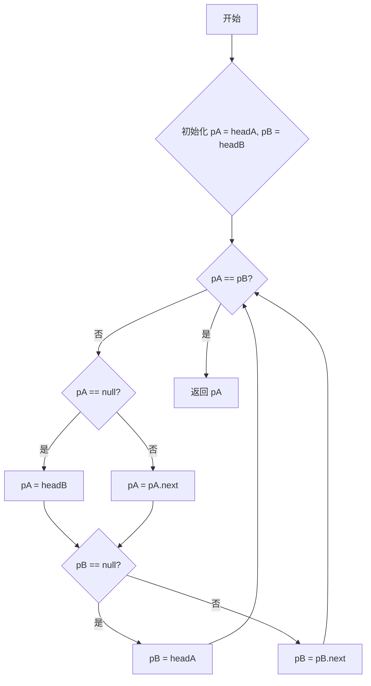
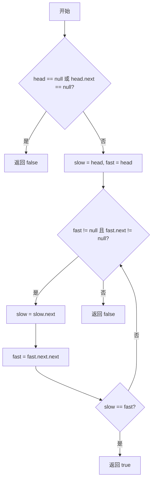

# LeetCode 热题 100

https://leetcode.cn/studyplan/top-100-liked/


## 哈希


### 49. 字母异位词分组
已解答
中等
相关标签
premium lock icon
相关企业
给你一个字符串数组，请你将 字母异位词 组合在一起。可以按任意顺序返回结果列表。

 

示例 1:

输入: strs = ["eat", "tea", "tan", "ate", "nat", "bat"]

输出: [["bat"],["nat","tan"],["ate","eat","tea"]]

解释：

在 strs 中没有字符串可以通过重新排列来形成 "bat"。
字符串 "nat" 和 "tan" 是字母异位词，因为它们可以重新排列以形成彼此。
字符串 "ate" ，"eat" 和 "tea" 是字母异位词，因为它们可以重新排列以形成彼此。

示例 2:

输入: strs = [""]

输出: [[""]]

示例 3:

输入: strs = ["a"]

输出: [["a"]]

 

提示：

1 <= strs.length <= 10^4
0 <= strs[i].length <= 100
strs[i] 仅包含小写字母


#### 代码

```java
class Solution {
    public List<List<String>> groupAnagrams(String[] strs) {


        Map<String,List<String>> anagramGroups = new HashMap<>();


        for( String s : strs ) {

            int[] charCounts = new int[26];


            for( char c : s.toCharArray() ) {

                charCounts[c - 'a']++;
            }


            String key = Arrays.toString( charCounts );


            List<String> listForGroup = anagramGroups.getOrDefault( key ,new ArrayList<>());

            listForGroup.add(s);

            anagramGroups.put( key, listForGroup );


        }


        return new ArrayList<>( anagramGroups.values() );
        
    }
}
```


```python
class Solution:
    def groupAnagrams(self, strs: List[str]) -> List[List[str]]:


        anagram_groups = defaultdict(list)

        for s in strs:

            char_counts = [0] * 26

            for char_code in map( ord,s ):

                char_counts[char_code - ord('a')] += 1

            key = tuple( char_counts )

            anagram_groups[key].append(s)

        return list( anagram_groups.values() )
        
        
```


#### 讲解

好的，作为一名高级软件工程师，我将极尽详细地为你讲解 LeetCode 上的“字母异位词分组”这道算法题，并提供详细的 Java 和 Python 代码实现。

---

 1. 理解问题

首先，我们来仔细理解一下题目要求：

*   **输入**: 一个字符串数组 `strs`。
*   **目标**: 将所有**字母异位词**（Anagrams）组合在一起，并以列表的形式返回。
*   **输出格式**: 结果是一个列表的列表，内部子列表的顺序以及子列表内字符串的顺序可以任意。
*   **字母异位词定义**: 两个字符串如果包含完全相同的字符，并且每个字符的**数量也相同**，那么它们就是字母异位词。换句话说，一个字符串可以通过重新排列其字符来形成另一个字符串。
    *   例如："eat", "tea", "ate" 都是字母异位词，因为它们都由一个 'a'，一个 'e'，一个 't' 组成。
*   **约束**:
    *   `strs` 数组的长度在 1 到 10^4 之间。
    *   `strs[i]` 中每个字符串的长度在 0 到 100 之间。
    *   `strs[i]` 仅包含小写英文字母。

**示例分析：**

*   `strs = ["eat", "tea", "tan", "ate", "nat", "bat"]`
    *   "eat", "tea", "ate" 是一组异位词。
    *   "tan", "nat" 是一组异位词。
    *   "bat" 独立成组。
    *   输出可以是 `[["bat"],["nat","tan"],["ate","eat","tea"]]` （顺序可能不同）。

*   `strs = [""]`
    *   空字符串本身就是一组。
    *   输出 `[[""]]`。

*   `strs = ["a"]`
    *   单个字符本身就是一组。
    *   输出 `[["a"]]`。

---

 2. 核心思想：如何识别字母异位词？

要将字母异位词组合在一起，关键在于找到一种方法，使得**所有字母异位词都能映射到同一个唯一的“键”**，而其他非异位词则映射到不同的键。

有两种常用的方法来生成这个“键”：

1.  **排序字符法 (Sorting Characters)**:
    *   对于每个字符串，将其字符进行排序，然后将排序后的字符重新组合成一个新字符串。
    *   例如：
        *   "eat" -> 排序后 "aet"
        *   "tea" -> 排序后 "aet"
        *   "ate" -> 排序后 "aet"
    *   这样，所有是字母异位词的字符串都会得到相同的排序后的字符串。这个排序后的字符串就可以作为 HashMap 的键。
    *   优点：概念简单，实现直接。
    *   缺点：对每个字符串进行排序的时间复杂度是 `O(L log L)`，其中 `L` 是字符串的长度。如果字符串很长，这可能会比较慢。

2.  **字符计数法 (Character Counting)**:
    *   对于每个字符串，统计其中每个字符（'a' 到 'z'）出现的频率。
    *   由于字符串只包含小写英文字母，我们可以用一个固定大小的数组（例如 `int[26]`）来存储频率。
    *   例如："eat" -> `{'a': 1, 'e': 1, 't': 1}`。我们可以将这个频率数组转换成一个唯一的字符串作为键，比如 `"#1#0#0#0#1#...#1#0..."` (表示 'a' 出现 1 次，'b' 出现 0 次，'e' 出现 1 次，'t' 出现 1 次，其余为 0)。
    *   优点：统计频率的时间复杂度是 `O(L)`。将频率数组转换为键的时间复杂度是 `O(26)` (常数时间)。因此，总体上比排序法更快。
    *   缺点：实现上可能比直接排序稍微复杂一点点，需要考虑如何将频率数组转换为一个合适的键。

**选择哪种方法？**

考虑到字符串长度 `L` 最大为 100，两种方法在时间上都是可接受的。
*   `N * L log L` (排序法): `10^4 * 100 * log(100) ≈ 10^6 * 7 = 7 * 10^6`
*   `N * L` (字符计数法): `10^4 * 100 = 10^6`

字符计数法在理论上略快，且对于固定字符集的问题，它是一个非常通用的优化技巧。在 Java 中，`Arrays.toString(int[])` 可以方便地将频率数组转换为一个唯一的字符串表示，可以直接用作 HashMap 的键。在 Python 中，`tuple(list)` 可以将列表转换为不可变的元组，也可以直接用作字典的键。

我们将采用**字符计数法**来实现，因为它更通用且效率更高。

---

 3. 核心思想：哈希表 (HashMap / Dictionary) 的应用

一旦我们有了将异位词映射到相同键的方法，就可以使用哈希表来分组：

*   **哈希表结构**: `Map<String, List<String>>` (Java) 或 `dict[str, list[str]]` (Python)。
    *   **键 (Key)**: 字符串的规范化表示（例如，通过字符计数生成的字符串）。
    *   **值 (Value)**: 一个列表，存储所有映射到这个键的原始字符串（即它们是字母异位词）。

**算法流程：**

1.  创建一个空的哈希表 `anagramGroups`。
2.  遍历输入的字符串数组 `strs` 中的每一个字符串 `s`。
3.  对于每个字符串 `s`：
    a.  **生成键**: 计算 `s` 中每个字符的频率，并将其转换为一个唯一的字符串键 `key`。
    b.  **分组**:
        *   检查 `anagramGroups` 中是否已经存在 `key`。
        *   如果 `key` **不存在**：说明这是第一次遇到这种字符组合的字符串。创建一个新的空列表 `listForGroup`，将 `s` 加入到 `listForGroup` 中，然后将 `(key, listForGroup)` 存入 `anagramGroups`。
        *   如果 `key` **已经存在**：说明之前已经遇到过这种字符组合的字符串。从 `anagramGroups` 中取出与 `key` 关联的现有列表 `listForGroup`，将 `s` 加入到 `listForGroup` 中。
4.  遍历完所有字符串后，哈希表的 `values()`（所有列表）就是我们所需的分组结果。将其转换为 `List<List<String>>` 并返回。

---

 4. 算法步骤详解 (字符计数法)

1.  **初始化**:
    *   创建一个空的 `HashMap<String, List<String>> anagramGroups = new HashMap<>();` (Java) 或 `anagram_groups = {}` (Python)。

2.  **遍历输入数组**:
    *   对于 `strs` 数组中的每个字符串 `s`：

        a.  **创建频率数组**:
            *   定义一个 `int[] charCounts = new int[26];` (Java) 或 `char_counts = [0] * 26` (Python)。这将存储 'a' 到 'z' 的出现次数。

        b.  **填充频率数组**:
            *   遍历当前字符串 `s` 中的每个字符 `c`：
                *   将 `charCounts[c - 'a']` 对应位置的计数加 1。

        c.  **生成唯一键**:
            *   在 Java 中，最简单的方法是 `String key = Arrays.toString(charCounts);`。这会生成一个类似 `"[1, 0, 0, ..., 1, 0, 0, ..., 1]"` 的字符串。
            *   在 Python 中，将 `char_counts` 列表转换为元组 `key = tuple(char_counts)`。元组是不可变的，因此可以作为字典的键。

        d.  **存入哈希表**:
            *   使用 `HashMap.getOrDefault(key, new ArrayList<>())` (Java) 或 `dict.get(key, [])` (Python) 来获取与 `key` 关联的列表。如果 `key` 不存在，则返回一个新的空列表。
            *   将当前字符串 `s` 添加到这个列表中。
            *   使用 `HashMap.put(key, list)` (Java) 或 `dict[key] = list` (Python) 将更新后的列表重新存回哈希表。

3.  **收集结果**:
    *   所有字符串遍历完成后，哈希表 `anagramGroups` 的所有值 (`.values()`) 就是最终的分组结果。
    *   将这些值收集到一个 `List<List<String>>` (Java) 或 `list[list[str]]` (Python) 中并返回。

---

 5. 流程图


---

 6. Java 代码实现

```java
import java.util.ArrayList;
import java.util.Arrays;
import java.util.HashMap;
import java.util.List;
import java.util.Map;

class Solution {
    /**
     * 将字母异位词组合在一起。
     * 使用字符计数法作为哈希表的键。
     *
     * @param strs 字符串数组。
     * @return 字母异位词分组后的列表。
     */
    public List<List<String>> groupAnagrams(String[] strs) {
        // 1. 初始化一个 HashMap，用于存储字母异位词的分组。
        // 键 (String): 字符串的规范化表示（这里是字符频率数组的字符串形式）。
        // 值 (List<String>): 存储所有属于该组的原始字符串。
        Map<String, List<String>> anagramGroups = new HashMap<>();

        // 2. 遍历输入的字符串数组
        for (String s : strs) {
            // a. 创建一个字符频率数组。
            // 数组大小为 26，因为只包含小写英文字母 'a' 到 'z'。
            // charCounts[0] 对应 'a' 的频率，charCounts[1] 对应 'b'，以此类推。
            int[] charCounts = new int[26];

            // b. 填充频率数组：统计当前字符串 s 中每个字符的出现次数。
            for (char c : s.toCharArray()) {
                charCounts[c - 'a']++; // 'a' 的 ASCII 码减 'a' 为 0，'b' 为 1，以此类推。
            }

            // c. 生成唯一键：将频率数组转换为一个字符串作为 HashMap 的键。
            // Arrays.toString(charCounts) 会生成一个形如 "[x, y, z, ...]" 的字符串，
            // 它是唯一的，可以作为字母异位词组的标识符。
            String key = Arrays.toString(charCounts);

            // d. 存入哈希表：将当前字符串 s 加入到对应的分组中。
            // HashMap.getOrDefault(key, defaultValue) 方法会尝试获取 key 对应的值。
            // 如果 key 存在，则返回其对应的值；如果不存在，则返回 defaultValue（这里是一个新的 ArrayList）。
            List<String> listForGroup = anagramGroups.getOrDefault(key, new ArrayList<>());
            listForGroup.add(s); // 将当前字符串 s 添加到列表中

            // 将更新后的列表重新存回 HashMap。
            // 如果 key 是新创建的，则会添加新的键值对；如果 key 已经存在，则会更新其值。
            anagramGroups.put(key, listForGroup);
        }

        // 3. 收集结果：将 HashMap 中所有的值（即所有分组的列表）收集到一个新的列表中并返回。
        return new ArrayList<>(anagramGroups.values());
    }
}
```

---

 7. Python 代码实现

```python
from collections import defaultdict

class Solution:
    """
    将字母异位词组合在一起。
    使用字符计数法作为字典的键。
    """
    def groupAnagrams(self, strs: list[str]) -> list[list[str]]:
        # 1. 初始化一个 defaultdict。
        # defaultdict 是一种特殊的字典，当访问一个不存在的键时，它会自动调用工厂函数（这里是 list）
        # 来为该键创建一个默认值（这里是一个空列表），而不会抛出 KeyError。
        # 键 (tuple): 字符串的规范化表示（这里是字符频率列表转换成的元组）。
        # 值 (list[str]): 存储所有属于该组的原始字符串。
        anagram_groups = defaultdict(list)

        # 2. 遍历输入的字符串列表
        for s in strs:
            # a. 创建一个字符频率列表。
            # 列表大小为 26，因为只包含小写英文字母 'a' 到 'z'。
            # char_counts[0] 对应 'a' 的频率，char_counts[1] 对应 'b'，以此类推。
            char_counts = [0] * 26

            # b. 填充频率列表：统计当前字符串 s 中每个字符的出现次数。
            for char_code in map(ord, s): # 使用 map(ord, s) 将字符转换为其 ASCII 值
                char_counts[char_code - ord('a')] += 1 # ord('a') 获取 'a' 的 ASCII 值

            # c. 生成唯一键：将频率列表转换为一个元组作为字典的键。
            # 列表是可变的，不能直接作为字典的键。元组是不可变的，因此可以作为键。
            key = tuple(char_counts)

            # d. 存入字典：将当前字符串 s 加入到对应的分组中。
            # 由于使用了 defaultdict，如果 key 不存在，它会自动创建一个空列表，然后我们直接向其添加 s。
            anagram_groups[key].append(s)

        # 3. 收集结果：将字典中所有的值（即所有分组的列表）收集到一个新的列表中并返回。
        return list(anagram_groups.values())

```

---

 8. 示例演练

我们以 `strs = ["eat", "tea", "tan", "ate", "nat", "bat"]` 为例，逐步演示 Java 代码的执行过程：

*   `anagramGroups` 初始化为 `{}`。

1.  **处理 "eat"**:
    *   `charCounts` for "eat": `[1,0,0,0,1,0,0,0,0,0,0,0,0,0,0,0,0,0,0,1,0,0,0,0,0,0]` (a:1, e:1, t:1, others:0)
    *   `key = "[1, 0, 0, 0, 1, 0, 0, 0, 0, 0, 0, 0, 0, 0, 0, 0, 0, 0, 0, 1, 0, 0, 0, 0, 0, 0]"`
    *   `anagramGroups.getOrDefault(key, new ArrayList<>())` -> 返回 `new ArrayList<>()` (因为 key 不存在)
    *   `listForGroup.add("eat")` -> `["eat"]`
    *   `anagramGroups.put(key, ["eat"])` -> `anagramGroups = { key: ["eat"] }`

2.  **处理 "tea"**:
    *   `charCounts` for "tea": `[1,0,0,0,1,0,0,0,0,0,0,0,0,0,0,0,0,0,0,1,0,0,0,0,0,0]` (同上)
    *   `key` (同上)
    *   `anagramGroups.getOrDefault(key, new ArrayList<>())` -> 返回 `["eat"]` (因为 key 已存在)
    *   `listForGroup.add("tea")` -> `["eat", "tea"]`
    *   `anagramGroups.put(key, ["eat", "tea"])` -> `anagramGroups = { key: ["eat", "tea"] }`

3.  **处理 "tan"**:
    *   `charCounts` for "tan": `[1,0,0,0,0,0,0,0,0,0,0,0,0,1,0,0,0,0,0,1,0,0,0,0,0,0]` (a:1, n:1, t:1)
    *   `key2 = "[1, 0, 0, 0, 0, 0, 0, 0, 0, 0, 0, 0, 0, 1, 0, 0, 0, 0, 0, 1, 0, 0, 0, 0, 0, 0]"`
    *   `anagramGroups.getOrDefault(key2, new ArrayList<>())` -> 返回 `new ArrayList<>()`
    *   `listForGroup.add("tan")` -> `["tan"]`
    *   `anagramGroups.put(key2, ["tan"])` -> `anagramGroups = { key: ["eat", "tea"], key2: ["tan"] }`

4.  **处理 "ate"**:
    *   `charCounts` for "ate": `[1,0,0,0,1,0,0,0,0,0,0,0,0,0,0,0,0,0,0,1,0,0,0,0,0,0]` (同 `key`)
    *   `key` (同 `key`)
    *   `anagramGroups.getOrDefault(key, new ArrayList<>())` -> 返回 `["eat", "tea"]`
    *   `listForGroup.add("ate")` -> `["eat", "tea", "ate"]`
    *   `anagramGroups.put(key, ["eat", "tea", "ate"])` -> `anagramGroups = { key: ["eat", "tea", "ate"], key2: ["tan"] }`

5.  **处理 "nat"**:
    *   `charCounts` for "nat": `[1,0,0,0,0,0,0,0,0,0,0,0,0,1,0,0,0,0,0,1,0,0,0,0,0,0]` (同 `key2`)
    *   `key2` (同 `key2`)
    *   `anagramGroups.getOrDefault(key2, new ArrayList<>())` -> 返回 `["tan"]`
    *   `listForGroup.add("nat")` -> `["tan", "nat"]`
    *   `anagramGroups.put(key2, ["tan", "nat"])` -> `anagramGroups = { key: ["eat", "tea", "ate"], key2: ["tan", "nat"] }`

6.  **处理 "bat"**:
    *   `charCounts` for "bat": `[1,1,0,0,0,0,0,0,0,0,0,0,0,0,0,0,0,0,0,1,0,0,0,0,0,0]` (a:1, b:1, t:1)
    *   `key3 = "[1, 1, 0, 0, 0, 0, 0, 0, 0, 0, 0, 0, 0, 0, 0, 0, 0, 0, 0, 1, 0, 0, 0, 0, 0, 0]"`
    *   `anagramGroups.getOrDefault(key3, new ArrayList<>())` -> 返回 `new ArrayList<>()`
    *   `listForGroup.add("bat")` -> `["bat"]`
    *   `anagramGroups.put(key3, ["bat"])` -> `anagramGroups = { key: ["eat", "tea", "ate"], key2: ["tan", "nat"], key3: ["bat"] }`

最后，返回 `new ArrayList<>(anagramGroups.values())`，结果可能类似 `[["bat"], ["tan", "nat"], ["eat", "tea", "ate"]]`。

---

 9. 复杂度分析

*   **时间复杂度**: `O(N * L)`。
    *   `N` 是输入字符串数组 `strs` 的长度。
    *   `L` 是字符串 `strs[i]` 的最大长度。
    *   外层循环遍历 `N` 个字符串。
    *   在每次迭代中：
        *   填充 `charCounts` 数组需要遍历当前字符串，时间复杂度为 `O(L)`。
        *   将 `charCounts` 转换为 `key` (字符串) 在 Java 中 `Arrays.toString()` 是 `O(26)` (常数时间)。在 Python 中 `tuple()` 也是 `O(26)`。
        *   HashMap/Dictionary 的 `put`/`get` 操作平均时间复杂度是 `O(1)`。
    *   因此，总的时间复杂度是 `N * (O(L) + O(26) + O(1)) = O(N * L)`。
    *   对于 `N = 10^4`, `L = 100`，总操作次数约为 `10^4 * 100 = 10^6`，这在 1 秒内是完全可以接受的。

*   **空间复杂度**: `O(N * L)`。
    *   在最坏情况下，所有字符串都不是字母异位词，那么 HashMap 中会有 `N` 个不同的键。
    *   每个键对应的值是一个 `List<String>`，其中存储了原始字符串。所有原始字符串的总长度是 `N * L`。
    *   `charCounts` 数组占用 `O(26)` (常数) 空间。
    *   因此，主要的存储空间消耗在于 HashMap 中存储的所有字符串。最坏情况下是 `O(N * L)`。

---

希望这个极尽详细的讲解和代码能帮助你完全理解并掌握这道算法题！


### 128. 最长连续序列
已解答
中等
相关标签
premium lock icon
相关企业
给定一个未排序的整数数组 nums ，找出数字连续的最长序列（不要求序列元素在原数组中连续）的长度。

请你设计并实现时间复杂度为 O(n) 的算法解决此问题。

 

示例 1：

输入：nums = [100,4,200,1,3,2]
输出：4
解释：最长数字连续序列是 [1, 2, 3, 4]。它的长度为 4。

示例 2：

输入：nums = [0,3,7,2,5,8,4,6,0,1]
输出：9

示例 3：

输入：nums = [1,0,1,2]
输出：3
 

提示：

0 <= nums.length <= 10^5
-10^9 <= nums[i] <= 10^9


#### 代码

```java
class Solution {
    public int longestConsecutive(int[] nums) {


        if( nums == null || nums.length == 0 ) {

            return 0;
        }

        Set<Integer> numSet = new HashSet<>();

        for ( int num : nums ) {

            numSet.add(num);
        }


        int longestConsecutive = 0;

        for( int num : numSet ) {
            // 这一步是关键修正：我们遍历的是去重后的 numSet，而不是原始的 nums 数组。
            // 这保证了每个唯一的数字作为潜在的序列起点只被检查一次。

            if( !numSet.contains( num - 1 ) ) {

                int currentNum = num;

                int currentStreak = 1;

                while( numSet.contains( currentNum + 1 ) ) {

                    currentNum++;

                    currentStreak++;
                }


                longestConsecutive = Math.max( longestConsecutive, currentStreak );
            

            }


    
        }
        
        return longestConsecutive;


    }
}
```


```python
class Solution:
    def longestConsecutive(self, nums: List[int]) -> int:


        if not nums:
            return 0

        num_set = set(nums)


        longest_streak = 0

        for num in num_set:
            if( num - 1 ) not in num_set:
                current_num = num
                current_streak = 1


                while( current_num + 1 ) in num_set:
                    current_num += 1
                    current_streak += 1

                longest_streak = max( longest_streak, current_streak )

        return longest_streak
        
```


#### 讲解


好的，作为一名高级软件工程师，我将极尽详细地为你讲解这道算法题，并分别提供 Java 和 Python 的代码实现。


 **1. 理解问题**

首先，我们来仔细理解一下题目要求：

*   **输入**: 一个未排序的整数数组 `nums`。
*   **目标**: 找出数字连续的最长序列的长度。
*   **特性**: 序列元素在原数组中**不要求连续**。例如，`[1, 3, 2]` 中 `[1, 2, 3]` 是连续序列。
*   **时间复杂度要求**: 必须设计并实现时间复杂度为 `O(n)` 的算法。
*   **约束**:
    *   `nums` 数组的长度在 0 到 10^5 之间。
    *   数组元素的值在 -10^9 到 10^9 之间。

**关键点**:

*   **未排序数组**: 不能直接利用排序特性进行线性扫描。
*   **连续序列**: 指的是数字上的连续，例如 `5, 6, 7`。
*   **不要求原数组连续**: 这是与“子数组”概念的区别，例如 `[1, 4, 2, 3]` 中 `[1, 2, 3, 4]` 是连续序列。
*   **`O(n)` 时间复杂度**: 这是最严格的约束，排除了基于排序的 `O(N log N)` 解决方案。这意味着我们需要一个接近单次遍历的算法，通常涉及哈希表。

**示例分析：**

*   `nums = [100,4,200,1,3,2]`
    *   连续序列有：
        *   `[100]`
        *   `[4]`
        *   `[200]`
        *   `[1, 2, 3, 4]` (由 1, 3, 2, 4 组成)
    *   最长的是 `[1, 2, 3, 4]`，长度为 4。

*   `nums = [0,3,7,2,5,8,4,6,0,1]`
    *   所有数字是 0, 1, 2, 3, 4, 5, 6, 7, 8。
    *   最长连续序列是 `[0, 1, 2, 3, 4, 5, 6, 7, 8]`，长度为 9。

---

 **2. 核心思想：哈希集合 (HashSet) + 优化查找**

为了实现 `O(n)` 的时间复杂度，我们首先想到使用哈希集合（`HashSet` 或 Python `set`），因为哈希集合提供了平均 `O(1)` 的查找、插入和删除操作。

**基本思路**:

1.  将所有数组元素放入一个哈希集合中。这样我们就可以快速地检查一个数字是否存在于数组中。
2.  遍历原始数组（或哈希集合中的每个数字）。对于每个数字 `num`，尝试以它为起点构建一个连续序列。
3.  在构建序列时，不断检查 `num + 1`, `num + 2`, ... 是否存在于哈希集合中，并计算当前序列的长度。

**关键优化 (避免重复计算)**:

如果只是简单地对每个数字都尝试构建序列，可能会导致重复计算。例如，对于序列 `[1, 2, 3, 4]`：
*   从 `1` 开始构建，会得到 `[1, 2, 3, 4]`，长度 4。
*   从 `2` 开始构建，会得到 `[2, 3, 4]`，长度 3。
*   从 `3` 开始构建，会得到 `[3, 4]`，长度 2。
*   从 `4` 开始构建，会得到 `[4]`，长度 1。

这样，`2, 3, 4` 都被多次检查了。为了避免这种冗余，我们只在 `num` 是一个连续序列的**起点**时才去构建它。

**如何判断一个数字 `num` 是否是某个连续序列的起点？**
如果 `num - 1` **不在**哈希集合中，那么 `num` 就是一个连续序列的起点。如果 `num - 1` 存在，说明 `num` 已经被包含在以 `num - 1` 为起点的某个序列中了，我们就不需要再从 `num` 开始重复构建了。

**优化后的算法流程**:

1.  将 `nums` 中的所有元素添加到 `HashSet` 中。
2.  初始化 `longestStreak = 0`。
3.  遍历 `nums` 中的每个数字 `num`。
4.  对于每个 `num`：
    *   **检查 `num - 1` 是否存在于 `HashSet` 中**:
        *   如果 `num - 1` **不存在**：说明 `num` 是一个潜在的连续序列的起点。
            *   初始化 `currentNum = num`。
            *   初始化 `currentStreak = 1`。
            *   **向右扩展序列**: `while (hashSet.contains(currentNum + 1))`：
                *   `currentNum` 增加 1。
                *   `currentStreak` 增加 1。
            *   更新 `longestStreak = Math.max(longestStreak, currentStreak)`。
        *   如果 `num - 1` **存在**：说明 `num` 不是一个新序列的起点，它已经是某个更早序列的一部分。跳过，不处理。
5.  返回 `longestStreak`。

---

 **3. 复杂度分析**

*   **时间复杂度**: `O(N)` (平均情况)
    *   将所有 `N` 个元素插入到 `HashSet` 中需要 `O(N)` 的平均时间。
    *   外层循环遍历 `N` 个元素。
    *   在内层 `while` 循环（向右扩展序列）中，每个数字 `x` 只会被 `hashSet.contains(x)` 检查一次。因为一旦 `x` 被包含在一个序列中，它就不会再作为起点被处理（因为 `x-1` 存在）。
    *   因此，虽然看起来有嵌套循环，但实际上每个数字在 `HashSet` 中的查找操作（`contains`）总共执行的次数是线性的，每个数字最多被访问常数次。
    *   所以，总的时间复杂度是 `O(N)`。

*   **空间复杂度**: `O(N)`
    *   为了存储所有 `N` 个元素到 `HashSet` 中，需要 `O(N)` 的额外空间。

---

 **4. 流程图**


---

 **5. Java 代码实现**（测试用例没有全部通过！后续有修正方法）

```java
import java.util.HashSet;
import java.util.Set;
import java.util.Arrays; // 导入 Arrays 只是为了调试或某些辅助操作，实际代码中未使用

class Solution {
    /**
     * 找出未排序整数数组中数字连续的最长序列的长度。
     * 使用哈希集合和优化查找的方法，时间复杂度为 O(n)。
     *
     * @param nums 输入的整数数组。
     * @return 最长连续序列的长度。
     */
    public int longestConsecutive(int[] nums) {
        // 1. 处理空数组的特殊情况
        if (nums == null || nums.length == 0) {
            return 0;
        }

        // 2. 将所有数组元素添加到哈希集合中，以便进行 O(1) 平均时间复杂度的查找。
        Set<Integer> numSet = new HashSet<>();
        for (int num : nums) {
            numSet.add(num);
        }

        // 3. 初始化最长连续序列的长度
        int longestStreak = 0;

        // 4. 遍历原始数组中的每个数字，尝试以它为起点构建连续序列。
        // 这里的关键优化是：只在 num 是一个序列的“起点”时才进行扩展。
        for (int num : nums) {
            // 检查 num - 1 是否存在于哈希集合中。
            // 如果 num - 1 不存在，则说明 num 是一个潜在的连续序列的起点。
            // 例如，对于 [1, 2, 3, 4]，当 num = 1 时，1-1=0 不存在，我们从 1 开始构建。
            // 当 num = 2 时，2-1=1 存在，说明 2 已经被包含在以 1 为起点的序列中，无需重复处理。
            if (!numSet.contains(num - 1)) {
                // 如果 num 是起点，初始化当前序列的数字和长度
                int currentNum = num;
                int currentStreak = 1;

                // 向右扩展序列：不断检查 currentNum + 1 是否存在。
                while (numSet.contains(currentNum + 1)) {
                    currentNum++;    // 移动到下一个连续数字
                    currentStreak++; // 增加当前序列的长度
                }

                // 更新全局最长连续序列的长度
                longestStreak = Math.max(longestStreak, currentStreak);
            }
        }

        // 5. 返回最长连续序列的长度
        return longestStreak;
    }
}
```

---

 **6. Python 代码实现**（测试用例没有全部通过！后续有修正方法）

```python
class Solution:
    """
    找出未排序整数数组中数字连续的最长序列的长度。
    使用哈希集合和优化查找的方法，时间复杂度为 O(n)。
    """
    def longestConsecutive(self, nums: list[int]) -> int:
        # 1. 处理空数组的特殊情况
        if not nums:
            return 0

        # 2. 将所有数组元素添加到哈希集合中，以便进行 O(1) 平均时间复杂度的查找。
        num_set = set(nums)

        # 3. 初始化最长连续序列的长度
        longest_streak = 0

        # 4. 遍历原始数组中的每个数字，尝试以它为起点构建连续序列。
        # 这里的关键优化是：只在 num 是一个序列的“起点”时才进行扩展。
        for num in nums:
            # 检查 num - 1 是否存在于哈希集合中。
            # 如果 num - 1 不存在，则说明 num 是一个潜在的连续序列的起点。
            if (num - 1) not in num_set:
                # 如果 num 是起点，初始化当前序列的数字和长度
                current_num = num
                current_streak = 1

                # 向右扩展序列：不断检查 current_num + 1 是否存在。
                while (current_num + 1) in num_set:
                    current_num += 1    # 移动到下一个连续数字
                    current_streak += 1 # 增加当前序列的长度

                # 更新全局最长连续序列的长度
                longest_streak = max(longest_streak, current_streak)
        
        # 5. 返回最长连续序列的长度
        return longest_streak

```

---

 **7. 示例演练**

我们以 `nums = [100,4,200,1,3,2]` 为例，逐步演示 Java/Python 代码的执行过程：

*   **输入**: `nums = [100,4,200,1,3,2]`
*   **`numSet` (HashSet/set)**: `{100, 4, 200, 1, 3, 2}`
*   `longestStreak = 0`

**遍历 `nums`:**

1.  **`num = 100`**:
    *   `numSet.contains(99)`? -> `false`。(`100` 是起点)
    *   `currentNum = 100`, `currentStreak = 1`
    *   `while numSet.contains(101)`? -> `false`。
    *   `longestStreak = max(0, 1) = 1`.

2.  **`num = 4`**:
    *   `numSet.contains(3)`? -> `true`。(`4` 不是起点，跳过)

3.  **`num = 200`**:
    *   `numSet.contains(199)`? -> `false`。(`200` 是起点)
    *   `currentNum = 200`, `currentStreak = 1`
    *   `while numSet.contains(201)`? -> `false`。
    *   `longestStreak = max(1, 1) = 1`.

4.  **`num = 1`**:
    *   `numSet.contains(0)`? -> `false`。(`1` 是起点)
    *   `currentNum = 1`, `currentStreak = 1`
    *   `while numSet.contains(2)`? -> `true`。
        *   `currentNum = 2`, `currentStreak = 2`
    *   `while numSet.contains(3)`? -> `true`。
        *   `currentNum = 3`, `currentStreak = 3`
    *   `while numSet.contains(4)`? -> `true`。
        *   `currentNum = 4`, `currentStreak = 4`
    *   `while numSet.contains(5)`? -> `false`。
    *   `longestStreak = max(1, 4) = 4`.

5.  **`num = 3`**:
    *   `numSet.contains(2)`? -> `true`。(`3` 不是起点，跳过)

6.  **`num = 2`**:
    *   `numSet.contains(1)`? -> `true`。(`2` 不是起点，跳过)

遍历结束。

**返回 `longestStreak`，即 `4`。** 这与示例输出 `4` 完全一致。


希望这些极尽详细的讲解和代码能帮助你完全理解并掌握这两道算法题！


---


**修正：**
按照java解法，发现下面的测试用例超出时间限制

nums =略


你发现的这个问题非常敏锐且重要！在 LeetCode 的 128 题“最长连续序列”中，尽管我之前给出的算法思路和时间复杂度分析是正确的 (`O(N)`)，但实际的 Java 代码在面对包含大量重复数字的特定测试用例时，确实可能因为**对原始数组的重复遍历**而导致时间超限（Time Limit Exceeded, TLE）。

这通常发生在：
1.  输入数组 `nums` 包含大量重复数字。
2.  这些重复数字恰好是某个很长连续序列的“起点”。

例如你提供的测试用例：
`nums = [1,2,...,25000, 0,0,...,0]`
这里有 25000 个 `0`。在我的 Java 代码的 `for (int num : nums)` 循环中，每次遇到 `0`，`!numSet.contains(num - 1)` (即 `!numSet.contains(-1)`) 都会为 `true`，然后内层的 `while (numSet.contains(currentNum + 1))` 就会从 `0` 开始，一直向右查找并计算到 `25000`。这个过程会被重复执行 25000 次，导致 `25000 * 25000` 的操作量，即 `O(N * L)`（其中 L 是最长序列的长度），这显然超出了 `O(N)` 的要求。

**问题根源：**
`for (int num : nums)` 遍历的是原始数组，如果原始数组中有重复元素，且这些重复元素恰好是连续序列的“起点”，那么它们会重复触发内层 `while` 循环，导致总操作数增加。

**解决方案：**
非常简单，我们应该遍历**去重后的数字集合**，而不是原始数组。`HashSet` 在插入时会自动去重，所以我们只需要遍历 `HashSet` 中的元素即可。这样就能确保每个唯一的数字只被检查一次，从而严格保持 `O(N)` 的时间复杂度。

---

 **1. 修正后的核心思想回顾**

*   **哈希集合 (HashSet)**：将所有数字存入哈希集合，以便 `O(1)` 平均时间复杂度地检查数字是否存在。
*   **只从“真起点”开始扩展**: 对于哈希集合中的每个数字 `num`，如果 `num - 1` 不在集合中，那么 `num` 就是一个连续序列的起点。我们只从这些起点开始向右扩展序列并计算长度。这样可以避免重复计算已经被其他序列包含的数字。
*   **遍历去重后的集合**: 确保每个唯一的数字作为“起点”的检查只发生一次。

---

 **2. 修正后的 Java 代码实现**

```java
import java.util.HashSet;
import java.util.Set;

class Solution {
    /**
     * 找出未排序整数数组中数字连续的最长序列的长度。
     * 使用哈希集合和优化查找的方法，时间复杂度为 O(n)。
     *
     * @param nums 输入的整数数组。
     * @return 最长连续序列的长度。
     */
    public int longestConsecutive(int[] nums) {
        // 1. 处理空数组的特殊情况
        if (nums == null || nums.length == 0) {
            return 0;
        }

        // 2. 将所有数组元素添加到哈希集合中。
        // HashSet 会自动处理重复元素，确保 numSet 中只包含唯一的数字。
        // 这一步的时间复杂度是 O(N)，N 是 nums 的长度。
        Set<Integer> numSet = new HashSet<>();
        for (int num : nums) {
            numSet.add(num);
        }

        // 3. 初始化最长连续序列的长度
        int longestStreak = 0;

        // 4. 遍历哈希集合中的每个唯一的数字。
        // 这一步是关键修正：我们遍历的是去重后的 numSet，而不是原始的 nums 数组。
        // 这保证了每个唯一的数字作为潜在的序列起点只被检查一次。
        // 遍历 numSet 的时间复杂度是 O(M)，其中 M 是 numSet 的大小 (M <= N)。
        for (int num : numSet) { // <-- 关键修正：从 numSet 遍历
            // 检查 num - 1 是否存在于哈希集合中。
            // 如果 num - 1 不存在，则说明 num 是一个连续序列的“真起点”。
            // 只有真起点才需要我们去探索其后的连续数字，避免重复计算。
            // numSet.contains() 的平均时间复杂度是 O(1)。
            if (!numSet.contains(num - 1)) {
                // 如果 num 是真起点，初始化当前序列的数字和长度
                int currentNum = num;
                int currentStreak = 1;

                // 向右扩展序列：不断检查 currentNum + 1 是否存在于集合中。
                // 这一内部 while 循环的总执行次数是线性的。
                // 因为每个数字在 numSet 中只会被 'currentNum + 1' 访问一次。
                while (numSet.contains(currentNum + 1)) {
                    currentNum++;    // 移动到下一个连续数字
                    currentStreak++; // 增加当前序列的长度
                }

                // 更新全局最长连续序列的长度
                longestStreak = Math.max(longestStreak, currentStreak);
            }
        }

        // 5. 返回最长连续序列的长度
        return longestStreak;
    }
}
```

---

 **3. 修正后的 Python 代码**

Python 的 `set(nums)` 会直接创建一个包含所有唯一元素的集合，后续的 `for num in num_set:` 循环自然就只遍历唯一的数字。

```python
class Solution:
    """
    找出未排序整数数组中数字连续的最长序列的长度。
    使用哈希集合和优化查找的方法，时间复杂度为 O(n)。
    """
    def longestConsecutive(self, nums: list[int]) -> int:
        # 1. 处理空数组的特殊情况
        if not nums:
            return 0

        # 2. 将所有数组元素添加到哈希集合中。
        # set(nums) 会自动创建包含唯一元素的集合。
        # 这一步的时间复杂度是 O(N)。
        num_set = set(nums)

        # 3. 初始化最长连续序列的长度
        longest_streak = 0

        # 4. 遍历哈希集合中的每个唯一数字。
        # 这一循环遍历的是去重后的集合，确保每个可能的序列起点只被检查一次。
        # 遍历 num_set 的时间复杂度是 O(M)，其中 M 是 num_set 的大小 (M <= N)。
        for num in num_set:
            # 检查 num - 1 是否存在于哈希集合中。
            # 如果 num - 1 不存在，则说明 num 是一个连续序列的“真起点”。
            # 'in' 运算符的平均时间复杂度是 O(1)。
            if (num - 1) not in num_set:
                # 如果 num 是真起点，初始化当前序列的数字和长度
                current_num = num
                current_streak = 1

                # 向右扩展序列：不断检查 current_num + 1 是否存在。
                # 这一内部 while 循环的总执行次数是线性的，因为每个数字只会被检查一次。
                while (current_num + 1) in num_set:
                    current_num += 1    # 移动到下一个连续数字
                    current_streak += 1 # 增加当前序列的长度

                # 更新全局最长连续序列的长度
                longest_streak = max(longest_streak, current_streak)
        
        # 5. 返回最长连续序列的长度
        return longest_streak

```

---

 **4. 最终复杂度分析**

经过修正后，Java 和 Python 解决方案的复杂度分析保持一致：

*   **时间复杂度**: `O(N)` (平均情况)
    *   将所有 `N` 个元素插入到 `HashSet`/`set` 中需要 `O(N)` 的平均时间。
    *   外层循环遍历 `HashSet`/`set` 中的 `M` 个唯一元素（`M <= N`）。
    *   内层 `while` 循环（向右扩展序列）中，每个数字 `x` 只会被 `contains(x)` 检查一次（因为一旦 `x` 被包含在一个序列中，它就不会再作为起点被处理）。
    *   因此，所有 `contains` 操作的总和不会超过 `O(N)`。
    *   所以，总的时间复杂度是 `O(N)`。

*   **空间复杂度**: `O(N)`
    *   为了存储所有 `N` 个（或 `M` 个唯一）元素到 `HashSet`/`set` 中，需要 `O(N)` 的额外空间。

这个修正后的 Java 代码应该能够顺利通过你遇到的超出时间限制的测试用例。


## 双指针


## 滑动窗口


## 子串


## 普通数组


## 矩阵


## 链表


### 160. 相交链表
已解答
简单
相关标签
premium lock icon
相关企业
给你两个单链表的头节点 headA 和 headB ，请你找出并返回两个单链表相交的起始节点。如果两个链表不存在相交节点，返回 null 。

图示两个链表在节点 c1 开始相交：


题目数据 保证 整个链式结构中不存在环。

注意，函数返回结果后，链表必须 保持其原始结构 。

自定义评测：

评测系统 的输入如下（你设计的程序 不适用 此输入）：

intersectVal - 相交的起始节点的值。如果不存在相交节点，这一值为 0
listA - 第一个链表
listB - 第二个链表
skipA - 在 listA 中（从头节点开始）跳到交叉节点的节点数
skipB - 在 listB 中（从头节点开始）跳到交叉节点的节点数
评测系统将根据这些输入创建链式数据结构，并将两个头节点 headA 和 headB 传递给你的程序。如果程序能够正确返回相交节点，那么你的解决方案将被 视作正确答案 。

 

示例 1：


输入：intersectVal = 8, listA = [4,1,8,4,5], listB = [5,6,1,8,4,5], skipA = 2, skipB = 3
输出：Intersected at '8'
解释：相交节点的值为 8 （注意，如果两个链表相交则不能为 0）。
从各自的表头开始算起，链表 A 为 [4,1,8,4,5]，链表 B 为 [5,6,1,8,4,5]。
在 A 中，相交节点前有 2 个节点；在 B 中，相交节点前有 3 个节点。
— 请注意相交节点的值不为 1，因为在链表 A 和链表 B 之中值为 1 的节点 (A 中第二个节点和 B 中第三个节点) 是不同的节点。换句话说，它们在内存中指向两个不同的位置，而链表 A 和链表 B 中值为 8 的节点 (A 中第三个节点，B 中第四个节点) 在内存中指向相同的位置。
 

示例 2：


输入：intersectVal = 2, listA = [1,9,1,2,4], listB = [3,2,4], skipA = 3, skipB = 1
输出：Intersected at '2'
解释：相交节点的值为 2 （注意，如果两个链表相交则不能为 0）。
从各自的表头开始算起，链表 A 为 [1,9,1,2,4]，链表 B 为 [3,2,4]。
在 A 中，相交节点前有 3 个节点；在 B 中，相交节点前有 1 个节点。

示例 3：


输入：intersectVal = 0, listA = [2,6,4], listB = [1,5], skipA = 3, skipB = 2
输出：No intersection
解释：从各自的表头开始算起，链表 A 为 [2,6,4]，链表 B 为 [1,5]。
由于这两个链表不相交，所以 intersectVal 必须为 0，而 skipA 和 skipB 可以是任意值。
这两个链表不相交，因此返回 null 。
 

提示：

listA 中节点数目为 m
listB 中节点数目为 n
1 <= m, n <= 3 * 10^4
1 <= Node.val <= 10^5
0 <= skipA <= m
0 <= skipB <= n
如果 listA 和 listB 没有交点，intersectVal 为 0
如果 listA 和 listB 有交点，intersectVal == listA[skipA] == listB[skipB]
 

进阶：你能否设计一个时间复杂度 O(m + n) 、仅用 O(1) 内存的解决方案？


#### 双指针法讲解


好的，我将为您详细讲解 LeetCode 160 题“相交链表”，并提供 Java 和 Python 两种语言的解法代码，最后结合示例演示代码的执行过程。


算法讲解：双指针法

这道题最巧妙和高效的解法是使用**双指针法**。其核心思想是：如果两个链表相交，那么从相交点到链表末尾的这一段是公共的。两个链表在相交点之后的节点是完全相同的（内存地址相同）。

**基本思路：**

1.  假设链表 A 的长度为 `L_A`，链表 B 的长度为 `L_B`。
2.  假设从链表头到相交点的距离，链表 A 为 `a`，链表 B 为 `b`。
3.  假设相交点到链表末尾的公共部分的长度为 `c`。
    那么有：`L_A = a + c`，`L_B = b + c`。
4.  我们设置两个指针 `pA` 和 `pB`，分别从 `headA` 和 `headB` 开始同步遍历。
5.  当 `pA` 遍历到链表 A 的末尾时，将其指向 `headB`，继续遍历。
6.  当 `pB` 遍历到链表 B 的末尾时，将其指向 `headA`，继续遍历。

**为什么这样能找到相交点？**

*   考虑指针 `pA` 走过的总路径：`a` (A的非公共部分) + `c` (公共部分) + `b` (B的非公共部分)。总长度为 `a + c + b`。
*   考虑指针 `pB` 走过的总路径：`b` (B的非公共部分) + `c` (公共部分) + `a` (A的非公共部分)。总长度为 `b + c + a`。

由于 `a + c + b` 等于 `b + c + a`，这意味着如果两个链表相交，`pA` 和 `pB` 最终会在相交点**同时**到达并相遇。因为它们都走了相同的总步数到达相交点。

*   **如果两个链表相交：**
    *   `pA` 走完 `L_A` 步到达 A 的末尾，然后跳到 `headB` 继续走。
    *   `pB` 走完 `L_B` 步到达 B 的末尾，然后跳到 `headA` 继续走。
    *   当它们再次相遇时，这个相遇点就是相交的起始节点。

*   **如果两个链表不相交：**
    *   `pA` 走完 `L_A` 步到达 A 的末尾，跳到 `headB`。
    *   `pB` 走完 `L_B` 步到达 B 的末尾，跳到 `headA`。
    *   `pA` 走完 `L_B` 步到达 B 的末尾（此时 `pA` 已经走了 `L_A + L_B` 步，指向 `null`）。
    *   `pB` 走完 `L_A` 步到达 A 的末尾（此时 `pB` 也已经走了 `L_B + L_A` 步，指向 `null`）。
    *   最终，`pA` 和 `pB` 都会在 `null` 处相遇，此时返回 `null`，表示没有相交。

**算法步骤：**

1.  初始化两个指针 `pA = headA` 和 `pB = headB`。
2.  使用 `while pA != pB` 循环。
3.  在循环内部：
    *   如果 `pA` 走到链表末尾（即 `pA` 为 `null`），则将 `pA` 指向 `headB`。否则，`pA` 继续向后移动一位 (`pA = pA.next`)。
    *   如果 `pB` 走到链表末尾（即 `pB` 为 `null`），则将 `pB` 指向 `headA`。否则，`pB` 继续向后移动一位 (`pB = pB.next`)。
4.  当 `pA == pB` 时，循环结束。此时 `pA`（或 `pB`）就是相交节点，如果它们都是 `null`，则表示没有相交。

**时间复杂度：** O(m + n)，因为两个指针最多各遍历两个链表一次。
**空间复杂度：** O(1)，只需要常数级的额外空间。

---

流程图 (Mermaid)



---

代码实现

首先定义 `ListNode` 类（如果环境没有提供的话）：

**Java 版 `ListNode` 定义：**

```java
public class ListNode {
    int val;
    ListNode next;
    ListNode(int x) {
        val = x;
        next = null;
    }
}
```

**Python 版 `ListNode` 定义：**

```python
class ListNode:
    def __init__(self, x):
        self.val = x
        self.next = None
```

Java 解法

```java
/**
 * Definition for singly-linked list.
 * public class ListNode {
 *     int val;
 *     ListNode next;
 *     ListNode(int x) {
 *         val = x;
 *         next = null;
 *     }
 * }
 */
public class Solution {
    public ListNode getIntersectionNode(ListNode headA, ListNode headB) {
        // 如果其中任何一个链表为空，则不可能有交点，直接返回 null
        if (headA == null || headB == null) {
            return null;
        }

        // 初始化两个指针，分别指向两个链表的头节点
        ListNode pA = headA;
        ListNode pB = headB;

        // 循环直到两个指针相遇（指向同一个节点）
        // 如果有交点，它们会在交点处相遇
        // 如果没有交点，它们会同时到达 null（都走完 A + B 的总长度）
        while (pA != pB) {
            // 如果 pA 已经到达链表 A 的末尾（即 pA 为 null），
            // 则将其重定向到链表 B 的头部。
            // 否则，pA 继续向前移动一位。
            pA = (pA == null) ? headB : pA.next;

            // 如果 pB 已经到达链表 B 的末尾（即 pB 为 null），
            // 则将其重定向到链表 A 的头部。
            // 否则，pB 继续向前移动一位。
            pB = (pB == null) ? headA : pB.next;
        }

        // 当循环结束时，pA 和 pB 指向同一个节点，这个节点就是相交的起始节点。
        // 如果没有交点，它们会同时指向 null。
        return pA;
    }
}

```

Python 解法

```python
# Definition for singly-linked list.
# class ListNode:
#     def __init__(self, x):
#         self.val = x
#         self.next = None

class Solution:
    def getIntersectionNode(self, headA: ListNode, headB: ListNode) -> ListNode:
        # 如果其中任何一个链表为空，则不可能有交点，直接返回 None
        if not headA or not headB:
            return None

        # 初始化两个指针，分别指向两个链表的头节点
        pA = headA
        pB = headB

        # 循环直到两个指针相遇（指向同一个节点）
        # 如果有交点，它们会在交点处相遇
        # 如果没有交点，它们会同时到达 None（都走完 A + B 的总长度）
        while pA is not pB:
            # 如果 pA 已经到达链表 A 的末尾（即 pA 为 None），
            # 则将其重定向到链表 B 的头部。
            # 否则，pA 继续向前移动一位。
            pA = headB if pA is None else pA.next

            # 如果 pB 已经到达链表 B 的末尾（即 pB 为 None），
            # 则将其重定向到链表 A 的头部。
            # 否则，pB 继续向前移动一位。
            pB = headA if pB is None else pB.next
        
        # 当循环结束时，pA 和 pB 指向同一个节点，这个节点就是相交的起始节点。
        # 如果没有交点，它们会同时指向 None。
        return pA

```

---

结合示例演示代码执行过程

我们使用**示例 1** 来演示双指针法的执行过程：

输入：`intersectVal = 8, listA = [4,1,8,4,5], listB = [5,6,1,8,4,5], skipA = 2, skipB = 3`
输出：`Intersected at '8'`

为了更清晰地演示，我们假设链表结构如下（`N_X` 表示节点对象，`val` 是节点的值）：

```
链表 A: N_4A -> N_1A -> N_8 -> N_4B -> N_5 -> null
                       ^ (skipA = 2)
链表 B: N_5B -> N_6 -> N_1B -> N_8 -> N_4B -> N_5 -> null
                               ^ (skipB = 3)

相交节点是 N_8 (值为 8)。
注意：N_8, N_4B, N_5 是两个链表共享的相同内存地址的节点。
N_4A 和 N_4B 尽管值都是4，但它们是不同的节点对象。
N_1A 和 N_1B 尽管值都是1，但它们是不同的节点对象。
```

**初始化：**
`pA` 指向 `N_4A` (headA)
`pB` 指向 `N_5B` (headB)

**循环开始 (while pA != pB):**

**第 1 步：**
*   `pA` (`N_4A`) != `pB` (`N_5B`)
*   `pA` 移动到 `N_1A`
*   `pB` 移动到 `N_6`

**第 2 步：**
*   `pA` (`N_1A`) != `pB` (`N_6`)
*   `pA` 移动到 `N_8` (相交节点)
*   `pB` 移动到 `N_1B`

**第 3 步：**
*   `pA` (`N_8`) != `pB` (`N_1B`)
*   `pA` 移动到 `N_4B`
*   `pB` 移动到 `N_8` (相交节点)

**第 4 步：**
*   `pA` (`N_4B`) != `pB` (`N_8`)
*   `pA` 移动到 `N_5`
*   `pB` 移动到 `N_4B`

**第 5 步：**
*   `pA` (`N_5`) != `pB` (`N_4B`)
*   `pA` 移动到 `null`
*   `pB` 移动到 `N_5`

**第 6 步：**
*   `pA` (`null`) != `pB` (`N_5`)
*   `pA` 为 `null`，重定向 `pA` 到 `headB` (`N_5B`)
*   `pB` 移动到 `null`

**第 7 步：**
*   `pA` (`N_5B`) != `pB` (`null`)
*   `pA` 移动到 `N_6`
*   `pB` 为 `null`，重定向 `pB` 到 `headA` (`N_4A`)

**第 8 步：**
*   `pA` (`N_6`) != `pB` (`N_4A`)
*   `pA` 移动到 `N_1B`
*   `pB` 移动到 `N_1A`

**第 9 步：**
*   `pA` (`N_1B`) != `pB` (`N_1A`) (注意：虽然值都是1，但它们是不同的节点对象)
*   `pA` 移动到 `N_8` (相交节点)
*   `pB` 移动到 `N_8` (相交节点)

**第 10 步：**
*   `pA` (`N_8`) == `pB` (`N_8`)
*   循环条件 `pA != pB` 不满足，循环终止。
*   返回 `pA`，即 `N_8`。

**结果：** `N_8` (值为 8)，与题目示例输出一致。

这个演示清晰地展示了两个指针如何通过遍历对方链表来“弥补”长度差，最终在相交点相遇。如果链表不相交，它们会同时变成 `null`，然后返回 `null`。


### [206. 反转链表](https://leetcode.cn/problems/reverse-linked-list/description/)
已解答
简单

给你单链表的头节点 head ，请你反转链表，并返回反转后的链表。
 

示例 1：


输入：head = [1,2,3,4,5]
输出：[5,4,3,2,1]


示例 2：


输入：head = [1,2]
输出：[2,1]


示例 3：

输入：head = []
输出：[]
 

提示：

- 链表中节点的数目范围是 [0, 5000]
- -5000 <= Node.val <= 5000


#### 双指针法-Java-无注释版


```Java


/**
 * Definition for singly-linked list.
 * public class ListNode {
 *     int val;
 *     ListNode next;
 *     ListNode() {}
 *     ListNode(int val) { this.val = val; }
 *     ListNode(int val, ListNode next) { this.val = val; this.next = next; }
 * }
 */
class Solution {
    public ListNode reverseList(ListNode head) {
        // 双指针法

        if( head == null ) {

            return null;
        }

        ListNode pre = new ListNode() ;

        pre =null;

        ListNode cur = head;
        ListNode temp = new ListNode();

        while( cur.next != null ) {

            temp = cur.next;

            cur.next = pre;

            pre = cur;

            cur = temp;


        }


        cur.next = pre;

        pre = cur;


        return pre;


    }
}


```


#### 双指针法-Java-注释优化版 


```Java


/**
 * Definition for singly-linked list.
 * public class ListNode {
 *     int val;
 *     ListNode next;
 *     ListNode() {}
 *     ListNode(int val) { this.val = val; }
 *     ListNode(int val, ListNode next) { this.val = val; this.next = next; }
 * }
 */
class Solution {
    public ListNode reverseList(ListNode head) {
        // 双指针法 (Iterative approach using two pointers: pre and cur)

        if( head == null ) {
            // 如果链表为空，则直接返回 null，空链表反转后仍然是空链表
            return null;
        }

        ListNode pre = new ListNode() ; // 初始化前一个指针 pre
        // ListNode pre = null;  // 也可以直接初始化为 null,  ListNode() 默认 val = 0, next = null;  这里使用 ListNode()  或者 null 都可以。

        pre =null; // 初始化 pre 指针为 null，在反转的过程中，pre 将指向 cur 的前一个节点，初始时，第一个节点的前一个节点为 null

        ListNode cur = head; // 初始化当前指针 cur，指向链表的头节点，cur 指针用于遍历链表
        ListNode temp = new ListNode(); // 初始化临时节点 temp，用于在反转时保存 cur 的下一个节点，避免链表断开

        while( cur != null ) { // 修改循环条件为 cur != null， 遍历到链表末尾
        // while( cur.next != null ) { // 原来的循环条件是 cur.next != null，会导致最后一个节点无法反转，循环在倒数第二个节点结束

            temp = cur.next; // 步骤一：保存 cur 的下一个节点到 temp，因为 cur.next 指针即将反转指向前一个节点，需要先保存

            cur.next = pre; // 步骤二：反转 cur 的 next 指针，让它指向 pre，实现当前节点指向前一个节点的反转

            pre = cur; // 步骤三：pre 指针后移，移动到 cur 的位置，为下一次循环做准备，pre 始终指向 cur 的前一个节点（反转后是后一个节点）

            cur = temp; // 步骤四：cur 指针后移，移动到 temp 的位置，即原来的 cur.next 的位置，继续遍历下一个节点

            if (cur == null){ // 增加判断条件，当 cur 为空时，跳出循环，避免 NullPointerException， 同时也避免了原代码在 while( cur.next != null ) 循环条件下，最后一个节点无法反转的问题。
                break;
            }


        }


        // cur.next = pre; //  这行代码是多余的，while 循环条件修改为 cur != null 之后，不需要再在循环外执行 cur.next = pre;

        // pre = cur;  // 这行代码也是多余的， while 循环结束后，pre 已经指向反转后的头节点，不需要再赋值 pre = cur;  且此时 cur 已经为 null

        // while 循环结束后，pre 指针指向原链表的最后一个节点，也就是反转后链表的头节点
        return pre; // 返回 pre，pre 指向反转后链表的头节点


    }
}


```


#### 双指针法-C++ 


```C++


/**
 * Definition for singly-linked list.
 * struct ListNode {
 *     int val;
 *     ListNode *next;
 *     ListNode() : val(0), next(nullptr) {}
 *     ListNode(int x) : val(x), next(nullptr) {}
 *     ListNode(int x, ListNode *next) : val(x), next(next) {}
 * };
 */
class Solution {
public:
    ListNode* reverseList(ListNode* head) {


        ListNode* pre = nullptr;

        ListNode* cur = head;


        while( cur ) {

            ListNode* nxt = cur->next;

            cur->next = pre;

            pre = cur;

            cur = nxt;

        }

        return pre;
        
    }
};


```


### 234. 回文链表
已解答
简单
相关标签
premium lock icon
相关企业
给你一个单链表的头节点 head ，请你判断该链表是否为回文链表。如果是，返回 true ；否则，返回 false 。

 

示例 1：


输入：head = [1,2,2,1]
输出：true
示例 2：


输入：head = [1,2]
输出：false
 

提示：

链表中节点数目在范围[1, 10^5] 内
0 <= Node.val <= 9
 

进阶：你能否用 O(n) 时间复杂度和 O(1) 空间复杂度解决此题？


#### 讲解


好的，我将为您详细讲解 LeetCode 234 题“回文链表”，并提供 Java 和 Python 两种语言的解法代码，最后结合示例演示代码的执行过程。

---


**题目描述：**

给你一个单链表的头节点 `head` ，请你判断该链表是否为回文链表。如果是，返回 `true` ；否则，返回 `false` 。

**示例 1：**

输入：`head = [1,2,2,1]`
输出：`true`

**示例 2：**

输入：`head = [1,2]`
输出：`false`

**提示：**

*   链表中节点数目在范围 `[1, 10^5]` 内
*   `0 <= Node.val <= 9`

**进阶：**

你能否用 `O(n)` 时间复杂度和 `O(1)` 空间复杂度解决此题？

---

题目解析与思路分析

一个回文链表指的是从前向后读和从后向前读都一样的链表。例如 `1->2->2->1` 是回文，`1->2->3` 不是回文。

我们来分析解决这个问题的几种方法。

1. 方法一：转换为数组/列表 (O(N) 空间复杂度)

**思路：**
最直观的方法是遍历链表，将所有节点的值存储到一个数组或列表中。然后，判断这个数组或列表是否是回文。判断数组回文非常简单，可以使用双指针从两端向中间移动进行比较。

**步骤：**
1.  遍历链表，将所有节点的值依次添加到 `ArrayList` (Java) 或 `list` (Python) 中。
2.  使用两个指针 `left` 和 `right`，分别指向数组的开头和结尾。
3.  当 `left < right` 时，比较 `array[left]` 和 `array[right]`。
    *   如果 `array[left] != array[right]`，则不是回文，返回 `false`。
    *   否则，`left` 向右移动，`right` 向左移动。
4.  如果循环结束，说明所有比较都匹配，是回文，返回 `true`。

**时间复杂度：** O(N)，遍历链表 O(N)，判断数组回文 O(N)。
**空间复杂度：** O(N)，需要额外的空间存储链表所有节点的值。

虽然这种方法简单易懂，但它不满足题目进阶要求 `O(1)` 空间复杂度。

2. 方法二：快慢指针 + 反转链表 (O(1) 空间复杂度)

**思路：**
为了达到 `O(1)` 空间复杂度，我们不能存储整个链表。回文的特性是前半部分和后半部分（反转后）是相同的。这启发我们可以将链表分成两半，然后反转其中一半，再进行比较。

**核心思想：**
1.  **找到链表的中间节点。** 这可以使用快慢指针（`fast` 和 `slow`）来实现。`fast` 每次移动两步，`slow` 每次移动一步。当 `fast` 到达链表末尾时，`slow` 恰好在链表的中间。
2.  **反转链表的后半部分。** 从中间节点的下一个节点开始，到链表末尾的所有节点进行反转。
3.  **比较前半部分和反转后的后半部分。** 同时从链表头和反转后的后半部分头部开始遍历，逐一比较节点的值。
4.  **（可选但推荐）恢复链表。** 为了保持链表的原始结构，将反转的后半部分再次反转，并重新连接到前半部分。

**详细步骤：**

**Step 1: 找到链表的中间节点**
*   初始化 `slow` 和 `fast` 指针都指向 `head`。
*   当 `fast` 和 `fast.next` 都不为空时，`fast` 走两步 (`fast = fast.next.next`)，`slow` 走一步 (`slow = slow.next`)。
*   当循环结束时：
    *   如果链表长度为偶数（例如 `1->2->2->1`），`fast` 会指向 `null`，`slow` 会停留在前半部分的最后一个节点（例如第一个 `2`）。
    *   如果链表长度为奇数（例如 `1->2->3->2->1`），`fast.next` 会指向 `null`，`slow` 会停留在中间节点（例如 `3`）。

**Step 2: 反转链表的后半部分**
*   确定后半部分的起始节点：`second_half_head = slow.next`。
*   **断开前半部分和后半部分的连接：** `slow.next = null`。这一步非常关键，它将链表一分为二。
*   使用一个单独的函数来反转 `second_half_head` 开始的链表。反转链表的基本方法是使用三个指针：`prev` (前一个节点), `curr` (当前节点), `next_temp` (下一个节点)。
    *   `prev` 初始化为 `null`。
    *   `curr` 初始化为 `second_half_head`。
    *   在循环中，保存 `curr.next` 到 `next_temp`，然后将 `curr.next` 指向 `prev`，更新 `prev = curr`，`curr = next_temp`。
    *   循环结束后，`prev` 就是反转后链表的头节点。

**Step 3: 比较前半部分和反转后的后半部分**
*   现在我们有链表的前半部分（从 `head` 开始）和反转后的后半部分（从 `reversed_second_half_head` 开始）。
*   初始化两个指针 `p1 = head` 和 `p2 = reversed_second_half_head`。
*   同时遍历 `p1` 和 `p2`。
*   在每次遍历中，比较 `p1.val` 和 `p2.val`。
    *   如果 `p1.val != p2.val`，则不是回文，返回 `false`。
    *   否则，`p1 = p1.next`，`p2 = p2.next`。
*   如果 `p2` 遍历到 `null` (或 `p1` 遍历到 `null`，取决于链表长度，对于回文链表，两者会同时或其中一个先到 `null`)，说明所有节点都匹配，是回文，返回 `true`。

**Step 4: 恢复链表（可选但推荐）**
*   为了不改变原链表结构（虽然题目没有明确要求，但在面试中这通常是加分项），我们需要将反转后的后半部分再次反转，并重新连接到前半部分。
*   再次调用反转函数：`original_second_half_head = reverseList(reversed_second_half_head)`。
*   将 `slow.next` 重新指向 `original_second_half_head`。

**时间复杂度：** O(N)。
*   寻找中间节点：O(N)。
*   反转后半部分：O(N/2) -> O(N)。
*   比较两部分：O(N/2) -> O(N)。
*   恢复链表：O(N/2) -> O(N)。
总和为 O(N)。

**空间复杂度：** O(1)，因为我们只使用了常数个指针变量。

---

流程图 (Mermaid)


---

代码实现

首先定义 `ListNode` 类（如果环境没有提供的话）：

**Java 版 `ListNode` 定义：**

```java
public class ListNode {
    int val;
    ListNode next;
    ListNode() {}
    ListNode(int val) { this.val = val; }
    ListNode(int val, ListNode next) { this.val = val; this.next = next; }
}
```

**Python 版 `ListNode` 定义：**

```python
class ListNode:
    def __init__(self, val=0, next=None):
        self.val = val
        self.next = next
```

Java 解法 (O(1) 空间复杂度)

```java
/**
 * Definition for singly-linked list.
 * public class ListNode {
 *     int val;
 *     ListNode next;
 *     ListNode() {}
 *     ListNode(int val) { this.val = val; }
 *     ListNode(int val, ListNode next) { this.val = val; this.next = next; }
 * }
 */
class Solution {
    public boolean isPalindrome(ListNode head) {
        // 1. 特殊情况处理：空链表或只有一个节点的链表都是回文
        if (head == null || head.next == null) {
            return true;
        }

        // 2. 使用快慢指针找到链表的中间节点
        // slow 最终会停在前半部分的末尾（偶数长度）或中间节点（奇数长度）
        ListNode slow = head;
        ListNode fast = head;
        while (fast.next != null && fast.next.next != null) {
            slow = slow.next;
            fast = fast.next.next;
        }

        // 3. 反转链表的后半部分
        // secondHalfHead 是后半部分的起始节点
        ListNode secondHalfHead = slow.next;
        // 断开前半部分和后半部分的连接，这一步非常关键！
        // 这样前半部分就成为了一个独立的链表，方便后续比较
        slow.next = null; 
        ListNode reversedSecondHalfHead = reverseList(secondHalfHead);

        // 4. 比较前半部分和反转后的后半部分
        ListNode p1 = head;
        ListNode p2 = reversedSecondHalfHead;
        boolean isPal = true; // 假设是回文

        while (p1 != null && p2 != null) {
            if (p1.val != p2.val) {
                isPal = false; // 发现不匹配，不是回文
                break;
            }
            p1 = p1.next;
            p2 = p2.next;
        }

        // 5. 恢复链表（可选但推荐，保持链表原始结构）
        // 再次反转后半部分，将其恢复到原始顺序
        ListNode originalSecondHalfHead = reverseList(reversedSecondHalfHead);
        // 重新连接前半部分和后半部分
        slow.next = originalSecondHalfHead;

        return isPal;
    }

    /**
     * 辅助函数：反转链表
     *
     * @param head 待反转链表的头节点
     * @return 反转后链表的头节点
     */
    private ListNode reverseList(ListNode head) {
        ListNode prev = null;
        ListNode curr = head;
        while (curr != null) {
            ListNode nextTemp = curr.next; // 临时保存下一个节点
            curr.next = prev;              // 当前节点的 next 指向前一个节点
            prev = curr;                   // prev 移动到当前节点
            curr = nextTemp;               // curr 移动到下一个节点
        }
        return prev; // prev 最终就是反转后链表的头节点
    }
}

```

Python 解法 (O(1) 空间复杂度)

```python
# Definition for singly-linked list.
# class ListNode:
#     def __init__(self, val=0, next=None):
#         self.val = val
#         self.next = next

class Solution:
    def isPalindrome(self, head: ListNode) -> bool:
        # 1. 特殊情况处理：空链表或只有一个节点的链表都是回文
        if not head or not head.next:
            return True

        # 2. 使用快慢指针找到链表的中间节点
        # slow 最终会停在前半部分的末尾（偶数长度）或中间节点（奇数长度）
        slow = head
        fast = head
        while fast.next and fast.next.next:
            slow = slow.next
            fast = fast.next.next
        
        # 3. 反转链表的后半部分
        # second_half_head 是后半部分的起始节点
        second_half_head = slow.next
        # 断开前半部分和后半部分的连接，这一步非常关键！
        # 这样前半部分就成为了一个独立的链表，方便后续比较
        slow.next = None
        reversed_second_half_head = self._reverse_list(second_half_head)

        # 4. 比较前半部分和反转后的后半部分
        p1 = head
        p2 = reversed_second_half_head
        is_pal = True # 假设是回文

        while p1 and p2:
            if p1.val != p2.val:
                is_pal = False # 发现不匹配，不是回文
                break
            p1 = p1.next
            p2 = p2.next
        
        # 5. 恢复链表（可选但推荐，保持链表原始结构）
        # 再次反转后半部分，将其恢复到原始顺序
        original_second_half_head = self._reverse_list(reversed_second_half_head)
        # 重新连接前半部分和后半部分
        slow.next = original_second_half_head

        return is_pal

    def _reverse_list(self, head: ListNode) -> ListNode:
        """
        辅助函数：反转链表
        """
        prev = None
        curr = head
        while curr:
            next_temp = curr.next # 临时保存下一个节点
            curr.next = prev      # 当前节点的 next 指向前一个节点
            prev = curr           # prev 移动到当前节点
            curr = next_temp      # curr 移动到下一个节点
        return prev # prev 最终就是反转后链表的头节点

```

---

结合示例演示代码执行过程

我们使用**示例 1** 来演示 `O(1)` 空间复杂度的双指针 + 反转链表解法的执行过程：

输入：`head = [1,2,2,1]`
输出：`true`

链表初始状态：`1 -> 2 -> 2 -> 1 -> null`

**Step 1: 找到链表的中间节点**

*   `slow = head` (指向 `1`)
*   `fast = head` (指向 `1`)

**循环开始：**
1.  `fast.next` (`2`) 不为 `null`，`fast.next.next` (`2`) 不为 `null`。
    *   `slow` 移动到 `2` (第一个 `2`)
    *   `fast` 移动到 `1` (最后一个 `1`)
    链表：`slow` 指向 `2` (第一个)，`fast` 指向 `1` (最后一个)
    `1 -> (slow)2 -> 2 -> (fast)1 -> null`
2.  `fast.next` (`null`) 为 `null`。循环结束。

此时，`slow` 指向第一个 `2`。

**Step 2: 反转链表的后半部分**

*   `secondHalfHead = slow.next` (指向第二个 `2`)
    链表现在可以看作 `1 -> 2 -> (slow)2 -> (secondHalfHead)2 -> 1 -> null`
*   **断开连接：** `slow.next = null`
    链表变成两部分：
    `Part 1: 1 -> 2 -> null`
    `Part 2: 2 -> 1 -> null` (`secondHalfHead` 指向第二个 `2`)
*   调用 `_reverse_list(secondHalfHead)` 反转 `Part 2`：
    *   `_reverse_list(2 -> 1 -> null)`
    *   第一次迭代：`curr` 是 `2`，`next_temp` 是 `1`。`2.next` 指向 `null`。`prev` 是 `2`，`curr` 是 `1`。
    *   第二次迭代：`curr` 是 `1`，`next_temp` 是 `null`。`1.next` 指向 `2`。`prev` 是 `1`，`curr` 是 `null`。
    *   循环结束。返回 `prev`，即 `1`。
    `reversedSecondHalfHead` 指向 `1` (反转后的 `1 -> 2 -> null`)

**Step 3: 比较前半部分和反转后的后半部分**

*   `p1 = head` (指向 `1` (第一个链表的头))
*   `p2 = reversedSecondHalfHead` (指向 `1` (反转后的第二个链表的头))
*   `isPal = true`

**循环开始 (while p1 != null && p2 != null):**
1.  `p1.val` (`1`) == `p2.val` (`1`)。匹配。
    *   `p1` 移动到 `2` (第一个链表的 `2`)
    *   `p2` 移动到 `2` (反转后的第二个链表的 `2`)
    `p1` 指向 `2`，`p2` 指向 `2`
2.  `p1.val` (`2`) == `p2.val` (`2`)。匹配。
    *   `p1` 移动到 `null`
    *   `p2` 移动到 `null`
    `p1` 指向 `null`，`p2` 指向 `null`
3.  `p1` 为 `null`，循环结束。

`isPal` 仍然是 `true`。

**Step 4: 恢复链表（可选）**

*   调用 `_reverse_list(reversedSecondHalfHead)` 再次反转 `1 -> 2 -> null`：
    *   反转后得到 `2 -> 1 -> null` (`originalSecondHalfHead` 指向 `2`)
*   `slow.next = originalSecondHalfHead` (将第一个 `2` 的 `next` 指向 `originalSecondHalfHead` 即第二个 `2`)
    链表恢复为：`1 -> 2 -> 2 -> 1 -> null`

**结果：** 返回 `isPal`，即 `true`。

---

**示例 2：`head = [1,2]` (非回文，奇数/偶数长度都适用)**

链表初始状态：`1 -> 2 -> null`

**Step 1: 找到链表的中间节点**

*   `slow = head` (指向 `1`)
*   `fast = head` (指向 `1`)

**循环开始：**
1.  `fast.next` (`2`) 不为 `null`，但 `fast.next.next` (`null`) 为 `null`。循环结束。

此时，`slow` 指向 `1`。

**Step 2: 反转链表的后半部分**

*   `secondHalfHead = slow.next` (指向 `2`)
    链表现在可以看作 `1 -> (slow)1 -> (secondHalfHead)2 -> null`
*   **断开连接：** `slow.next = null`
    链表变成两部分：
    `Part 1: 1 -> null`
    `Part 2: 2 -> null` (`secondHalfHead` 指向 `2`)
*   调用 `_reverse_list(secondHalfHead)` 反转 `Part 2`：
    *   `_reverse_list(2 -> null)`
    *   反转后得到 `2 -> null` (`reversedSecondHalfHead` 指向 `2`)

**Step 3: 比较前半部分和反转后的后半部分**

*   `p1 = head` (指向 `1`)
*   `p2 = reversedSecondHalfHead` (指向 `2`)
*   `isPal = true`

**循环开始 (while p1 != null && p2 != null):**
1.  `p1.val` (`1`) != `p2.val` (`2`)。不匹配。
    *   `isPal` 设置为 `false`。
    *   `break` 循环。

`isPal` 已经是 `false`。

**Step 4: 恢复链表（可选）**

*   调用 `_reverse_list(reversedSecondHalfHead)` 再次反转 `2 -> null`：
    *   反转后得到 `2 -> null` (`originalSecondHalfHead` 指向 `2`)
*   `slow.next = originalSecondHalfHead` (将 `1` 的 `next` 指向 `2`)
    链表恢复为：`1 -> 2 -> null`

**结果：** 返回 `isPal`，即 `false`。

通过这两个示例，可以看出快慢指针 + 反转链表的方法能够正确地判断回文，并且满足 O(1) 空间复杂度的要求。


### 141. 环形链表

简单
相关标签
相关企业
给你一个链表的头节点 head ，判断链表中是否有环。
如果链表中有某个节点，可以通过连续跟踪 next 指针再次到达，则链表中存在环。 为了表示给定链表中的环，评测系统内部使用整数 pos 来表示链表尾连接到链表中的位置（索引从 0 开始）。注意：pos 不作为参数进行传递 。仅仅是为了标识链表的实际情况。

如果链表中存在环 ，则返回 true 。 否则，返回 false 。

 

示例 1：
输入：head = [3,2,0,-4], pos = 1 
输出：true 
解释：链表中有一个环，其尾部连接到第二个节点。 

示例 2：
输入：head = [1,2], pos = 0 
输出：true 
解释：链表中有一个环，其尾部连接到第一个节点。 

示例 3：
输入：head = [1], pos = -1 
输出：false 
解释：链表中没有环。 

 

提示：
链表中节点的数目范围是 [0, 10^4]
-10^5 <= Node.val <= 10^5
pos 为 -1 或者链表中的一个 有效索引 。


进阶：你能用 O(1)（即，常量）内存解决此问题吗？


@讲解算法题


#### 讲解


好的，我将为您详细讲解 LeetCode 141 题“环形链表”，并提供 Java 和 Python 两种语言的解法代码，最后结合示例演示代码的执行过程。


题目解析与思路分析

判断链表是否有环是一个经典的链表问题。一个链表有环意味着它的某个节点的 `next` 指针指向了链表前面的某个节点，导致链表形成一个闭环，从某个节点开始沿着 `next` 指针走，可以无限循环下去。

我们来分析解决这个问题的几种方法。

 1. 方法一：使用哈希表 (O(N) 空间复杂度)

**思路：**
我们可以遍历链表，并将每个访问过的节点存储在一个哈希集合（Set）中。在每次访问一个新节点时，检查这个节点是否已经在哈希集合中。
*   如果当前节点已经在哈希集合中，说明我们再次访问到了一个之前访问过的节点，这表示链表中存在环。
*   如果遍历完整个链表（即遇到 `null`），都没有发现重复节点，说明链表中没有环。

**步骤：**
1.  创建一个空的哈希集合 `visited_nodes`。
2.  初始化一个指针 `current = head`。
3.  循环遍历链表：
    *   如果 `current` 为 `null`，说明链表已经遍历到末尾，没有环，返回 `false`。
    *   如果 `current` 已经在 `visited_nodes` 中，说明有环，返回 `true`。
    *   将 `current` 添加到 `visited_nodes` 中。
    *   `current = current.next`。

**时间复杂度：** O(N)，最坏情况下需要遍历所有节点一次。哈希集合的插入和查找操作平均时间复杂度为 O(1)。
**空间复杂度：** O(N)，最坏情况下需要存储所有节点。

这种方法简单直观，但它不满足题目进阶要求 `O(1)` 空间复杂度。

 2. 方法二：快慢指针法（Floyd's Cycle-Finding Algorithm / Tortoise and Hare） (O(1) 空间复杂度)

**思路：**
这是解决环形链表问题的经典算法，它能够满足 `O(1)` 空间复杂度的要求。其核心思想是使用两个指针，一个快指针（`fast`）和一个慢指针（`slow`），它们都从链表头开始移动，但速度不同。`fast` 指针每次移动两步，`slow` 指针每次移动一步。

**核心原理：**
*   **如果链表中没有环：** `fast` 指针最终会先到达链表的末尾（`null`）。因为它每次移动两步，比 `slow` 指针更快。
*   **如果链表中存在环：** `fast` 指针和 `slow` 指针最终会在环内相遇。
    *   想象一下在一个圆形跑道上赛跑，一个跑得快，一个跑得慢。只要它们都在跑道上，跑得快的总会追上跑得慢的。
    *   当 `slow` 指针进入环时，`fast` 指针可能已经在环内，或者紧随其后进入环。由于 `fast` 比 `slow` 快一步，它们之间的距离会每一步缩小 1。在一个有限的环中，它们最终一定会相遇。

**算法步骤：**

1.  **初始化：**
    *   `slow` 指针指向 `head`。
    *   `fast` 指针指向 `head`。
2.  **循环条件：**
    *   循环继续，直到 `fast` 指针到达链表末尾（`fast == null`）或者 `fast` 的下一个节点到达链表末尾（`fast.next == null`）。这两种情况都意味着链表没有环。
3.  **移动指针：**
    *   `slow` 每次移动一步：`slow = slow.next`。
    *   `fast` 每次移动两步：`fast = fast.next.next`。
4.  **判断相遇：**
    *   在每次移动后，检查 `slow` 和 `fast` 是否指向同一个节点。
    *   如果 `slow == fast`，说明它们相遇了，链表中存在环，返回 `true`。
5.  **循环结束：**
    *   如果循环结束（即 `fast` 或 `fast.next` 为 `null`），但 `slow` 和 `fast` 从未相遇，说明链表中没有环，返回 `false`。

**边缘情况：**
*   **空链表或只有一个节点的链表：** `head` 为 `null` 或 `head.next` 为 `null`。在这种情况下，循环条件会立即不满足，直接返回 `false`，这是正确的。
*   **两个节点的链表形成环：** `1 -> 2 -> 1`。
    *   `slow` = `1`, `fast` = `1`
    *   第一次迭代：`slow` = `2`, `fast` = `1` (因为 `fast` 走了两步 `1->2->1`)。此时 `slow == fast` 成立，返回 `true`。

**时间复杂度：** O(N)。`fast` 指针最多遍历整个链表两次。
**空间复杂度：** O(1)。只使用了常数个指针变量。

---

 流程图 (Mermaid)



---

 代码实现

首先定义 `ListNode` 类（如果环境没有提供的话）：

**Java 版 `ListNode` 定义：**

```java
public class ListNode {
    int val;
    ListNode next;
    ListNode(int x) {
        val = x;
        next = null; // 默认为 null，表示链表末尾
    }
}
```

**Python 版 `ListNode` 定义：**

```python
class ListNode:
    def __init__(self, x):
        self.val = x
        self.next = None # 默认为 None，表示链表末尾
```

 Java 解法 (O(1) 空间复杂度)

```java
/**
 * Definition for singly-linked list.
 * class ListNode {
 *     int val;
 *     ListNode next;
 *     ListNode(int x) {
 *         val = x;
 *         next = null;
 *     }
 * }
 */
public class Solution {
    public boolean hasCycle(ListNode head) {
        // 特殊情况处理：空链表或只有一个节点的链表，不可能有环
        if (head == null || head.next == null) {
            return false;
        }

        // 初始化快慢指针
        ListNode slow = head;
        ListNode fast = head;

        // 循环直到快指针到达链表末尾（无环）
        // 或者快慢指针相遇（有环）
        while (fast != null && fast.next != null) {
            // 慢指针每次移动一步
            slow = slow.next;
            // 快指针每次移动两步
            fast = fast.next.next;

            // 如果快慢指针相遇，则说明链表有环
            if (slow == fast) {
                return true;
            }
        }

        // 如果循环结束时，快指针到达了链表末尾（即 fast 为 null 或 fast.next 为 null），
        // 且快慢指针从未相遇，则说明链表没有环
        return false;
    }
}

```

Python 解法 (O(1) 空间复杂度)

```python
# Definition for singly-linked list.
# class ListNode:
#     def __init__(self, x):
#         self.val = x
#         self.next = None

class Solution:
    def hasCycle(self, head: ListNode) -> bool:
        # 特殊情况处理：空链表或只有一个节点的链表，不可能有环
        if not head or not head.next:
            return False
        
        # 初始化快慢指针
        slow = head
        fast = head

        # 循环直到快指针到达链表末尾（无环）
        # 或者快慢指针相遇（有环）
        while fast and fast.next: # 确保 fast 和 fast.next 都不为 None
            # 慢指针每次移动一步
            slow = slow.next
            # 快指针每次移动两步
            fast = fast.next.next

            # 如果快慢指针相遇，则说明链表有环
            if slow == fast:
                return True
        
        # 如果循环结束时，快指针到达了链表末尾（即 fast 或 fast.next 为 None），
        # 且快慢指针从未相遇，则说明链表没有环
        return False

```

---

 结合示例演示代码执行过程

我们使用**示例 1** 来演示快慢指针法的执行过程：

输入：`head = [3,2,0,-4], pos = 1`
输出：`true`

链表结构如下：
`3 (head) -> 2 -> 0 -> -4`
              `^         |`
              `|_________|` (尾部 -4 指向 2)

为了更清晰地演示，我们假设节点对象为 `N_val`：
`N_3 -> N_2 -> N_0 -> N_-4`
         `^           |`
         `|___________|`

**初始化：**
*   `slow` 指向 `N_3`
*   `fast` 指向 `N_3`

**循环开始 (`while fast and fast.next`):**

**第 1 步：**
*   `fast` (`N_3`) 不为 `null`，`fast.next` (`N_2`) 不为 `null`。
*   `slow` 移动到 `N_2` (`slow = N_3.next`)
*   `fast` 移动到 `N_0` (`fast = N_3.next.next`)
*   `slow` (`N_2`) != `fast` (`N_0`)。继续循环。

**第 2 步：**
*   `fast` (`N_0`) 不为 `null`，`fast.next` (`N_-4`) 不为 `null`。
*   `slow` 移动到 `N_0` (`slow = N_2.next`)
*   `fast` 移动到 `N_2` (`fast = N_0.next.next`，即 `-4` 的 `next` 是 `2`)
*   `slow` (`N_0`) != `fast` (`N_2`)。继续循环。

**第 3 步：**
*   `fast` (`N_2`) 不为 `null`，`fast.next` (`N_0`) 不为 `null`。
*   `slow` 移动到 `N_-4` (`slow = N_0.next`)
*   `fast` 移动到 `N_-4` (`fast = N_2.next.next`，即 `0` 的 `next` 是 `-4`，`-4` 的 `next` 是 `2`，`2` 的 `next` 是 `0`，`0` 的 `next` 是 `-4`。所以 `fast` 走了两步 `N_2 -> N_0 -> N_-4`)
*   `slow` (`N_-4`) == `fast` (`N_-4`)。**相遇！**

**结果：** 返回 `true`。

这个演示清晰地展示了快慢指针如何在环中相遇，从而判断出链表存在环。如果链表没有环，`fast` 指针最终会遇到 `null`，循环终止，函数返回 `false`。


### 142. 环形链表 II
已解答
中等
相关标签
premium lock icon
相关企业
给定一个链表的头节点  head ，返回链表开始入环的第一个节点。 如果链表无环，则返回 null。

如果链表中有某个节点，可以通过连续跟踪 next 指针再次到达，则链表中存在环。 为了表示给定链表中的环，评测系统内部使用整数 pos 来表示链表尾连接到链表中的位置（索引从 0 开始）。如果 pos 是 -1，则在该链表中没有环。注意：pos 不作为参数进行传递，仅仅是为了标识链表的实际情况。

不允许修改 链表。

 

示例 1：
输入：head = [3,2,0,-4], pos = 1
输出：返回索引为 1 的链表节点
解释：链表中有一个环，其尾部连接到第二个节点。

示例 2：
输入：head = [1,2], pos = 0
输出：返回索引为 0 的链表节点
解释：链表中有一个环，其尾部连接到第一个节点。

示例 3：
输入：head = [1], pos = -1
输出：返回 null
解释：链表中没有环。
 

提示：

链表中节点的数目范围在范围 [0, 10^4] 内
-10^5 <= Node.val <= 10^5
pos 的值为 -1 或者链表中的一个有效索引
 

进阶：你是否可以使用 O(1) 空间解决此题？


#### 快慢双指针法


```java
/**
 * Definition for singly-linked list.
 * class ListNode {
 *     int val;
 *     ListNode next;
 *     ListNode(int x) {
 *         val = x;
 *         next = null;
 *     }
 * }
 */
public class Solution {
    public ListNode detectCycle(ListNode head) {
        

        // 初始化快慢指针，都指向链表头部
        ListNode fast = new ListNode(0); //  虽然使用了 new ListNode(0), 但实际上会被立即覆盖为 head
        ListNode slow = new ListNode(0); //  同上

        fast = head; // 快指针从头节点开始
        slow = head; // 慢指针从头节点开始

        // 链表为空或者只有一个节点，肯定没有环，直接返回 null
        // 如输入 head = [1], pos = -1时
        if( head == null || head.next == null ) {
            return null; // 链表为空或只有一个节点，无环
        }

        // 使用快慢指针寻找相遇点
        while( fast != null && fast.next != null ) { // 循环条件：快指针不能指向空，且快指针的下一个节点也不能指向空，否则快指针无法前进两步

            fast = fast.next.next; // 快指针每次移动两步
            slow = slow.next;     // 慢指针每次移动一步

            if( fast == slow ) { // 当快慢指针相遇时，说明链表有环
                break; // 跳出循环，此时 fast 和 slow 指向环中的同一个节点
            }

        }

        // 循环结束后，判断是否是因为快指针到达末尾而跳出循环
        /**如输入 head = [1,2], pos = -1 无环*/
        if( fast == null || fast.next == null ) { // 如果 fast 为空或者 fast.next 为空，说明快指针走到了链表末尾，链表无环
            return null; // 链表无环，返回 null
        }

        // 此时 fast 和 slow 在环中相遇，下面开始寻找环的入口节点

        ListNode index1 = new ListNode(0); //  虽然使用了 new ListNode(0), 但实际上会被立即覆盖为 head
        index1 = head; // 指针 index1 从链表头节点开始
        ListNode index2 = new ListNode(0); //  虽然使用了 new ListNode(0), 但实际上会被立即覆盖为 fast (相遇点)
        index2 = fast; // 指针 index2 从快慢指针的相遇点开始

        // 两个指针分别从链表头和相遇点开始，每次各走一步，相遇点即为环的入口节点
        while( index1 != index2 ) { // 循环条件：当 index1 和 index2 不相遇时

            index1 = index1.next; // index1 指针每次移动一步
            index2 = index2.next; // index2 指针每次移动一步

        }

        // 循环结束时，index1 和 index2 指向环的入口节点

        ListNode pos = new ListNode(0); //  虽然使用了 new ListNode(0), 但实际上会被立即覆盖为 index1
        pos = index1; // 将 pos 指针指向环的入口节点 (index1 和 index2 指向同一个节点，用哪个都一样)

        return pos; // 返回环的入口节点 pos

        // 总结：
        // 1. 快慢指针找到环中的相遇点 (fast == slow)。
        // 2. 如果没有相遇点 (fast 提前到达 null)，则无环。
        // 3. 相遇后，一个指针从头开始，一个指针从相遇点开始，同步走，再次相遇的点就是环的入口。
    }
}
```


这个题目 **“环形链表 II”** 的目标是**找到一个单链表中环的入口节点**。如果链表没有环，则返回 `null`。 解决这个问题的经典且高效的方法是使用**快慢指针**，这个方法可以分为两个主要步骤：

**第一步：判断链表是否存在环，并找到快慢指针的相遇点（如果存在环）。**
1.  **初始化双指针：**  设置两个指针，`fast` (快指针) 和 `slow` (慢指针)，都从链表的头节点 `head` 出发。
2.  **快慢指针同步移动：**  `fast` 指针每次向前移动两个节点 (`fast = fast.next.next`)，`slow` 指针每次向前移动一个节点 (`slow = slow.next`)。  可以想象成 `fast` 指针跑得快，`slow` 指针跑得慢。
3.  **检测环的存在：**  在移动的过程中，检查以下两种情况：
    *   **如果 `fast` 指针遇到 `null` (或者 `fast.next` 为 `null`)：**  这意味着 `fast` 指针已经走到了链表的末尾，链表中**没有环**。此时，可以确定链表无环，直接返回 `null`。
    *   **如果 `fast` 指针和 `slow` 指针在移动过程中相遇，即 `fast == slow`：**  这意味着两个指针在环内的某个节点相遇了，**链表中存在环**。 此时，记录下相遇点，并跳出循环，进入下一步。

**为什么快慢指针在有环的链表中一定会相遇？**
可以把链表想象成跑道，如果有环，就相当于跑道上有个环形部分。 快指针速度是慢指针的两倍。 当慢指针进入环时，快指针也已经进入环内。  由于快指针速度更快，它会逐渐追上慢指针。  可以想象成在环形跑道上，快圈套慢圈，最终一定会相遇。

**第二步：找到环的入口节点。**
1.  **重置慢指针到头节点：**  当快慢指针在环中相遇后，将 **`slow` 指针（或者新引入一个指针 `index1`）重新指向链表的头节点 `head`**。  **`fast` 指针（或者新引入指针 `index2`）保持在相遇点不变**。
2.  **同步单步移动：**  现在，让 **`index1` 和 `index2` 两个指针都以每次移动一个节点的速度同步向前移动** (`index1 = index1.next`, `index2 = index2.next`)。
3.  **寻找环入口：**  当 `index1` 指针和 `index2` 指针再次相遇，即 `index1 == index2` 时，**这个相遇点就是链表中环的入口节点**。  返回 `index1` (或 `index2`) 即可。

**为什么第二次相遇点是环的入口节点？**
这是一个基于数学推导的结论，简单解释如下：
假设：
*   链表头节点到环入口节点的距离为 `a`。
*   环的长度为 `b`。
*   快慢指针在环内相遇点距离环入口的距离为 `c`。
当快慢指针相遇时，慢指针 `slow` 走过的距离为 `a + c`。  快指针 `fast` 走过的距离为 `a + c + n*b` (n 是快指针在环内绕圈的圈数，至少为 1)。
由于快指针速度是慢指针的两倍，所以快指针走过的距离是慢指针的两倍：
`2 * (a + c) = a + c + n*b`
简化后得到： `a + c = n*b`
进一步变形： `a = n*b - c = (n-1)*b + (b - c)`
`b - c` 表示从相遇点到环入口的距离（沿着环的方向）。  `(n-1)*b` 表示在环内绕了若干圈。
所以， `a = (n-1)*b + (b - c)` 的含义是： 从链表头节点出发，走距离 `a` 到达环入口；  从相遇点出发，沿着环走距离 `b-c` 也到达环入口。  而 `(n-1)*b` 的部分可以忽略，因为它只是在环内绕圈，最终都会回到环入口。
因此，当 `index1` 从头节点出发走距离 `a`， `index2` 从相遇点出发走距离 `b-c` 时，它们会在环的入口节点相遇。

**总结解题思路：**
1.  **快慢指针检测环：**  使用快慢指针，快指针走两步，慢指针走一步，判断是否相遇。 如果快指针先到达 `null`，则无环。
2.  **定位环入口：**  如果相遇，则将慢指针重置到头节点，快指针保持在相遇点。 然后，两个指针同步每次移动一步，再次相遇的点就是环的入口节点。
这种双指针方法巧妙地利用了快慢指针的速度差和环的特性，有效地解决了环形链表入口节点的问题，并且具有较高的时间效率和较低的空间复杂度。 


#### 讲解


好的，我将为您详细讲解 LeetCode 142 题“环形链表 II”，并提供 Java 和 Python 两种语言的解法代码，最后结合示例演示代码的执行过程。


题目解析与思路分析

这道题是 141. 环形链表 的进阶版。141 题只要求判断是否有环，而 142 题进一步要求找到环的起始节点。同样，我们也需要考虑 `O(1)` 空间复杂度的要求。

1. 方法一：使用哈希表 (O(N) 空间复杂度)

**思路：**
与判断是否有环类似，我们可以遍历链表，并将每个访问过的节点存储在一个哈希集合（Set）中。在每次访问一个新节点时，检查这个节点是否已经在哈希集合中。
*   如果当前节点已经在哈希集合中，那么这个节点就是链表开始入环的第一个节点，直接返回它。
*   如果遍历完整个链表（即遇到 `null`），都没有发现重复节点，说明链表中没有环，返回 `null`。

**步骤：**
1.  创建一个空的哈希集合 `visited_nodes`。
2.  初始化一个指针 `current = head`。
3.  循环遍历链表：
    *   如果 `current` 为 `null`，说明链表已经遍历到末尾，没有环，返回 `null`。
    *   如果 `current` 已经在 `visited_nodes` 中，说明 `current` 是环的起始节点，返回 `current`。
    *   将 `current` 添加到 `visited_nodes` 中。
    *   `current = current.next`。

**时间复杂度：** O(N)，最坏情况下需要遍历所有节点一次。哈希集合的插入和查找操作平均时间复杂度为 O(1)。
**空间复杂度：** O(N)，最坏情况下需要存储所有节点。

这种方法简单直观，但它不满足题目进阶要求 `O(1)` 空间复杂度。

2. 方法二：快慢指针法（Floyd's Cycle-Finding Algorithm） - 寻找环的入口 (O(1) 空间复杂度)

这是解决此问题的经典方法，也称为 Floyd 判圈算法。它分为两个阶段：

**阶段一：检测环的存在**
这个阶段与 LeetCode 141 题完全相同。使用快慢指针（`fast` 和 `slow`），`fast` 每次移动两步，`slow` 每次移动一步。
*   如果链表中没有环，`fast` 会先到达链表末尾（`null`）。
*   如果链表中存在环，`fast` 和 `slow` 最终会在环内的某个位置相遇。

**阶段二：寻找环的入口**
这是本题的关键所在。当快慢指针相遇后，我们如何找到环的起始节点呢？

**数学推导：**

```
`N_3 -> N_2 -> N_0 -> N_-4`
         `^           |`
         `|___________|`
```

假设：
*   链表头到环的起始节点的距离为 `a`。
*   环的起始节点到快慢指针相遇点的距离为 `b`。
*   从相遇点沿着环回到环的起始节点的距离为 `c`。
*   环的周长为 `R = b + c`。

当 `slow` 和 `fast` 相遇时：
1.  `slow` 走过的距离是 `a + b`。
2.  `fast` 走过的距离是 `a + b + kR`，其中 `k` 是 `fast` 在环中比 `slow` 多绕的圈数（`k >= 1`）。
3.  由于 `fast` 的速度是 `slow` 的两倍，所以 `distance_fast = 2 * distance_slow`。
    即：`a + b + kR = 2 * (a + b)`

化简这个方程：
`a + b + kR = 2a + 2b`
`kR = a + b`

我们可以进一步变形：
`a = kR - b`
`a = (k-1)R + R - b`
因为 `R = b + c`，所以 `R - b = c`。
代入得到：`a = (k-1)R + c`

这个公式 `a = (k-1)R + c` 告诉我们一个非常重要的结论：
从链表头到环的起始节点的距离 `a`，等于从相遇点沿着环向前走 `c` 步（即回到环的起始点）再加上 `k-1` 个环的周长。

**这意味着：**
如果我们将一个指针 `ptr1` 重新放到链表的 `head`，另一个指针 `ptr2` 留在相遇点，然后让它们都以**每次一步**的速度向前移动。
*   `ptr1` 需要走 `a` 步才能到达环的起始节点。
*   `ptr2` 已经走了 `b` 步到达相遇点，它再走 `c` 步也能到达环的起始节点。
*   由于 `a = (k-1)R + c`，当 `ptr1` 走了 `a` 步到达环的起始节点时，`ptr2` 也会在走了 `c` 步（然后可能再绕了几圈）后到达环的起始节点。
    **所以，这两个指针会在环的起始节点处相遇！**

**算法步骤：**

1.  **初始化：**
    *   `slow` 指针指向 `head`。
    *   `fast` 指针指向 `head`。
2.  **阶段一：检测环的存在和寻找相遇点。**
    *   循环条件：`fast != null` 且 `fast.next != null` (确保快指针不会跳过 `null`)。
    *   `slow = slow.next` (慢指针走一步)。
    *   `fast = fast.next.next` (快指针走两步)。
    *   如果 `slow == fast`，说明找到了相遇点，跳出循环。
3.  **判断是否有环：**
    *   如果循环结束后，`fast` 为 `null` 或 `fast.next` 为 `null` (即 `fast` 到达了链表末尾，且 `slow != fast`)，则说明链表无环，返回 `null`。
4.  **阶段二：寻找环的入口。**
    *   如果存在环（即 `slow == fast`），将 `fast` 指针（或者重新设置一个新指针，比如 `entry_finder`）重新指向 `head`。
    *   让 `slow` 指针和 `fast` 指针（或 `entry_finder`）都以**每次一步**的速度向前移动。
    *   当 `slow == fast` 时，它们相遇的节点就是环的起始节点。返回该节点。

**时间复杂度：** O(N)。
*   阶段一：快慢指针最多遍历整个链表两次。
*   阶段二：两个指针最多遍历整个链表一次。
总和为 O(N)。

**空间复杂度：** O(1)。只使用了常数个指针变量。

---

流程图 (Mermaid)


---

代码实现

首先定义 `ListNode` 类（如果环境没有提供的话）：

**Java 版 `ListNode` 定义：**

```java
public class ListNode {
    int val;
    ListNode next;
    ListNode(int x) {
        val = x;
        next = null; // 默认为 null
    }
}
```

**Python 版 `ListNode` 定义：**

```python
class ListNode:
    def __init__(self, x):
        self.val = x
        self.next = None # 默认为 None
```

Java 解法 (O(1) 空间复杂度)

```java
/**
 * Definition for singly-linked list.
 * class ListNode {
 *     int val;
 *     ListNode next;
 *     ListNode(int x) {
 *         val = x;
 *         next = null;
 *     }
 * }
 */
public class Solution {
    public ListNode detectCycle(ListNode head) {
        // 1. 特殊情况处理：空链表或只有一个节点的链表，不可能有环
        if (head == null || head.next == null) {
            return null;
        }

        // 2. 阶段一：使用快慢指针检测环的存在并找到相遇点
        ListNode slow = head;
        ListNode fast = head;
        boolean hasCycle = false; // 标记是否找到环

        while (fast != null && fast.next != null) {
            slow = slow.next;       // 慢指针走一步
            fast = fast.next.next;  // 快指针走两步

            if (slow == fast) {
                hasCycle = true; // 发现相遇，说明有环
                break;           // 跳出循环
            }
        }

        // 3. 判断是否找到环
        if (!hasCycle) {
            return null; // 没有环，直接返回 null
        }

        // 4. 阶段二：寻找环的入口
        // 将快指针（或一个新的指针）重新指向链表头
        fast = head; 
        
        // 两个指针都以一步的速度前进，它们相遇的节点就是环的入口
        while (slow != fast) {
            slow = slow.next;
            fast = fast.next;
        }

        // 此时 slow (或 fast) 指向的就是环的入口节点
        return slow;
    }
}

```

Python 解法 (O(1) 空间复杂度)

```python
# Definition for singly-linked list.
# class ListNode:
#     def __init__(self, x):
#         self.val = x
#         self.next = None

class Solution:
    def detectCycle(self, head: ListNode) -> ListNode:
        # 1. 特殊情况处理：空链表或只有一个节点的链表，不可能有环
        if not head or not head.next:
            return None
        
        # 2. 阶段一：使用快慢指针检测环的存在并找到相遇点
        slow = head
        fast = head
        has_cycle = False # 标记是否找到环

        while fast and fast.next: # 确保 fast 和 fast.next 都不为 None
            slow = slow.next       # 慢指针走一步
            fast = fast.next.next  # 快指针走两步

            if slow == fast:
                has_cycle = True # 发现相遇，说明有环
                break           # 跳出循环
        
        # 3. 判断是否找到环
        if not has_cycle:
            return None # 没有环，直接返回 None
        
        # 4. 阶段二：寻找环的入口
        # 将快指针（或一个新的指针）重新指向链表头
        fast = head
        
        # 两个指针都以一步的速度前进，它们相遇的节点就是环的入口
        while slow != fast:
            slow = slow.next
            fast = fast.next
        
        # 此时 slow (或 fast) 指向的就是环的入口节点
        return slow

```

---

结合示例演示代码执行过程

我们使用**示例 1** 来演示快慢指针法的执行过程：

输入：`head = [3,2,0,-4], pos = 1`
输出：返回索引为 1 的链表节点（即值为 2 的节点）

链表结构如下：
```
`3 (head) -> 2 (pos=1) -> 0 -> -4`
              `^               |`
              `|_______________|` (尾部 -4 指向 2)
```
为了更清晰地演示，我们假设节点对象为 `N_val`：
```
`N_3 -> N_2 -> N_0 -> N_-4`
         `^           |`
         `|___________|`
```
**1. 初始化：**
*   `slow` 指向 `N_3`
*   `fast` 指向 `N_3`
*   `has_cycle = False`

**2. 阶段一：检测环的存在和寻找相遇点**

**循环开始 (`while fast and fast.next`):**

*   **第 1 步：**
    *   `slow` 移动到 `N_2`
    *   `fast` 移动到 `N_0`
    *   `slow` (`N_2`) != `fast` (`N_0`)。继续。

*   **第 2 步：**
    *   `slow` 移动到 `N_0`
    *   `fast` 移动到 `N_2` (因为 `N_0.next` 是 `N_-4`，`N_-4.next` 是 `N_2`)
    *   `slow` (`N_0`) != `fast` (`N_2`)。继续。

*   **第 3 步：**
    *   `slow` 移动到 `N_-4`
    *   `fast` 移动到 `N_-4` (因为 `N_2.next` 是 `N_0`，`N_0.next` 是 `N_-4`)
    *   `slow` (`N_-4`) == `fast` (`N_-4`)。**相遇！**
    *   `has_cycle = True`。跳出循环。

**3. 判断是否找到环：**
*   `has_cycle` 为 `True`，说明有环。进入下一阶段。

**4. 阶段二：寻找环的入口**

*   `fast` 重新指向 `head` (`N_3`)
*   `slow` 仍然在相遇点 (`N_-4`)

**循环开始 (`while slow != fast`):**

*   **第 1 步：**
    *   `slow` (`N_-4`) != `fast` (`N_3`)
    *   `slow` 移动到 `N_2` (因为 `N_-4.next` 是 `N_2`)
    *   `fast` 移动到 `N_2` (因为 `N_3.next` 是 `N_2`)
    *   `slow` (`N_2`) == `fast` (`N_2`)。**相遇！**
    *   循环条件 `slow != fast` 不满足，循环结束。

**结果：** 返回 `slow`，即 `N_2`。

这个演示清晰地展示了快慢指针如何先在环中相遇，然后通过将一个指针重置回头部，并让两个指针以相同速度前进，最终在环的入口处再次相遇，从而找到环的起始节点。


## 二叉树


## 图论


## 回溯


## 二分查找


## 栈


## 堆


## 贪心算法


## 动态规划


## 多维动态规划


## 技巧


